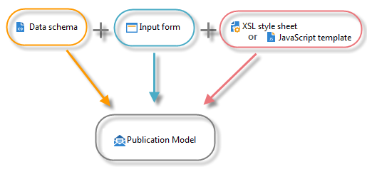

# Middelen en beginselen voor inhoudsbeheer{#content-manager-resources-and-principles}

U moet een publicatiesjabloon definiëren dat transformatiesjablonen voor elke inhoud bevat.

Een inhoudsblok is gestructureerd in een XML-document voor gegevensopslag. Er wordt een bewerkingsinterface gebruikt om de inhoud in te voeren vanaf de Adobe Campagne-clientconsole of via een webbrowser. De inhoud kan ook automatisch worden ingevoerd via het vastleggen van XML-flow of gegevens die in een database zijn samengevoegd.

Wanneer u het XML-document en de XSL- of JavaScript-sjabloonopmaakmodellen combineert, wordt automatisch de projectie van de publicatiesjabloon in de verschillende indelingen (HTML, tekst) gegenereerd.

De volgende middelen worden vereist voor inhoudsconfiguratie:

* Gegevensschema&#39;s: beschrijving van de XML-inhoudsstructuur. Voor meer op dit, verwijs naar de schema&#39;s van [Gegevens](../../delivery/using/data-schemas.md).
* Formulieren voor gegevensinvoer: bouw van gegevensinvoerschermen. Zie [Invoerformulieren](../../delivery/using/input-forms.md)voor meer informatie.
* Afbeeldingen: afbeeldingen die worden gebruikt in formulieren voor gegevensinvoer. Raadpleeg [Afbeeldingsbeheer](../../delivery/using/formatting.md#image-management)voor meer informatie.
* Stylesheets: opmaak van uitvoerdocumenten met XSLT-taal. Raadpleeg [Opmaak](../../delivery/using/formatting.md)voor meer informatie.
* JavaScript-sjablonen: opmaak van uitvoerdocumenten met gebruik van JavaScript-taal. Raadpleeg de sjablonen [voor](../../delivery/using/publication-templates.md)publicaties voor meer informatie.
* JavaScript-codes: JavaScript-codes voor gegevensaggregatie. Raadpleeg [Samenvoegprogramma](../../delivery/using/publication-templates.md#aggregator)voor meer informatie hierover.
* Publicatiesjablonen: definitie van publicatiesjablonen. Raadpleeg de sjablonen [voor](../../delivery/using/publication-templates.md)publicaties voor meer informatie.
* Inhoud: te maken en te publiceren inhoudsinstanties. Raadpleeg [Een inhoudssjabloon](../../delivery/using/using-a-content-template.md)gebruiken voor meer informatie.
