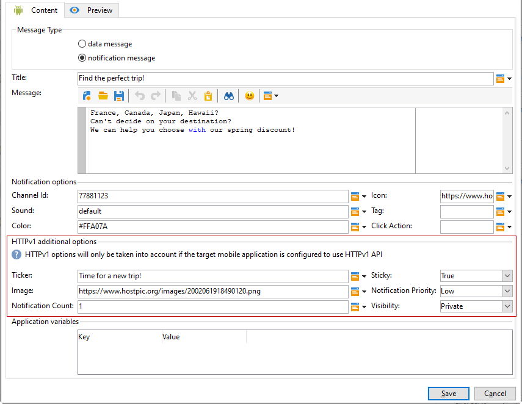

# Meldingen maken voor Android{#create-notificaations-android}

Gebruik Adobe Campaign om pushmeldingen te verzenden op Android-apparaten. Algemene concepten voor het maken van leveringen worden weergegeven in [deze sectie](steps-about-delivery-creation-steps.md).

Begin door een nieuwe levering te maken.

Met Firebase Cloud Messaging kunt u kiezen uit twee typen berichten:

* **[!UICONTROL Data message]**, afgehandeld door de clienttoepassing.
    De berichten worden verzonden rechtstreeks naar de mobiele toepassing die het android bericht aan het apparaat zal produceren en tonen. Gegevensberichten bevatten alleen aangepaste toepassingsvariabelen.

* **[!UICONTROL Notification message]**, automatisch afgehandeld door de FCM SDK.
     FCM geeft automatisch het bericht weer op de apparaten van uw gebruikers namens de client-app. Meldingsberichten bevatten een vooraf gedefinieerde set parameters en opties, maar kunnen nog steeds verder worden aangepast met aangepaste toepassingsvariabelen.

Raadpleeg [FCM-documentatie](https://firebase.google.com/docs/cloud-messaging/concept-options#notifications_and_data_messages) voor meer informatie over de berichttypen in Firebase Cloud Messaging.

## Een gegevensbericht maken {#creating-data-message}

1. Ga naar **[!UICONTROL Campaign management]** > **[!UICONTROL Deliveries]**.

1. Klik op **[!UICONTROL New]**.

   

1. Selecteer **[!UICONTROL Deliver on Android (android)]** in **[!UICONTROL Delivery template]** drop-down. Voeg een **[!UICONTROL Label]** aan uw levering toe.

1. Klik op **[!UICONTROL To]** om de doelpopulatie te definiëren. Standaard wordt de **[!UICONTROL Subscriber application]**-doeltoewijzing toegepast. Klik **[!UICONTROL Add]** om uw dienst te selecteren.

   

1. Selecteer **[!UICONTROL Target type]** in het venster **[!UICONTROL Subscribers of an Android mobile application]** en klik **[!UICONTROL Next]**.

1. Selecteer in de vervolgkeuzelijst **[!UICONTROL Service]** de eerder gemaakte service en klik vervolgens op **[!UICONTROL Finish]**.
**[!UICONTROL Application variables]** worden automatisch toegevoegd afhankelijk van wat tijdens de configuratiestappen werd toegevoegd.

   

1. Selecteer **[!UICONTROL data message]** als **[!UICONTROL Message Type]**.

1. Bewerk uw uitgebreide melding.

   

1. U kunt informatie in uw eerder gevormde **[!UICONTROL Application variables]** indien nodig toevoegen. **[!UICONTROL Application variables]** moet worden geconfigureerd in de Android-service en maakt deel uit van de berichtlading die naar het mobiele apparaat wordt verzonden.

1. Klik **[!UICONTROL Save]** en verzend uw levering.

De afbeelding en webpagina moeten worden weergegeven in het pushbericht wanneer deze worden ontvangen op de mobiele Android-apparaten van de abonnees.

## Een meldingsbericht maken {#creating-notification-message}

>[!NOTE]
>
>Aanvullende opties voor berichten zijn alleen beschikbaar bij de HTTP v1 API-configuratie. Raadpleeg deze [sectie](configuring-the-mobile-application-android.md#android-service-httpv1) voor meer informatie.

 [Leer hoe u een Android-pushmelding maakt in video](https://experienceleague.adobe.com/docs/campaign-classic-learn/getting-started-with-push-notifications-for-android/configuring-and-sending-push-notifications.html?lang=en#additional-resources)

1. Ga naar **[!UICONTROL Campaign management]** > **[!UICONTROL Deliveries]**.

1. Klik op **[!UICONTROL New]**.

   

1. Selecteer **[!UICONTROL Deliver on Android (android)]** in **[!UICONTROL Delivery template]** drop-down. Voeg een **[!UICONTROL Label]** aan uw levering toe.

1. Klik op **[!UICONTROL To]** om de doelpopulatie te definiëren. Standaard wordt de **[!UICONTROL Subscriber application]**-doeltoewijzing toegepast. Klik **[!UICONTROL Add]** om uw dienst te selecteren.

   

1. Selecteer **[!UICONTROL Target type]** in het venster **[!UICONTROL Subscribers of an Android mobile application]** en klik **[!UICONTROL Next]**.

1. Selecteer in de vervolgkeuzelijst **[!UICONTROL Service]** de eerder gemaakte service en klik vervolgens op **[!UICONTROL Finish]**.

   

1. Selecteer **[!UICONTROL notification message]** als **[!UICONTROL Message Type]**.

1. Voeg een titel toe en bewerk uw bericht. Pas uw pushmelding aan met de **[!UICONTROL Notification options]**:

   * **[!UICONTROL Channel ID]**: Stel de kanaal-id van uw melding in. De app moet een kanaal met deze kanaal-id maken voordat meldingen met deze kanaal-id worden ontvangen.
   * **[!UICONTROL Sound]**: Stel het geluid in dat moet worden afgespeeld wanneer het apparaat het bericht ontvangt.
   * **[!UICONTROL Color]**: Stel de kleur van het pictogram van uw melding in.
   * **[!UICONTROL Icon]**: Stel het pictogram van het bericht in op weergave op de apparaten van uw profielen.
   * **[!UICONTROL Tag]**: Stel de id in die wordt gebruikt om bestaande meldingen in de meldingslade te vervangen.
   * **[!UICONTROL Click action]**: Stel de handeling in die aan een gebruiker is gekoppeld, en klik op het bericht.

   Raadpleeg [FCM-documentatie](https://firebase.google.com/docs/reference/fcm/rest/v1/projects.messages#androidnotification) voor meer informatie over **[!UICONTROL Notification options]** en hoe u deze velden invult.

   

1. Als uw toepassing met het protocol van HTTP v1 API wordt gevormd, kunt u uw dupmelding verder personaliseren met het volgende **[!UICONTROL HTTPV1 additional options]**:

   * **[!UICONTROL Ticker]**: Stel de tekst van de markering in voor uw melding. Alleen beschikbaar voor apparaten die zijn ingesteld op Android 5.0 Lollipop.
   * **[!UICONTROL Image]**: Stel de URL van de afbeelding in die in uw melding moet worden weergegeven.
   * **[!UICONTROL Notification Count]**: Stel het aantal nieuwe ongelezen gegevens in dat u rechtstreeks op het toepassingspictogram wilt weergeven.
   * **[!UICONTROL Sticky]**: Ingesteld op true of false. Indien ingesteld op false, wordt het bericht automatisch genegeerd wanneer de gebruiker erop klikt. Indien ingesteld op true, wordt het bericht nog steeds weergegeven, zelfs wanneer de gebruiker erop klikt.
   * **[!UICONTROL Notification Priority]**: Plaats de prioritaire niveaus van uw bericht aan gebrek, minimum, laag of hoog. Raadpleeg [FCM-documentatie](https://firebase.google.com/docs/reference/fcm/rest/v1/projects.messages#NotificationPriority) voor meer informatie.
   * **[!UICONTROL Visibility]**: Stel de zichtbaarheidsniveaus van uw melding in op openbaar, privé of geheim. Raadpleeg [FCM-documentatie](https://firebase.google.com/docs/reference/fcm/rest/v1/projects.messages#visibility) voor meer informatie.

   Raadpleeg [FCM-documentatie](https://firebase.google.com/docs/reference/fcm/rest/v1/projects.messages#androidnotification) voor meer informatie over **[!UICONTROL HTTP v1 additional options]** en hoe u deze velden invult.

   

1. U kunt informatie in uw eerder gevormde **[!UICONTROL Application variables]** indien nodig toevoegen. **[!UICONTROL Application variables]** moet worden geconfigureerd in de Android-service en maakt deel uit van de berichtlading die naar het mobiele apparaat wordt verzonden.

1. Klik **[!UICONTROL Save]** en verzend uw levering.

De afbeelding en webpagina moeten worden weergegeven in het pushbericht wanneer deze worden ontvangen op de mobiele Android-apparaten van de abonnees.
