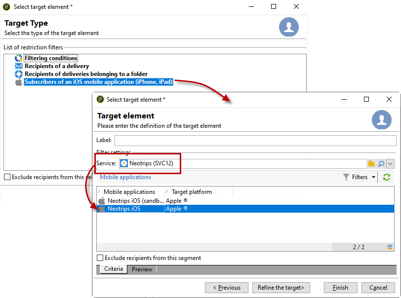

# Meldingen maken voor iOS{#create-notifications-ios}

In deze sectie worden de specifieke elementen voor de levering van iOS-berichten beschreven. De globale concepten op leveringsverwezenlijking worden voorgesteld in [ deze sectie ](steps-about-delivery-creation-steps.md).

Begin door een nieuwe levering te maken.

Voer de volgende stappen uit om een pushmelding voor iOS-apparaten te maken:

1. Selecteer de leveringssjabloon **[!UICONTROL Deliver on iOS]** .

   

1. Als u het doel van de melding wilt definiëren, klikt u op de koppeling **[!UICONTROL To]** en vervolgens op **[!UICONTROL Add]** .

   

   >[!NOTE]
   >
   >Het gedetailleerde proces wanneer het selecteren van de doelbevolking van een levering wordt voorgesteld in [ deze sectie ](steps-defining-the-target-population.md).
   >
   >Voor meer op het gebruik van verpersoonlijkingsgebieden, verwijs naar [ deze sectie ](about-personalization.md).
   >
   >Voor meer op de opneming van een zaadlijst, verwijs naar [ Ongeveer zaadadressen ](about-seed-addresses.md).

1. Selecteer **[!UICONTROL Subscribers of an iOS mobile application (iPhone, iPad)]** , selecteer de service die relevant is voor uw mobiele toepassing (in dit geval Neotrips) en selecteer vervolgens de iOS-versie van de toepassing.

   

1. Kies de **[!UICONTROL Notification type]** tussen **[!UICONTROL General notification (Alert, Sound, Badge)]** of **[!UICONTROL Silent notification]** .

   

   >[!NOTE]
   >
   >De **wijze van de Duw van 0} Zijde** staat een &quot;stil&quot;bericht toe om naar een mobiele toepassing worden verzonden. De gebruiker wordt niet op de hoogte gebracht van de aankomst van de melding. Deze wordt rechtstreeks naar de toepassing overgedragen.

1. Voer in het veld **[!UICONTROL Title]** het label in van de titel die u wilt weergeven in de lijst met meldingen die beschikbaar is in het meldingscentrum.

   Dit gebied staat u toe om de waarde van de **titel** parameter van de het berichtlading van iOS te bepalen.

1. U kunt een **[!UICONTROL Subtitle]** -waarde van de ondertitelparameter van de iOS-berichtlading toevoegen. Verwijs naar [ deze sectie ](configuring-the-mobile-application.md).

1. Voer de inhoud van het bericht in in de sectie **[!UICONTROL Message content]** van de assistent. Het gebruik van verpersoonlijkingsgebieden wordt voorgesteld in [ Ongeveer verpersoonlijkings ](about-personalization.md) sectie.

   

1. Klik op het pictogram **[!UICONTROL Insert emoticon]** om emoticons in te voegen bij uw pushmelding. Om de emoticonlijst aan te passen, verwijs naar [ deze sectie ](customizing-emoticon-list.md)

1. Op het tabblad **[!UICONTROL Sound and Badge]** kunt u de volgende opties bewerken:

   * **[!UICONTROL Clean Badge]**: schakel deze optie in om de waarde van de badge te vernieuwen.

   * **[!UICONTROL Value]** : stel een getal in dat wordt gebruikt om het aantal nieuwe ongelezen gegevens direct op het toepassingspictogram weer te geven.

   * **[!UICONTROL Critical alert mode]**: schakel deze optie in om geluid toe te voegen aan uw melding, zelfs als de telefoon van de gebruiker is ingesteld in de focusmodus of als de iPhone is gedempt.

   * **[!UICONTROL Name]** : selecteer het geluid dat door de mobiele terminal moet worden afgespeeld wanneer het bericht wordt ontvangen.

   * **[!UICONTROL Volume]**: volume van uw geluid van 0 tot 100.

   >[!NOTE]
   >
   >Geluiden moeten in de toepassing worden opgenomen en worden gedefinieerd wanneer de service wordt gemaakt. Zie [deze sectie](configuring-the-mobile-application.md#configuring-external-account-ios).

   

1. Vanaf de tab **[!UICONTROL Application variables]** wordt de **[!UICONTROL Application variables]** automatisch toegevoegd. Met deze instructies kunt u bijvoorbeeld het berichtgedrag definiëren. U kunt dan een specifiek toepassingsscherm configureren dat wordt weergegeven wanneer de gebruiker het bericht activeert.

   Raadpleeg [deze sectie](configuring-the-mobile-application.md) voor meer informatie.

1. Op het tabblad **[!UICONTROL Advanced]** kunt u de volgende algemene opties bewerken:

   * **[!UICONTROL Mutable content]** : schakel deze optie in zodat de mobiele toepassing media-inhoud kan downloaden.

   * **[!UICONTROL Thread-id]**: id die wordt gebruikt om gerelateerde meldingen te groeperen.

   * **[!UICONTROL Category]**: naam van de categorie-id waarin de knoppen voor handelingen worden weergegeven. Met deze meldingen kan de gebruiker sneller verschillende taken uitvoeren als reactie op een melding zonder de applicatie te openen of erin te moeten navigeren.

   

1. Voor meldingen met tijdgevoeligheid kunt u de volgende opties opgeven:

   * **[!UICONTROL Target content ID]**: id die wordt gebruikt om aan te geven welk toepassingsvenster moet worden verzonden wanneer de melding wordt geopend.

   * **[!UICONTROL Launch image]**: naam van het bestand met de opstartafbeelding dat moet worden weergegeven. Als de gebruiker ervoor kiest de toepassing te starten, wordt de geselecteerde afbeelding weergegeven in plaats van het startscherm van de toepassing.

   * **[!UICONTROL Interruption level]** :

      * **[!UICONTROL Active]**: standaard ingesteld, geeft het systeem de melding direct weer, licht het scherm op en kan een geluid worden afgespeeld. Meldingen doorbreken niet door de focusmodi.

      * **[!UICONTROL Passive]**: het systeem voegt het bericht toe aan de meldingslijst zonder het scherm te belichten of een geluid af te spelen. Meldingen doorbreken niet door de focusmodi.

      * **[!UICONTROL Time sensitive]**: Het systeem presenteert de melding direct, licht het scherm op, kan een geluid afspelen en de modus Focus doorbreken. Voor dit niveau is geen speciale toestemming van Apple vereist.

      * **[!UICONTROL Critical]**: Het systeem presenteert de melding direct, licht het scherm op en laat de modi voor demtschakelaar of focus voorbijgaan. Voor dit niveau is een speciale machtiging van Apple vereist.

   * **[!UICONTROL Relevance score]** : stel een relevantiescore in van 0 tot 100. Het systeem gebruikt dit om de berichten in het berichtoverzicht te sorteren.

   

1. Nadat het bericht is geconfigureerd, klikt u op het tabblad **[!UICONTROL Preview]** om een voorvertoning van het bericht te bekijken.

   

   >[!NOTE]
   >
   >De berichtstijl (banner of waarschuwing) wordt niet gedefinieerd in Adobe Campaign. Het hangt van de configuratie af die door de gebruiker in hun montages van iOS wordt geselecteerd. In Adobe Campaign kunt u echter elk type berichtstijl bekijken. Klik op de pijl rechtsonder om van de ene stijl naar de andere te gaan.
   >
   >In de voorvertoning wordt de iOS 10-look en -feel gebruikt.

Als u een bewijs wilt verzenden en de uiteindelijke levering wilt verzenden, gebruikt u hetzelfde proces als voor e-mailleveringen. [Meer informatie](steps-validating-the-delivery.md)

Nadat u berichten hebt verzonden, kunt u de leveringen controleren en volgen. Raadpleeg deze secties voor meer informatie hierover:

* [Push notification quarantines](understanding-quarantine-management.md#push-notification-quarantines)
* [Een levering controleren](about-delivery-monitoring.md)
* [Leveringsfouten begrijpen](understanding-delivery-failures.md)

## Een rijke iOS-melding maken {#creating-ios-delivery}

Met iOS 10 of hoger is het mogelijk om rijke meldingen te genereren. Adobe Campaign kan meldingen verzenden met behulp van variabelen waarmee het apparaat een uitgebreide melding kan weergeven.

U moet nu een nieuwe levering maken en deze koppelen aan de mobiele toepassing die u hebt gemaakt.

1. Ga naar **[!UICONTROL Campaign management]** > **[!UICONTROL Deliveries]** .

1. Klik op **[!UICONTROL New]**.

   

1. Selecteer **[!UICONTROL Deliver on iOS (ios)]** in de vervolgkeuzelijst **[!UICONTROL Delivery template]** . Voeg een **[!UICONTROL Label]** toe aan uw levering.

1. Klik op **[!UICONTROL To]** om de doelpopulatie te definiëren. Standaard wordt de doeltoewijzing **[!UICONTROL Subscriber application]** toegepast. Klik op **[!UICONTROL Add]** om de eerder gemaakte service te selecteren.

   

1. Selecteer **[!UICONTROL Subscribers of an iOS mobile application (iPhone, iPad)]** in het **[!UICONTROL Target type]** -venster en klik op **[!UICONTROL Next]** .

1. Selecteer in de vervolgkeuzelijst **[!UICONTROL Service]** de eerder gemaakte service, selecteer vervolgens de toepassing die u als doel wilt instellen en klik op **[!UICONTROL Finish]** .

   

1. Bewerk uw uitgebreide melding.

   

1. Vanaf het tabblad **[!UICONTROL Application variables]** wordt de **[!UICONTROL Application variables]** automatisch toegevoegd, afhankelijk van wat er tijdens de configuratiestappen is toegevoegd.

   >[!NOTE]
   >
   >Toepassingsvariabelen moeten worden gedefinieerd in de code van de mobiele toepassing en moeten worden ingevoerd tijdens het maken van de service. Raadpleeg [deze sectie](configuring-the-mobile-application.md) voor meer informatie.

   

1. Schakel op het tabblad **[!UICONTROL Advanced]** het vakje **[!UICONTROL Mutable content]** in, zodat de mobiele toepassing media-inhoud kan downloaden.

1. Klik op **[!UICONTROL Save]** en verzend de levering.

De afbeelding en webpagina moeten in de pushmelding worden weergegeven wanneer deze worden ontvangen op de mobiele iOS-apparaten van de abonnees.

