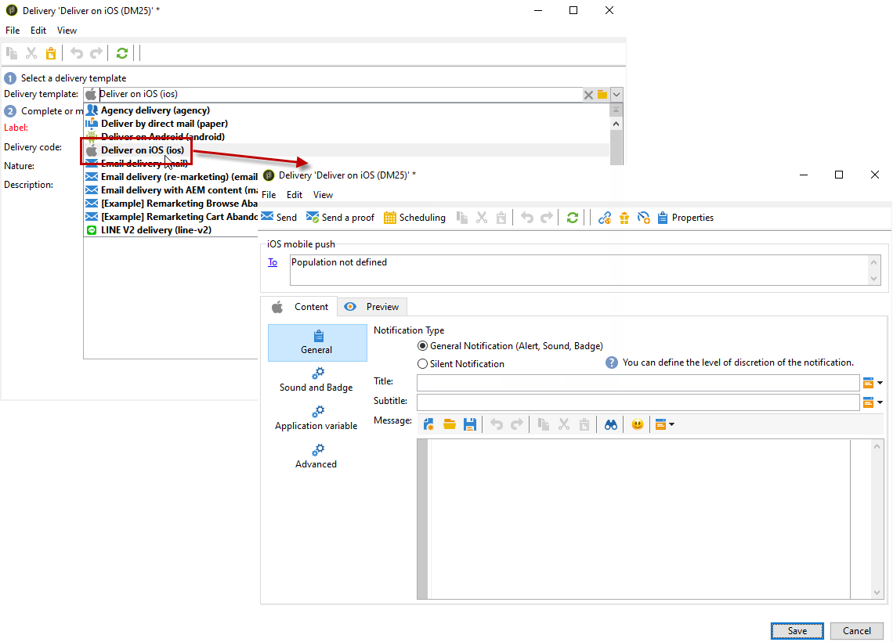

# Meldingen maken voor iOS{#create-notifications-ios}

In deze sectie worden de specifieke elementen voor de levering van iOS-berichten beschreven. Algemene concepten voor het creëren van levering worden weergegeven in [deze sectie](steps-about-delivery-creation-steps.md).

Begin door een nieuwe levering te maken.

Voer de volgende stappen uit om een pushmelding voor iOS-apparaten te maken:

1. Selecteer **[!UICONTROL Deliver on iOS]** leveringssjabloon.

   

1. Als u het doel van het bericht wilt definiëren, klikt u op de knop **[!UICONTROL To]** koppeling en klik vervolgens op **[!UICONTROL Add]**.

   

   >[!NOTE]
   >
   >Het gedetailleerde proces bij de selectie van de doelpopulatie van een levering wordt weergegeven in [deze sectie](steps-defining-the-target-population.md).
   >
   >Voor meer informatie over het gebruik van verpersoonlijkingsgebieden, verwijs naar [deze sectie](about-personalization.md).
   >
   >Voor meer informatie over het opnemen van een zaadlijst raadpleegt u [Informatie over zaadadressen](about-seed-addresses.md).

1. Selecteren **[!UICONTROL Subscribers of an iOS mobile application (iPhone, iPad)]** Selecteer eerst de service die relevant is voor uw mobiele toepassing (in dit geval Neotrips) en selecteer vervolgens de iOS-versie van de toepassing.

   

1. Selecteer het berichttype: **[!UICONTROL Alert]**, **[!UICONTROL Badge]**, of **[!UICONTROL Alert and badge]** of **[!UICONTROL Silent Push]**.

   

   >[!NOTE]
   >
   >De **Silent Push** in de modus kan een melding &quot;stil&quot; naar een mobiele toepassing worden verzonden. De gebruiker wordt niet op de hoogte gebracht van de aankomst van de melding. Deze wordt rechtstreeks naar de toepassing overgedragen.

1. In de **[!UICONTROL Title]** Voer het label in van de titel die u in het bericht wilt weergeven. Deze wordt alleen weergegeven in de lijst met meldingen die beschikbaar zijn in het meldingscentrum. In dit veld kunt u de waarde van de optie **titel** parameter van de iOS-berichtlading.

1. Als u de HTTP/2-connector gebruikt, kunt u een ondertitel (waarde van de **ondertitel** parameter van de iOS-berichtlading). Zie de [deze sectie](configuring-the-mobile-application.md).

1. Voer vervolgens de **[!UICONTROL Message]** en de **[!UICONTROL Value of the badge]** op basis van het gekozen meldingstype.

   

   >[!NOTE]
   >
   >**[!UICONTROL Badge]** en **[!UICONTROL Alert and badge]** met typedeclaraties kunt u de waarde van de badge wijzigen (het nummer boven het logo van de mobiele toepassing). Als u de badge wilt vernieuwen, hoeft u alleen 0 als waarde in te voeren. Als het veld leeg is, verandert de waarde van de badge niet.

1. Klik op de knop **[!UICONTROL Insert emoticon]** pictogram om emoticons in te voegen in uw pushmelding. Als u de lijst met emoticonen wilt aanpassen, raadpleegt u [deze sectie](customizing-emoticon-list.md)

1. De **[!UICONTROL Action button]** Hiermee kunt u een label definiëren voor de actieknop in de waarschuwingsmeldingen (**action_loc_key** veld van de lading). Als uw iOS-toepassing landinstellbare tekenreeksen beheert (**Localizable.strings**), voert u de corresponderende sleutel in dit veld in. Als uw toepassing geen landinstellbare tekst beheert, voert u het label in dat u wilt zien op de actieknop. Voor meer informatie over lokaliseerbare tekenreeksen raadpleegt u de [Apple-documentatie](https://developer.apple.com/library/archive/documentation/NetworkingInternet/Conceptual/RemoteNotificationsPG/CreatingtheNotificationPayload.html#//apple_ref/doc/uid/TP40008194-CH10-SW1) .
1. In de **[!UICONTROL Play a sound]** veld, selecteert u het geluid dat door de mobiele terminal moet worden afgespeeld wanneer het bericht wordt ontvangen.

   >[!NOTE]
   >
   >Geluiden moeten in de toepassing worden opgenomen en worden gedefinieerd wanneer de service wordt gemaakt. Zie [deze sectie](configuring-the-mobile-application.md#configuring-external-account-ios).

1. In de **[!UICONTROL Application variables]** Voer de waarde van elke variabele in. Met toepassingsvariabelen kunt u berichtgedrag definiëren: U kunt bijvoorbeeld een specifiek toepassingsscherm configureren dat moet worden weergegeven wanneer de gebruiker het bericht activeert.

   >[!NOTE]
   >
   >Toepassingsvariabelen moeten worden gedefinieerd in de code van de mobiele toepassing en moeten worden ingevoerd tijdens het maken van de service. Raadpleeg [deze sectie](configuring-the-mobile-application.md) voor meer informatie.

1. Zodra het bericht wordt gevormd, klik **[!UICONTROL Preview]** om een voorvertoning van de melding weer te geven.

   

   >[!NOTE]
   >
   >De berichtstijl (banner of waarschuwing) wordt niet gedefinieerd in Adobe Campaign. Het hangt van de configuratie af die door de gebruiker in hun montages van iOS wordt geselecteerd. In Adobe Campaign kunt u echter elk type berichtstijl bekijken. Klik op de pijl rechtsonder om van de ene stijl naar de andere te gaan.
   >
   >In de voorvertoning wordt het uiterlijk van iOS 10 gebruikt.

Als u een bewijs wilt verzenden en de uiteindelijke levering wilt verzenden, gebruikt u hetzelfde proces als voor e-mailleveringen.

Nadat u berichten hebt verzonden, kunt u de leveringen controleren en volgen. Raadpleeg deze secties voor meer informatie hierover:

* [Push notification quarantines](understanding-quarantine-management.md#push-notification-quarantines)
* [Een levering controleren](about-delivery-monitoring.md)
* [Leveringsfouten begrijpen](understanding-delivery-failures.md)

## Een rijke iOS-melding maken {#creating-ios-delivery}

Met iOS 10 of hoger is het mogelijk om rijke meldingen te genereren. Adobe Campaign kan meldingen verzenden met behulp van variabelen waarmee het apparaat een uitgebreide melding kan weergeven.

U moet nu een nieuwe levering maken en deze koppelen aan de mobiele toepassing die u hebt gemaakt.

1. Ga naar **[!UICONTROL Campaign management]** > **[!UICONTROL Deliveries]**.

1. Klik op **[!UICONTROL New]**.

   

1. Selecteren **[!UICONTROL Deliver on iOS (ios)]** in de **[!UICONTROL Delivery template]** vervolgkeuzelijst. Voeg een **[!UICONTROL Label]** op uw levering.

1. Klikken **[!UICONTROL To]** om de doelgroep te bepalen. Standaard worden de **[!UICONTROL Subscriber application]** doeltoewijzing wordt toegepast. Klikken **[!UICONTROL Add]** om onze eerder gemaakte service te selecteren.

   

1. In de **[!UICONTROL Target type]** venster, selecteert u **[!UICONTROL Subscribers of an iOS mobile application (iPhone, iPad)]** en klik op **[!UICONTROL Next]**.

1. In de **[!UICONTROL Service]** vervolgkeuzelijst, selecteert u eerst de eerder gemaakte service en vervolgens de toepassing waarvoor u een toepassing wilt maken. Klik vervolgens op **[!UICONTROL Finish]**.
De **[!UICONTROL Application variables]** worden automatisch toegevoegd afhankelijk van wat tijdens de configuratiestappen werd toegevoegd.

   

1. Bewerk uw uitgebreide melding.

   

1. Controleer de **[!UICONTROL Mutable content]** in het venster Meldingen bewerken om de mobiele toepassing in staat te stellen media-inhoud te downloaden.

1. Klikken **[!UICONTROL Save]** en verzend uw levering.

De afbeelding en webpagina moeten in de pushmelding worden weergegeven wanneer deze worden ontvangen op de mobiele iOS-apparaten van de abonnees.

