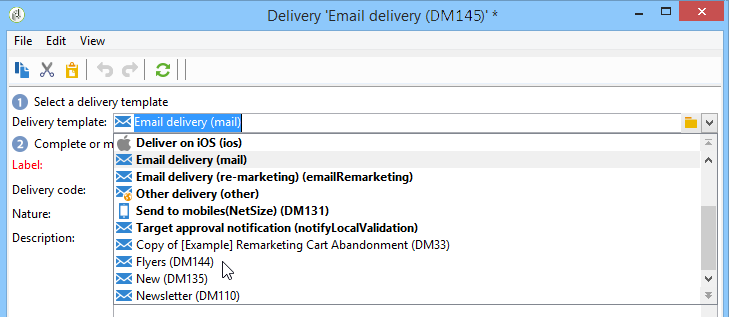

# Een levering maken via een sjabloon{#creating-a-delivery-from-a-template}

## De sjabloon koppelen aan een levering {#linking-the-template-to-a-delivery}

Als u een levering wilt maken op basis van een bestaande sjabloon, selecteert u de sjabloon in de lijst met beschikbare leveringssjablonen.

Klik anders op de **[!UICONTROL Select link]** map rechts van het veld om door de boomstructuur te bladeren.

Selecteer de gewenste map in het **[!UICONTROL Folder]** veld of klik op het **[!UICONTROL Display sub-levels]** pictogram om de inhoud van de mappen in de substructuren van de huidige map weer te geven.

Selecteer de leveringssjabloon die u wilt gebruiken en klik op **[!UICONTROL Ok]**.

## De sjabloon uitvoeren {#executing-the-template}

U kunt de uitvoering van een sjabloon rechtstreeks vanuit de sjabloonlijst starten zonder eerst een levering te maken. Selecteer hiertoe de sjabloon die u wilt uitvoeren en klik met de rechtermuisknop. Selecteer **[!UICONTROL Actions>Execute the delivery template...]**.

U kunt ook gebruiken **[!UICONTROL File>Actions>Execute the delivery template...]**.

Voer de leveringsparameters in en klik op **[!UICONTROL Send]**.

Deze actie produceert een levering in de omslag verbonden aan het malplaatje. De naam van deze levering is de naam van het leveringsmalplaatje waarvan het werd gecreeerd.

>[!NOTE]
>
>Zie E-mailinhoud definiëren voor meer informatie over het configureren van een levering.
