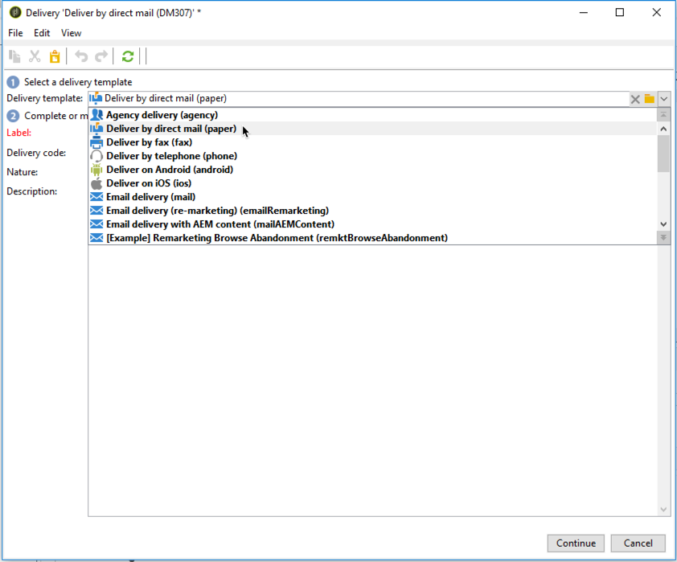

# Direct maillevering maken{#creating-a-direct-mail-delivery}

Voer de volgende stappen uit om een nieuwe levering via e-mail te maken:

>[!NOTE]
>
>Algemene concepten voor het maken van leveringen worden in [deze sectie](../../delivery/using/steps-about-delivery-creation-steps.md)beschreven.

1. Maak een nieuwe levering, bijvoorbeeld via het dashboard Levering.
1. Selecteer de leveringssjabloon **Afleveren via direct mail (papier)**.

   

1. Identificeer uw levering met een etiket, code, en beschrijving. Raadpleeg voor meer informatie [deze sectie](../../delivery/using/steps-create-and-identify-the-delivery.md#identifying-the-delivery)
1. Klik op **Doorgaan** om deze informatie te bevestigen en het venster voor berichtconfiguratie weer te geven.
