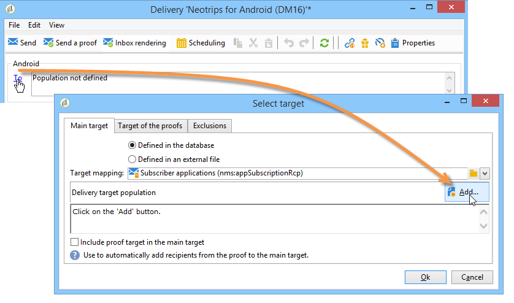

# Meldingen maken{#creating-notifications}

In deze sectie worden de elementen beschreven die specifiek zijn voor de levering van iOS- en Android-berichten. Algemene concepten voor het maken van leveringen worden in [deze sectie](../../delivery/using/steps-about-delivery-creation-steps.md)beschreven.

Begin door een nieuwe levering te maken.

## Meldingen verzenden op iOS {#sending-notifications-on-ios}

1. Selecteer de **[!UICONTROL Deliver on iOS]** leveringssjabloon.

   

1. Als u het doel van het bericht wilt definiëren, klikt u op de **[!UICONTROL To]** koppeling en vervolgens op **[!UICONTROL Add]**.

   

   >[!NOTE]
   >
   >Het gedetailleerde proces bij het selecteren van de doelpopulatie van een levering wordt in [deze sectie](../../delivery/using/steps-defining-the-target-population.md)weergegeven.
   >
   >Voor meer over het gebruik van verpersoonlijkingsgebieden, verwijs naar [Ongeveer verpersoonlijking](../../delivery/using/about-personalization.md).
   >
   >Voor meer over de opneming van een zaadlijst, verwijs naar [Ongeveer zaadadressen](../../delivery/using/about-seed-addresses.md).

1. Selecteer **[!UICONTROL Subscribers of an iOS mobile application (iPhone, iPad)]**, selecteer de service die relevant is voor uw mobiele toepassing (in dit geval Neotrips) en selecteer vervolgens de iOS-versie van de toepassing.

   

1. Selecteer het berichttype: **[!UICONTROL Alert]**, **[!UICONTROL Badge]**, of **[!UICONTROL Alert and badge]** of **[!UICONTROL Silent Push]**.

   

   >[!NOTE]
   >
   >De modus **Silent Push** is beschikbaar in iOS 7. Hierdoor kan een &quot;stille&quot; melding naar een mobiele toepassing worden verzonden. De gebruiker wordt niet op de hoogte gebracht van de aankomst van de melding. Deze wordt rechtstreeks naar de toepassing overgedragen.

1. Voer in het **[!UICONTROL Title]** veld het label in van de titel die u in het bericht wilt weergeven. Deze wordt alleen weergegeven in de lijst met meldingen die beschikbaar zijn in het meldingscentrum. In dit veld kunt u de waarde definiëren van de parameter **title** van de payload van de iOS-melding.

1. Als u de HTTP/2-connector gebruikt, kunt u een ondertitel (waarde van de **ondertitelingsparameter** van de iOS-berichtlading) toevoegen. Raadpleeg de sectie Mobiele toepassing [configureren in de Adobe-campagne](../../delivery/using/configuring-the-mobile-application.md) .

1. Voer vervolgens de code **[!UICONTROL Message]** en de **[!UICONTROL Value of the badge]** code in op basis van het gekozen berichttype.

   

   >[!NOTE]
   >
   >**[!UICONTROL Badge]** en **[!UICONTROL Alert and badge]** typemeldingen kunt u de waarde van de badge wijzigen (het nummer boven het logo van de mobiele toepassing). Als u de badge wilt vernieuwen, hoeft u alleen 0 als waarde in te voeren. Als het veld leeg is, verandert de waarde van de badge niet.

1. Klik op het **[!UICONTROL Insert emoticon]** pictogram om emoticons in te voegen bij uw pushmelding. Als u de lijst met emoticonen wilt aanpassen, raadpleegt u het [aanpassen van de lijst met emoticonen](../../delivery/using/defining-interactive-content.md)

1. Met **[!UICONTROL Action button]** de optie kunt u een label definiëren voor de actieknop in de waarschuwingsberichten (veld **action_loc_key** van de payload). Als uw iOS-toepassing landinstellbare tekenreeksen beheert (**Localizable.strings**), voert u de bijbehorende sleutel in dit veld in. Als uw toepassing geen landinstellbare tekst beheert, voert u het label in dat u wilt zien op de actieknop. Raadpleeg de documentatie [van](https://developer.apple.com/library/archive/documentation/NetworkingInternet/Conceptual/RemoteNotificationsPG/CreatingtheNotificationPayload.html#//apple_ref/doc/uid/TP40008194-CH10-SW1) Apple voor meer informatie over landinstellbare tekenreeksen.
1. Selecteer in het **[!UICONTROL Play a sound]** veld het geluid dat door de mobiele terminal moet worden afgespeeld wanneer het bericht wordt ontvangen.

   >[!NOTE]
   >
   >Geluiden moeten in de toepassing worden opgenomen en worden gedefinieerd wanneer de service wordt gemaakt. Zie Externe account [van iOS](../../delivery/using/configuring-the-mobile-application.md#configuring-external-account-ios)configureren.

1. Voer in het **[!UICONTROL Application variables]** veld de waarde van elke variabele in. Met toepassingsvariabelen kunt u berichtgedrag definiëren: U kunt bijvoorbeeld een specifiek toepassingsscherm configureren dat moet worden weergegeven wanneer de gebruiker het bericht activeert.

   >[!NOTE]
   >
   >Toepassingsvariabelen moeten worden gedefinieerd in de code van de mobiele toepassing en moeten worden ingevoerd tijdens het maken van de service. Raadpleeg voor meer informatie: [Een mobiele toepassing configureren in Adobe Campagne](../../delivery/using/configuring-the-mobile-application.md).

1. Zodra het bericht wordt gevormd, klik het **[!UICONTROL Preview]** lusje aan voorproef het bericht.

   

   >[!NOTE]
   >
   >De berichtstijl (banner of waarschuwing) is niet gedefinieerd in Adobe Campagne. Het hangt van de configuratie af die door de gebruiker in hun iOS montages wordt geselecteerd. In Adobe Campaign kunt u echter elk type berichtstijl bekijken. Klik op de pijl rechtsonder om van de ene stijl naar de andere te gaan.
   >
   >In de voorvertoning wordt de iOS 10-vormgeving gebruikt.

Als u een bewijs wilt verzenden en de uiteindelijke levering wilt verzenden, gebruikt u hetzelfde proces als voor e-mailleveringen.

Nadat u berichten hebt verzonden, kunt u de leveringen controleren en volgen. Raadpleeg de volgende secties voor meer informatie:

* [Push notification quarantines](../../delivery/using/understanding-quarantine-management.md#push-notification-quarantines)
* [Toezicht op levering](../../delivery/using/monitoring-a-delivery.md)
* [Leveringsfouten begrijpen](../../delivery/using/understanding-delivery-failures.md)

## Meldingen verzenden op Android {#sending-notifications-on-android}

1. Begin door het **[!UICONTROL Deliver on Android (android)]** leveringsmalplaatje te selecteren.

   

1. Als u het doel van het bericht wilt definiëren, klikt u op de **[!UICONTROL To]** koppeling en vervolgens op **[!UICONTROL Add]**.

   

1. Selecteer **[!UICONTROL Subscribers of an Android mobile application]**, kies de service die relevant is voor uw mobiele toepassing (in dit geval Neotrips) en selecteer vervolgens de Android-versie van de toepassing.

   

1. Voer vervolgens de inhoud voor het bericht in.

   

1. Klik op het **[!UICONTROL Insert emoticon]** pictogram om emoticons in te voegen bij uw pushmelding. Als u de lijst met emoticonen wilt aanpassen, raadpleegt u het [aanpassen van de lijst met emoticonen](../../delivery/using/defining-interactive-content.md)

1. Voer in het **[!UICONTROL Application variables]** veld de waarde van elke variabele in. Met toepassingsvariabelen kunt u berichtgedrag definiëren: U kunt bijvoorbeeld een specifiek toepassingsscherm configureren dat moet worden weergegeven wanneer de gebruiker het bericht activeert.

   >[!NOTE]
   >
   >Toepassingsvariabelen moeten worden gedefinieerd in de code van de mobiele toepassing en moeten worden ingevoerd tijdens het maken van de service. Raadpleeg voor meer informatie: [Een mobiele toepassing configureren in Adobe Campagne](../../delivery/using/configuring-the-mobile-application.md).

1. Zodra het bericht wordt gevormd, klik het **[!UICONTROL Preview]** lusje aan voorproef het bericht.

   

Als u een bewijs wilt verzenden en de uiteindelijke levering wilt verzenden, gebruikt u hetzelfde proces als voor e-mailleveringen.

Het gedetailleerde proces voor het valideren en verzenden van een levering wordt in de volgende secties weergegeven:

* [De levering valideren](../../delivery/using/steps-validating-the-delivery.md)
* [De levering verzenden](../../delivery/using/steps-sending-the-delivery.md)

Nadat u berichten hebt verzonden, kunt u de leveringen controleren en volgen. Raadpleeg de volgende secties voor meer informatie:

* [Push notification quarantines](../../delivery/using/understanding-quarantine-management.md#push-notification-quarantines)
* [Toezicht op levering](../../delivery/using/monitoring-a-delivery.md)
* [Leveringsfouten begrijpen](../../delivery/using/understanding-delivery-failures.md)
