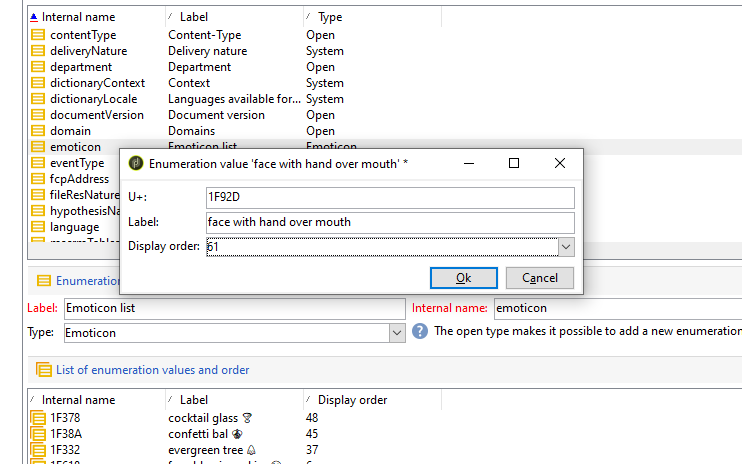
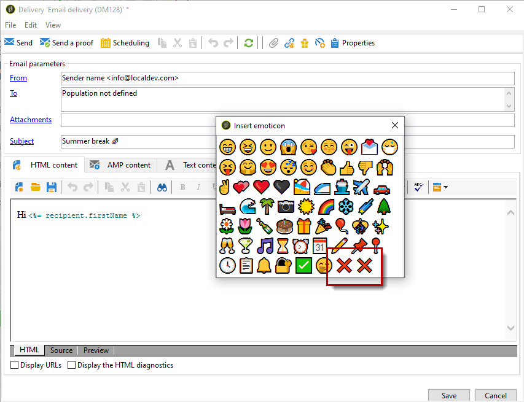

# De lijst met emoticons aanpassen {#customize-emoticons}

De emoticonlijst die in pop-up wordt getoond wordt bepaald door een opsomming die u toestaat om waarden in een lijst te tonen om de keuzen te beperken die de gebruiker voor een bepaald gebied heeft.
U kunt de volgorde van de emoticonlijst aanpassen en u kunt ook andere emoticons aan uw lijst toevoegen.
Er zijn emoticons beschikbaar voor e-mail en druk op voor meer informatie. Zie deze [page](defining-the-email-content.md#inserting-emoticons).

## Een nieuw emoticon toevoegen {#add-new-emoticon}

>[!CAUTION]
>
>De emoticonlijst kan niet meer dan 81 items weergeven.

1. Kies het nieuwe emoticon dat u uit deze afbeelding wilt toevoegen [page](https://unicode.org/emoji/charts/full-emoji-list.html). Let op: deze moet compatibel zijn met de verschillende platforms, zoals de browser en het besturingssysteem.

1. Van de **[!UICONTROL Explorer]**, selecteert u **[!UICONTROL Administration]** > **[!UICONTROL Platform]** > **[!UICONTROL Enumerations]** en klik op de knop **[!UICONTROL Emoticon list]** opsomming buiten de doos.

   >[!NOTE]
   >
   >De opsommingen buiten de doos kunnen slechts door een beheerder van uw console van Adobe Campaign Classic worden beheerd.

   

1. Klik op **[!UICONTROL Add]**.

1. Vul de velden in:

   * **[!UICONTROL U+]**: Code van je nieuwe emoticon. De lijst met emoticons-codes vindt u in dit [page](https://unicode.org/emoji/charts/full-emoji-list.html).
Om compatibiliteitsproblemen te voorkomen, raden we u aan emoticons te kiezen die worden ondersteund door browsers en op elk besturingssysteem.

   * **[!UICONTROL Label]**: Label van uw nieuwe emoticon.

   

1. Klikken **[!UICONTROL Ok]** dan **[!UICONTROL Save]** wanneer uw configuratie wordt gebeëindigd.
Uw nieuwe emoticon wordt automatisch in de winkel geplaatst.

1. Om het in te tonen in **[!UICONTROL Insert emoticon]** Selecteer het nieuwe emoticon door erop te dubbelklikken.

1. Kies in het dialoogvenster **[!UICONTROL Display order]** vervolgkeuzelijst waarin de volgorde van het nieuwe emoticon wordt weergegeven. Door een reeds toegewezen weergavevolgorde te selecteren, wordt het bestaande emoticon automatisch naar de winkel verplaatst.

    In dit voorbeeld hebben we de weergavevolgorde 61 gekozen. Dit houdt in dat als een item al deze volgorde had, dit item automatisch naar de winkel wordt verplaatst en dat onze nieuwe vermelding in de opsommingslijst wordt geplaatst.

   

1. Uw nieuwe emoticon is nu toegevoegd aan de **[!UICONTROL Insert emoticon list]** opsomming buiten de doos. U kunt de **[!UICONTROL Display order]** op elk moment of verplaats het naar de winkel als u het niet meer nodig hebt.

1. Als u rekening wilt houden met uw wijzigingen, verbreekt u de verbinding en maakt u opnieuw verbinding met Adobe Campaign Classic. Als uw nieuwe emoticon nog steeds niet in de **[!UICONTROL Insert emoticon]** in het pop-upvenster moet u mogelijk de cache wissen. Raadpleeg deze [sectie](../../platform/using/faq-campaign-config.md#perform-soft-cache-clear) voor meer informatie.

1. Uw nieuwe emoticon is nu te vinden in uw bestellingen in de **[!UICONTROL Insert emoticon]** pop-upvenster op de 61ste positie zoals geconfigureerd in de vorige stappen. Raadpleeg deze voor meer informatie over het gebruik van emoticons in uw leveringen [page](defining-the-email-content.md#inserting-emoticons).

   

1. Als de volgende emoticons in uw **[!UICONTROL Insert emoticon]** pop-up venster, dit betekent dat zij niet correct werden gevormd. Controleer of uw **[!UICONTROL U+]** code of **[!UICONTROL Display order]** is correct in **[!UICONTROL Emoticon list]**.

   
