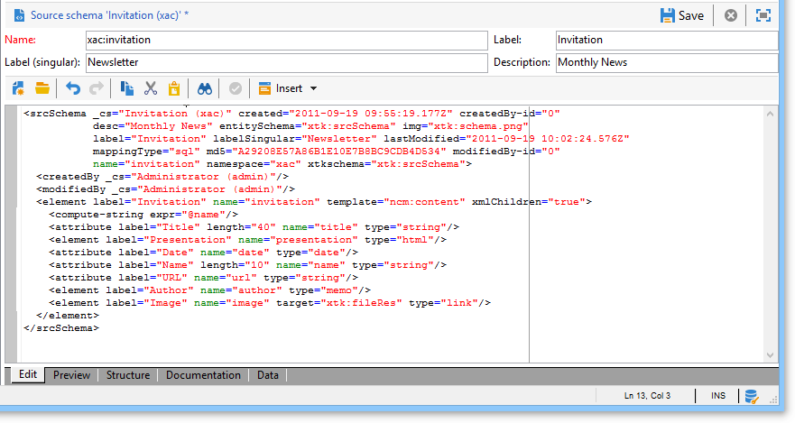

# Gegevensschema&#39;s{#data-schemas}

Hieronder volgen enkele algemene beginselen voor het gebruik van gegevensschema&#39;s in Adobe Campaign.

Raadpleeg [deze sectie](../../configuration/using/about-schema-edition.md)voor meer informatie over het maken en configureren van gegevensschema&#39;s in Adobe Campaign.

## Schema-structuur {#schema-structure}

Het document van XML van een gegevensschema moet het **`<srcschema>`** wortelelement met de **naam** en **namespace** attributen bevatten om de schemanaam en zijn namespace te bevolken.

```
<srcSchema name="schema_name" namespace="namespace">
...
</srcSchema>
```

Het punt van ingang van het schema is zijn belangrijkste element. Het is gemakkelijk te identificeren omdat het de zelfde naam zoals het schema heeft, en het zou het kind van het wortelelement moeten zijn. De beschrijving van de inhoud begint met dit element.

In een inhoudsbeheerschema, wordt het belangrijkste element vertegenwoordigd door de volgende lijn:

```
<element name="book" template="ncm:content" xmlChildren="true">
```

Met het **sjabloonkenmerk** dat u in het hoofdelement hebt ingevoerd, kunt u het schema met algemene eigenschappen uitbreiden naar alle inhoudsdefinities, zoals naam, aanmaakdatum, auteur, gekoppelde tekenreeks, enzovoort.

Deze eigenschappen worden beschreven in het **ncm:inhoudsschema** .

>[!NOTE]
>
>De aanwezigheid van het kenmerk **xmlChildren** geeft aan dat de gegevensstructuur die via het hoofdelement wordt ingevoerd, wordt opgeslagen in een XML-document van de instantie content.

>[!CAUTION]
>
>Wanneer het creëren van een nieuw schema of tijdens een schemauitbreiding, moet u de zelfde primaire zeer belangrijke opeenvolgingswaarde (@pkSequence) voor het volledige schema houden.

## Gegevenstypen {#data-types}

Hier volgt een voorbeeld van een inhoudsbeheerschema met de ingevulde typen:

```
<srcSchema name="book" namespace="cus">
  <element name="book" template="ncm:content" xmlChildren="true">
    <attribute name="title" type="string"/>
    <attribute name="date" type="date"/>
    <attribute name="language" type="string"/>
    <element name="chapter">
      <attribute name="name" type="string"/>
      <element name="page" type="string>
        <attribute name="number" type="short"/>
      </element>
    </element>
  </element>
</element>
```

## Eigenschappen {#properties}

Diverse eigenschappen kunnen worden gebruikt om de **`<element>`** en de **`<attribute>`** elementen van het gegevensschema te verrijken.

De belangrijkste eigenschappen die in inhoudsbeheer worden gebruikt zijn als volgt:

* **label**: korte beschrijving,
* **desc**: lange beschrijving,
* **standaard**: expressie die een standaardwaarde retourneert bij het maken van inhoud;
* **userEnum**: gratis opsomming voor het opslaan en weergeven van de waarden die via dit veld worden ingevoerd;
* **opsomming**: vaste opsomming die wordt gebruikt wanneer de lijst van mogelijke waarden vooraf bekend is.

Hier volgt ons voorbeeldschema met de eigenschappen die zijn ingevuld:

```
<srcSchema name="book" namespace="cus">
  <enumeration name="language" basetype="string" default="eng">    
    <value name="fra" label="French"/>    
    <value name="eng" label="English"/>   
  </enumeration>

  <element name="book" label="Book" desc="Example book" template="ncm:content" xmlChildren="true">
    <attribute name="title" type="string" label="Title" default="'New book'"/>
    <attribute name="date" type="date" default="GetDate()"/>
    <attribute name="language" type="string" label="Language" enum="language"/>
    <element name="chapter" label="Chapter">
      <attribute name="name" type="string" label="Name" desc="Name of chapter"/>
      <element name="page" type="string" label="Page" desc="Page content">
        <attribute name="number" type="short" label="Number" default="CounterValue('numPage')"/>
      </element>
    </element>
  </element>
</srcSchema>
```

## Verzamelelementen {#collection-elements}

Een verzameling is een lijst met elementen met dezelfde naam en hetzelfde hiërarchische niveau.

In ons voorbeeld zijn de **`<chapter>`** en **`<page>`** elementen verzamelingselementen. Het **niet-gebonden** kenmerk moet daarom aan de definitie van deze elementen worden toegevoegd:

```
<element name="chapter" label="Chapter" unbound="true" ordered="true">
```

```
<element name="page" type="string" label="Page" desc="Content of page" unbound="true">
```

>[!NOTE]
>
>Met de aanwezigheid van het **ordered=&quot;true&quot;** -kenmerk kunt u de ingevoegde verzamelingselementen ordenen.

## Element verwijzen {#element-referencing}

Element dat verwijst wordt veel gebruikt in inhoudsschema&#39;s. Hiermee kunt u de definitie van een **`<element>`** element factoriseren, zodat er naar kan worden verwezen op andere elementen met dezelfde structuur.

Het kenmerk **ref** op het element waarnaar moet worden verwezen, moet worden ingevuld met het pad (XPath) van het referentie-element.

**Voorbeeld**: toevoegen van een **bijlage** sectie met de zelfde structuur zoals het **`<chapter>`** element van ons voorbeeldschema.

```
<srcSchema name="book" namespace="cus">
  <element name="section">
    <attribute name="name" type="string" label="Name" desc="Name"/>
    <element name="page" type="string" label="Page" desc="Content of page">
      <attribute name="number" type="short" label="Number" default="CounterValue('numPage')"/>
    </element>

  <element name="book" label="Book" desc="Example book" template="ncm:content" xmlChildren="true">
    <attribute name="title" type="string" label="Title" default="'New book'"/>
    <attribute name="date" type="date" default="GetDate()"/>
    <attribute name="language" type="string" label="Language" enum="language"/>
    <element name="chapter" label="Chapter" ref="section"/>
    <element name="appendix" label="Appendix" ref="section"/>
  </element>
</srcSchema>
```

De hoofdstukstructuur wordt verplaatst naar het element met de naam &quot;sectie&quot; buiten het hoofdelement. Het hoofdstuk en de sectie verwijzen naar het element &quot;section&quot;.

## Rekenreeks {#compute-string}

Een **rekenreeks** is een XPath-expressie die wordt gebruikt om een tekenreeks samen te stellen die een inhoudsinstantie vertegenwoordigt.

Hier is ons voorbeeldschema met zijn **Berekende koord**:

```
<srcSchema name="book" namespace="cus">
  <element name="book" label="Book" desc="Example book" template="ncm:content" xmlChildren="true">
    <compute-string expr="@name"/>
    ...
  </element>
</srcSchema>
```

## Schema&#39;s bewerken {#editing-schemas}

In het bewerkingsveld kunt u de XML-inhoud van het bronschema invoeren:



Wanneer het bronschema wordt opgeslagen, wordt het uitgebreide schema automatisch opgestart.

>[!NOTE]
>
>Met het besturingselement **Naam** bewerken kunt u de sleutel van het schema invoeren, bestaande uit de naam en naamruimte. De **naam** en de **naamruimte** attributen van het schema wortelelement worden automatisch bijgewerkt op XML uitgeeft gebied van het schema.
