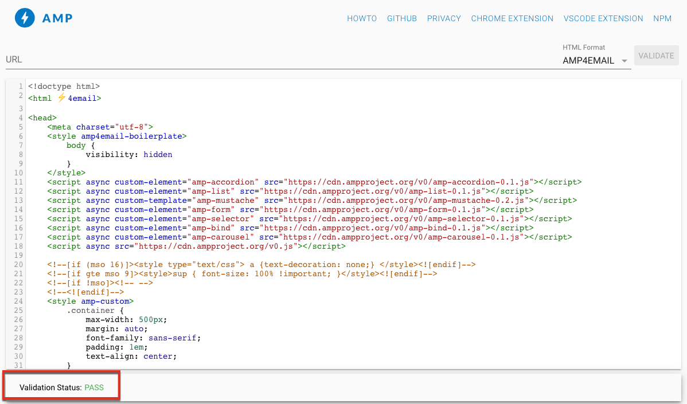

# Interactieve inhoud definiëren{#defining-interactive-content}

Met Adobe Campaign kunt u de nieuwe interactieve [AMP-indeling voor e-mail](https://amp.dev/about/email/) proberen, waarmee u onder bepaalde omstandigheden dynamische e-mailberichten kunt verzenden.

>[!CAUTION]
>
>* Deze functie is een bètafunctie in Adobe Campaign.
>* AMP for Email is een nieuwe open-source-indeling waarmee ontwikkelaars dynamische en interactieve e-mails kunnen maken. Momenteel wordt het ondersteund door twee e-mailproviders: Gmail en Outlook.
>
>
Daarom kunt u alleen:
>* Test het leveren van AMP-e-mails naar specifieke Gmail- of Outlook-adressen die op de juiste wijze zijn geconfigureerd.
>* Breng AMP-e-mails over naar elk Gmail-adres na registratie bij Google en naar elk Outlook-adres na registratie bij Microsoft.
>
>
Zie [Een AMP-e-mail](#targeting-amp-email)als doel instellen.

Deze functie is beschikbaar via een speciaal pakket in Adobe Campaign. Dit pakket moet zijn geïnstalleerd om het te kunnen gebruiken. Start vervolgens de server opnieuw om rekening te houden met het pakket.

Voor hybride en gehoste architecturen moet het pakket op alle servers worden geïnstalleerd, inclusief de [mid-sourcingserver](../../installation/using/mid-sourcing-server.md) en de [uitvoeringsinstantie](../../message-center/using/creating-a-shared-connection.md#execution-instance). Neem contact op met uw accountmanager.

Bekijk deze [video](https://docs.adobe.com/content/help/en/campaign-learn/campaign-classic-tutorials/sending-messages/email-channel/defining-interactive-email-content-with-amp.html) om te zien hoe u AMP activeert in Adobe Campaign en meer te weten te komen over het gebruik ervan.

## Informatie over AMP voor e-mail {#about-amp-for-email}

Met de nieuwe indeling **AMP for Email** kunt u AMP-componenten opnemen in berichten om de e-mailervaring te verbeteren met rijke en activeerbare inhoud. Met de moderne toepassingsfunctionaliteit die direct beschikbaar is in e-mails, kunnen ontvangers dynamisch communiceren met de inhoud van het bericht zelf.

Bijvoorbeeld:
* E-mails die met AMP zijn geschreven, kunnen interactieve elementen bevatten, zoals afbeeldingscarrousels.
* De inhoud wordt bijgewerkt in het bericht.
* Ontvangers kunnen actie ondernemen zoals op een formulier reageren zonder hun Postvak IN te verlaten.

AMP for Email is compatibel met bestaande e-mails. De AMP-versie van het bericht is in de e-mail ingesloten als een nieuw MIME-onderdeel, in aanvulling op de HTML en/of onbewerkte tekst, waardoor compatibiliteit tussen alle e-mailclients wordt gegarandeerd.

Raadpleeg de documentatie bij AMP-ontwikkelaars voor meer informatie over de AMP voor e-mailindeling, specificatie en vereisten.

## Belangrijke stappen voor het gebruik van AMP voor e-mail met Adobe-campagne {#key-steps-to-use-amp}

Volg onderstaande stappen om een AMP-e-mail met Adobe Campagne te testen en te verzenden:
1. Installeer het **[!UICONTROL AMP support (Beta)]** pakket. Zie Standaardpakketten [voor campagne](../../installation/using/installing-campaign-standard-packages.md)installeren.
1. Maak een e-mail en maak uw AMP-inhoud in Adobe Campaign. Zie AMP-e-mailinhoud [maken met Adobe Campagne](#build-amp-email-content).
1. Zorg ervoor dat u voldoet aan alle leveringsvereisten van de e-mailproviders die de AMP-indeling ondersteunen.

   >[!NOTE]
   >
   >AMP for Email is beschikbaar als bètamogelijkheid voor testdoeleinden. Momenteel ondersteunen slechts twee e-mailproviders het testen van deze indeling (Gmail en Outlook).

   Zie [AMP voor vereisten](#amp-for-email-delivery-requirements)voor e-maillevering.

1. Wanneer u uw doel definieert, moet u ontvangers selecteren die de AMP-indeling kunnen weergeven.

   >[!NOTE]
   >
   >Momenteel kunt u alleen testen of u AMP-e-mailberichten naar specifieke e-mailadressen verzendt die op de juiste wijze zijn geconfigureerd of nadat u zich hebt geregistreerd bij de e-mailproviders die deelnemen aan het bètaprogramma van AMP.

   Zie [Een AMP-e-mail](#targeting-amp-email)als doel instellen.

1. Verzend uw e-mail zoals u gewoonlijk zou doen. Zie Een AMP-e-mail verzenden.

## AMP-e-mailinhoud samenstellen in Adobe-campagne {#build-amp-email-content}

Voer de onderstaande stappen uit om een e-mailbericht te maken in de AMP-indeling.

>[!CAUTION]
>
>Zorg ervoor dat u de AMP volgt voor e-mailvereisten en specificaties die in de documentatie [van de](https://amp.dev/documentation/guides-and-tutorials/learn/email_fundamentals/?format=email)AMP-ontwikkelaar worden beschreven. U kunt ook het [AMP raadplegen voor best practices](https://amp.dev/documentation/guides-and-tutorials/develop/amp_email_best_practices/?format=email)voor e-mail.

1. Selecteer een sjabloon wanneer u uw e-maillevering maakt.

   >[!NOTE]
   >
   >Een specifieke AMP-sjabloon bevat een voorbeeld van de belangrijkste capaciteiten die u kunt gebruiken: productaanbieding, carrousel, dubbele opt-in, enquête en geavanceerde serveraanvraag.

1. Klik op het **[!UICONTROL AMP content]** tabblad.

   

1. Bewerk de AMP-inhoud naar wens.

   >[!NOTE]
   >
   >Raadpleeg de documentatie bij AMP-ontwikkelaars voor meer informatie over het samenstellen van uw eerste AMP-e-mail.

   U kunt bijvoorbeeld de component met de productlijst in de AMP-sjabloon gebruiken en een lijst bijhouden met producten van een systeem van derden of zelfs in Adobe-campagne. Wanneer u een prijs of een ander element aanpast, zal het automatisch weerspiegeld worden wanneer de ontvanger opnieuw e-mail van hun brievenbus opent.

1. Pas uw AMP-inhoud naar wens aan, zoals u gewoonlijk doet met de HTML-indeling in Adobe Campaign, met verpersoonlijkingsvelden en aanpassingsblokken.

   

1. Als u klaar bent met bewerken, selecteert u de volledige AMP-inhoud en kopieert en plakt u deze in de webvalidator [van het](https://validator.ampproject.org) AMP of een vergelijkbare website.

   >[!NOTE]
   >
   >Zorg ervoor dat u **AMP4 EMAIL** selecteert in de vervolgkeuzelijst boven aan het scherm.

   

   Eventuele fouten worden inline gemarkeerd.

   >[!NOTE]
   >
   >De AMP-editor van Adobe Campagne is niet ontworpen voor validatie van inhoud. Gebruik een externe website, zoals de webvalidator [van het](https://validator.ampproject.org) AMP, om te controleren of uw inhoud correct is.

1. Breng zo nodig wijzigingen aan totdat de AMP-inhoud de validatie doorgeeft.

   

1. Kopieer de gevalideerde inhoud naar [AMP Playground](https://playground.amp.dev) of een vergelijkbare website om een voorvertoning van de inhoud weer te geven.

   >[!NOTE]
   >
   >Selecteer **AMP voor e-mail** in de vervolgkeuzelijst boven aan het scherm.

   

   >[!NOTE]
   >
   >U kunt uw AMP-inhoud niet rechtstreeks in Adobe Campaign voorvertonen. Gebruik een externe website, zoals [AMP Playground](https://playground.amp.dev).

1. Ga terug naar Adobe Campagne en kopieer en plak uw gevalideerde inhoud naar het **[!UICONTROL AMP content]** tabblad.

1. Schakel over naar het **[!UICONTROL HTML content]** **[!UICONTROL Text content]** tabblad of het tabblad en definieer inhoud voor ten minste een van deze twee indelingen.

   >[!CAUTION]
   >
   >Als uw e-mail niet naast de AMP-inhoud een HTML- of onbewerkte tekstversie bevat, kan deze niet worden verzonden.

## AMP voor vereisten voor e-maillevering {#amp-for-email-delivery-requirements}

Wanneer u AMP-inhoud maakt in Adobe Campaign, moet u voldoen aan de voorwaarden voor het verzenden van een dynamische e-mail, die specifiek zijn voor de e-mailproviders van uw ontvangers.

Momenteel ondersteunen twee e-mailproviders het testen van deze indeling: Gmail en Outlook.

Alle stappen en specificaties die worden vereist om levering met AMP formaat op de rekeningen van Gmail te testen zijn gedetailleerd in de overeenkomstige [documentatie](https://developers.google.com/gmail/ampemail?) van de ontwikkelaar van Gmail en de [ontwikkelaarsdocumentatie](https://docs.microsoft.com/en-gb/outlook/amphtml/)van Vooruitzichten.

Met name moet aan de volgende eisen worden voldaan:
* Volg de de veiligheidsvereisten van AMP specifiek voor [Gmail](https://developers.google.com/gmail/ampemail/security-requirements) en [Vooruitzichten](https://docs.microsoft.com/en-gb/outlook/amphtml/security-requirements).
* Het AMP MIME-onderdeel moet een [geldig AMP-document](https://amp.dev/documentation/guides-and-tutorials/learn/validation-workflow/validate_emails/?format=email)bevatten.
* Het AMP MIME-onderdeel moet kleiner zijn dan 100 kB.

U kunt ook de [Tips en bekende beperkingen voor Gmail](https://developers.google.com/gmail/ampemail/tips) en de beste praktijken van [AMP voor Vooruitzichten](https://docs.microsoft.com/en-gb/outlook/amphtml/best-practices)raadplegen.

## Een AMP-e-mail als doel instellen {#targeting-amp-email}

Aangezien AMP for Email beschikbaar is als bètamogelijkheid, kunt u momenteel in twee stappen experimenteren met het verzenden van een AMP-e-mail:

1. Met Adobe Campaign kunt u testen of een dynamische e-mail met AMP-functionaliteit wordt geleverd aan geselecteerde e-mailadressen die correct zijn geconfigureerd, om de inhoud en het gedrag ervan te controleren. Zie AMP-e-maillevering [testen voor geselecteerde adressen](#testing-amp-delivery-for-selected-addresses).
1. Nadat de test is uitgevoerd, kunt u een levering of een campagne verzenden als onderdeel van het bètaprogramma voor e-mail door u te registreren bij de relevante e-mailprovider(s) om uw senderdomein te laten zweven. Zie E-mails met AMP [leveren door u te registreren bij een e-mailprovider](#delivering-amp-emails-by-registering).

### AMP-e-maillevering testen voor geselecteerde adressen {#testing-amp-delivery-for-selected-addresses}

U kunt testen hoe dynamische berichten vanuit Adobe Campaign naar geselecteerde e-mailadressen worden verzonden.

>[!NOTE]
>
>Momenteel ondersteunen alleen Gmail en Outlook het testen van de AMP-indeling.

Voordat u dit doet, moet u een whitelist maken van het verzendadres of de afzenderadressen die u gebruikt voor levering vanuit Adobe Campaign voor de Gmail- en Outlook-accounts waarop u zich richt.

Dit doet u als volgt:
1. Controleer of de optie voor het inschakelen van dynamische e-mail is ingeschakeld bij de desbetreffende e-mailprovider(s).
1. Kopieer het afzenderadres dat in het **[!UICONTROL From]** veld van de levering wordt weergegeven en plak het in de desbetreffende sectie van de accountinstellingen van uw e-mailprovider.

Raadpleeg de documentatie [van de](https://developers.google.com/gmail/ampemail/testing-dynamic-email) Gmail-ontwikkelaar en de documentatie [van de](https://docs.microsoft.com/en-gb/outlook/amphtml/register-outlook#individual-mailbox-registration)Outlook-ontwikkelaar voor meer informatie.

### E-mails met AMP leveren door zich te registreren bij een e-mailprovider {#delivering-amp-emails-by-registering}

U kunt experimenteren met het leveren van dynamische e-mailberichten door u te registreren bij de e-mailproviders die deelnemen aan het AMP bètaprogramma om uw senderdomein te laten whiteleren.

>[!NOTE]
>
>Momenteel ondersteunen alleen Gmail en Outlook de AMP-indeling.

Als u eenmaal met een paar adressen bent getest, kunt u AMP-e-mails naar elk Gmail- of Outlook-adres sturen. Om dit te doen, moet u respectvol registreren bij Google of Microsoft, en hun antwoord wachten.

Voer de stappen uit die in de documentatie [van de](https://developers.google.com/gmail/ampemail/register) Gmail-ontwikkelaar en de documentatie [van de](https://docs.microsoft.com/en-gb/outlook/amphtml/register-outlook#global-registration)Outlook-ontwikkelaar worden gepresenteerd. Nadat je bent ingeschreven, word je een geautoriseerde afzender.

## Een AMP-e-mail verzenden {#sending-amp-email}

Zodra uw AMP-inhoud en -fallback klaar zijn en u een compatibel doel hebt gedefinieerd, kunt u de e-mail verzenden zoals u dat gewoonlijk doet.

Momenteel ondersteunen alleen Gmail en Outlook de AMP-indeling onder bepaalde omstandigheden. U kunt adressen van andere e-mailleveranciers richten, maar zij zullen de HTML of de gewone tekstversie van uw e-mail ontvangen.

>[!NOTE]
>
>Als uw e-mail niet naast de AMP-inhoud een HTML- of onbewerkte tekstversie bevat, kan deze niet worden verzonden.

De overeenkomende ontvangers hebben de AMP-versie van de e-mail die in hun postvak wordt weergegeven.

Bijvoorbeeld, als u een productlijst in uw e-mail opnam, wanneer het uitgeven van de prijzen in een derdesysteem, zullen de prijzen automatisch worden aangepast telkens als uw ontvangers de e-mail opnieuw in hun brievenbus openen.

>[!NOTE]
>
>U kunt een regel voor e-mailverwerking maken om te voorkomen dat bepaalde domeinen AMP-e-mails ontvangen. Zie E-mailindelingen [beheren](../../installation/using/email-deliverability.md#managing-email-formats).
>
>Standaard is de **[!UICONTROL AMP inclusion]** optie ingesteld op **[!UICONTROL No]**.
