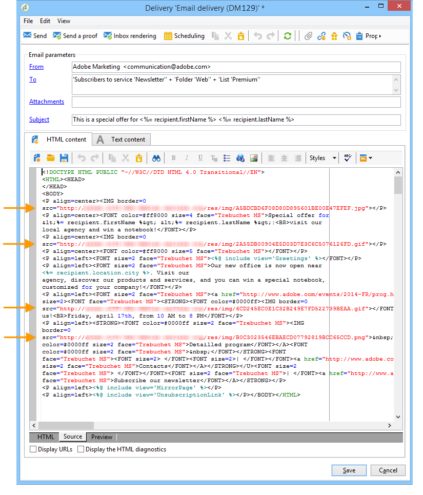

# De e-mailcontent opgeven {#defining-the-email-content}

## Afzender {#sender}

Als u de naam en het adres wilt definiëren van de afzender die wordt weergegeven in de koptekst van de verzonden berichten, klikt u op de knop **[!UICONTROL From]** koppeling.

In dit venster kunt u alle gegevens invoeren die nodig zijn om de e-mailberichtkoppen te maken. Deze informatie kan worden gepersonaliseerd. Hiervoor gebruikt u de knoppen rechts van de invoervelden om aanpassingsvelden in te voegen.

Als u wilt weten hoe u verpersoonlijkingsvelden invoegt en gebruikt, raadpleegt u [Over personalisatie](about-personalization.md) sectie.

>[!NOTE]
>
>* Het adres van de afzender wordt gebruikt voor antwoorden door gebrek.
>* De headerparameters mogen niet leeg zijn. Door gebrek, bevatten zij de waardeninput wanneer het vormen van de plaatsingstovenaar. Lees meer in [deze sectie](../../installation/using/deploying-an-instance.md).
>* Het adres van de afzender is verplicht om een e-mailbericht toe te staan (norm RFC).
>* Adobe Campaign controleert de syntaxis van de ingevoerde e-mailadressen.

>[!CAUTION]
>
>Om leveringsproblemen te voorkomen, moeten de e-mailaccounts die overeenkomen met de adressen die voor leveringen en antwoorden zijn opgegeven, bestaan en worden gecontroleerd. Neem contact op met de systeembeheerder.

## Berichtonderwerp {#message-subject}

Het onderwerp van het bericht wordt gevormd op het overeenkomstige gebied. U kunt het rechtstreeks in het veld invoeren of op de knop **[!UICONTROL Subject]** koppeling gebruiken om een script in te voeren. Met de koppeling voor personalisatie kunt u databasevelden in het onderwerp invoegen.

>[!IMPORTANT]
>
>Het onderwerp van het bericht is verplicht.

De inhoud van het veld wordt vervangen door de waarde in het ontvangende profiel wanneer het bericht wordt verzonden.

In het bovenstaande bericht is het onderwerp van het bericht bijvoorbeeld gepersonaliseerd voor elke ontvanger met gegevens uit zijn profiel.

>[!NOTE]
>
>Het gebruik van personalisatievelden wordt weergegeven in [Over personalisatie](about-personalization.md).

U kunt ook emoticons aan uw onderwerpregel toevoegen met de **[!UICONTROL Insert emoticon]** pop-upvenster.

## Berichtinhoud {#message-content}

>[!IMPORTANT]
>
>Om privacyredenen raden we u aan HTTPS te gebruiken voor alle externe bronnen.

De inhoud van het bericht wordt bepaald in de lagere sectie van het venster van de leveringsconfiguratie.

Berichten worden standaard in HTML- of tekstindeling verzonden, afhankelijk van de voorkeur van de ontvanger. We raden u aan inhoud in beide indelingen te maken om ervoor te zorgen dat berichten correct kunnen worden weergegeven in elk e-mailsysteem. Raadpleeg voor meer informatie hierover [Berichtindelingen selecteren](email-parameters.md#selecting-message-formats).

* Als u inhoud van een HTML wilt importeren, gebruikt u de **[!UICONTROL Open]** knop. U kunt de broncode ook rechtstreeks in het dialoogvenster **[!UICONTROL Source]** subtab.

  Als u het [Editor voor digitale inhoud](../../web/using/about-campaign-html-editor.md) (DCE), zie [Een inhoudssjabloon selecteren](../../web/using/use-case-creating-an-email-delivery.md#step-3---selecting-a-content).

  >[!IMPORTANT]
  >
  >De HTML-inhoud moet vooraf worden gemaakt en vervolgens worden geïmporteerd in Adobe Campaign. De HTML-editor is niet ontworpen voor het maken van inhoud.

  De **[!UICONTROL Preview]** Met de subtab kunt u de rendering van elke inhoud voor een ontvanger bekijken. De verpersoonlijkingsgebieden en de voorwaardelijke elementen van inhoud worden vervangen met de overeenkomstige informatie voor het geselecteerde profiel.

  Met de werkbalkknoppen hebt u toegang tot de standaardhandelingen en opmaakparameters voor de pagina HTML.

  

  U kunt afbeeldingen invoegen in berichten vanuit een lokaal bestand of vanuit een afbeeldingsbibliotheek in Adobe Campaign. Om dit te doen, klik **[!UICONTROL Image]** en selecteert u de gewenste optie.

  

  Bibliotheekafbeeldingen zijn toegankelijk via de **[!UICONTROL Resources>Online>Public resources]** in de mappenstructuur. Zie ook [Afbeeldingen toevoegen](#adding-images).

  Met de laatste knop op de werkbalk kunt u aanpassingsvelden invoegen.

  >[!NOTE]
  >
  >Het gebruik van personalisatievelden wordt weergegeven in [Over personalisatie](about-personalization.md).

  Met de tabbladen onder aan de pagina kunt u de HTML-code weergeven van de pagina die wordt gemaakt en kunt u de weergave van het bericht met de personalisatie bekijken. Klik op **[!UICONTROL Preview]** en selecteer een ontvanger met de **[!UICONTROL Test personalization]** in de werkbalk. U kunt een ontvanger selecteren bij de gedefinieerde doelgroep(en) of een andere ontvanger kiezen.

  

  U kunt het bericht HTML valideren. U kunt ook de inhoud van de koptekst van de e-mail weergeven.

  

* Als u tekstinhoud wilt importeren, gebruikt u de opdracht **[!UICONTROL Open]** of de **[!UICONTROL Text Content]** om de inhoud van het bericht in te voeren wanneer deze wordt weergegeven in tekstopmaak. Gebruik de werkbalkknoppen om toegang te krijgen tot handelingen over de inhoud. Met de laatste knop kunt u aanpassingsvelden invoegen.

  

  Als voor het formaat van de HTML klik **[!UICONTROL Preview]** onder aan de pagina om de weergave van het bericht met de personalisatie weer te geven.

  

## Interactieve content definiëren {#amp-for-email-format}

Met Adobe Campaign kunt u de nieuwe interactieve [AMP voor e-mail](https://amp.dev/about/email/) -indeling, waarmee onder bepaalde omstandigheden dynamische e-mailberichten kunnen worden verzonden.

Zie [deze sectie](defining-interactive-content.md)voor meer informatie.

## Inhoudsbeheer gebruiken {#using-content-management}

U kunt de inhoud van de levering bepalen gebruikend de vormen van het inhoudsbeheer, direct in de leveringstovenaar. Hiervoor moet u verwijzen naar de publicatiesjabloon van het inhoudsbeheer dat u wilt gebruiken, in het gedeelte **[!UICONTROL Advanced]** tabblad van de leveringseigenschappen.

Met een extra tabblad kunt u inhoud invoeren die automatisch wordt geïntegreerd en opgemaakt volgens de regels voor inhoudsbeheer.

>[!NOTE]
>
>Voor meer informatie over contentbeheer in Adobe Campaign raadpleegt u [deze sectie](about-content-management.md).

## emoticons invoegen {#inserting-emoticons}

U kunt emoticons invoegen in uw e-mailinhoud.

1. Klik op de knop **[!UICONTROL Insert emoticon]** pictogram.
1. Selecteer een emoticon in het pop-upvenster.

   

1. Klik op de knop **[!UICONTROL Close]** als u klaar bent.

Als u de lijst met emoticonen wilt aanpassen, raadpleegt u deze [page](customizing-emoticon-list.md).

## Afbeeldingen toevoegen {#adding-images}

E-mailleveringen in HTML-indeling kunnen afbeeldingen bevatten. Vanuit de wizard voor levering kunt u een HTML-pagina met afbeeldingen importeren of rechtstreeks via de HTML-editor afbeeldingen invoegen **[!UICONTROL Image]** pictogram.

### Guardrails {#img-guardrails}

Om prestatieproblemen te voorkomen, mogen afbeeldingen in e-mailberichten niet groter zijn dan 100 kB. Deze standaard ingestelde limiet kan worden gewijzigd in `NmsDelivery_MaxDownloadedImageSize` -optie. Adobe raadt echter sterk aan om grote afbeeldingen in uw e-mailleveringen te voorkomen.

Meer informatie in [de lijst met opties voor Campaigns Classic](../../installation/using/configuring-campaign-options.md#delivery).

### Afbeeldingstypen {#img-types}

Afbeeldingen kunnen:

* Een lokale afbeelding of een afbeelding die wordt aangeroepen vanaf een server
* Een afbeelding die is opgeslagen in de openbare-bronnenbibliotheek van Adobe Campaign

  Openbare middelen zijn toegankelijk via **[!UICONTROL Resources > Online]** knooppunt van de Adobe Campaign-hiërarchie. Ze zijn gegroepeerd in een bibliotheek en kunnen worden opgenomen in e-mailberichten, maar kunnen ook worden gebruikt voor campagnes of taken, of voor inhoudsbeheer.

* An asset shared with Adobe Experience Cloud. Zie [deze sectie](../../integrations/using/sharing-assets-with-adobe-experience-cloud.md).

### Afbeeldingen invoegen en beheren {#manage-images}

Met de wizard voor levering kunt u lokale afbeeldingen of afbeeldingen die zijn opgeslagen in de bibliotheek toevoegen aan de inhoud van berichten. Om dit te doen, klik **[!UICONTROL Image]** op de werkbalk Inhoud HTML.

>[!IMPORTANT]
>
>De ontvangers kunnen de afbeeldingen die zijn opgenomen in de berichten die ze ontvangen, alleen weergeven als deze berichten beschikbaar zijn op een server die van buitenaf toegankelijk is.

Afbeeldingen beheren via de wizard voor levering:

1. Klik op de knop **[!UICONTROL Tracking & Images]** in de werkbalk.
   

1. Selecteren **[!UICONTROL Upload images]** in de **[!UICONTROL Images]** tab.
1. Vervolgens kunt u kiezen of u de afbeeldingen in het e-mailbericht wilt opnemen.
   

* U kunt afbeeldingen handmatig uploaden zonder te wachten op de fase van de leveringsanalyse. Om dit te doen, klik **[!UICONTROL Upload the images straightaway...]** koppeling.
* U kunt een ander pad opgeven voor toegang tot de afbeeldingen op de trackingserver. Om dit te doen, ga het in in **[!UICONTROL Images URL]** veld. Deze waarde negeert de waarde die is gedefinieerd in de parameters van de installatiewizard.

Wanneer u HTML-inhoud met opgenomen afbeeldingen opent in de wizard voor levering, kunt u de afbeeldingen volgens de leveringsparameters direct uploaden.

>[!IMPORTANT]
>
> De afbeeldings-URL&#39;s worden gewijzigd tijdens handmatig uploaden of tijdens het verzenden van berichten.
> 

### Hoofdlettergebruik: een bericht met afbeeldingen verzenden {#uc-images}

Hieronder ziet u een voorbeeld van een levering met vier afbeeldingen:

Deze afbeeldingen komen uit een lokale map of website zoals u kunt controleren op de knop **[!UICONTROL Source]** tab.

Klik op de knop **[!UICONTROL Tracking & Images]** en vervolgens de **[!UICONTROL Images]** om de afbeeldingen in het bericht te detecteren.

Voor elke gedetecteerde afbeelding kunt u de status bekijken:

* Als een afbeelding lokaal is opgeslagen of zich op een andere server bevindt, zelfs als deze server van buitenaf zichtbaar is (bijvoorbeeld op een internetsite), wordt deze gedetecteerd als **[!UICONTROL Not yet online]**.
* De afbeeldingen worden gedetecteerd als **[!UICONTROL Already online]** als ze eerder zijn geüpload terwijl een andere levering wordt gemaakt.
* In de implementatietovenaar kunt u URLs bepalen waarvoor beeldopsporing niet wordt toegelaten: het uploaden van deze beelden zal worden **[!UICONTROL Skipped]**.

>[!NOTE]
>
>Afbeeldingen worden geïdentificeerd door hun inhoud en niet door hun toegangspaden. Dit betekent dat een afbeelding die eerder onder een andere naam of in een andere map is geüpload, wordt gedetecteerd als **[!UICONTROL Already online]**.

Tijdens de analysefase worden de afbeeldingen automatisch geüpload naar de server, zodat ze van buitenaf toegankelijk zijn, behalve de lokale afbeeldingen die vooraf moeten worden geüpload.

U kunt vooruit werken en afbeeldingen uploaden, zodat deze door andere Adobe Campaign-operatoren kunnen worden weergegeven. Dit is handig als u in samenwerking werkt. Om dit te doen, klik **[!UICONTROL Upload the images straightaway...]** om de afbeeldingen naar de server te uploaden.

>[!NOTE]
>
>De URL&#39;s van de afbeeldingen in de e-mail en met name de namen van de afbeeldingen worden vervolgens gewijzigd.

Als de afbeeldingen eenmaal online zijn, kunt u de wijzigingen in de namen en paden van de **[!UICONTROL Source]** tabblad van het bericht.

Als u **[!UICONTROL Include the images in the email]**, kunt u kiezen welke afbeeldingen u wilt opnemen in de corresponderende kolom.

>[!NOTE]
>
>Als het bericht lokale afbeeldingen bevat, moet u de wijzigingen in de broncode van het bericht bevestigen.

## Een gepersonaliseerde streepjescode invoegen{#insert-a-barcode}

Met de module voor het genereren van streepjescodes kunt u verschillende typen streepjescodes maken die voldoen aan veel gangbare normen, waaronder 2D-streepjescodes.

Het is mogelijk om dynamisch een streepjescode als bitmap te produceren gebruikend een waarde die gebruikend klantencriteria wordt bepaald. U kunt persoonlijke streepjescodes opnemen in e-mailcampagnes. De ontvanger kan het bericht afdrukken en het aan het uitgevende bedrijf tonen voor scannen (bijvoorbeeld bij uitchecken).

Als u een streepjescode in een e-mailbericht wilt invoegen, plaatst u de cursor op de gewenste plaats in de inhoud en klikt u op de knop voor aanpassen. Selecteer **[!UICONTROL Include > Barcode...]**.

Dan vorm de volgende elementen om uw behoeften aan te passen:

1. Selecteer het type streepjescode.

   * Voor 1D-indeling zijn de volgende typen beschikbaar in Adobe Campaign: Codabar, Code 128, GS1-128 (voorheen EAN-128), UPC-A, UPC-E, ISBN, EAN-8, Code39, Interleaved 2 of 5, POSTNET en Royal Mail (RM4SCC).

     Voorbeeld van een 1D-streepjescode:

     

   * De typen DataMatrix en PDF417 hebben betrekking op de 2D-indeling.

     Voorbeeld van een 2D-streepjescode:

     

   * Als u een QR-code wilt invoegen, selecteert u dit type en voert u de toe te passen foutcorrectiesnelheid in. Dit percentage bepaalt de hoeveelheid gegevens die wordt herhaald en de tolerantie voor kwaliteitsverlies.

     

     Voorbeeld van een QR-code:

     

1. Voer de grootte in van de streepjescode die u in de e-mail wilt invoegen: als u de schaal configureert, kunt u de streepjescode groter of kleiner maken, van x1 tot x10.
1. De **[!UICONTROL Value]** kunt u de waarde van de streepjescode definiëren. Een waarde kan een speciale aanbieding aanpassen en kan de functie van criteria zijn, het kan de waarde van een gegevensbestandgebied zijn verbonden met de klanten.

   In dit voorbeeld wordt een streepjescode van het type EAN-8 getoond, waaraan het rekeningnummer van een ontvanger is toegevoegd. Als u dit accountnummer wilt toevoegen, klikt u op de knop voor personalisatie rechts van het dialoogvenster **[!UICONTROL Value]** veld en selecteer **[!UICONTROL Recipient > Account number]**.

   

1. De **[!UICONTROL Height]** kunt u de hoogte van de streepjescode configureren zonder de breedte te wijzigen door de hoeveelheid ruimte tussen de streepjes te wijzigen.

   Er is geen restrictief besturingselement voor invoer afhankelijk van het type streepjescode. Als een streepjescodewaarde onjuist is, is deze alleen zichtbaar in **Voorvertoning** in de modus waarin de streepjescode rood wordt doorgehaald.

   >[!NOTE]
   >
   >De waarde die aan een streepjescode wordt toegewezen, is afhankelijk van het type. Een type EAN-8 moet bijvoorbeeld precies 8 cijfers hebben.
   >
   >De verpersoonlijkingsknoop rechts van **[!UICONTROL Value]** in dit veld kunt u naast de waarde zelf ook gegevens toevoegen. Hiermee wordt de streepjescode verrijkt, op voorwaarde dat de streepjescodestandaard dit accepteert.
   >
   >Als u bijvoorbeeld een streepjescode van het type GS1-128 gebruikt en als u naast de waarde het rekeningnummer van een ontvanger wilt invoeren, klikt u op de knop Verpersoonlijken en selecteert u **[!UICONTROL Recipient > Account number]**. Als het accountnummer van de geselecteerde ontvanger correct is ingevoerd, wordt hiermee rekening gehouden in de streepjescode.

Zodra deze elementen zijn gevormd, kunt u uw e-mail voltooien en het verzenden. Als u fouten wilt voorkomen, moet u ervoor zorgen dat de inhoud correct wordt weergegeven voordat u de levering uitvoert door op de knop **[!UICONTROL Preview]** tab.

>[!NOTE]
>
>Wanneer de waarde van een streepjescode onjuist is, wordt de bitmap rood weergegeven.

