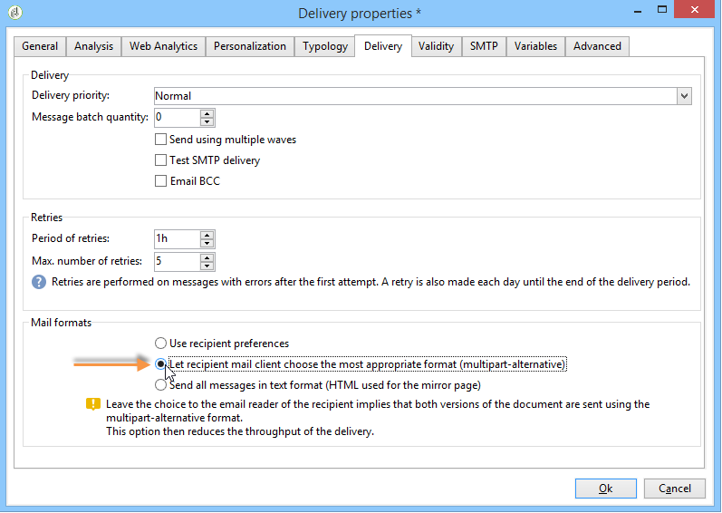

# De e-mailinhoud definiëren{#defining-the-email-content}

## Afzender {#sender}

Als u de naam en het adres wilt definiëren van de afzender die wordt weergegeven in de koptekst van de verzonden berichten, klikt u op de **[!UICONTROL From]** koppeling.

In dit venster kunt u alle gegevens invoeren die nodig zijn om de e-mailberichtkoppen te maken. Deze informatie kan worden gepersonaliseerd. Hiervoor gebruikt u de knoppen rechts van de invoervelden om aanpassingsvelden in te voegen.

Raadpleeg de sectie [Over personalisatie](../../delivery/using/about-personalization.md) voor meer informatie over het invoegen en gebruiken van verpersoonlijkingsvelden.

>[!NOTE]
>
>* Het adres van de afzender zal voor antwoorden door gebrek worden gebruikt.
>* De headerparameters mogen niet leeg zijn. Door gebrek, bevatten zij de waardeninput wanneer het vormen van de plaatsingstovenaar. Raadpleeg de [installatiegids](../../installation/using/deploying-an-instance.md)voor meer informatie.
>* Het adres van de afzender is verplicht om een e-mailbericht toe te staan (norm RFC).
>* Adobe Campagne controleert de syntaxis van e-mailadressen ingegaan.

>[!CAUTION]
>
>In de context van de controles die door de Leveranciers van de Toegang van Internet (ISPs) worden uitgevoerd om ongevraagde e-mail (spam) te bestrijden, adviseert Adobe het creëren van e-mailrekeningen die aan de adressen beantwoorden die voor leveringen en antwoorden worden gespecificeerd. Vraag de beheerder van het berichtensysteem om advies.

## Berichtonderwerp {#message-subject}

Het onderwerp van het bericht wordt gevormd op het overeenkomstige gebied. U kunt het rechtstreeks in het veld invoeren of op de **[!UICONTROL Subject]** koppeling klikken om een script in te voeren. Met de koppeling voor personalisatie kunt u databasevelden in het onderwerp invoegen.

>[!CAUTION]
>
>Het onderwerp van het bericht is verplicht.

De inhoud van het veld wordt vervangen door de waarde in het ontvangende profiel wanneer het bericht wordt verzonden.

In het bovenstaande bericht is het onderwerp van het bericht bijvoorbeeld gepersonaliseerd voor elke ontvanger met gegevens uit zijn profiel.

>[!NOTE]
>
>Het gebruik van verpersoonlijkingsgebieden wordt voorgesteld in [Ongeveer verpersoonlijking](../../delivery/using/about-personalization.md).

## Berichtinhoud {#message-content}

>[!CAUTION]
>
>Om privacyredenen raden we u aan HTTPS te gebruiken voor alle externe bronnen.

De inhoud van het bericht wordt bepaald in de lagere sectie van het venster van de leveringsconfiguratie.

Berichten worden standaard in HTML- of tekstindeling verzonden, afhankelijk van de voorkeur van de ontvanger. We raden u aan inhoud in beide indelingen te maken om ervoor te zorgen dat berichten correct kunnen worden weergegeven in elk e-mailsysteem. Raadpleeg [Berichtindelingen](#selecting-message-formats)selecteren voor meer informatie.

* Als u HTML-inhoud wilt importeren, gebruikt u de **[!UICONTROL Open]** knop. U kunt de broncode ook rechtstreeks in het **[!UICONTROL Source]** subtabblad plakken.

   Als u de [Digital Content Editor](../../web/using/about-campaign-html-editor.md) (DCE) gebruikt, raadpleegt u [Een inhoudssjabloon](../../web/using/use-case--creating-an-email-delivery.md#step-3---selecting-a-content)selecteren.

   >[!CAUTION]
   >
   >De HTML-inhoud moet vooraf worden gemaakt en vervolgens worden geïmporteerd in Adobe Campaign. De HTML-editor is niet ontworpen voor het maken van inhoud.

   Met het **[!UICONTROL Preview]** subtabblad kunt u de rendering van elke inhoud voor een ontvanger bekijken. De verpersoonlijkingsgebieden en de voorwaardelijke elementen van inhoud worden vervangen met de overeenkomstige informatie voor het geselecteerde profiel.

   Met de werkbalkknoppen hebt u toegang tot de standaardhandelingen en opmaakparameters voor de HTML-pagina.

   

   U kunt afbeeldingen invoegen in berichten vanuit een lokaal bestand of vanuit een afbeeldingsbibliotheek in Adobe Campaign. Klik hiertoe op het **[!UICONTROL Image]** pictogram en selecteer de gewenste optie.

   

   Bibliotheekafbeeldingen zijn toegankelijk via de **[!UICONTROL Resources>Online>Public resources]** map in de mappenstructuur. Zie ook [Afbeeldingen](#adding-images)toevoegen.

   Met de laatste knop op de werkbalk kunt u aanpassingsvelden invoegen.

   >[!NOTE]
   >
   >Het gebruik van verpersoonlijkingsgebieden wordt voorgesteld in [Ongeveer verpersoonlijking](../../delivery/using/about-personalization.md).

   Met de tabbladen onder aan de pagina kunt u de HTML-code weergeven van de pagina die wordt gemaakt en kunt u de weergave van het bericht met de personalisatie bekijken. Als u deze weergave wilt starten, klikt u op **[!UICONTROL Preview]** en selecteert u een ontvanger met de **[!UICONTROL Test personalization]** knop op de werkbalk. U kunt een ontvanger selecteren bij de gedefinieerde doelgroep(en) of een andere ontvanger kiezen.

   

   U kunt het HTML-bericht valideren. U kunt ook de inhoud van de koptekst van de e-mail weergeven.

   

* Als u tekstinhoud wilt importeren, gebruikt u de **[!UICONTROL Open]** knop of het **[!UICONTROL Text Content]** tabblad om de inhoud van het bericht in te voeren wanneer deze in tekstindeling wordt weergegeven. Gebruik de werkbalkknoppen om toegang te krijgen tot handelingen over de inhoud. Met de laatste knop kunt u aanpassingsvelden invoegen.

   

   Als u de HTML-indeling gebruikt, klikt u op het **[!UICONTROL Preview]** tabblad onder aan de pagina om de weergave van het bericht met de personalisatie weer te geven.

   

## Berichtindelingen selecteren {#selecting-message-formats}

U kunt de indeling van verzonden e-mailberichten wijzigen. Hiervoor bewerkt u de leveringseigenschappen en klikt u op het **[!UICONTROL Delivery]** tabblad.

Selecteer de indeling van de e-mail in de onderste sectie van het venster:

* **[!UICONTROL Use recipient preferences]** (standaardmodus)

   De berichtindeling wordt gedefinieerd op basis van de gegevens die zijn opgeslagen in het ontvangende profiel en wordt standaard opgeslagen in het **[!UICONTROL email format]** veld (@emailFormat). Als een ontvanger berichten in een bepaald formaat wenst te ontvangen, is dit het verzonden formaat. Als het veld niet is ingevuld, wordt een meerdelig alternatief bericht verzonden (zie hieronder).

* **[!UICONTROL Let recipient mail client choose the most appropriate format]**

   Het bericht bevat beide indelingen: tekst en HTML. Het formaat dat op ontvangst wordt getoond hangt van de configuratie van de postsoftware van de ontvanger (multipart-alternatief) af.

   >[!CAUTION]
   >
   >Deze optie omvat beide versies van het document. Het heeft daarom invloed op de leveringstarieven, omdat de berichtgrootte groter is.

* **[!UICONTROL Send all messages in text format]**

   Het bericht wordt verzonden in tekstformaat. De HTML-indeling wordt niet verzonden, maar wordt alleen voor de spiegelpagina gebruikt wanneer de ontvanger op het bericht klikt.

## Interactieve inhoud definiëren {#amp-for-email-format}

Met Adobe Campaign kunt u de nieuwe interactieve [AMP-indeling voor e-mail](https://amp.dev/about/email/) proberen, waarmee u onder bepaalde omstandigheden dynamische e-mailberichten kunt verzenden.

Zie [deze sectie](../../delivery/using/defining-interactive-content.md)voor meer informatie.

## Inhoudsbeheer gebruiken {#using-content-management}

U kunt de inhoud van de levering bepalen gebruikend de vormen van het inhoudsbeheer, direct in de leveringstovenaar. Hiervoor moet u verwijzen naar de publicatiesjabloon van het inhoudsbeheer dat moet worden gebruikt, op het **[!UICONTROL Advanced]** tabblad van de leveringseigenschappen.

Met een extra tabblad kunt u inhoud invoeren die automatisch wordt geïntegreerd en opgemaakt volgens de regels voor inhoudsbeheer.

>[!NOTE]
>
>Zie [deze sectie](../../delivery/using/about-content-management.md)voor meer informatie over inhoudsbeheer in Adobe Campaign.

## Afbeeldingen toevoegen {#adding-images}

E-mailleveringen in HTML-indeling kunnen afbeeldingen bevatten. Vanuit de wizard voor levering kunt u een HTML-pagina met afbeeldingen importeren of afbeeldingen rechtstreeks via het **[!UICONTROL Image]** pictogram invoegen in de HTML-editor.

Afbeeldingen kunnen:

* Een lokale afbeelding of een afbeelding die wordt aangeroepen vanaf een server
* Een afbeelding die is opgeslagen in de bibliotheek met openbare bronnen voor Adobe Campagne

   De openbare middelen zijn toegankelijk via de **[!UICONTROL Resources > Online]** knoop van de hiërarchie van de Campagne van Adobe. Ze zijn gegroepeerd in een bibliotheek en kunnen worden opgenomen in e-mailberichten, maar kunnen ook worden gebruikt voor campagnes of taken, of voor inhoudsbeheer.

* Een middel dat wordt gedeeld met Adobe Experience Cloud. Zie [deze sectie](../../integrations/using/sharing-assets-with-adobe-experience-cloud.md).

>[!CAUTION]
>
>Als u afbeeldingen in de e-mailberichten wilt opnemen met de wizard voor levering, moet de Adobe Campagne-instantie zo zijn geconfigureerd dat het beheer van openbare bronnen is ingeschakeld. Deze procedure kan van de plaatsingstovenaar worden uitgevoerd. Raadpleeg de [volgende sectie](../../installation/using/deploying-an-instance.md) voor meer informatie over de configuratie.

Met de wizard voor levering kunt u lokale afbeeldingen of afbeeldingen die zijn opgeslagen in de bibliotheek toevoegen aan de inhoud van berichten. Klik hiertoe op de **[!UICONTROL Image]** knop op de werkbalk HTML-inhoud.

De ontvangers kunnen de afbeeldingen die zijn opgenomen in de berichten die ze ontvangen, alleen weergeven als deze berichten beschikbaar zijn op een server die van buitenaf toegankelijk is.

Als u afbeeldingen wilt beheren via de wizard voor levering, moet u op het **[!UICONTROL Tracking & Images]** pictogram op de werkbalk klikken.

Selecteer **[!UICONTROL Upload images]** op het **[!UICONTROL Images]** tabblad. Vervolgens kunt u kiezen of u de afbeeldingen in het e-mailbericht wilt opnemen.

* U kunt afbeeldingen handmatig uploaden zonder te wachten op de fase van de leveringsanalyse. Klik hiertoe op de **[!UICONTROL Upload images now]** koppeling.
* U kunt een ander pad opgeven voor toegang tot de afbeeldingen op de trackingserver. Voer dit in het **[!UICONTROL Image URL]** veld in. Deze waarde negeert de waarde die is gedefinieerd in de parameters van de installatiewizard.

Wanneer u HTML-inhoud met opgenomen afbeeldingen opent in de wizard voor levering, kunt u de afbeeldingen volgens de leveringsparameters direct uploaden.

>[!CAUTION]
>
>De toegangspaden voor afbeeldingen worden gewijzigd tijdens het handmatig uploaden of tijdens het verzenden van berichten.

**Voorbeeld: verzenden, bericht met afbeeldingen{#example--sending-a-message-with-images}**

Hier volgt een voorbeeld van een levering met vier afbeeldingen:

Deze afbeeldingen komen uit een lokale map of website die u kunt controleren op het **[!UICONTROL Source]** tabblad.

Klik op het **[!UICONTROL Tracking & Images]** pictogram en vervolgens op het **[!UICONTROL Images]** tabblad om de afbeeldingen in het bericht te detecteren.

Voor elke gedetecteerde afbeelding kunt u de status bekijken:

* Als een afbeelding lokaal is opgeslagen of zich op een andere server bevindt, zelfs als deze server van buitenaf zichtbaar is (bijvoorbeeld op een internetsite), wordt deze gedetecteerd als **[!UICONTROL Not yet online]**.
* De afbeeldingen worden gedetecteerd alsof ze eerder zijn geüpload terwijl een andere levering wordt gemaakt. **[!UICONTROL Already online]**
* In de plaatsingstovenaar, kunt u URLs bepalen waarvoor beeldopsporing niet wordt toegelaten: Deze afbeeldingen worden geüpload **[!UICONTROL Skipped]**.

>[!NOTE]
>
>Afbeeldingen worden geïdentificeerd door hun inhoud en niet door hun toegangspaden. Dit betekent dat een afbeelding die eerder onder een andere naam of in een andere map is geüpload, wordt gedetecteerd als **[!UICONTROL Already online]** een afbeelding.

Tijdens de analysefase worden de afbeeldingen automatisch geüpload naar de server, zodat ze van buitenaf toegankelijk zijn, behalve de lokale afbeeldingen die vooraf moeten worden geüpload.

U kunt vooruit werken en afbeeldingen uploaden, zodat deze door andere Adobe-campagneoperatoren kunnen worden weergegeven. Dit is handig als u in samenwerking werkt. Om dit te doen, klik **[!UICONTROL Upload the images straightaway...]** om de beelden op de server te uploaden.

>[!NOTE]
>
>De URL&#39;s van de afbeeldingen in de e-mail en met name de namen van de afbeeldingen worden vervolgens gewijzigd.

Als de afbeeldingen eenmaal online zijn, kunt u de wijzigingen in de naam en het pad bekijken op het **[!UICONTROL Source]** tabblad van het bericht.

Als u **[!UICONTROL Include the images in the email]** deze optie selecteert, kunt u kiezen welke afbeeldingen u wilt opnemen in de corresponderende kolom.

>[!NOTE]
>
>Als het bericht lokale afbeeldingen bevat, moet u de wijzigingen in de broncode van het bericht bevestigen.

## Een streepjescode invoegen in een e-mail{#inserting-a-barcode-in-an-email}

Met de module voor het genereren van streepjescodes kunt u verschillende typen streepjescodes maken die voldoen aan veel gangbare normen, waaronder 2D-streepjescodes.

Het is mogelijk om dynamisch een streepjescode als bitmap te produceren gebruikend een waarde die gebruikend klantencriteria wordt bepaald. U kunt persoonlijke streepjescodes opnemen in e-mailcampagnes. De ontvanger kan het bericht afdrukken en het aan het uitgevende bedrijf tonen voor scannen (bijvoorbeeld bij uitchecken).

Als u een streepjescode in een e-mailbericht wilt invoegen, plaatst u de cursor op de gewenste plaats in de inhoud en klikt u op de knop voor aanpassen. Selecteer **[!UICONTROL Include > Barcode...]**.

Dan vorm de volgende elementen om uw behoeften aan te passen:

1. Selecteer het type streepjescode.

   * Voor de 1D-indeling zijn de volgende typen beschikbaar in Adobe Campagne: Codabar, Code 128, GS1-128 (voorheen EAN-128), UPC-A, UPC-E, ISBN, EAN-8, Code39, Interleaved 2 of 5, POSTNET and Royal Mail (RM4SCC).

      Voorbeeld van een 1D-streepjescode:

      

   * De typen DataMatrix en PDF417 hebben betrekking op de 2D-indeling.

      Voorbeeld van een 2D-streepjescode:

      

   * Als u een QR-code wilt invoegen, selecteert u dit type en voert u de toe te passen foutcorrectiesnelheid in. Dit percentage bepaalt de hoeveelheid gegevens die wordt herhaald en de tolerantie voor kwaliteitsverlies.

      

      Voorbeeld van een QR-code:

      

1. Voer de grootte in van de streepjescode die u in de e-mail wilt invoegen: Door de schaal te configureren kunt u de grootte van de streepjescode verhogen of verlagen, van x1 tot x10.
1. In het **[!UICONTROL Value]** veld kunt u de waarde van de streepjescode definiëren. Een waarde kan een speciale aanbieding aanpassen en kan de functie van criteria zijn, het kan de waarde van een gegevensbestandgebied zijn verbonden met de klanten.

   In dit voorbeeld wordt een streepjescode van het type EAN-8 getoond, waaraan het rekeningnummer van een ontvanger is toegevoegd. Als u dit accountnummer wilt toevoegen, klikt u op de aanpassingsknop rechts van het **[!UICONTROL Value]** veld en selecteert u **[!UICONTROL Recipient > Account number]**.

   

1. In het **[!UICONTROL Height]** veld kunt u de hoogte van de streepjescode configureren zonder de breedte te wijzigen door de hoeveelheid ruimte tussen de streepjes te wijzigen.

   Er is geen restrictief besturingselement voor invoer afhankelijk van het type streepjescode. Als een streepjescodewaarde onjuist is, is deze alleen zichtbaar in de modus **Voorbeeld** , waarin de streepjescode in het rood wordt doorgestreept.

   >[!NOTE]
   >
   >De waarde die aan een streepjescode wordt toegewezen, is afhankelijk van het type. Een type EAN-8 moet bijvoorbeeld precies 8 cijfers hebben.
   >
   >Met de aanpassingsknop rechts van het **[!UICONTROL Value]** veld kunt u naast de waarde zelf ook gegevens toevoegen. Hiermee wordt de streepjescode verrijkt, op voorwaarde dat de streepjescodestandaard dit accepteert.
   >
   >Als u bijvoorbeeld een streepjescode van het type GS1-128 gebruikt en als u naast de waarde het rekeningnummer van een ontvanger wilt invoeren, klikt u op de knop Verpersoonlijken en selecteert u **[!UICONTROL Recipient > Account number]**. Als het accountnummer van de geselecteerde ontvanger correct is ingevoerd, wordt hiermee rekening gehouden in de streepjescode.

Zodra deze elementen zijn gevormd, kunt u uw e-mail voltooien en het verzenden. U voorkomt fouten door op het **[!UICONTROL Preview]** tabblad te klikken om ervoor te zorgen dat de inhoud correct wordt weergegeven voordat u de levering uitvoert.

>[!NOTE]
>
>Wanneer de waarde van een streepjescode onjuist is, wordt de bitmap rood weergegeven.

## E-mails verzenden naar Japanse mobiele telefoons {#sending-emails-on-japanese-mobiles}

### E-mailindelingen voor Japanse mobiele apparaten {#email-formats-for-japanese-mobiles}

Adobe Campaign beheert drie specifieke Japanse indelingen voor e-mail op mobiele apparaten: **Deco-mail** (DoCoMo mobiles), **Decore Mail** (Softbank mobiles) en **Decoration Mail** (KDDI AU mobiles). Deze formaten leggen bijzondere coderings, structuur, en groottebeperkingen op. Meer informatie over beperkingen en aanbevelingen vindt u in [deze sectie](#limitations-and-recommendations).

Om ervoor te zorgen dat de ontvanger berichten in één van deze formaten correct ontvangt, adviseren wij selecterend **[!UICONTROL Deco-mail (DoCoMo)]**, **[!UICONTROL Decore Mail (Softbank)]** of **[!UICONTROL Decoration Mail (KDDI AU)]** in het overeenkomstige profiel:

Als u de **[!UICONTROL Email format]** optie echter als **[!UICONTROL Unknown]**, **[!UICONTROL HTML]** of **[!UICONTROL Text]**, laat Adobe Campaign automatisch de Japanse indeling detecteren (wanneer u het e-mailbericht verzendt) voor gebruik, zodat het bericht correct wordt weergegeven.

Dit automatische detectiesysteem is gebaseerd op de lijst met vooraf gedefinieerde domeinen die zijn gedefinieerd in de set met **[!UICONTROL Management of Email Formats]** mailregels. Raadpleeg [deze pagina](../../installation/using/email-deliverability.md#managing-email-formats)voor meer informatie over het beheren van e-mailindelingen.

### Beperkingen en aanbevelingen {#limitations-and-recommendations}

Voor het verzenden van e-mails die worden gelezen op een mobiel apparaat dat wordt gebruikt door een Japanse provider (Softbank, DoCoMo, KDDI AU) gelden een aantal beperkingen.

Daarom moet u:

* Alleen afbeeldingen in de JPEG- of GIF-indeling gebruiken
* Een levering maken met tekst en HTML-secties die strikt lager zijn dan 10 000 bytes (voor KDDI AU en DoCoMo)
* Afbeeldingen met een totale grootte (vóór codering) van minder dan 100 kB gebruiken
* Gebruik niet meer dan 20 afbeeldingen per bericht
* Een HTML-indeling van beperkte grootte gebruiken (een beperkt aantal tags is beschikbaar voor elke operator)

>[!NOTE]
>
>Wanneer u uw bericht maakt, moet u rekening houden met de beperkingen die specifiek zijn voor elke operator. Zie:
>
>* Raadpleeg [deze pagina voor DoCoMo](https://www.nttdocomo.co.jp/service/developer/make/content/deco_mail/index.html)
>* Voor KDDI AU, verwijs naar [deze pagina](https://www.au.com/ezfactory/tec/spec/decorations/template.html)
>* Raadpleeg [deze pagina voor Softbank](https://www.support.softbankmobile.co.jp/partner/home_tech3/index.cfm)

### E-mailinhoud testen {#testing-the-email-content}

#### Een voorbeeld van het bericht bekijken {#previewing-the-message}

Met Adobe Campaign kunt u controleren of de berichtindeling is aangepast en kan worden verzonden naar een Japanse mobiele telefoon.

Nadat u de inhoud hebt gedefinieerd en het onderwerp van de e-mail hebt ingevoerd, kunt u de weergave en opmaak controleren wanneer het bericht wordt gemaakt.

Als u op het **[!UICONTROL Preview]** tabblad van het venster voor het bewerken van inhoud klikt, **[!UICONTROL More... > Deco-mail diagnostic]** kunt u:

* Controleren of de HTML-inhoudscodes voldoen aan de Japanse indelingsbeperkingen
* Controleer of het aantal afbeeldingen in het bericht de limiet van de indeling (20 afbeeldingen) niet overschrijdt
* De totale berichtgrootte controleren (minder dan 100 kB)

   

#### Typologieregel uitvoeren {#running-typology-rule}

Naast de diagnose van de voorvertoning wordt een tweede controle uitgevoerd bij de verzending van een bewijs of een levering: tijdens de analyse wordt een specifieke typologieregel **[!UICONTROL Deco-mail check]** opgestart .

>[!CAUTION]
>
>Deze typologieregel wordt alleen uitgevoerd als ten minste een van de ontvangers is geconfigureerd voor het ontvangen van e-mails in **[!UICONTROL Deco-mail (DoCoMo)]**, **[!UICONTROL Decore Mail (Softbank)]** of **[!UICONTROL Decoration Mail (KDDI AU)]** -indeling.

Met deze typologieregel kunt u ervoor zorgen dat de levering voldoet aan de [indelingsbeperkingen](#limitations-and-recommendations) die door de Japanse operatoren zijn gedefinieerd, met name ten opzichte van de totale grootte van de e-mail, de grootte van de HTML- en tekstsecties, het aantal afbeeldingen in de berichten en de tags in de HTML-inhoud.

#### Proefdrukken verzenden {#sending-proofs}

U kunt proefdrukken verzenden om de levering te testen. Als u de proefdruk verzendt en vervangende adressen gebruikt, voert u adressen in die overeenkomen met de e-mailindeling van het gebruikte profiel.

U kunt bijvoorbeeld het adres van een profiel vervangen door test@softbank.ne.jp als de e-mailindeling voor dit profiel vooraf is gedefinieerd **[!UICONTROL Decore Mail (Softbank)]**.

### Berichten verzenden {#sending-messages}

Voor het verzenden van een e-mailbericht naar ontvangers met Japanse e-mailindelingen via Campagne zijn twee opties mogelijk:

* Twee leveringen maken: één voor Japanse ontvangers en een andere voor andere ontvangers - verwijs naar [deze sectie](#designing-a-specific-delivery-for-japanese-formats).
* Maak één levering en Adobe Campaign detecteert automatisch de indeling die u wilt gebruiken. Raadpleeg [deze sectie](#designing-a-delivery-for-all-formats).

#### Een specifieke levering ontwerpen voor Japanse indelingen {#designing-a-specific-delivery-for-japanese-formats}

U kunt een werkstroom maken die twee leveringen bevat: Een voor lezen op een Japans mobiel en een ander voor ontvangers met een standaard e-mailformaat.

Hiervoor gebruikt u de **[!UICONTROL Split]** activiteit in uw workflow en definieert u de Japanse e-mailindelingen (Deco-mail, Decoration Mail en Decoration Mail) als filtervoorwaarden.

#### Een levering ontwerpen voor alle indelingen {#designing-a-delivery-for-all-formats}

Wanneer de indelingen in Adobe Campagne dynamisch worden beheerd volgens het domein (profielen met e-mailindelingen die als **[!UICONTROL Unknown]**, **[!UICONTROL HTML]** of **[!UICONTROL Text]** worden gedefinieerd), kunt u dezelfde levering naar al uw ontvangers verzenden.

Het berichtcontact zal correct voor de gebruikers op Japanse mobiele telefoons, enkel zoals voor de standaardontvangers tonen.

>[!CAUTION]
>
>Let erop dat u de speciale functies respecteert die aan elke Japanse e-mailindeling (Deco-mail, Decoration Mail en Decoration Mail) zijn gekoppeld. Zie [deze sectie](#limitations-and-recommendations)voor meer informatie over beperkingen.
