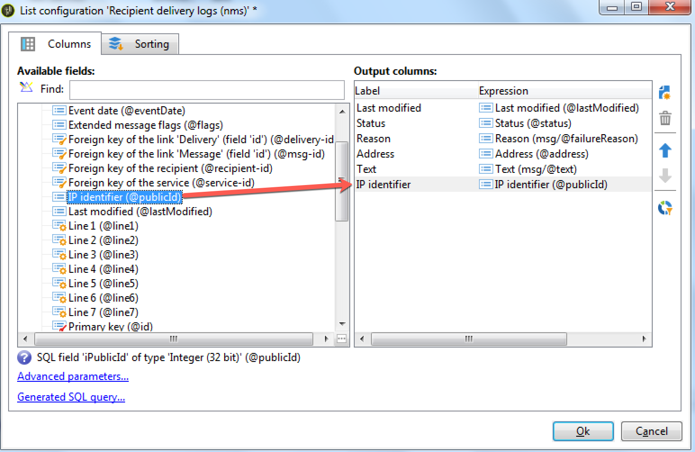
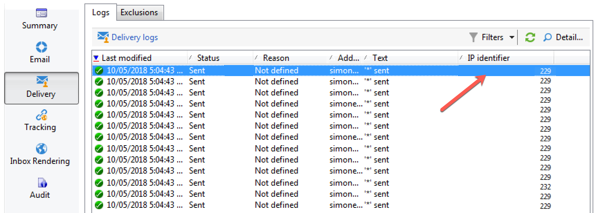

# Leveringsdashboard {#delivery-dashboard}

Het **leveringsdashboard** is van essentieel belang om uw leveringen en eventuele problemen te controleren die tijdens het verzenden van berichten worden ondervonden.

Hiermee kunt u informatie over een levering ophalen en deze indien nodig bewerken. De tabinhoud kan niet meer worden gewijzigd nadat de levering is verzonden.

Hier volgt de informatie die u kunt controleren met de verschillende tabbladen die beschikbaar zijn in het dashboard:

* [Leveringsoverzicht](#delivery-summary)
* [Leveringsrapporten](#delivery-reports)
* [Afleveringslogs, spiegelpagina&#39;s, uitsluitingen](#delivery-logs-and-history)
* [Logbestanden en geschiedenis voor het bijhouden van leveringen](#tracking-logs)
* [Rendering van levering](#delivery-rendering)
* [Afleveringscontrole](#delivery-audit-)


**Verwante onderwerpen:**

* [Leveringsfouten begrijpen](../../delivery/using/understanding-delivery-failures.md)
* [Quarantainebeheer begrijpen](../../delivery/using/understanding-quarantine-management.md)
* [Best practices voor levering](../../delivery/using/delivery-best-practices.md)
* [Leverbaarheid beheren](../../delivery/using/about-deliverability.md)

## Leveringsoverzicht {#delivery-summary}

Het tabblad **[!UICONTROL Summary]** bevat de kenmerken van de levering: leveringsstatus, gebruikt kanaal, informatie over de afzender, onderwerp, informatie over uitvoering.

## Leveringsrapporten {#delivery-reports}

Met de koppeling **[!UICONTROL Reports]**, die toegankelijk is via het tabblad **[!UICONTROL Summary]**, kunt u een set rapporten bekijken die betrekking hebben op de leveringsactie: algemeen leveringsrapport, gedetailleerd rapport, leveringsrapport, verspreiding van mislukte berichten, openingsfrequentie, klikken en transacties, enz.

De inhoud van dit lusje kan volgens uw vereisten worden gevormd. Raadpleeg [deze sectie](../../reporting/using/delivery-reports.md) voor meer informatie over leveringsrapporten.


## Leveringslogboeken, geschiedenis en uitsluitingen {#delivery-logs-and-history}

Het tabblad **[!UICONTROL Delivery]** geeft een geschiedenis van de gebeurtenissen in deze levering. Het bevat de leveringslogboeken, d.w.z. de lijst van verzonden berichten en hun status en de bijbehorende berichten.

Voor een levering kunt u (bijvoorbeeld) alleen ontvangers met een mislukte levering of een adres in quarantaine weergeven. Om dit te doen, klik **[!UICONTROL Filters]** knoop en selecteer **[!UICONTROL By state]**. Selecteer vervolgens het frame in de vervolgkeuzelijst. Verschillende statussen worden vermeld in [deze pagina](../../delivery/using/delivery-statuses.md).

>[!NOTE]
>
>De lijst met de leveringslogboeken kan worden aangepast, net als elke lijst in Campaign Classic. U kunt bijvoorbeeld een kolom toevoegen om te weten welk IP-adres elke e-mail in een bezorging heeft verzonden. Voor meer op dit, verwijs naar het gebruiksgeval in [dit sectie](#use-case) wordt beschreven.


Met de koppeling **[!UICONTROL Display the mirror page for this message...]** kunt u de spiegelpagina weergeven voor de inhoud van de levering die is geselecteerd in de lijst in een nieuw venster.

De spiegelpagina is alleen beschikbaar voor leveringen waarvoor HTML-inhoud is gedefinieerd. Voor meer op dit, verwijs naar [Generating the mirror page](../../delivery/using/sending-messages.md#generating-the-mirror-page).


## Logbestanden voor het bijhouden van de levering en geschiedenis {#tracking-logs}

Op het tabblad **[!UICONTROL Tracking]** wordt de geschiedenis van het bijhouden van gegevens voor deze levering weergegeven. Op dit tabblad worden volggegevens weergegeven voor de verzonden berichten, d.w.z. alle URL&#39;s die door Adobe Campaign moeten worden gevolgd. De volgende gegevens worden per uur bijgewerkt.

>[!NOTE]
>
>Als &#39;tracking&#39; niet is ingeschakeld voor levering, wordt dit tabblad niet weergegeven.

De volgende configuratie wordt uitgevoerd in het aangewezen stadium in de leveringstovenaar. Zie [Hoe te om gevolgde verbindingen](../../delivery/using/how-to-configure-tracked-links.md) te vormen.

**[!UICONTROL Tracking]** gegevens worden geïnterpreteerd in de leveringsrapporten. Zie [deze sectie](../../reporting/using/delivery-reports.md).


## Inboxrendering {#delivery-rendering}

Op het tabblad **[!UICONTROL Inbox rendering]** kunt u een voorvertoning van het bericht weergeven in de verschillende contexten waarin het bericht kan worden ontvangen en kunt u de compatibiliteit van grote desktops en toepassingen controleren.

Op deze manier kunt u ervoor zorgen dat uw bericht optimaal aan de ontvangers wordt weergegeven op verschillende webclients, webmails en apparaten.

Raadpleeg [deze pagina](../../delivery/using/inbox-rendering.md) voor meer informatie over het renderen in de Postvak IN.


## Afleveringscontrole {#delivery-audit-}

Het tabblad **[!UICONTROL Audit]** bevat het leveringslogboek en alle berichten met betrekking tot de proefdrukken.

Met de knop **[!UICONTROL Refresh]** kunt u de gegevens bijwerken. Gebruik de knop **[!UICONTROL Filters]** om een filter op de gegevens te definiëren.

Met speciale pictogrammen kunt u fouten of waarschuwingen herkennen. Zie [De levering analyseren](../../delivery/using/steps-validating-the-delivery.md#analyzing-the-delivery).

Met het subtabblad **[!UICONTROL Proofs]** kunt u de lijst met proefdrukken weergeven die zijn verzonden.


U kunt de informatie wijzigen die in dit venster wordt weergegeven (en die van de tabbladen **[!UICONTROL Delivery]** en **[!UICONTROL Tracking]**) door de kolommen te selecteren die moeten worden weergegeven. Klik hiertoe op het pictogram **[!UICONTROL Configure list]** in de rechterbenedenhoek. Raadpleeg [deze sectie](../../platform/using/adobe-campaign-workspace.md#configuring-lists) voor meer informatie over het configureren van de lijstweergave.

## Synchronisatie van dashboard {#delivery-dashboard-synchronization} leveren

Van uw leveringsdashboard, wilt u de verwerkte berichten en leveringslogboeken controleren om ervoor te zorgen dat uw levering met succes werd verzonden.

Sommige indicatoren of status kunnen onjuist of niet bijgewerkt zijn, dit kan met de volgende oplossingen worden opgelost:

* Als uw leveringsstatus onjuist is, controleer dat alle noodzakelijke goedkeuringen voor deze levering zijn gedaan of **[!UICONTROL operationMgt]** en **[!UICONTROL deliveryMgt]** werkschema&#39;s zonder fouten lopen. Dit kan ook zijn toe te schrijven aan de levering gebruikend een affiniteit die niet op de verzendende instantie wordt gevormd.

* Als uw leveringsindicatoren nog bij nul zijn en als u op een midsourcingconfiguratie bent, controleer het **[!UICONTROL Mid-sourcing (delivery counters)]** technische werkschema. Start het als de status ervan niet **[!UICONTROL Started]** is. Vervolgens kunt u proberen de indicatoren opnieuw te berekenen door met de rechtermuisknop op de desbetreffende levering in de Adobe Campaign-verkenner te klikken en **[!UICONTROL Actions]** > **[!UICONTROL Recompute delivery and tracking indicators]** te selecteren. Voor meer informatie over volgindicatoren, verwijs naar dit [sectie](../../reporting/using/delivery-reports.md#tracking-indicators).

* Als uw leveringsteller niet overeenkomt met uw levering, probeert u de indicatoren opnieuw te berekenen door met de rechtermuisknop op de desbetreffende levering in de Adobe Campaign-verkenner te klikken en **[!UICONTROL Actions]** > **[!UICONTROL Recompute delivery and tracking indicators]** te selecteren om opnieuw te synchroniseren. Voor meer informatie over volgindicatoren, verwijs naar dit [sectie](../../reporting/using/delivery-reports.md#tracking-indicators).

* Als uw leveringsteller niet bijgewerkt is voor midsourcingimplementaties, controleert u of de technische workflow **[!UICONTROL Mid-Sourcing (Delivery counters)]** actief is. Raadpleeg [deze pagina](../../installation/using/mid-sourcing-deployment.md) voor meer informatie.

U kunt uw leveringen ook bijhouden met verschillende rapporten via het leveringsdashboard. Raadpleeg deze [sectie](../../reporting/using/delivery-reports.md) voor meer informatie.

## Hoofdlettergebruik: IP-adressen van afzenders toevoegen aan de logboeken {#use-case}

In deze sectie leert u hoe u informatie over de leveringslogs toevoegt aan het IP-adres dat elke e-mail in een levering heeft verzonden.

>[!NOTE]
>
>Deze wijziging is anders als u één instantie of mid-sourcing instantie gebruikt. Voordat u de wijziging doorvoert, moet u controleren of u verbinding hebt met het verzendende exemplaar van de e-mail.

### Stap 1: Het schema uitbreiden

Om **publicID** in uw leveringslogboeken toe te voegen moet u het schema eerst uitbreiden. U kunt doorgaan zoals volgt.

1. Maak een schema-extensie onder **[!UICONTROL Administration]** > **[!UICONTROL Configuration]** > **[!UICONTROL Data Schemas]** > **[!UICONTROL New]**.

   Voor meer informatie over schemauitbreidingen, verwijs naar [deze pagina](../../configuration/using/extending-a-schema.md).

1. Selecteer **[!UICONTROL broadLogRcp]** om de Ontvanger leverlogboeken (nms) uit te breiden en een douanemespace te bepalen. In dit geval is het &quot;cus&quot;:

   

   >[!NOTE]
   >
   >Als uw instantie in Midden-sourcing is, moet u met schema werken wideLogMid.

1. Voeg het nieuwe veld toe aan de extensie. In dit voorbeeld moet u het volgende vervangen:

   ```
   <element img="nms:broadLog.png" label="Recipient delivery logs" labelSingular="Recipient delivery log" name="broadLogRcp"/>
   ```

   door:

   ```
   <element img="nms:broadLog.png" label="Recipient delivery logs" labelSingular="Recipient delivery log" name="broadLogRcp">
   <attribute desc="Outbound IP identifier" label="IP identifier"
   name="publicId" type="long"/>
   </element>
   ```

   

### Stap 2: Databasestructuur bijwerken

Zodra de wijzigingen worden gedaan, moet u gegevensbestandstructuur bijwerken zodat het met zijn logische beschrijving gericht is.

Volg de onderstaande stappen om dit te doen:

1. Klik op het menu **[!UICONTROL Tools]** > **[!UICONTROL Advanced]** > **[!UICONTROL Update database structure...]**.

   

1. In het venster **[!UICONTROL Edit tables]** wordt de tabel **[!UICONTROL NmsBroadLogRcp]** gecontroleerd (of de tabel **[!UICONTROL broadLogMid]** als de tabel zich in een omgeving voor midsourcing bevindt), zoals hieronder:

   

   >[!IMPORTANT]
   >
   >Zorg er altijd voor dat er geen andere wijziging is, behalve de tabel **[!UICONTROL NmsBroadLoGRcp]** (of de tabel **[!UICONTROL broadLogMid]** als de tabel zich in een omgeving voor midsourcing bevindt). Als dat het geval is, schakelt u andere tabellen uit.

1. Klik **[!UICONTROL Next]** om te bevestigen. Het volgende scherm wordt weergegeven:

   

1. Klik **[!UICONTROL Next]**, dan **[!UICONTROL Start]** beginnen gegevensbestandstructuur bij te werken. Indexopbouw begint. Deze stap kan lang zijn, afhankelijk van het aantal rijen in de **[!UICONTROL NmsBroadLogRcp]** lijst.

   

>[!NOTE]
>
>Zodra de update van de fysieke structuur van het gegevensbestand met succes wordt voltooid, moet u losmaken en opnieuw verbinden zodat uw wijzigingen in overweging worden genomen.

### Stap 3: De wijziging valideren

Om alles te bevestigen werkte correct, moet u het scherm van leveringslogboeken bijwerken.

Om dit te doen, heb toegang tot de leveringslogboeken en voeg de &quot;IP herkenningsteken&quot;kolom toe.



>[!NOTE]
>
>Leren hoe te om lijsten in de interface van Campaign Classic te vormen, verwijs naar [deze pagina](../../platform/using/adobe-campaign-workspace.md).

Hieronder ziet u wat u na wijzigingen op het tabblad **[!UICONTROL Delivery]** moet zien:


