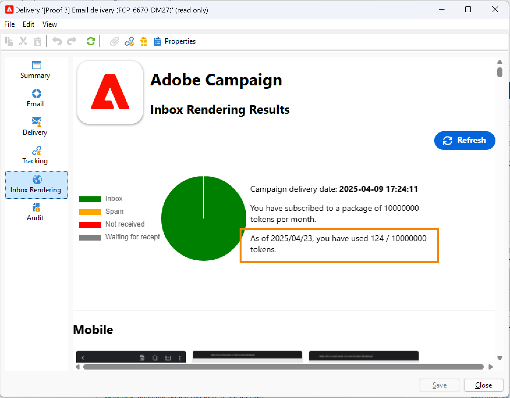

# Leveringsdashboard {#delivery-dashboard}


De **bezorgdashboard** is de sleutel om uw leveringen en eventuele problemen te controleren die tijdens het verzenden van berichten worden ondervonden.

Hiermee kunt u informatie over een levering ophalen en deze indien nodig bewerken. De tabinhoud kan niet meer worden gewijzigd nadat de levering is verzonden.

Hier volgt de informatie die u kunt controleren met de verschillende tabbladen die beschikbaar zijn in het dashboard:

* [Leveringsoverzicht](#delivery-summary)
* [Leveringsrapporten](#delivery-reports)
* [Afleveringslogs, spiegelpagina&#39;s, uitsluitingen](#delivery-logs-and-history)
* [Logbestanden en geschiedenis voor het bijhouden van leveringen](#tracking-logs)
* [Rendering van levering](#delivery-rendering)
* [Afleveringscontrole](#delivery-audit-)


**Verwante onderwerpen:**

* [Leveringsfouten begrijpen](understanding-delivery-failures.md)
* [Werken met quarantainebeheer](understanding-quarantine-management.md)
* [Best practices voor verzending](delivery-best-practices.md)
* [Leverbaarheid beheren](about-deliverability.md)

## Leveringsoverzicht {#delivery-summary}

De **[!UICONTROL Summary]** tab bevat de kenmerken van de levering: leveringsstatus, gebruikt kanaal, informatie over de afzender, onderwerp, informatie over uitvoering.

## Leveringsrapporten {#delivery-reports}

De **[!UICONTROL Reports]** , die toegankelijk is via de **[!UICONTROL Summary]** kunt u een set rapporten bekijken die betrekking hebben op de leveringsactie: algemeen leveringsrapport, gedetailleerd rapport, leveringsrapport, verspreiding van mislukte berichten, openingsfrequentie, klikken en transacties, enz.

De inhoud van dit lusje kan volgens uw vereisten worden gevormd. Voor meer informatie over leveringsrapporten raadpleegt u [deze sectie](../../reporting/using/delivery-reports.md).


## Afleveringsregisters, geschiedenis en uitsluitingen {#delivery-logs-and-history}

De **[!UICONTROL Delivery]** tabblad geeft een overzicht van de gebeurtenissen in deze levering. Het bevat de leveringslogboeken, d.w.z. de lijst van verzonden berichten en hun status en de bijbehorende berichten.

Voor een levering kunt u (bijvoorbeeld) alleen ontvangers met een mislukte levering of een adres in quarantaine weergeven. Om dit te doen, klik **[!UICONTROL Filters]** en selecteert u **[!UICONTROL By state]**. Selecteer vervolgens het frame in de vervolgkeuzelijst. Verschillende statussen worden vermeld in [deze pagina](delivery-statuses.md).

>[!NOTE]
>
>De lijst met de leveringslogboeken kan worden aangepast, net als elke lijst in Campaign Classic. U kunt bijvoorbeeld een kolom toevoegen om te weten welk IP-adres elke e-mail in een bezorging heeft verzonden. Raadpleeg voor meer informatie het gebruiksgeval in [deze sectie](#use-case).


De **[!UICONTROL Display the mirror page for this message...]** Met de koppeling kunt u de spiegelpagina weergeven voor de inhoud van de levering die in de lijst is geselecteerd, in een nieuw venster.

De spiegelpagina is alleen beschikbaar voor leveringen waarvoor HTML-inhoud is gedefinieerd. Raadpleeg voor meer informatie hierover [De spiegelpagina genereren](sending-messages.md#generating-the-mirror-page).


## Logbestanden en geschiedenis voor het bijhouden van leveringen {#tracking-logs}

De **[!UICONTROL Tracking]** wordt de volggeschiedenis voor deze levering weergegeven. Op dit tabblad worden volggegevens weergegeven voor de verzonden berichten, d.w.z. alle URL&#39;s die door Adobe Campaign moeten worden gevolgd. De volgende gegevens worden per uur bijgewerkt.

>[!NOTE]
>
>Als &#39;tracking&#39; niet is ingeschakeld voor levering, wordt dit tabblad niet weergegeven.

De volgende configuratie wordt uitgevoerd in het aangewezen stadium in de leveringstovenaar. Zie [Hoe te om gevolgde verbindingen te vormen](how-to-configure-tracked-links.md).

**[!UICONTROL Tracking]** gegevens worden geïnterpreteerd in de leveringsrapporten. Zie [deze sectie](../../reporting/using/delivery-reports.md).


## Inboxrendering {#delivery-rendering}

De **[!UICONTROL Inbox rendering]** kunt u een voorvertoning van het bericht bekijken in de verschillende contexten waarin het kan worden ontvangen en de compatibiliteit van grote desktops en toepassingen controleren.

Op deze manier kunt u ervoor zorgen dat uw bericht optimaal aan de ontvangers wordt weergegeven op verschillende webclients, webmails en apparaten.

Raadpleeg voor meer informatie over het renderen in Postvak IN [deze pagina](inbox-rendering.md)



## Afleveringscontrole {#delivery-audit-}

De **[!UICONTROL Audit]** bevat het leveringslogboek en alle berichten betreffende de proefdrukken.

De **[!UICONTROL Refresh]** kunt u de gegevens bijwerken. Gebruik de **[!UICONTROL Filters]** om een filter op de gegevens te definiëren.

Met speciale pictogrammen kunt u fouten of waarschuwingen herkennen. Zie [De levering analyseren](steps-validating-the-delivery.md#analyzing-the-delivery).

De **[!UICONTROL Proofs]** In het subtabblad kunt u de lijst met proefdrukken weergeven die zijn verzonden.


U kunt de informatie wijzigen die wordt weergegeven in dit venster (en in het venster **[!UICONTROL Delivery]** en **[!UICONTROL Tracking]** tabs) door de kolommen te selecteren die moeten worden weergegeven. Om dit te doen, klik **[!UICONTROL Configure list]** in de rechterbenedenhoek. Raadpleeg voor meer informatie over het configureren van de lijstweergave [deze sectie](../../platform/using/adobe-campaign-workspace.md#configuring-lists).

## Synchronisatie van het dashboard voor levering {#delivery-dashboard-synchronization}

Van uw leveringsdashboard, wilt u de verwerkte berichten en leveringslogboeken controleren om ervoor te zorgen dat uw levering met succes werd verzonden.

Sommige indicatoren of status kunnen onjuist of niet bijgewerkt zijn, dit kan met de volgende oplossingen worden opgelost:

* Als uw leveringsstatus onjuist is, controleert u of alle vereiste goedkeuringen zijn uitgevoerd voor deze levering of of de **[!UICONTROL operationMgt]** en **[!UICONTROL deliveryMgt]** workflows worden uitgevoerd zonder fouten. Dit kan ook zijn toe te schrijven aan de levering gebruikend een affiniteit die niet op de verzendende instantie wordt gevormd.

* Als uw leveringsindicatoren nog bij nul zijn en als u op een midsourcingconfiguratie bent, controleer **[!UICONTROL Mid-sourcing (delivery counters)]** technische workflow. Start het als de status niet is ingesteld **[!UICONTROL Started]**. Vervolgens kunt u proberen de indicatoren opnieuw te berekenen door met de rechtermuisknop op de desbetreffende levering in de Adobe Campaign-verkenner te klikken en vervolgens **[!UICONTROL Actions]** > **[!UICONTROL Recompute delivery and tracking indicators]**. Raadpleeg voor meer informatie over trackingindicatoren deze [sectie](../../reporting/using/delivery-reports.md#tracking-indicators).

* Als uw leveringsteller niet overeenkomt met uw levering, probeert u de indicatoren opnieuw te berekenen door met de rechtermuisknop op de desbetreffende levering in de Adobe Campaign-verkenner te klikken en **[!UICONTROL Actions]** > **[!UICONTROL Recompute delivery and tracking indicators]** om opnieuw te synchroniseren. Raadpleeg voor meer informatie over trackingindicatoren deze [sectie](../../reporting/using/delivery-reports.md#tracking-indicators).

* Als uw leveringsteller niet up-to-date is voor mid-sourcing plaatsingen, controleer dat **[!UICONTROL Mid-Sourcing (Delivery counters)]** de technische workflow wordt uitgevoerd. Raadpleeg [deze pagina](../../installation/using/mid-sourcing-deployment.md) voor meer informatie.

U kunt uw leveringen ook bijhouden met verschillende rapporten via het leveringsdashboard. Raadpleeg deze [sectie](../../reporting/using/delivery-reports.md) voor meer informatie.

## Hoofdlettergebruik: IP-adressen van afzenders toevoegen aan de logboeken {#use-case}

In deze sectie leert u hoe u informatie over de leveringslogs toevoegt aan het IP-adres dat elke e-mail in een levering heeft verzonden.

>[!NOTE]
>
>Deze wijziging is anders als u één instantie of mid-sourcing instantie gebruikt. Voordat u de wijziging doorvoert, moet u controleren of u verbinding hebt met het verzendende exemplaar van de e-mail.

### Stap 1: Het schema uitbreiden

Toevoegen **publicID** in uw leveringslogboeken moet u het schema eerst uitbreiden. U kunt doorgaan zoals volgt.

1. Een schema-extensie maken onder **[!UICONTROL Administration]** > **[!UICONTROL Configuration]** > **[!UICONTROL Data Schemas]** > **[!UICONTROL New]**.

   Voor meer informatie over schemauitbreidingen, verwijs naar [deze pagina](../../configuration/using/extending-a-schema.md).

1. Selecteren **[!UICONTROL broadLogRcp]** om de Ontvanger leveringslogboeken (nms) uit te breiden en een aangepaste Namespace te bepalen. In dit geval is het &quot;cus&quot;:

   

   >[!NOTE]
   >
   >Als uw instantie in Midden-sourcing is, moet u met schema werken wideLogMid.

1. Voeg het nieuwe veld toe aan de extensie. In dit voorbeeld moet u het volgende vervangen:

   ```
   <element img="nms:broadLog.png" label="Recipient delivery logs" labelSingular="Recipient delivery log" name="broadLogRcp"/>
   ```

   door:

   ```
   <element img="nms:broadLog.png" label="Recipient delivery logs" labelSingular="Recipient delivery log" name="broadLogRcp">
   <attribute desc="Outbound IP identifier" label="IP identifier"
   name="publicId" type="long"/>
   </element>
   ```

   

### Stap 2: Databasestructuur bijwerken

Zodra de wijzigingen worden gedaan, moet u gegevensbestandstructuur bijwerken zodat het met zijn logische beschrijving gericht is.

Volg de onderstaande stappen om dit te doen:

1. Klik op de knop **[!UICONTROL Tools]** > **[!UICONTROL Advanced]** > **[!UICONTROL Update database structure...]** -menu.

   

1. In de **[!UICONTROL Edit tables]** venster, **[!UICONTROL NmsBroadLogRcp]** tabel is ingeschakeld (of de **[!UICONTROL broadLogMid]** tabel als uw computer zich in een omgeving voor midsourcing bevindt), zoals hieronder:

   

   >[!IMPORTANT]
   >
   >Zorg er altijd voor dat er geen andere wijzigingen zijn, behalve de **[!UICONTROL NmsBroadLoGRcp]** of de **[!UICONTROL broadLogMid]** tabel als uw computer zich in een omgeving voor midsourcing bevindt). Als dat het geval is, schakelt u andere tabellen uit.

1. Klikken **[!UICONTROL Next]** om te valideren. Het volgende scherm wordt weergegeven:

   

1. Klikken **[!UICONTROL Next]** vervolgens **[!UICONTROL Start]** om de databasestructuur bij te werken. Indexopbouw begint. Deze stap kan lang zijn, afhankelijk van het aantal rijen in de **[!UICONTROL NmsBroadLogRcp]** tabel.

   

>[!NOTE]
>
>Nadat de update van de fysieke structuur van de database is voltooid, moet u de verbinding verbreken en opnieuw tot stand brengen, zodat er rekening wordt gehouden met uw wijzigingen.

### Stap 3: De wijziging valideren

Om alles te bevestigen werkte correct, moet u het scherm van leveringslogboeken bijwerken.

Om dit te doen, heb toegang tot de leveringslogboeken en voeg de &quot;IP herkenningsteken&quot;kolom toe.


>[!NOTE]
>
>Leren hoe te om lijsten in de interface van Campaign Classic te vormen, verwijs naar [deze pagina](../../platform/using/adobe-campaign-workspace.md).

Hieronder ziet u wat u moet zien in het dialoogvenster **[!UICONTROL Delivery]** tabblad na wijzigingen:


