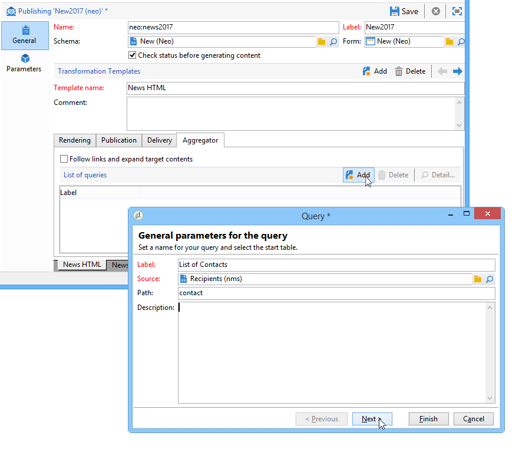
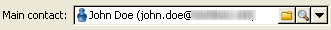

# Inhoud verrijken{#enriching-content}

Met aggregators kunt u de inhoud verrijken met externe gegevens. Dit gegeven komt uit generische vragen of verbonden lijsten.

## Algemene vragen {#generic-queries}

De vragen worden gevormd via het publicatiesjabloon in het **[!UICONTROL Aggregator]** lusje.

De opgehaalde gegevens verrijken het XML-uitvoerdocument via het hoofdelement.

Voorbeeld van het resultaat van een query op het ontvangende schema (**nms:receiver**):

```
<book name="Content Management">
  ...
  <collection-recipient>
    <recipient lastName="Doe" firstName="John" email="john.doe@aolf.com">
    ...
  </collection-recipient>
</book>
```

Het **`<collection-recipient>`** element vertegenwoordigt het invoerelement van het document dat het resultaat is van een query. De opgehaalde gegevens worden onder dit element geretourneerd. in ons voorbeeld, een ontvankelijke lijst.

### Een query toevoegen {#adding-a-query}

De queryparameters worden bewerkt met een wizard.

1. Geef op de eerste pagina het label en het schema op met de gegevens die moeten worden opgehaald.

   

   >[!NOTE]
   >
   >Het bewerkingsgebied **Pad** wordt gebruikt om het element van de vraagoutput anders te noemen.

1. Op de volgende pagina kunt u de gegevens selecteren die u wilt ophalen.

   

1. De volgende pagina bepaalt de filtervoorwaarde.

   

1. Op de laatste pagina wordt een voorvertoning geopend van de gegevens die door de query worden geretourneerd.

   

## Gekoppelde tabellen {#linked-tables}

Met koppelingen kunt u externe gegevens ophalen die zijn gekoppeld aan de inhoud.

Er zijn twee typen gekoppelde gegevens:

* Koppelingen naar inhoud: dit is de native modus voor inhoudsbeheer. De inhoud van de koppeling wordt automatisch in het XML-uitvoerdocument geïntegreerd.
* Koppelingen naar externe tabellen geven toegang tot alle andere tabellen in de database met als beperking het ophalen van de gegevens van de geselecteerde koppeling met een aggregator.

### Koppeling maken naar een inhoudsschema {#link-to-a-content-schema}

Een inhoudskoppeling wordt als volgt gedeclareerd in het gegevensschema:

```
<element expandSchemaTarget="cus:chapter" label="Main chapter" name="mainChapter" type="string"/>
```

De definitie van de koppeling wordt ingevuld in een **tekenreeks**-type **`<element>`**, en de **eigenschap expandSchemaTarget** verwijst naar het doelschema (&quot;cus:chapter&quot; in ons voorbeeld). Het schema waarnaar wordt verwezen, moet een inhoudsschema zijn.

De inhoud van het doelelement verrijkt het koppelingselement, dat wil zeggen het **`<chapter>`** element in ons voorbeeldschema:

```
<mainChapter computeString="Introduction" id="7011" title="Introduction" xtkschema="cus:chapter">    
  <page>Introduction to input <STRONG>forms</STRONG>.</page>
</mainChapter>
```

>[!NOTE]
>
>De **computeString** -tekenreeks van de koppeling wordt vanuit het kenmerk **computeString** weergegeven.

In het invoerformulier wordt het bewerkingsbeheer van de koppeling als volgt gedeclareerd:

```
<input type="articleEdit" xpath="mainChapter"/>
```


Met het **[!UICONTROL Magnifier]** pictogram kunt u het bewerkingsformulier van het gekoppelde element openen.

#### Verzameling koppelen {#link-collection}

Als u een verzameling koppelingen wilt vullen, voegt u het kenmerk **unbound=&quot;true&quot;** toe aan de definitie van het koppelingselement in het gegevensschema:

```
<element expandSchemaTarget="cus:chapter" label="List of chapters" name="chapter"  ordered="true" unbound="true"/>
```

De inhoud van het doelelement verrijkt elk verzamelingselement:

```
<chapter computeString="Introduction" id="7011" title="Introduction" xtkschema="cus:chapter">    
  <page>Introduction to input <STRONG>forms</STRONG>.</page>
</chapter>
```

In het invoerformulier wordt het besturingselement voor de lijst als volgt gedeclareerd:

```
<input editable="false" nolabel="true" toolbarCaption="List of chapters" type="articleList" xpath="chapter" zoom="true"/>
```


Er wordt een standaardkolom weergegeven om de tekenreeks **Berekenen** van de doelelementen weer te geven.

### Koppelingen naar externe tabellen {#links-to-external-tables}

Een koppeling naar een externe tabel wordt als volgt gedeclareerd in het gegevensschema:

```
<element label="Main contact" name="mainContact" target="nms:recipient" type="link"/>
```

De definitie van de koppeling wordt ingevuld in een **koppelings**-type **`<element>`**, en de **doelkenmerken** verwijzen naar het doelschema (&quot;nms:ontvanger&quot; in ons voorbeeld).

Door overeenkomst, moeten de verbindingen van het belangrijkste element van het gegevensschema worden verklaard.

De tekenreeks **** Berekenen en de sleutel van het doelelement verrijken de **`<name>-id`** en **`<name>-cs`** kenmerken van het hoofdelement.

In ons voorbeeld wordt de koppeling gevuld in het schema &quot;cus:book&quot;. De inhoud van de koppelingsgegevens bevindt zich in de kenmerken &quot;mainContact-id&quot; en &quot;mainContact-cs&quot;:

```
<book computeString="Content management" date="2006/06/08" id="6106" language="en" mainContact-cs="John Doe (john.doe@adobe.com)" mainContact-id="3012" name="Content management" xtkschema="cus:book">
```

Besturingselement voor bewerken van koppeling wordt als volgt gedeclareerd:

```
<input xpath="mainContact"/>
```



U kunt de keuze van doelelementen beperken door het **`<sysfilter>`** element toe te voegen via de koppelingsdefinitie in het invoerformulier:

```
<input xpath="mainContact">
  <!-- Filter the selection of the link on the Adobe domain -->
  <sysFilter>
    <condition expr="@domain =  'adobe.com '"/>
  </sysFilter>
</input>
```

>[!NOTE]
>
>Deze beperking geldt ook voor inhoudskoppelingen.

#### Verzameling koppelen {#link-collection-1}

De definitie van de verzameling is identiek aan de definitie van een lijst met verzamelingselementen:

```
<element label="List of contacts" name="contact" unbound="true">
  <element label="Recipient" name="recipient" target="nms:recipient" type="link"/>
</element>
```

In het invoerformulier wordt het besturingselement voor de lijst als volgt gedeclareerd:

```
<input nolabel="true" toolbarCaption="List of contacts" type="list" xpath="contact">
  <input xpath="recipient"/>
</input>
```


>[!NOTE]
>
>De lijst is editable en laat u de verbinding van een &quot;verbinding&quot;hierboven voorgesteld controle selecteren.

De inhoud van het doelelement verrijkt elk verzamelingselement in het uitvoerdocument:

```
<contact id="11504978621" recipient-cs="Doe John (john.doe@adobe.com)" recipient-id="3012"/>
<contact id="11504982510" recipient-cs="Martinez Peter (peter.martinez@adobe.com)" recipient-id="3013"/>
```

#### Linkaggregatie {#link-aggregation}

De inhoud van elke koppeling waarnaar wordt verwezen, is beperkt tot de interne sleutel en de tekenreeks **** Berekenen van het doelelement.

Een JavaScript-script wordt gebruikt om de inhoud van de koppelingen te verrijken via SOAP-query&#39;s.

**Voorbeeld**: De naam van de ontvanger toevoegen aan de koppeling &quot;mainContact&quot; en de koppelingen voor de verzameling &quot;contact&quot;:

```
// Update <mainContact> link
var mainContactId = content.@['mainContact-id']
var query = xtk.queryDef.create(
    <queryDef schema="nms:recipient" operation="get">
      <select>
        <node expr="@lastName"/>
      </select>
      <where>
        <condition expr={"@id="+mainContactId}/>
      </where>
    </queryDef>)

var recipient = query.ExecuteQuery()
content.mainContact.@lastName = recipient.@lastName

// Update <contact> link collection
for each(var contact in content.contact)
{
  var contactId = contact.@['recipient-id']
  var query = xtk.queryDef.create(
    <queryDef schema="nms:recipient" operation="get">
      <select>
        <node expr="@lastName"/>
      </select>
      <where>
        <condition expr={"@id="+contactId}/>
      </where>
    </queryDef>
  )
  
  var recipient = query.ExecuteQuery()
  contact.@lastName = recipient.@lastName
}
```

Het resultaat dat na de uitvoering van het script wordt bereikt:

```
<mainContact lastName="Doe"/>

<contact id="11504978621" lastName="Doe" recipient-cs="Doe John (john.doe@adobe.com)" recipient-id="3012"/>  
<contact id="11504982510" lastName="Martinez" recipient-cs="Martinez Peter (peter.martinez@adobe.com)" recipient-id="3013"/> 
```

De inhoud van de JavaScript-code wordt toegevoegd via de **[!UICONTROL Administration > Configuration > Content management > JavaScript Codes]** map en moet voor elke transformatie worden ingevuld in de publicatiesjabloon.


