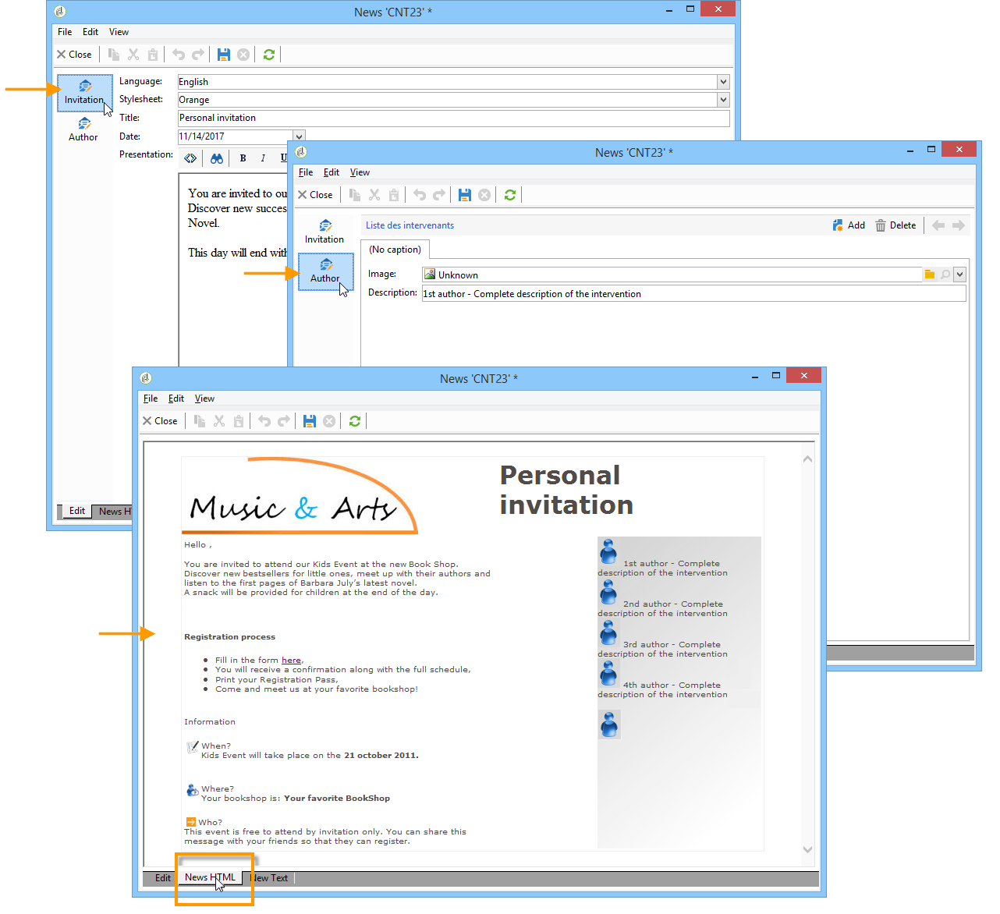

# Opmaak{#formatting}

## JavaScript-sjablonen {#javascript-templates}

Een JavaScript-sjabloon is een HTML- of tekstdocument dat JavaScript-code bevat. Deze wordt op dezelfde manier samengesteld als e-mailinhoud in een leveringsactie.

### Identificatie van een JavaScript-sjabloon {#identification-of-a-javascript-template}

Een JavaScript-sjabloon wordt net als schema&#39;s en formulieren aangeduid met de naam en naamruimte ervan. Het wordt echter aanbevolen de optie **.js** aan de sjabloonnaam toe te voegen.

### Structuur van een JavaScript-sjabloon {#structure-of-a-javascript-template}

Voorbeeld van een JavaScript HTML-opmaaksjabloon op basis van het schema &quot;cus:book&quot;:

```
<html>
  <body>
    <!-- Title of book -->
    <h1><%= content.@name %></h1>
    <ul>
      <% for each(var chapter in content.chapter) { %>
        <li><%= chapter.@name %></li>
      <% }%>
    </ul>
  </body>
</html>
```

De verschillende JavaScript-instructies worden in de volgende vorm weergegeven:

* Velden samenvoegen: Hiermee geeft u de inhoud van de gegevens weer met de **`<%= <source> %>`** syntaxis waarin het bronveld `<source>`staat van de gegevens die moeten worden weergegeven.
* Instructieblokken: voert een reeks JavaScript-instructies uit die tussen de tags &lt;% en %> staan.

Het **inhoudsobject** vertegenwoordigt het hoofdelement van het XML-invoerdocument.

In ons voorbeeld geeft de volgende regel de inhoud van de naam van het naamboek weer:

```
<h1><%= content.@name %></h1>
```

De volgende code herhaalt op het `<chapter>` inzamelingselement:

```
<% for each(var chapter in content.chapter) { %>
  <li><%= chapter.@name %></li>
<% }%>
```

De kenmerken en elementen van de inhoud worden weergegeven als JavaScript-objecten en respecteren de structuur van het brondocument.

**Voorbeeld**:

* **inhoud.@name**: Hiermee wordt de waarde van het kenmerk &quot;name&quot; van het hoofdelement opgehaald
* **inhoud.@`['name']`**: identiek aan de** inhoud.@name **syntaxis
* **content.chapter.length**: retourneert het aantal elementen in het `<chapter` verzamelingselement
* **content.chapter`[0]`.@name**: wint de naam van het eerste `<chapter>` element terug
* **hoofdstuk.name()**: retourneert de naam van het `<chapter>` element
* **hoofdstuk.parent().name()**: retourneert de naam van het bovenliggende element van `<chapter>`

>[!CAUTION]
>
>Omdat het &#39;-&#39;-teken is gereserveerd in de JavaScript-taal, moet het herstel van de waarde van elk kenmerk of element dat dit teken bevat, worden uitgevoerd via de `['<field>']` syntaxis.
>
>Bijvoorbeeld: `content.@['offer-id']`.

Alle kracht van een programmeertaal (variabelen, lussen, voorwaardelijke tests, functies, enz.). ) is beschikbaar om het uitvoerdocument samen te stellen. SOAP-API&#39;s zijn toegankelijk voor verrijking van het uitvoerdocument.

Voorbeelden:

* Voorwaardelijke test:

   ```
   <% if (content.@number == 1 || content.@language == 'en') { %>
   <!-- Content to be displayed if test is true--> 
   <% } %>
   ```

* Functieaanroep:

   ```
   <!-- Displays a horizontal bar -->
   ;<% function DisplayHorizontalBar() { %>
     <hr/>
   <% } %> 
   
   <!-- The same function in a block  -->
   <% 
   function DisplayHorizontalBar2()
   {
     document.write('<hr/>');
   }
   %> 
   
   <!-- Returns the value in uppercase -->
   <% 
   function formatName(value)
   { 
     return value.toUpperCase(); 
   }
   %>
   
   <!-- Call functions -->
   <%= DisplayHorizontalBar1() %>
   <%= DisplayHorizontalBar2() %>
   <%= formatName(content.@name) %>
   ```

* Declaraties en variabele call:

   ```
   <%  var counter = 0; %>
   
   <%= counter += 10 %>
   ```

* Ophalen en weergeven van een naam van een ontvanger met statische methoden:

   ```
   <% var recipient = nms.recipient.get(1246); %>
   <%= recipient.lastName %>
   ```

* Terugwinning en vertoning van een ontvankelijke naam met niet statische methodes:

   ```
   <% var query = xtk.queryDef.create(
     <queryDef schema="nms:recipient" operation="get">
       <select>
         <node expr="@lastName"/>
       </select>
       <where>
         <condition expr="@id=1246"/>
       </where>
     </queryDef>);
   
     var recipient = query.ExecuteQuery();
   %>
   
   <%= recipient.@lastName %>
   ```

### Een JavaScript-sjabloon opnemen {#including-a-javascript-template}

U kunt een bibliotheek van functies of variabelen voor later gebruik vormen. Hiertoe importeert u de JavaScript-sjabloon met de functie **eval** . Hiermee kunt u contexten verrijken met extra functies die zijn gedeclareerd in andere JavaScript-sjablonen.

**Voorbeeld**: het invoeren van het **common.jsp** malplaatje.

```
<% eval(xtk.javascript.get("cus:common.js").data);  %>
```

### Een JavaScript-sjabloon bewerken {#editing-a-javascript-template}

In de bewerkingszone kunt u de inhoud van de JavaScript-sjabloon vullen:


>[!NOTE]
>
>Het bijbehorende schema van het gegevensmodel moet worden ingevuld voor de initialisatie van JavaScript-objecten.

Als u de voorvertoning van het uitvoerdocument wilt genereren, selecteert u op elk gewenst moment een inhoud en een uitvoerindeling (HTML, Tekst, XML) en klikt u op **[!UICONTROL Generate]** :


>[!NOTE]
>
>U hoeft de wijzigingen niet op te slaan om een voorvertoning van het uitvoerdocument weer te geven.

### Voorbeeld van het maken en gebruiken van een JavaScript-sjabloon {#example-of-how-to-create-and-use-a-javascript-template}

Hieronder ziet u de configuratie die is vereist voor het implementeren van het volgende inhoudsbeheer met behulp van een JavaScript-sjabloon:



In dit voorbeeld worden de volgende stappen uitgevoerd:

1. Maak het volgende schema (in dit geval: **neo:news**):

   ```
   <srcSchema _cs="Invitation (neo)"   entitySchema="xtk:srcSchema" img="xtk:schema.png" label="Invitation" mappingType="sql" name="news" namespace="neo" xtkschema="xtk:srcSchema">
   
     <enumeration basetype="string" default="en" name="language">
       <value label="Français" name="fr" value="fr"/>
       <value label="English" name="gb" value="gb"/>
     </enumeration>
   
     <enumeration basetype="string" name="css">
       <value label="Blue" name="bl" value="blue"/>
       <value label="Orange" name="or" value="orange"/>
     </enumeration>
   
     <element label="Intervenants" name="attendee">
       <key internal="true" name="id">
         <keyfield xpath="@id"/>
       </key>
       <attribute label="Name" name="name" type="string"/>
       <element label="Image" name="image" target="xtk:fileRes" type="link"/>
       <attribute label="Description" name="description" type="string"/>
       <attribute default="Gid()" label="Id" name="id" type="long"/>
     </element>
   
     <element label="Invitation" name="news" template="ncm:content" xmlChildren="true">
   
       <compute-string expr="@name"/>
       <attribute enum="language" label="Language" name="language" type="string"/>
       <attribute enum="css" label="Stylesheet" name="css" type="string"/>
       <attribute label="Title" name="title" type="string"/>
       <element label="Presentation" name="presentation" type="html"/>
       <attribute label="Date" name="date" type="date"/>
       <element label="Attendees list" name="attendeesList" ordered="true" ref="attendee" unbound="true"/>
   
     </element>
   </srcSchema>
   ```

1. Het gekoppelde **[!UICONTROL Content management]** tekstformulier maken (**neo:news**)

   ```
   <form _cs="News (neo)" entitySchema="xtk:form"  img="xtk:form.png" label="News"  name="news" namespace="neo" type="contentForm" xtkschema="xtk:form">
   
     <container type="iconbox">
       <container label="Invitation">
         <input xpath="@langue"/>
         <input xpath="@css"/>
         <input xpath="@title"/>
         <input xpath="@date"/>
         <input xpath="presentation"/>
       </container>
   
       <container label="Intervenants">
         <container toolbarCaption="Liste des intervenants" type="notebooklist" xpath="attendeesList" xpath-label="@nom">
           <container>
             <input xpath="@nom"/>
             <input img="nl:sryimage.png" newEntityFormChoice="true" xpath="image">
               <sysFilter>
                 <condition expr="@isImage = true"/>
               </sysFilter>
             </input>
             <input xpath="@description"/>
           </container>
         </container>
       </container>
     </container>
   
   </form>
   ```

1. Maak de JavaScript-sjablonen met de inhoud van berichten voor HTML- en tekstindelingen.

   * In ons voorbeeld geldt voor HTML:

      ```
      <html>     
        <head>         
          <title>Newsletter</title>
           <style type="text/css">
            .body {font-family:Verdana, Arial, Helvetica, sans-serif; font-size:10px; color:#514c48; margin-left: auto; margin-right: auto;}
            .body table {width:748; border: solid 1px; cellpadding:0; cellspacing:0"}
           </style>
        </head>     
        <body>
          <p><center><%= mirrorPage %></center></p>
          <center>
            <table>      
             <tr>
              <td>                                                         
                                                   
              </td>
              <td>
                <h1><%= content.@title %></h1>
              </td>
             </tr>
             <tr>
      
             <td>
              <div >                                    
                <h0><%= hello,</h0>                              
                <p><%= content.presentation %></p>                                          
      
                <h0>Useful information</h0>                              
                <p>                                  
                  When? <br/><%= formatDate(content.@date, "%2D %Bl %4Y") %> From 10 AM in your bookshop.</p><br/>                                       
                <p>                                  
                  Who? <br>Meet our favorite authors and illustrators and get a signed copy of their book.</p><br/>                                                         
                <p>                                  
                  Attendance is free but there is a limited number of seats: sign up now!</p>
            </div>
            </td>
      
              <td>                                                    
               <div style="text-align:left; width:210; height:400px; background:url([IMAGE DE FOND])">
      
                  <h0><%= participant %></h0>
                  <%
                  var i
                  var iLength = content.attendeesList.length()
                  for (i=0; i<iLength; i++)
                  { %>
                  <p>
                    <%= generateImgTag(content.attendeesList[i].@["image-id"]) %>  <%= content.attendeesList[i].@description %>
                  </p>  
                  <% }  
                  %>                              
               </div2>
              </td>
          </tr>
        </table>
      </center>
      </body>    
      </html>
      ```

   * Voor de tekst:

      ```
      <%= content.@title %>
      <%= content.presentation %>
      
      *** When? On <%= formatDate(content.@date, "%2D %Bl %4Y") %> From 10 AM in your bookshop.
      
      *** Who? Come and meet our favorite authors and illustrators and get a signed copy of their books. 
      
      *** Attendance is free but there is a limited number of seats: sign up now!
      
      Guests:
      ******************
      <%
      var i
      var iLength = content.attendeesList.length()
      //for (i=(iLength-1); i>-1; i--)
      for( i=0 ; i<iLength ; i++ )
        { %>
        Description <%= i %> : <%= content.attendeesList[i].@description %>
        <% }  
      %>
      ```

1. Maak nu de publicatiesjabloon die voor beide indelingen wordt gebruikt:

   * Voor HTML:

      

   * Voor tekst:

      

1. U kunt deze inhoudssjabloon dan gebruiken in uw leveringen.

   Raadpleeg [Een inhoudssjabloon](../../delivery/using/using-a-content-template.md)gebruiken voor meer informatie.

## XSL Stylesheets {#xsl-stylesheets}

Met de XSLT-taal kunt u een XML-document wijzigen in een uitvoerdocument. Afhankelijk van de uitvoermethode van de stijlpagina kan het resulterende document worden gegenereerd in HTML, platte tekst of een andere XML-structuur.

Deze transformatie wordt op zijn beurt in XML in een document gedetaillerd dat als stylesheet wordt bekend.

### Een stijlpagina identificeren {#identifying-a-stylesheet}

Een stijlpagina wordt geïdentificeerd door zijn naam en namespace, enkel als schema&#39;s en vormen. Het wordt echter aanbevolen de extensie **.xsl** toe te voegen aan de naam van het stijlblad.

De identificatiecode van een stijlpagina is een tekenreeks die wordt gevormd door de naamruimte en de naam die wordt gescheiden door een dubbele punt. bijvoorbeeld: **cus:book.xsl**.

### Structuur van een stijlblad {#structure-of-a-stylesheet}

Voorbeeld van een HTML-opmaakstijlpagina op basis van het voorbeeldschema &quot;cus:book&quot;:

```
<?xml version="1.0" encoding="ISO-8859-1" ?>
<xsl:stylesheet xmlns:xsl="http://www.w3.org/1999/XSL/Transform" version="1.0">
  <xsl:output encoding="ISO-8859-1" method="html"/>
  <!-- Point of entry of the stylesheet -->
  <xsl:template match="/book">
    <html>
      <body>
        <!-- Book title -->
        <h1><xsl:value-of select="@name"/></h1>
        <lu>
          <!-- List of chapters -->
          <xsl:for-each select="child::chapter">
            <li><xsl:value-of select="@name"/></li>
          </xsl:for-each>
       </lu>
      </body>
    </html>
   </xsl:template>
</xsl:stylesheet>
```

Een stijlpagina is een XML-document dat aan de volgende regels voldoet:

* de kenmerkwaarden liggen tussen aanhalingstekens;
* een element moet een openingsmarkering en een sluitmarkering hebben;
* de tekens &#39;&lt;&#39; of &#39;&amp;&#39; vervangen door de entiteiten **&#39;&lt;&#39;** of **&#39;&amp;&#39;** ;
* elk XSL-element moet de naamruimte **xsl** gebruiken.

Een stijlpagina moet beginnen met de markering voor het XSL-basiselement **`<xsl:stylesheet>`** en eindigen met de **`</xsl:stylesheet>`** markering. De XSL-naamruimte moet als volgt worden gedefinieerd in de openingsmarkering:

```
<xsl:stylesheet xmlns:xsl="http://www.w3.org/1999/XSL/Transform" version="1.0">
```

Het **`<xsl:output>`** element geeft de indeling van het gegenereerde document aan. Geef de gewenste set tekens en de uitvoerindeling op.

```
<xsl:output encoding="ISO-8859-1" method="html"/>
```

In de volgende instructies wordt de configuratie van de stijlpagina voor de opmaak van het uitvoerdocument beschreven.

```
<xsl:template match="/book">
  <html>
    <body>
      <!-- Book title -->
      <h1><xsl:value-of select="@name"/></h1>
      <lu>
        <!-- List of chapters -->
        <xsl:for-each select="child::chapter">
          <li><xsl:value-of select="@name"/></li>
        </xsl:for-each>
      </lu>
    </body>
  </html>
</xsl:template>
```

Standaard zoekt de XSLT-processor naar de **sjabloon** die van toepassing is op het hoofd- of hoofdknooppunt van het XML-invoerdocument. De constructie van het uitvoerdocument begint met deze **sjabloon**.

In ons voorbeeld wordt een HTML-pagina gegenereerd vanuit het schema &quot;cus:book&quot; door de naam van het boek en de lijst met hoofdstukken weer te geven.

>[!NOTE]
>
>Raadpleeg een XSLT-referentiedocument voor meer informatie over de XSLT-taal.

### HTML/XML weergeven {#displaying-html-xml}

Als u een **HTML** -veld wilt weergeven, gebruikt u de optie **disable-output-escape=&quot;yes&quot;** uit de **`<xsl:value-of>`** instructie. Zo voorkomt u dat tekens door hun XML-entiteit worden vervangen (bijvoorbeeld &lt; met &lt;).

Met de **`<xsl:text>`** instructie **disable-output-escape=&quot;yes&quot;** kunt u JavaScript-tags invoegen voor verpersoonlijkingsvelden of voorwaardelijke tests.

Voorbeelden:

* De inhoud van een veld van het type &quot;html&quot; weergeven:

   ```
   <xsl:value-of select="summary" disable-output-escaping="yes"/>
   ```

* Het aanpassingsveld **&lt;%= receiving.email %>** invoegen:

   ```
   <xsl:text disable-output-escaping="yes"><%= recipient.email %></xsl:text>
   ```

* De voorwaardelijke test toevoegen **&lt;% if (receiving.language == &#39;en&#39;) { %>**:

   ```
   <xsl:text disable-output-escaping="yes"><% if (recipient.language == 'en') { %></xsl:text>
   ```

### Inclusief stijlbladen {#including-stylesheets}

Het is mogelijk om een bibliotheek van malplaatjes of variabelen op te bouwen die onder verscheidene stylesheets moeten worden gedeeld. De **sjabloon**&quot;longMonth&quot;, die hierboven wordt weergegeven, is een typisch voorbeeld van het voordeel dat een sjabloon extern in een stijlpagina kan worden gevonden, zodat het later opnieuw kan worden gebruikt.

De **`<xsl:include>`** instructie geeft de naam aan van de stijlpagina die in het document moet worden opgenomen.

**Voorbeeld**: inclusief het stijlblad &quot;common.xsl&quot;.

```
<? xml version="1.0" encoding="ISO-8859-1" ?>
<xsl:stylesheet xmlns:xsl="http://www.w3.org/1999/XSL/Transform" version="1.0">
  <xsl:include href="common.xsl"/> 
  <xsl:output encoding="ISO-8859-1" method="jsp" indent="yes"/>
  ...
</xsl:stylesheet>
```

>[!NOTE]
>
>De naam van de naamruimte mag niet worden ingevoerd in de verwijzing naar de stijlpagina die moet worden opgenomen. Deze stijlpagina wordt standaard gemaakt met de naamruimte van de gebruiker.

### Een stijlpagina bewerken {#editing-a-stylesheet}

Met de bewerkingszone kunt u de inhoud van het stijlblad vullen:


Als u een voorvertoning van het uitvoerdocument wilt genereren, selecteert u een inhoudsinstantie en de indeling (HTML, Tekst, XML) en klikt u op **[!UICONTROL Generate]** :


>[!NOTE]
>
>U hoeft de wijzigingen in de stijlpagina niet op te slaan om de voorvertoning van het uitvoerdocument weer te geven.

## Afbeeldingsbeheer {#image-management}

### Verwijzing naar afbeelding {#image-referencing}

Naar de afbeeldingen die u opgeeft in het HTML-uitvoerdocument, kan worden verwezen met absolute of relatieve verwijzingen.

Met relatieve verwijzing kunt u de URL invoeren van de server die de afbeeldingen bevat in de opties **NcmRessourcesDir** en **NcmRessourcesDirPreview** . Deze opties bevatten de locatie van afbeeldingen die u wilt publiceren en voorvertonen in de Adobe Campagne-clientconsole.

Deze twee opties zijn toegankelijk via het scherm voor optiebeheer in de **[!UICONTROL Administration > Platform > Options]** map.

**Voorbeeld**:

* NcmResourcesDir = &quot;https://server/images/&quot;
* NcmResourcesDirPreview = &quot;x:/images/&quot;

Tijdens het opmaken van stijlpagina&#39;s wordt het kenmerk **_resPath** op het hoofdelement van het XML-invoerdocument automatisch ingevuld met een of meer van de opties, afhankelijk van de context (voorvertoning of publicatie).

Voorbeeld van het gebruik van de plaatsingsoptie voor afbeeldingen en het gebruik ervan voor een afbeelding:

```
/newsletter/image.png"/>
```

>[!NOTE]
>
>We raden u aan een variabele te declareren die de referentie bevat van de server waar de afbeeldingen zijn opgeslagen (&quot;resPath&quot; in ons voorbeeld).

### Overheidsmiddelen gebruiken {#using-public-resources}

U kunt ook gebruiken **[!UICONTROL Public resources]** om afbeeldingen te declareren en deze naar de server te uploaden, afhankelijk van de instantie-instellingen die u hebt ingevoerd in de implementatietovenaar.

Vervolgens kunt u deze afbeeldingen in de inhoud oproepen. Hiervoor gebruikt u de volgende syntaxis in het inhoudsbeheerschema:

```
<element label="Image" name="image" target="xtk:fileRes" type="link"/>
```

In het formulier wordt het veld voor het selecteren van de afbeelding toegevoegd met de volgende syntaxis:

```
<input img="nl:sryimage.png" newEntityFormChoice="true" xpath="image">
    <sysFilter>
      <condition expr="@isImage = true"/>
    </sysFilter>
  </input>
```

>[!NOTE]
>
>Voor meer op **[!UICONTROL Public resources]** en hoe te om hen te vormen en te gebruiken, verwijs naar [deze sectie](../../installation/using/deploying-an-instance.md#managing-public-resources).

## Datumweergave {#date-display}

In het XML-invoerdocument worden de datums opgeslagen in de interne XML-indeling: **YYY/MM/DD HH:MM:SS** (voorbeeld 2018/10/01 12:23:30).

Adobe Campaign biedt functies voor datumopmaak voor de JavaScript-sjablonen en XSL-opmaakmodellen die hieronder worden beschreven.

### JavaScript-datumopmaak {#javascript-date-formatting}

Als u een datum in de gewenste notatie wilt weergeven, biedt Adobe Campaign de **formatDate** -functie die als invoer de inhoud van de datum opgeeft en een tekenreeks die de uitvoerindeling opgeeft, met de volgende syntaxis: **%4Y/%2M/%2D %2H%2N%2S**

Voorbeelden:

* De datum weergeven in de **notatie 31/10/2018** :

   ```
    <%= formatDate(content.@date, "%2D/%2M/%4Y") %>
   ```

* De datum weergeven in de notatie **juli 2018** :

   ```
   <%
    function displayDate(date)
     {
       var aMonth = 
       [ 'January', 'February', 'March', 'April', 'May', 'June', 'July', 'August', 'September', 'October', 'November', 'December' ];
   
       var month = formatDate(content.@date, "%2M")
       var year = formatDate(content.@date, "%4Y")
   
       return aMonth[month-1]+" "+year;
     }
   %>
   
   <%= displayDate(content.@date) %>
   ```

### XSL-datumopmaak {#xsl-date-formatting}

Er is geen standaardfunctie voor datumbeheer in XSLT-syntaxis. Als u een datum in de gewenste notatie wilt weergeven, biedt Adobe Campagne de externe **datumnotatie** voor de functie. Deze functie neemt als input de inhoud van de datum en een koord die het outputformaat met de volgende syntaxis specificeren: **%4Y/%2M/%2D %2H%2N%2S**

Voorbeelden:

* De datum weergeven in de notatie **01/10/2018** :

   ```
   <xsl:value-of select="external:date-format(@date, '%2D/%2M/%4Y')"/>
   ```

* De datum weergeven in de notatie **juli 2018** :

   ```
   <!-- Returns the month in the form of a string with the month number as input -->
   <xsl:template name="longMonth">
     <xsl:param name="monthNumber"/>
   
     <xsl:choose>
       <xsl:when test="$monthNumber = 1">January</xsl:when>
       <xsl:when test="$monthNumber = 2">February</xsl:when>
       <xsl:when test="$monthNumber = 3">March</xsl:when>
       <xsl:when test="$monthNumber = 4">April</xsl:when>
       <xsl:when test="$monthNumber = 5">May</xsl:when>
       <xsl:when test="$monthNumber = 6">June</xsl:when>
       <xsl:when test="$monthNumber = 7">July</xsl:when>
       <xsl:when test="$monthNumber = 8">August</xsl:when>
       <xsl:when test="$monthNumber = 9">September</xsl:when>
       <xsl:when test="$monthNumber = 10">October</xsl:when>
       <xsl:when test="$monthNumber = 11">November</xsl:when>
       <xsl:when test="$monthNumber = 12">December</xsl:when>
     </xsl:choose>
   </xsl:template> 
   
   <!-- Display date -->
   <xsl:call-template name="longMonth">
     <xsl:with-param name="monthNumber">
       <xsl:value-of select="external:date-format(@date, '%2M')"/>
     </xsl:with-param>
   </xsl:call-template>
    <xsl:value-of select="external:date-format(@date, '%4y')"/>
   ```
