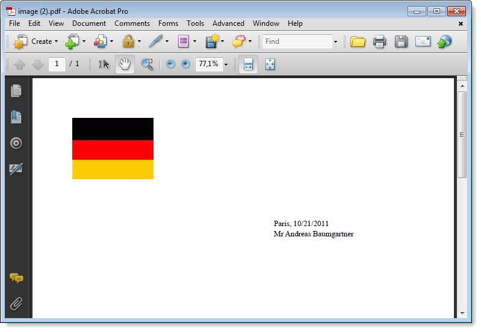

# Aangepaste PDF-documenten genereren{#generating-personalized-pdf-documents}

## Variabele PDF-documenten {#about-variable-pdf-documents}

Met Adobe Campaign kunt u variabele PDF-documenten (voor e-mailbijlagen, direct mail verzenden) genereren vanuit LibreOffice- of Microsoft Word-documenten.

De volgende extensies worden ondersteund: &quot;.docx&quot;, &quot;.doc&quot; en &quot;.odt&quot;.

Voor het aanpassen van uw documenten zijn dezelfde JavaScript-functies beschikbaar als voor het aanpassen van e-mails.

U moet de **[!UICONTROL "The content of the file is personalized and converted to PDF during the delivery of each message"]** optie activeren. Deze optie is toegankelijk wanneer u het bestand bijvoegt bij de e-mail voor levering. Raadpleeg de sectie [Bestanden](../../delivery/using/attaching-files.md) koppelen voor meer informatie over het bijvoegen van een berekend bestand.

Voorbeeld van een personalisatie van de factuurheader:


Als u dynamische tabellen wilt genereren of afbeeldingen wilt opnemen via een URL, moet u een specifiek proces volgen.

## Dynamische tabellen genereren {#generating-dynamic-tables}

De procedure voor het genereren van dynamische tabellen is als volgt:

* Maak een tabel met drie regels en zoveel kolommen als nodig zijn en configureer de indeling (randen, enzovoort).
* Plaats de cursor op de tabel en klik op het **[!UICONTROL Table > Table properties]** menu. Ga naar het **[!UICONTROL Table]** lusje en ga een naam in die met **NlJsTable** begint.
* Definieer in de eerste cel van de eerste regel een lus (&quot;for&quot;, bijvoorbeeld) die herhaling mogelijk maakt voor de waarden die u in de tabel wilt weergeven.
* Voeg in elke cel van de tweede regel van de tabel scripts in die de waarden retourneren die u wilt weergeven.
* Sluit de lus in de derde en laatste regel van de tabel.

   Voorbeeld van een dynamische tabeldefinitie:

   

## Externe afbeeldingen invoegen {#inserting-external-images}

Het invoegen van externe afbeeldingen is handig als u bijvoorbeeld een document wilt personaliseren met een afbeelding waarvan de URL is ingevoerd in een veld van de ontvanger.

Om dit te doen, moet u een verpersoonlijkingsblok vormen, dan een vraag aan het verpersoonlijkingsblok in de gehechtheid omvatten.

**Voorbeeld: invoering van een gepersonaliseerd logo afhankelijk van het land van de ontvanger**

**Stap 1: de bijlage maken:**

* Neem de vraag aan het verpersoonlijkingsblok op: **&lt;%@ include view=&quot;blockname&quot; %>**.
* Plaats de (al dan niet gepersonaliseerde) inhoud in de hoofdtekst van het bestand.


**Stap 2: Maak het verpersoonlijkingsblok:**

* Ga naar het **[!UICONTROL Resources > Campaign management > Personalization blocks]** menu van de console van de Campagne van Adobe.
* Maak een nieuw &#39;Mijn logo&#39;-personalisatieblok met &#39;Mijn logo&#39; als interne naam.
* Klik op de **[!UICONTROL Advanced parameters...]** koppeling en controleer vervolgens de **[!UICONTROL "The content of the block is included in an attachment"]** optie. Hiermee kunt u de definitie van het verpersoonlijkingsblok rechtstreeks naar de inhoud van het OpenOffice-bestand kopiëren.

   

   U moet twee soorten verklaringen binnen het verpersoonlijkingsblok onderscheiden:

   * De Adobe Campagne-code van de verpersoonlijkingsgebieden waarvoor de &quot;open&quot;en &quot;gesloten&quot;chevrons met escape karakters (respectievelijk `&lt;` en `&gt;`) moeten worden vervangen.
   * De volledige XML-code van OpenOffice wordt naar het OpenOffice-document gekopieerd.

In het voorbeeld ziet het verpersoonlijkingsblok er als volgt uit:

```
<% if (recipient.country.label == "Germany") { %>
<draw:frame svg:width="4cm" svg:height="3cm">
<draw:image xlink:href=https://..../logo_germany.png />
</draw:frame>
<% } else
if (recipient.country.label == "USA")
{ %>
<draw:frame svg:width="4cm" svg:height="3cm">
<draw:image xlink:href=https://..../logo_USA.png />
</draw:frame>
<% } %>
```

Afhankelijk van het land van de ontvanger is personalisatie zichtbaar in het document dat aan de levering is gekoppeld:


