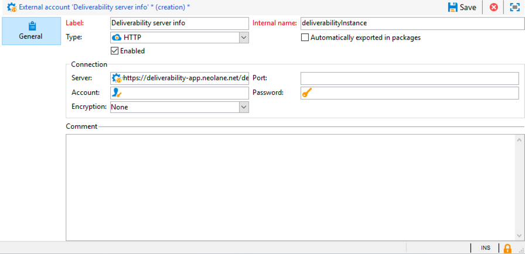

# Inboxrendering{#inbox-rendering}

## Inbox-rendering {#about-inbox-rendering}

Alvorens **te raken verzend** knoop, zorg ervoor dat uw bericht aan de ontvangers op een optimale manier op een verscheidenheid van Webcliënten, Webpost en apparaten zal worden getoond.

Om dit toe te staan, gebruikt Adobe Campaign de [&#128279;](https://litmus.com/email-testing) web-based e-mailtestende oplossing 0&rbrace; Litmus &lbrace;om de teruggaven te vangen en hen beschikbaar te maken in een specifiek rapport.  Hierdoor kunt u een voorvertoning van het verzonden bericht weergeven in de verschillende contexten waarin het kan worden ontvangen en de compatibiliteit van grote desktops en toepassingen controleren.

>[!CAUTION]
>Inbox het teruggeven is niet compatibel met [ terugkomende leveringen ](communication-channels.md#recurring-delivery).
>

Litmus is een functie-rijke e-mailbevestiging en previewing toepassing. Hiermee kunnen makers van e-mailinhoud hun berichtinhoud voorvertonen in meer dan 70 e-mailrenderers, zoals de Gmail inbox of de Apple Mail client.

De mobiele, overseinen en webmail cliënten beschikbaar voor **Inbox teruggevend** in Adobe Campaign zijn vermeld op de [ website van de Samenvatting ](https://litmus.com/email-testing) (klik **Mening alle e-mailcliënten**).

>[!NOTE]
>
>Rendering in doos is niet nodig om personalisatie in leveringen te testen. Personalization kan met de hulpmiddelen van Adobe Campaign zoals **[!UICONTROL Preview]** en [ Proofs ](steps-validating-the-delivery.md#sending-a-proof) worden gecontroleerd.

## Inbox-rendering activeren {#activating-inbox-rendering}

[!BADGE &#x200B; Op-gebouw &amp; Hybrid &#x200B;]{type=Caution url="https://experienceleague.adobe.com/docs/campaign-classic/using/installing-campaign-classic/architecture-and-hosting-models/hosting-models-lp/hosting-models.html?lang=nl" tooltip="Alleen van toepassing op on-premise en hybride implementaties"}

Voor gehoste en hybride clients wordt de InBox-rendering op uw exemplaar geconfigureerd door technische ondersteuning en consultants van Adobe. Neem voor meer informatie contact op met de Adobe-accountmanager.

Voor on-premise installaties, volg de stappen hieronder om Inbox teruggeven te vormen.

1. Installeer het pakket **[!UICONTROL Inbox rendering (IR)]** via het menu **[!UICONTROL Tools]** > **[!UICONTROL Advanced]** > **[!UICONTROL Import package]** . Voor meer op dit, zie [ Installerend de standaardpakketten van Campaign Classic ](../../installation/using/installing-campaign-standard-packages.md).
1. Configureer een externe account van het HTTP-type via het knooppunt **[!UICONTROL Administration]** > **[!UICONTROL Platform]** > **[!UICONTROL External Accounts]** . Voor meer op dit, zie [ Creërend een externe rekening ](../../installation/using/external-accounts.md#creating-an-external-account).
1. Stel de parameters voor de externe account als volgt in:
   * **[!UICONTROL Label]**: informatie over de server voor levering
   * **[!UICONTROL Internal name]**: DeliabilityInstance
   * **[!UICONTROL Type]** : HTTP
   * **[!UICONTROL Server]**: https://deliverability-app.neolane.net/deliverability
   * **[!UICONTROL Encryption]**: geen
   * Schakel de optie **[!UICONTROL Enabled]** in.

   

1. Ga naar het knooppunt **[!UICONTROL Administration]** > **[!UICONTROL Platform]** > **[!UICONTROL Options]** . Zoek naar de optie **[!UICONTROL DmRendering_cuid]** en neem contact op met de ondersteuning voor de id van de leveringsrapporten die u naar het veld **[!UICONTROL Value (text)]** wilt kopiëren.
1. Bewerk het {**dossier 0} serverConf.xml om een vraag aan de server van het Samenvatting toe te staan.** Voeg de volgende regel toe aan de sectie `<urlPermission>` :

   ```
   <url dnsSuffix="deliverability-app.neolane.net" urlRegEx="https://.*"/>
   ```

1. Laad de configuratie opnieuw gebruikend het volgende bevel:

   ```
   nlserver config -reload
   ```

>[!NOTE]
>
>Mogelijk moet u zich afmelden bij de console en u opnieuw aanmelden om de rendering Inbox te kunnen gebruiken.

## Informatie over Litmus tokens {#about-litmus-tokens}

Aangezien Litmus een derdedienst is, werkt het op een krediet-per-gebruiksmodel. Telkens wanneer een gebruiker op de functionaliteit van de Leiding roept, wordt het krediet afgetrokken.

In Adobe Campaign komt het krediet overeen met het aantal beschikbare renderingen (tokens genoemd).

>[!NOTE]
>
>Het aantal beschikbare Litmus tokens hangt af van de campagnelicentie die u hebt aangeschaft. Controleer uw licentieovereenkomst.

Telkens wanneer u de functie **[!UICONTROL Inbox rendering]** in een levering gebruikt, vermindert elke gegenereerde rendering de beschikbare tokens met één.

>[!IMPORTANT]
>
>Tokens zijn voor elke afzonderlijke rendering en niet voor het hele Inbox-renderrapport, wat betekent dat:
>
>* Telkens als Inbox teruggevend rapport wordt geproduceerd, wordt één teken per overseinencliënt afgetrokken: één teken voor het teruggeven van Vooruitzichten 2000, voor het teruggeven van Vooruitzichten 2010, voor Apple Mail 9, etc.
>* Als u voor dezelfde levering de rendering Inbox opnieuw genereert, wordt het aantal beschikbare tokens opnieuw verminderd met het aantal gegenereerde renderingen.
>

Het aantal resterende beschikbare tokens wordt getoond in het [ Inbox teruggevend rapport ](#inbox-rendering-report).


Doorgaans wordt de renderfunctie Inbox gebruikt om het HTML-framework van een nieuw ontworpen e-mail te testen. Voor elke rendering zijn ongeveer 70 tokens nodig (afhankelijk van het aantal omgevingen dat doorgaans wordt getest). In sommige gevallen hebt u echter meerdere renderingrapporten in postvak nodig om de levering volledig te testen. Het zou dus meer tokens kunnen vergen om meerdere controles te voltooien.

## Toegang tot het renderrapport in Postvak IN {#accessing-the-inbox-rendering-report}

Voer onderstaande stappen uit als u de e-maillevering hebt gemaakt en de content en de doelpopulatie ervan hebt bepaald.

Voor meer bij het creëren van, het ontwerpen van en het richten van een levering, verwijs naar [ deze sectie ](about-email-channel.md).

1. Klik op de knop **[!UICONTROL Inbox rendering]** op de bovenste balk van de levering.
1. Selecteer **[!UICONTROL Analyze]** om het vastlegproces te starten.

   

   Er wordt een bewijs verzonden. De renderingminiaturen zijn enkele minuten na het verzenden van de e-mails toegankelijk in die proefdruk. Voor meer bij het verzenden van proeven, verwijs naar [ deze sectie ](steps-validating-the-delivery.md#sending-a-proof).

1. Na verzending wordt de proefdruk weergegeven in de leveringslijst. Dubbelklik erop.

   

1. Ga naar **Inbox die** tabel teruggeeft van de proef.

   

   Het renderrapport Inbox wordt weergegeven.

## Inbox rendering report {#inbox-rendering-report}

In dit rapport worden de inbox-weergaven weergegeven zoals deze aan de ontvanger worden weergegeven. De renderingen kunnen afwijken, afhankelijk van de manier waarop de ontvanger de e-maillevering opent: in een browser, op een mobiel apparaat of via een e-mailtoepassing.

In de bovenste sectie wordt de verdeling weergegeven van het aantal ontvangen berichten, ongewenste berichten (spam), niet-ontvangen berichten of in afwachting van ontvangst via een grafische kleurcodering.

{width="40%" align="left"}

Houd de cursor boven het diagram om de details van elke kleur weer te geven. Klik op een item in de lijst om de bijbehorende categorie in het diagram te verbergen of weer te geven.

De hoofdtekst van het rapport bestaat uit drie delen: **[!UICONTROL Mobile]** , **[!UICONTROL Desktop]** en **[!UICONTROL Webmails]** . Blader omlaag door het rapport om alle weergaven gegroepeerd in deze drie categorieën te bekijken.


Klik op de bijbehorende kaart om de informatie voor elk rapport op te halen. De weergave wordt getoond voor de geselecteerde ontvangstmethode.


