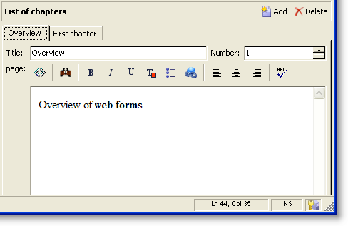

# Invoerformulieren{#input-forms}

Hieronder volgen enkele algemene beginselen voor het gebruik van invoerformulieren in Adobe Campagne.

Formulieren worden beschreven in [deze sectie](../../configuration/using/identifying-a-form.md).

## Formulierstructuur {#form-structure}

Het XML-document van een invoerformulier moet het **`<form>`** hoofdelement bevatten met de kenmerken **name** en **namespace** om respectievelijk de naam en naamruimte van het formulier te vullen.

```
<form name="form_name" namespace="name_space">
...
</form>
```

Standaard is een formulier gekoppeld aan het gegevensschema met dezelfde naam en naamruimte. Als u een formulier wilt koppelen aan een andere naam, typt u de schemasleutel in het kenmerk **entiteit-schema** van het **`<form>`** element.

Om de structuur van een invoerformulier te illustreren, beschrijven we een interface op basis van ons voorbeeldschema &quot;cus:book&quot;:


Dit is het corresponderende invoerformulier:

```
<form name="book" namespace="cus" type="contentForm">
  <input xpath="@name"/>
  <input xpath="@date"/>
  <input xpath="@language"/>
</form>
```

De beschrijving van de bewerkingselementen begint met het **`<form>`** hoofdelement.

Een bewerkingsbesturingselement wordt ingevoerd in een **`<input>`** element met het kenmerk **xpath** dat het pad van het veld in het schema bevat.

**Herinnering voor XPath-syntaxis:**

De taal XPath wordt gebruikt in de Campagne van Adobe om naar een element of een attribuut te verwijzen dat tot een gegevensschema behoort.

XPath is een syntaxis waarmee u een knooppunt in de boomstructuur van een XML-document kunt zoeken.

Elementen worden aangeduid met hun naam en kenmerken worden aangeduid met de naam voorafgegaan door het teken &quot;@&quot;.

Voorbeelden:

* **@date**: selecteert het kenmerk met de naam &quot;date&quot;
* **hoofdstuk/@titel**: selecteert het kenmerk &quot;title&quot; onder het `<chapter>` element
* **../@datum**: selecteert de datum uit het bovenliggende element van het huidige element

Het bewerkingsbesturingselement past zich automatisch aan het overeenkomstige gegevenstype aan en gebruikt het label dat in het schema is gedefinieerd.

Elk veld wordt standaard op één regel weergegeven en neemt alle beschikbare ruimte in beslag, afhankelijk van het type gegevens.

>[!CAUTION]
>
>Het invoerformulier moet verwijzen naar een kenmerk **type=&quot;contentForm&quot;** op het **`<form>`** element om automatisch het frame toe te voegen dat nodig is voor de invoer van inhoud.

## Opmaak {#formatting}

De rangschikking van de besturingselementen ten opzichte van elkaar lijkt op de rangschikking die wordt gebruikt in HTML-tabellen, met de mogelijkheid om een besturingselement in meerdere kolommen te verdelen, elementen te interliniëren of de bezetting van de beschikbare ruimte op te geven. Houd er echter rekening mee dat de opmaak alleen de verdeling van de verhoudingen toestaat; u kunt geen vaste afmetingen opgeven voor een object.

Zie [deze sectie](../../configuration/using/form-structure.md#formatting)voor meer informatie.

## Besturingselementen voor lijsttypen {#list-type-controls}

Om een inzamelingselement uit te geven, moet u een lijsttypecontrole gebruiken.

### Kolomlijst {#column-list}

Met dit besturingselement wordt een bewerkbare kolomlijst weergegeven met een werkbalk die knoppen Toevoegen en Verwijderen bevat.


```
<input xpath="chapter" type="list">
  <input xpath="@name"/>
  <input xpath="@number"/>
</input>
```

De lijstcontrole moet met het **type=&quot;list&quot;** attribuut worden ingevuld, en de weg van de lijst moet naar het inzamelingselement verwijzen.

De kolommen worden gedeclareerd door de onderliggende **`<input>`** elementen van de lijst.

>[!NOTE]
>
>De pijl-omhoog en pijl-omlaag worden automatisch toegevoegd wanneer het kenmerk **ordered=&quot;true&quot;** wordt voltooid voor het verzamelingselement in het gegevensschema.

Standaard worden de werkbalkknoppen verticaal uitgelijnd. Ze kunnen ook horizontaal worden uitgelijnd:


```
<input nolabel="true" toolbarCaption="List of chapters" type="list" xpath="chapter">
  <input xpath="@name"/>
  <input xpath="@number"/>
</input>
```

Met het **kenmerk toolbarCaption** wordt de horizontale uitlijning van de werkbalk afgedwongen en wordt de titel boven de lijst gevuld.

>[!NOTE]
>
>Voor het etiket van het inzamelingselement dat niet aan de linkerzijde van de controle moet worden getoond, voeg het **nolabel= &quot;waar&quot;** attribuut toe.

#### Inzoomen op een lijst {#zoom-in-a-list}

Het invoegen en bewerken van lijstgegevens kan in een afzonderlijk bewerkingsformulier worden uitgevoerd.

In de volgende gevallen worden formulieren in lijsten bewerken gebruikt:

* Ter vergemakkelijking van de invoer van informatie,
* Aanwezigheid van een meerregelig besturingselement
* De kolommen in de lijst bevatten alleen de hoofdvelden en in het formulier worden alle velden van het verzamelingselement weergegeven.


```
<input nolabel="true" toolbarCaption="List of chapters" type="list" xpath="chapter" zoom="true" zoomOnAdd="true">
  <input xpath="@name"/>
  <input xpath="@number"/>

  <form colcount="2" label="Editing a chapter">
    <input xpath="@name"/>
    <input xpath="@number"/>
    <input colspan="2" xpath="page"/>
  </form>
</input>
```

De definitie van het bewerkingsformulier wordt opgegeven via het **`<form>`** element onder het lijstelement. De structuur ervan is identiek aan de structuur van een invoerformulier.

Er wordt automatisch een **[!UICONTROL Detail]** knop toegevoegd wanneer het kenmerk **zoom=&quot;true&quot;** wordt ingevoerd in de lijstdefinitie. Hiermee kunt u het bewerkingsformulier openen op de geselecteerde regel.

>[!NOTE]
>
>Door het toevoegen van het **kenmerk zoomOnAdd=&quot;true&quot;** wordt het bewerkingsformulier afgedwongen bij het invoegen van een element in de lijst.

### Tablijst {#tab-list}

In deze lijst wordt het bewerken van verzamelingselementen weergegeven in de vorm van tabbladen.



```
<container toolbarCaption="List of chapters" type="notebooklist" xpath="chapter" xpath-label="@name">
  <container colcount="2">
    <input xpath="@name"/>
    <input xpath="@number"/>
    <input colspan="2" xpath="page"/>
  </container>
</container>
```

Het lijstbesturingselement moet worden ingevuld met het kenmerk **type=&quot;notebooklist&quot;** en het pad van de lijst moet naar het verzamelingselement verwijzen.

De titel van het tabblad bevat de waarde van de gegevens die zijn ingevoerd via het kenmerk **xpath-label** .

De bewerkingsbesturingselementen moeten worden gedeclareerd onder een **`<container>`** element dat een onderliggend element is van het lijstbesturingselement.

Met de werkbalkknoppen kunt u lijstelementen toevoegen of verwijderen.

>[!NOTE]
>
>De linker en juiste het ordenen pijlen worden automatisch toegevoegd wanneer het **ordered=&quot;waar&quot;** attribuut voor het inzamelingselement in het gegevensschema wordt bevolkt.

## Containers {#containers}

Met containers kunt u een set besturingselementen groeperen. Ze bestaan via het **`<container>`** element. Zij zijn reeds gebruikt om controles in verscheidene kolommen en voor de controle van de lusjelijst te formatteren.

Raadpleeg [deze sectie](../../configuration/using/form-structure.md#containers)voor meer informatie over containers en hoe u deze kunt gebruiken in invoerformulieren.

## Formulieren bewerken {#editing-forms}

In de bewerkingszone kunt u de XML-inhoud van het invoerformulier invoeren:


Op het **[!UICONTROL Preview]** tabblad kunt u het invoerformulier weergeven:


