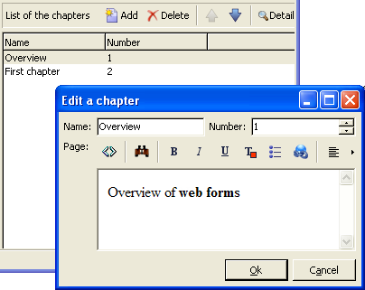

# Invoerformulieren{#input-forms}


Hieronder volgen enkele algemene beginselen voor het gebruik van inputformulieren in Adobe Campaign.

Forms wordt gedetailleerd weergegeven in [deze sectie](../../configuration/using/identifying-a-form.md).

## Formulierstructuur {#form-structure}

Het XML-document van een invoerformulier moet het **`<form>`** hoofdelement met de **name** en **namespace** kenmerken om respectievelijk de formuliernaam en de naamruimte te vullen.

```xml
<form name="form_name" namespace="name_space">
…
</form>
```

Standaard is een formulier gekoppeld aan het gegevensschema met dezelfde naam en naamruimte. Als u een formulier wilt koppelen aan een andere naam, voert u de schemasleutel in het dialoogvenster **entiteitsschema** kenmerk van de **`<form>`** element.

Om de structuur van een invoerformulier te illustreren, beschrijven we een interface op basis van ons voorbeeldschema &quot;cus:book&quot;:


Dit is het corresponderende invoerformulier:

```xml
<form name="book" namespace="cus" type="contentForm">
  <input xpath="@name"/>
  <input xpath="@date"/>
  <input xpath="@language"/>
</form>
```

De beschrijving van de bewerkingselementen begint met de **`<form>`** hoofdelement.

Een bewerkingsbesturingselement is ingevoerd in een **`<input>`** met de **xpath** kenmerk met het pad van het veld in het schema.

**Herinnering voor XPath-syntaxis:**

De XPath-taal wordt in Adobe Campaign gebruikt om naar een element of kenmerk te verwijzen dat of dat tot een gegevensschema behoort.

XPath is een syntaxis waarmee u een knooppunt in de boomstructuur van een XML-document kunt zoeken.

Elementen worden aangeduid met hun naam en kenmerken worden aangeduid met de naam voorafgegaan door het teken &quot;@&quot;.

Voorbeelden:

* **@date**: selecteert het kenmerk met de naam &quot;date&quot;
* **hoofdstuk/@titel**: selecteert het kenmerk &quot;title&quot; onder het tabblad `<chapter>` element
* **../@date**: selecteert de datum uit het bovenliggende element van het huidige element

Het bewerkingsbesturingselement past zich automatisch aan het overeenkomstige gegevenstype aan en gebruikt het label dat in het schema is gedefinieerd.

Elk veld wordt standaard op één regel weergegeven en neemt alle beschikbare ruimte in beslag, afhankelijk van het type gegevens.

>[!CAUTION]
>
>Het invoerformulier moet verwijzen naar een **type=&quot;contentForm&quot;** kenmerk op de **`<form>`** -element om automatisch het frame toe te voegen dat vereist is voor de invoer van inhoud.

## Opmaak {#formatting}

De rangschikking van de besturingselementen ten opzichte van elkaar lijkt op de rangschikking die wordt gebruikt in HTML-tabellen, met de mogelijkheid om een besturingselement te verdelen in meerdere kolommen, interliniërende elementen of het gebruik van de beschikbare ruimte te specificeren. Houd er echter rekening mee dat de opmaak alleen de verdeling van de verhoudingen toestaat; u kunt geen vaste afmetingen opgeven voor een object.

Raadpleeg [deze sectie](../../configuration/using/form-structure.md#formatting) voor meer informatie.

## Besturingselementen voor lijsttypen {#list-type-controls}

Om een inzamelingselement uit te geven, moet u een lijsttypecontrole gebruiken.

### Kolomlijst {#column-list}

Met dit besturingselement wordt een bewerkbare kolomlijst weergegeven met een werkbalk die knoppen Toevoegen en Verwijderen bevat.


```xml
<input xpath="chapter" type="list">
  <input xpath="@name"/>
  <input xpath="@number"/>
</input>
```

Het besturingselement voor de lijst moet worden ingevuld met de **type=&quot;list&quot;** en het pad van de lijst moet naar het verzamelingselement verwijzen.

De kolommen worden gedeclareerd door het onderliggende object **`<input>`** elementen van de lijst.

>[!NOTE]
>
>De pijl-omhoog en -omlaag worden automatisch toegevoegd wanneer de **ordered=&quot;true&quot;** attribuut wordt voltooid voor het inzamelingselement in het gegevensschema.

Standaard worden de werkbalkknoppen verticaal uitgelijnd. Ze kunnen ook horizontaal worden uitgelijnd:


```xml
<input nolabel="true" toolbarCaption="List of chapters" type="list" xpath="chapter">
  <input xpath="@name"/>
  <input xpath="@number"/>
</input>
```

De **toolbarCaption** Met dit kenmerk dwingt u de horizontale uitlijning van de werkbalk af en vult u de titel boven de lijst in.

>[!NOTE]
>
>Voor het etiket van het inzamelingselement dat niet aan de linkerzijde van de controle moet worden getoond, voeg toe **nolabel=&quot;true&quot;** kenmerk.

#### Inzoomen op een lijst {#zoom-in-a-list}

Het invoegen en bewerken van lijstgegevens kan in een afzonderlijk bewerkingsformulier worden uitgevoerd.

In de volgende gevallen worden formulieren in lijsten bewerken gebruikt:

* Ter vergemakkelijking van de invoer van informatie,
* Aanwezigheid van een meerregelig besturingselement
* De kolommen in de lijst bevatten alleen de hoofdvelden en in het formulier worden alle velden van het verzamelingselement weergegeven.



```xml
<input nolabel="true" toolbarCaption="List of chapters" type="list" xpath="chapter" zoom="true" zoomOnAdd="true">
  <input xpath="@name"/>
  <input xpath="@number"/>

  <form colcount="2" label="Editing a chapter">
    <input xpath="@name"/>
    <input xpath="@number"/>
    <input colspan="2" xpath="page"/>
  </form>
</input>
```

De definitie van het bewerkingsformulier wordt opgegeven via de **`<form>`** -element onder het lijstelement. De structuur ervan is identiek aan de structuur van een invoerformulier.

A **[!UICONTROL Detail]** wordt automatisch toegevoegd wanneer de knop **zoom=&quot;true&quot;** wordt in de lijstdefinitie ingevoerd. Hiermee kunt u het bewerkingsformulier openen op de geselecteerde regel.

>[!NOTE]
>
>Het toevoegen van **zoomOnAdd=&quot;true&quot;** Met dit kenmerk wordt het bewerkingsformulier afgedwongen wanneer een element in de lijst wordt ingevoegd.

### Tablijst {#tab-list}

In deze lijst wordt het bewerken van verzamelingselementen weergegeven in de vorm van tabbladen.


```xml
<container toolbarCaption="List of chapters" type="notebooklist" xpath="chapter" xpath-label="@name">
  <container colcount="2">
    <input xpath="@name"/>
    <input xpath="@number"/>
    <input colspan="2" xpath="page"/>
  </container>
</container>
```

Het besturingselement voor de lijst moet worden ingevuld met de **type=&quot;notebooklist&quot;** en het pad van de lijst moet naar het verzamelingselement verwijzen.

De titel van het tabblad bevat de waarde van de gegevens die zijn ingevoerd via het dialoogvenster **xpath-label** kenmerk.

De besturingselementen voor bewerken moeten worden gedeclareerd onder een **`<container>`** element dat een kind van de lijstcontrole is.

Met de werkbalkknoppen kunt u lijstelementen toevoegen of verwijderen.

>[!NOTE]
>
>De pijl-links en pijl-rechts wordt automatisch toegevoegd wanneer de **ordered=&quot;true&quot;** attribuut wordt bevolkt voor het inzamelingselement in het gegevensschema.

## Containers {#containers}

Met containers kunt u een set besturingselementen groeperen. Ze bestaan via de **`<container>`** element. Zij zijn reeds gebruikt om controles in verscheidene kolommen en voor de controle van de lusjelijst te formatteren.

Raadpleeg voor meer informatie over containers en hoe u deze kunt gebruiken in invoerformulieren [deze sectie](../../configuration/using/form-structure.md#containers).

## Formulieren bewerken {#editing-forms}

In de bewerkingszone kunt u de XML-inhoud van het invoerformulier invoeren:


De **[!UICONTROL Preview]** kunt u het invoerformulier weergeven:


Meer informatie over [formulieren bewerken](../../configuration/using/editing-forms.md) en [formulierstructuur](../../configuration/using/form-structure.md).
