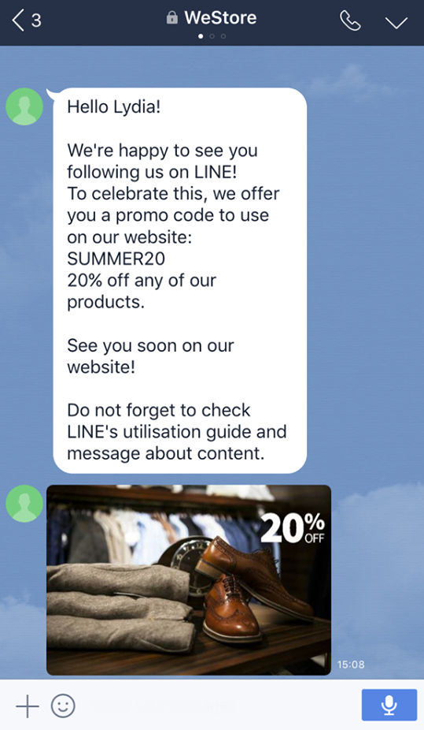

# Regelleveringen maken{#line-channel}

>[!NOTE]
>
>[!DNL LINE] is alleen beschikbaar voor installaties op locatie of voor beheerde services.

[!DNL LINE] is een toepassing voor gratis instant messaging-, spraak- en videogesprekken, beschikbaar op elk mobiel besturingssysteem en op pc.

[!DNL LINE] kan ook worden gecombineerd met de module Transactiebericht om realtime berichten te verzenden over de  [!DNL LINE] app die is geïnstalleerd in mobiele apparaten voor consumenten. Raadpleeg [deze pagina](../../message-center/using/transactional-messaging-architecture.md#transactional-messaging-and-line) voor meer informatie.

De stappen voor het gebruiken van het [!DNL LINE] kanaal zijn:

1. [LINE-kanaal instellen](#setting-up-line-channel)
1. [Een levering maken](#creating-the-delivery)
1. [Het inhoudstype configureren](#defining-the-content)
1. [Bewaking van de aflevering (volgen, quarantining, rapporten, enz.)](#accessing-reports)

## LINE-kanaal instellen {#setting-up-line-channel}

Voordat u een [!DNL LINE]-account en een externe account maakt, moet u eerst het LINE-pakket op uw exemplaar installeren. Raadpleeg de sectie [LINE](../../installation/using/installing-campaign-standard-packages.md#line-package) in de installatiehandleiding voor meer informatie hierover.

U moet eerst een [!DNL LINE]-account maken, zodat u deze aan Adobe Campaign kunt koppelen. Vervolgens kunt u [!DNL LINE] berichten verzenden naar gebruikers die uw [!DNL LINE]-account in hun mobiele toepassing hebben toegevoegd. Externe accounts en [!DNL LINE]-account kunnen alleen worden beheerd door de functionele beheerder van het platform.

Zie [Documentatie voor lijnontwikkelaars](https://developers.line.me/) voor informatie over het maken en configureren van een [!DNL LINE]-account.

### Creeer en vorm de dienst van de LIJN {#configure-line-service}

Uw [!DNL LINE]-service maken:

1. Selecteer op de startpagina van Adobe Campaign Classic de tab **[!UICONTROL Profiles and Targets]**.

1. Selecteer **[!UICONTROL Services and Subscriptions]** in het linkermenu en klik op **[!UICONTROL Create]**.

   

1. Voeg een **[!UICONTROL Label]** en **[!UICONTROL Internal name]** aan uw nieuwe dienst toe.

1. Selecteer **[!UICONTROL LINE]** van **[!UICONTROL Type]** drop-down.

   

1. Klik op **[!UICONTROL Save]**.

Zie [Abonnementen beheren](managing-subscriptions.md) voor meer informatie over abonnementen en services.

### Externe LINE-account configureren {#configure-line-external}

Nadat u de [!DNL LINE]-service hebt gemaakt, moet u de [!DNL LINE] externe account op Adobe Campaign configureren:

1. Klik in **[!UICONTROL Administration]** > **[!UICONTROL Platform]** boomstructuur op het tabblad **[!UICONTROL External Accounts]**.

1. Selecteer de ingebouwde **[!UICONTROL LINE V2 routing]** externe account.

   

1. Klik op het tabblad **[!UICONTROL LINE]** van uw externe account om uw externe account te configureren. Vul de volgende velden in:

   

   * **[!UICONTROL Channel Alias]**: wordt via uw  [!DNL LINE] account op het  **[!UICONTROL Channels]** >- **[!UICONTROL Technical configuration]** tabblad opgegeven.
   * **[!UICONTROL Channel ID]**: wordt via uw  [!DNL LINE] account op het  **[!UICONTROL Channels]** >- **[!UICONTROL Basic Information panel]** tabblad opgegeven.
   * **[!UICONTROL Channel secret key]**: wordt via uw  [!DNL LINE] account op het  **[!UICONTROL Channels]** >- **[!UICONTROL Basic Information panel]** tabblad opgegeven.
   * **[!UICONTROL Access token]**: via uw  [!DNL LINE] account in het ontwikkelaarsportaal of door op de  **[!UICONTROL Get access token]** knop te klikken.
   * **[!UICONTROL Access token expiration date]**: staat u toe om de vervaldatum van het teken van de Toegang te specificeren.
   * **[!UICONTROL LINE subscription service]**: staat u toe om de diensten te specificeren waarop de gebruikers zullen worden ingetekend.

1. Zodra uw configuratie gereed is, klikt u op **[!UICONTROL Save]**.

1. Selecteer **[!UICONTROL Explorer]** > **[!UICONTROL Production]** > **[!UICONTROL Technical workflows]** > **[!UICONTROL LINE workflows]** om te controleren of de **[!UICONTROL LINE V2 access token update (updateLineAccessToken)]**- en **[!UICONTROL Delete blocked LINE users (deleteBlockedLineUsers)]**-workflows zijn gestart.**[!UICONTROL Administration]**

[!DNL LINE] wordt nu gevormd in Adobe Campaign, kunt u beginnen leveranties van de LIJN aan abonnees te creëren en te verzenden.

## LINE-levering maken {#creating-the-delivery}

>[!NOTE]
>
>Wanneer u een [!DNL LINE] levering voor het eerst naar een nieuwe ontvanger verzendt, moet u het officiële bericht van de LIJN betreffende de voorwaarden van gebruik en toestemming in de levering toevoegen. Het officiële bericht is beschikbaar op [volgende verbinding](https://terms.line.me/OA_privacy/).

Als u een levering [!DNL LINE] wilt maken, moet u de volgende stappen uitvoeren:

1. Selecteer **[!UICONTROL Campaigns]** op het tabblad **[!UICONTROL Deliveries]** en klik op de knop **[!UICONTROL Create]**.

   

1. Selecteer **[!UICONTROL LINE V2 delivery]** leveringssjabloon.

   

1. Identificeer uw levering met **[!UICONTROL Label]**, **[!UICONTROL Delivery code]**, en **[!UICONTROL Description]**. Raadpleeg [deze sectie](steps-create-and-identify-the-delivery.md#identifying-the-delivery) voor meer informatie.

1. Klik **[!UICONTROL Continue]** om uw levering tot stand te brengen.

1. In de leveringsredacteur, selecteer **[!UICONTROL To]** om de ontvangers van uw [!DNL LINE] levering te richten. Het richten wordt uitgevoerd op **[!UICONTROL Visitor subscriptions (nms:visitorSub)]**.

   Raadpleeg [Doelpopulaties identificeren](steps-defining-the-target-population.md) voor meer informatie.

   

1. Klik **[!UICONTROL Add]** om uw **[!UICONTROL Delivery target population]** te selecteren.

   

1. Kies of u [!DNL LINE] abonnees direct wilt richten of als u gebruikers afhankelijk van hun [!DNL LINE] abonnement wilt richten en **[!UICONTROL Next]** klikken. In dit voorbeeld hebben we **[!UICONTROL By LINE V2 subscription]** geselecteerd.

1. Selecteer **[!UICONTROL Line-V2]** in **[!UICONTROL Folder]** drop-down toen uw [!DNL LINE] dienst. Klik **[!UICONTROL Finish]** dan **[!UICONTROL Ok]** beginnen uw levering aan te passen.

   

1. Van uw leveringsredacteur, klik **[!UICONTROL Add]** om één of veelvoudige bericht toe te voegen en **[!UICONTROL Content type]** te selecteren.

   Raadpleeg [Het inhoudstype definiëren](#defining-the-content) voor meer informatie over de verschillende beschikbare **[!UICONTROL Content type]**.

   

1. Wanneer uw levering correct wordt gecreeerd en gevormd, kunt u het naar het vroeger bepaalde doel verzenden.

   Voor meer informatie bij het verzenden van een levering, verwijs naar [Send berichten](sending-messages.md).

1. Na het verzenden van uw bericht, heb toegang tot uw rapport om de doeltreffendheid van uw levering te meten.

   Raadpleeg [Toegangsrapporten](#accessing-reports) voor meer informatie over [!DNL LINE]-rapporten.

## Het inhoudstype definiëren {#defining-the-content}

Om de inhoud van een [!DNL LINE] levering te bepalen, moet u eerst berichttype aan uw levering toevoegen. Elke [!DNL LINE] levering kan tot 5 berichten bevatten.

U kunt kiezen uit drie berichttypen:

* [Tekstbericht](#configuring-a-text-message-delivery)
* [Afbeelding en koppeling](#configuring-an-image-and-link-delivery)
* [Video-bericht](#configuring-a-video-message-delivery)

### De levering van een tekstbericht configureren {#configuring-a-text-message-delivery}

>[!NOTE]
>
>Met de syntaxis `<%@ include option='NmsServer_URL' %>/webApp/APP3?id=<%=escapeUrl(cryptString(visitor.id))%>` kunt u een koppeling naar een webtoepassing opnemen in een LINE-bericht.

Een **[!UICONTROL Text message]** [!DNL LINE] levering is een bericht dat naar ontvangers in tekstvorm wordt verzonden.

De configuratie voor dit type van bericht is gelijkaardig aan de configuratie van **[!UICONTROL Text]** in e-mail. Raadpleeg deze [pagina](defining-the-email-content.md#message-content) voor meer informatie.

### Afbeelding en koppelingslevering configureren {#configuring-an-image-and-link-delivery}

Een **[!UICONTROL Image and link]** [!DNL LINE] levering is een bericht dat aan ontvangers in de vorm van een beeld wordt verzonden dat één of veelvoudige URLs kan bevatten.

U kunt het volgende gebruiken:

* a **[!UICONTROL Personalized image]**,

   >[!NOTE]
   >
   >Met de variabele **%SIZE%** kunt u de beeldweergave optimaliseren op basis van de schermgrootte van het mobiele apparaat van de ontvanger.

   

* en **[!UICONTROL Image URL]** per schermgrootte apparaat,

   

   Met de optie **[!UICONTROL Define images per device screen size]** kunt u verschillende afbeeldingsresoluties gebruiken om de zichtbaarheid van de levering op mobiele apparaten te optimaliseren. Alleen afbeeldingen met dezelfde hoogte en breedte worden ondersteund.

   Afbeeldingen kunnen worden gedefinieerd op basis van de schermgrootte:

   * 1040 px
   * 700 px
   * 460 px
   * 300 px
   * 240 px

   >[!CAUTION]
   >
   >De grootte van 1040 x 1040 px is verplicht voor elke lijnafbeelding met koppeling.

   Vervolgens moet u alternatieve tekst toevoegen die op het mobiele apparaat van de ontvanger verschijnt.

* en **[!UICONTROL Links]**.

   In de sectie **[!UICONTROL Links]** kunt u kiezen tussen verschillende lay-outs die de afbeelding verdelen in meerdere klikbare gebieden. U kunt elk van hen dan toewijzen een specifieke **[!UICONTROL Link URL]**.

   

### Een videoboodschap configureren {#configuring-a-video-message-delivery}

Een **[!UICONTROL Video message]** [!DNL LINE] levering is een bericht dat aan ontvangers in de vorm van een video wordt verzonden die een URL kan bevatten.

In het veld **[!UICONTROL Preview Image URL]** kunt u de URL toevoegen van een voorvertoning met een tekenlimiet van 1000. JPEG en PNG worden ondersteund met een maximale bestandsgrootte van 1 MB.

In het veld **[!UICONTROL Video Image URL]** kunt u de URL van het videobestand toevoegen met een tekenlimiet van 1000. Alleen MP4-indeling wordt ondersteund met een maximale bestandsgrootte van 200 MB.

Brede of lange video&#39;s kunnen worden bijgesneden wanneer deze op bepaalde apparaten worden afgespeeld.

## Toegang tot rapporten {#accessing-reports}

Nadat u de levering hebt verzonden, kunt u uw [!DNL LINE]-rapporten weergeven via het menu **[!UICONTROL Campaign Management]** > **[!UICONTROL Deliveries]** van **[!UICONTROL Explorer]**.

>[!NOTE]
>
>De volgende rapporten wijzen op het klikthrough tarief. [!DNL LINE] houdt geen rekening met de open rente.

Voor [!DNL LINE] servicerapporten opent u het menu **[!UICONTROL Profiles and Targets]** > **[!UICONTROL Services and Subscriptions]** > **[!UICONTROL LINE-V2]** op het tabblad **[!UICONTROL Explorer]**. Klik vervolgens op het pictogram **[!UICONTROL Reports]** in de service [!DNL LINE].

## Voorbeeld: een gepersonaliseerd lijnbericht maken en verzenden {#example--create-and-send-a-personalized-line-message}

In dit voorbeeld, gaan wij een tekstbericht en een beeld tot stand brengen en vormen die gegevens bevatten die volgens de ontvanger zullen worden gepersonaliseerd.

1. Maak uw [!DNL LINE] levering door op de knop **[!UICONTROL Create]** op het tabblad **[!UICONTROL Campaign]** te klikken.

   

1. Selecteer de leveringssjabloon **[!UICONTROL LINE V2 delivery]** en geef uw levering een naam.

   

1. Selecteer in het configuratievenster van uw levering de doelpopulatie.

   Raadpleeg [Doelpopulaties identificeren](steps-defining-the-target-population.md) voor meer informatie.

   

1. Klik **[!UICONTROL Add]** om uw bericht tot stand te brengen en **[!UICONTROL Content type]** te selecteren.

   Hier, willen wij eerst een **[!UICONTROL Text message]** tot stand brengen.

   

1. Plaats de cursor op de plaats waar u de gepersonaliseerde tekst wilt invoegen en klik op het vervolgkeuzepictogram en selecteer **[!UICONTROL Visitor]** > **[!UICONTROL First name]**.

   

1. Volg dezelfde procedure om een afbeelding toe te voegen door **[!UICONTROL Image and links]** te selecteren in de vervolgkeuzelijst **[!UICONTROL Message type]**.

   Voeg uw **[!UICONTROL Image URL]** toe.

   

1. Selecteer in de sectie **[!UICONTROL Links]** de lay-out die de afbeelding in meerdere klikbare gebieden zal verdelen.

1. Wijs een URL toe aan elk gebied van uw afbeelding.

   

1. Sla de levering op en klik op **[!UICONTROL Send]** om de levering te analyseren en naar het doel te verzenden.

   De levering wordt verzonden naar het doel.

   

