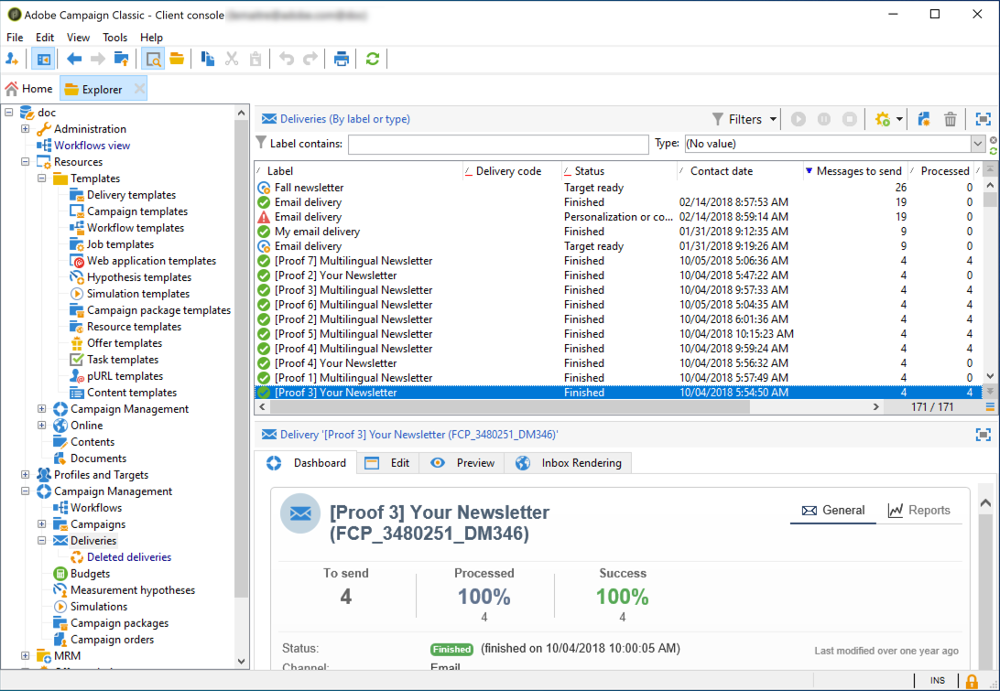

# De lijst met leveringen openen {#list-of-deliveries}

U kunt tot leveringen van de leveringslijst, via de **[!UICONTROL Campaign Management > Deliveries]** knoop van de boom toegang hebben.

Standaard bevat de lijst met leveringen de namen en statussen van de leveringen die in het geselecteerde knooppunt zijn gemaakt. Het toont ook het aantal berichten om te verzenden, te verwerken en met succes te verzenden.

* Het aantal **[!UICONTROL Messages to send]** komt overeen met het aantal ontvangers dat na analyse en vóór levering als doelgroep wordt genomen.
* Het aantal berichten in de kolom **[!UICONTROL Success]** komt overeen met het aantal berichten dat door de server wordt verzonden en door de ontvangers wordt ontvangen.
* Het aantal **[!UICONTROL Processed]** berichten beantwoordt aan het aantal ontvangen berichten plus het aantal berichten met fouten.

>[!NOTE]
>
>Voor grote leveringen wilt u deze waarden mogelijk bijwerken. U doet dit door de desbetreffende levering te selecteren en er vervolgens met de rechtermuisknop op te klikken. Selecteer **[!UICONTROL Action > Recompute delivery and tracking indicators...]** en gebruik vervolgens de wizard om deze gegevens bij te werken.

**Verwante onderwerpen:**

* [Leveringsdashboard](delivery-dashboard.md)
* [Leveringsstatussen](delivery-statuses.md)
