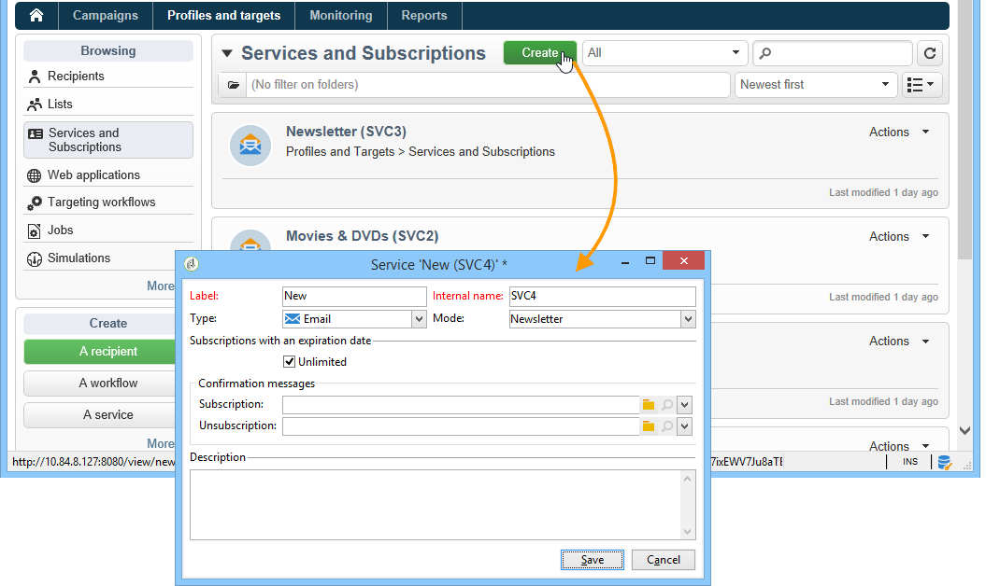
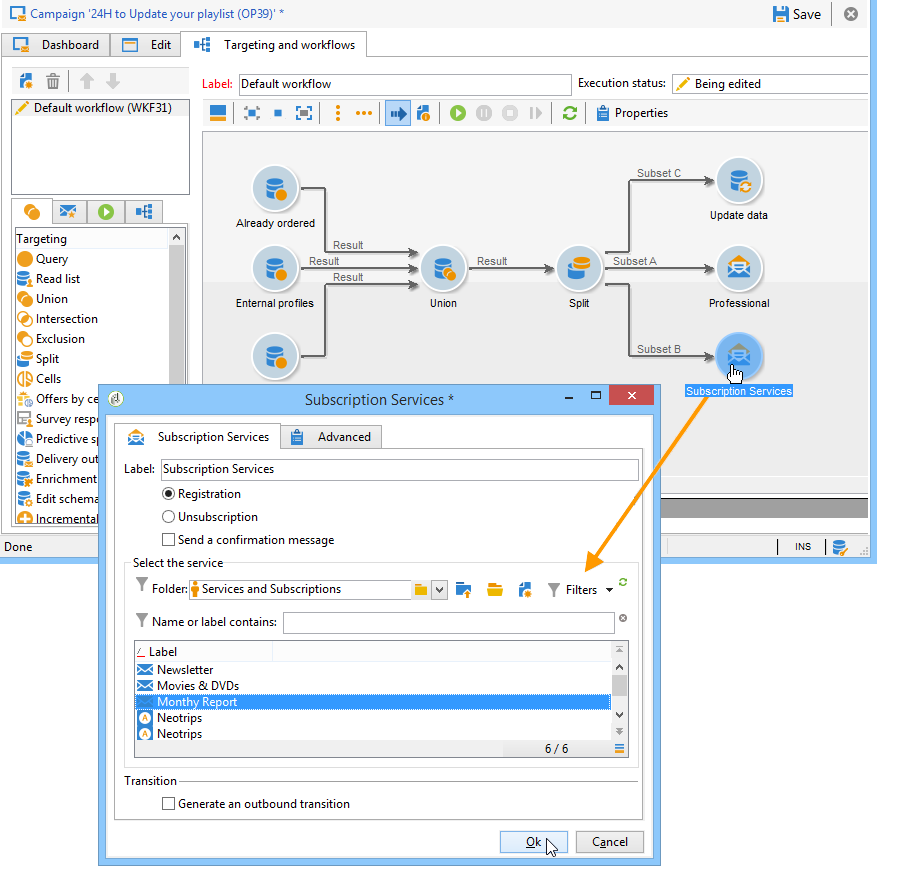

# Abonnementen beheren{#managing-subscriptions}

## Informatie over informatiediensten {#about-information-services}

Een informatiedienst omvat:

* registratie en abonnement (opt-in),
* Deregistratie, vrijwillig afzien van abonnement (opt-out) of automatisch afzien van abonnement (beperkte-tijdservice, bijvoorbeeld als proefaanbieding);
* bevestigingsmechanismen voor abonnementen en abonnementen (eenvoudige mechanismen met bevestiging, dubbele aanmelding, enz.);
* Het volgen van abonneegeschiedenis.

Deze diensten omvatten standaard specifieke statistische rapporten: het volgen van abonnees, loyaliteitsniveau, uitstaptendensen, enz.

Voor e-mails worden de verplichte abonnementskoppelingen automatisch gegenereerd. De volledige procedure voor het in- en uitschakelen van e-mail verloopt volledig geautomatiseerd, waarbij de historie wordt bijgehouden zodat de geldende regels volledig worden nageleefd.

Er zijn drie modi voor abonnementen/abonnementen op services:

1. handmatig
1. door importeren (alleen abonnement),
1. via een webformulier

>[!NOTE]
>
>In [deze sectie](../../web/using/use-cases--web-forms.md#create-a-subscription--form-with-double-opt-in)wordt een voorbeeld beschreven voor het maken van een abonnementsformulier met dubbele aanmelding.

## Een informatiedienst maken {#creating-an-information-service}

U kunt abonnementen op informatiediensten met bijbehorende bevestigingsberichten of automatische leveringen aan abonnees tot stand brengen en beheren.

Ga naar het **[!UICONTROL Profiles and Targets]** universum en klik op de **[!UICONTROL Services and Subscriptions]** koppeling om toegang te krijgen tot de kaart met informatiediensten.

Als u een bestaande service wilt bewerken, klikt u op de naam van de service. Als u een service wilt maken, klikt u op de **[!UICONTROL Create]** knop boven de lijst.

* Voer de naam van de service in het **[!UICONTROL Label]** veld in en selecteer het leveringskanaal: e-mail-, mobiele, Facebook-, Twitter- of mobiele toepassingen.

   >[!NOTE]
   >
   >Facebook- en Twitter-abonnementen worden in [deze sectie](../../social/using/about-social-marketing.md)beschreven. Abonnementen voor mobiele toepassingen worden beschreven in [Informatie over het mobiele toepassingskanaal](../../delivery/using/about-mobile-app-channel.md).

* Selecteer de **leveringsmodus** voor een service van het type E-mail. De mogelijke modi zijn: **[!UICONTROL Newsletter]** of **[!UICONTROL Viral]**.
* U kunt **bevestigingsberichten** voor een abonnement of een abonnement verzenden. Hiervoor selecteert u de leveringssjablonen die u wilt gebruiken om de corresponderende leveringen te maken vanuit de **[!UICONTROL Subscription]** velden en de **[!UICONTROL Unsubscription]** velden. Deze malplaatjes moeten met een **[!UICONTROL Subscription]** typedoelafbeelding, zonder een bepaald doel worden gevormd. Zie de sectie [Over e-mailkanaal](../../delivery/using/about-email-channel.md).
* Abonnementen zijn standaard onbeperkt. U kunt de **[!UICONTROL Unlimited]** optie uitschakelen om een geldigheidsduur voor de service te definiëren. De duur kan worden opgegeven in dagen (**[!UICONTROL d]** ) of maanden (**[!UICONTROL m]** ).

Zodra de dienst is opgeslagen, wordt het toegevoegd aan de lijst van de Diensten en van Abonnementen: Klik op de naam van het bestand om het te bewerken. Er zijn verschillende tabbladen beschikbaar. Op het **[!UICONTROL Subscriptions]** tabblad kunt u de lijst met abonnees van de informatiedienst (**[!UICONTROL Active subscriptions]** tabblad) of de abonnements-/**[!UICONTROL History]** uitstapgeschiedenis bekijken. U kunt ook abonnees toevoegen en verwijderen van dit tabblad. Zie [Abonnees](#adding-and-deleting-subscribers)toevoegen en verwijderen.

Met de **[!UICONTROL Detail...]** knop kunt u de abonnementseigenschappen voor de geselecteerde ontvanger bekijken.

U kunt de abonnementseigenschappen voor een ontvanger wijzigen.

Klik op het dashboard op het **[!UICONTROL Reports]** tabblad om abonnementen bij te houden: wijzigingen in het abonnementsniveau, het totale aantal abonnees, enz. U kunt rapporten archiveren en historie bekijken van dit lusje.

## Abonnees toevoegen en verwijderen {#adding-and-deleting-subscribers}

Klik op het **[!UICONTROL Subscriptions]** tabblad van een informatieservice **[!UICONTROL Add]** om abonnees toe te voegen. U kunt ook met de rechtermuisknop op de lijst met abonnees klikken en selecteren **[!UICONTROL Add]**. Selecteer de map waarin de profielen zijn opgeslagen die u wilt abonneren, selecteer vervolgens de profielen die u wilt abonneren en klik **[!UICONTROL OK]** om te valideren.

Als u abonnees wilt verwijderen, selecteert u de abonnees en klikt u op **[!UICONTROL Delete]**. U kunt ook met de rechtermuisknop op de abonnementenlijst klikken en selecteren **[!UICONTROL Delete]**.

In beide gevallen kunt u een bevestigingsbericht naar de betrokken gebruikers sturen als er een leveringssjabloon voor abonnementen aan de service is gekoppeld (zie [Een informatiedienst](#creating-an-information-service)maken). Met een waarschuwing kunt u deze levering valideren of niet valideren:

Zie [Abonnementsmechanismen en disabonnementmechanismen](#subscription-and-unsubscription-mechanisms).

## Het leveren aan de abonnees van een dienst {#delivering-to-the-subscribers-of-a-service}

Om aan de abonnees van een informatiedienst te leveren, kunt u de abonnees aan de betrokken informatiedienst richten, zoals in het volgende voorbeeld:

>[!CAUTION]
>
>De doeltoewijzing moet zijn **[!UICONTROL Subscriptions]**.

Selecteer **[!UICONTROL Subscribers of an information service]** en klik op **[!UICONTROL Next]**.

Selecteer de beoogde informatieservice en klik op **[!UICONTROL Finish]**.

Op het **[!UICONTROL Preview]** tabblad kunt u de lijst met abonnees van de geselecteerde informatiedienst weergeven.

## Abonnementsmechanismen en regelingen voor niet-inschrijving {#subscription-and-unsubscription-mechanisms}

U kunt abonnements- en uitstapmechanismen instellen om de processen en het abonneebeheer te automatiseren.

>[!NOTE]
>
>Je kunt een bevestigingsbericht naar nieuwe abonnees sturen.\
>De inhoud van dit bericht wordt bepaald in de configuratie van de informatiedienst via **[!UICONTROL Subscription]** of gebieden **[!UICONTROL Unsubscription]** .
>
>De bevestigingsberichten worden gecreeerd via de leveringsmalplaatjes die in deze gebieden worden gespecificeerd. Deze doeltoewijzingen moeten zijn **[!UICONTROL Subscriptions]**.

### Een ontvanger aan de dienst abonneren {#subscribing-a-recipient-to-a-service}

Als u ontvangers wilt registreren voor een informatieservice, kunt u:

* Voeg de service handmatig toe: hiertoe klikt u op het **[!UICONTROL Subscriptions]** tabblad van hun profiel op de betreffende informatiedienst **[!UICONTROL Add]** en selecteert u deze.

   Raadpleeg voor meer informatie de sectie over het bewerken van profielen in [deze sectie](../../platform/using/editing-a-profile.md).

* Schrijf automatisch een reeks ontvangers in op deze service. De lijst met ontvangers kan afkomstig zijn van een filterbewerking, een groep, een map, een import of een directe selectie met de muis. Als u zich op deze ontvangers wilt abonneren, selecteert u de profielen en klikt u met de rechtermuisknop. Selecteer **[!UICONTROL Actions > Subscribe selection to a service...]** de desbetreffende service, selecteer deze en start de bewerking.
* Importeer ontvangers en meld ze automatisch aan bij een informatieservice. Selecteer hiertoe de desbetreffende service in de laatste stap van de wizard Importeren.

   Zie [deze sectie](../../platform/using/importing-data.md#import-wizard)voor meer informatie.

* Gebruik een webformulier zodat ontvangers zich op een service kunnen abonneren.

   Zie [deze sectie](../../web/using/about-web-applications.md)voor meer informatie.

* Een doelworkflow maken en een **[!UICONTROL Subscription service]** vak gebruiken.

   

   De workflows en hoe deze te gebruiken worden in [deze sectie](../../workflow/using/about-workflows.md)beschreven.

### Een ontvanger afmelden bij een service {#unsubscribing-a-recipient-from-a-service}

#### Handmatig afmelden {#manual-unsubscribing}

e-mailleveringen moeten wettelijk gezien een link zonder abonnement bevatten. Ontvangers kunnen op deze koppeling klikken om hun profiel bij te werken en worden uitgesloten van de doelstellingen voor toekomstige leveringen.

De standaardkoppeling voor het ongedaan maken van abonnementen wordt ingevoegd via de laatste knop op de werkbalk van de inhoudseditor die wordt geleverd in de wizard voor levering (zie [Informatie over personalisatie](../../delivery/using/about-personalization.md)). Wanneer de ontvanger op deze koppeling klikt, wordt het profiel op de zwarte lijst geplaatst (opt-out), wat betekent dat deze ontvanger niet langer het doelwit is van een leveringsactie.

Ontvangers kunnen echter besluiten hun abonnement op een service op te zeggen zonder zich af te melden bij alle services. U kunt dit toestaan door een webformulier te gebruiken (zie [deze sectie](../../web/using/adding-fields-to-a-web-form.md#subscription-checkboxes)) of een gepersonaliseerde koppeling voor niet-abonnementen in te voegen (zie [Aanpassingsblokken](../../delivery/using/personalization-blocks.md)).

U kunt het abonnement op een ontvanger ook handmatig opzeggen vanuit het ontvangende profiel. Klik hiertoe op het **[!UICONTROL Subscriptions]** tabblad van de betrokken ontvanger, selecteer de betrokken informatiedienst(en) en klik op **[!UICONTROL Delete]**.

U kunt het abonnement op een of meer ontvangers uiteindelijk opzeggen via de betreffende informatiedienst. Klik hiertoe op het **[!UICONTROL Subscriptions]** tabblad van de service, selecteer de betrokken ontvangers en klik op **[!UICONTROL Delete]**.

#### Automatisch uitschakelen {#automatic-unsubscription}

Een informatiedienst kan een beperkte duur hebben. Ontvangers worden automatisch afgemeld wanneer de geldigheidsperiode is verlopen. Deze periode wordt gespecificeerd op het **[!UICONTROL Edit]** lusje van de de diensteigenschappen. Het wordt uitgedrukt in dagen.

U kunt ook een workflow zonder abonnement instellen voor een populatie. Hiervoor volgt u dezelfde procedure als voor een abonnementswerkstroom, maar selecteert u de **[!UICONTROL Unsubscription]** optie. Zie [Abonneren een ontvanger aan de dienst](#subscribing-a-recipient-to-a-service).

### Abonnementen bijhouden {#subscriber-tracking}

U kunt de wijzigingen in abonnementen op de informatieservices bijhouden met de **[!UICONTROL Reports]** koppeling op het dashboard.

