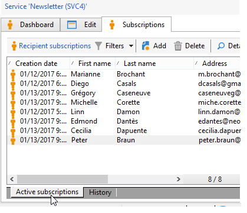

# Lidmaatschappen beheren{#managing-subscriptions}

## Informatie over informatiediensten {#about-information-services}

Een informatiedienst omvat:

* registratie en abonnement (opt-in),
* Deregistratie, vrijwillig afzien van abonnement (opt-out) of automatisch afzien van abonnement (beperkte-tijdservice, bijvoorbeeld als proefaanbieding);
* bevestigingsmechanismen voor abonnementen en abonnementen (eenvoudige mechanismen met bevestiging, dubbele aanmelding, enz.);
* Het volgen van abonneegeschiedenis.

Deze services omvatten standaard specifieke statistische rapporten: volgen van abonnees, niveau van loyaliteit, trends voor abonnementen, enz.

Voor e-mails worden de verplichte abonnementskoppelingen automatisch gegenereerd. De volledige procedure voor het in- en uitschakelen van e-mail verloopt volledig geautomatiseerd, waarbij de historie wordt bijgehouden om volledige naleving van de geldende regels te garanderen.

Er zijn drie modi voor abonnementen/abonnementen op services:

1. handmatig
1. door importeren (alleen abonnement),
1. via een webformulier

>[!NOTE]
>
>Een steekproef om een abonnementvorm met dubbel te creëren opt-in wordt gedetailleerd in [ deze sectie ](../../web/using/use-cases-web-forms.md#create-a-subscription--form-with-double-opt-in).

## Een informatiedienst maken {#creating-an-information-service}

U kunt abonnementen op informatieservices maken en beheren met de bijbehorende bevestigingsberichten of automatische leveringen aan abonnees.

Als u toegang wilt krijgen tot het overzicht met informatieservices, opent u het tabblad **[!UICONTROL Profiles and Targets]** en klikt u op de koppeling **[!UICONTROL Services and Subscriptions]** .

Als u een bestaande service wilt bewerken, klikt u op de naam van de service. Als u een service wilt maken, klikt u op de knop **[!UICONTROL Create]** boven de lijst.

* Voer in het veld **[!UICONTROL Label]** de naam van de service in en selecteer het leveringskanaal: email, mobile, Facebook, X (voorheen bekend als Twitter) of mobiele toepassingen.

  >[!NOTE]
  >
  >Facebook en de abonnementen van X zijn gedetailleerd in [ deze sectie ](../../social/using/about-social-marketing.md). De mobiele toepassingsabonnementen zijn gedetailleerd in [ Ongeveer mobiel toepassingskanaal ](about-mobile-app-channel.md).

* Voor een E-mail type dienst, selecteer de **wijze van de Levering**. De mogelijke modi zijn: **[!UICONTROL Newsletter]** of **[!UICONTROL Viral]** .
* U kunt **bevestigingsberichten** voor een abonnement of unsubscription verzenden. Hiervoor selecteert u de leveringssjablonen die u wilt gebruiken om de bijbehorende leveringen te maken in de velden **[!UICONTROL Subscription]** en **[!UICONTROL Unsubscription]** . Deze sjablonen moeten worden geconfigureerd met een **[!UICONTROL Subscription]** type target-toewijzing, zonder een gedefinieerd doel. Zie sectie [ Ongeveer e-mailkanaal ](about-email-channel.md).
* Abonnementen zijn standaard onbeperkt. U kunt de optie **[!UICONTROL Unlimited]** uitschakelen om een geldigheidsduur voor de service te definiëren. De duur kan in dagen (**[!UICONTROL d]** ) of maanden (**[!UICONTROL m]** ) worden gespecificeerd.

Nadat de service is opgeslagen, wordt deze toegevoegd aan de lijst Services en abonnementen. Klik op de naam van de service om deze te bewerken. Er zijn verschillende tabbladen beschikbaar. Het **[!UICONTROL Subscriptions]** lusje laat u de lijst van abonnees aan de informatiedienst (**[!UICONTROL Active subscriptions]** lusje) of de abonnement/unsubscription geschiedenis (**[!UICONTROL History]** tabel) bekijken. U kunt ook abonnees toevoegen en verwijderen van dit tabblad. Zie [ Toevoegend en schrappend abonnees ](#adding-and-deleting-subscribers).

Met de knop **[!UICONTROL Detail...]** kunt u de abonnementseigenschappen voor de geselecteerde ontvanger bekijken.

U kunt de abonnementseigenschappen voor een ontvanger wijzigen.

Klik op het dashboard op het tabblad **[!UICONTROL Reports]** om abonnementen bij te houden: wijzigingen in abonnementsniveaus, totaal aantal abonnees, enzovoort. U kunt rapporten archiveren en historie bekijken van dit lusje.

## Abonnees toevoegen en verwijderen {#adding-and-deleting-subscribers}

Klik op het tabblad **[!UICONTROL Subscriptions]** van een informatieservice op **[!UICONTROL Add]** om abonnees toe te voegen. U kunt ook met de rechtermuisknop op de lijst met abonnees klikken en **[!UICONTROL Add]** selecteren. Selecteer de map waarin de profielen zijn opgeslagen die u wilt abonneren, selecteer vervolgens de profielen die u wilt abonneren en klik op **[!UICONTROL OK]** om te valideren.

Als u abonnees wilt verwijderen, selecteert u deze en klikt u op **[!UICONTROL Delete]** . U kunt ook met de rechtermuisknop op de abonnementenlijst klikken en **[!UICONTROL Delete]** selecteren.

In beide gevallen, kunt u een bevestigingsbericht naar de betrokken gebruikers verzenden als een leveringsmalplaatje voor abonnementen in bijlage aan de dienst (zie [ Creërend een informatiedienst ](#creating-an-information-service)) is geweest. Met een waarschuwing kunt u deze levering valideren of niet valideren:

Zie [ Abonnement en unsubscription mechanismen ](#subscription-and-unsubscription-mechanisms).

## Het leveren aan de abonnees van een dienst {#delivering-to-the-subscribers-of-a-service}

Om aan de abonnees van een informatiedienst te leveren, kunt u de abonnees aan de betrokken informatiedienst richten, zoals in het volgende voorbeeld:

>[!CAUTION]
>
>De doeltoewijzing moet **[!UICONTROL Subscriptions]** zijn.

Selecteer **[!UICONTROL Subscribers of an information service]** en klik op **[!UICONTROL Next]**.

Selecteer de beoogde informatieservice en klik op **[!UICONTROL Finish]** .

Op het tabblad **[!UICONTROL Preview]** kunt u de lijst met abonnees van de geselecteerde informatiedienst weergeven.

## Abonnementsmechanismen en regelingen voor niet-inschrijving {#subscription-and-unsubscription-mechanisms}

U kunt abonnements- en uitstapmechanismen instellen om de processen en het abonneebeheer te automatiseren.

>[!NOTE]
>
>Je kunt een bevestigingsbericht naar nieuwe abonnees sturen.\
>De inhoud van dit bericht wordt gedefinieerd in de configuratie van de informatieservice via de velden **[!UICONTROL Subscription]** of **[!UICONTROL Unsubscription]** .
>
>De bevestigingsberichten worden gecreeerd via de leveringsmalplaatjes die in deze gebieden worden gespecificeerd. Deze doeltoewijzingen moeten **[!UICONTROL Subscriptions]** zijn.

### Een ontvanger aan de dienst abonneren {#subscribing-a-recipient-to-a-service}

Als u ontvangers wilt registreren voor een informatieservice, kunt u:

* Voeg handmatig de service toe: hiervoor klikt u op het tabblad **[!UICONTROL Subscriptions]** van het bijbehorende profiel op **[!UICONTROL Add]** en selecteert u de desbetreffende informatieservice.

  Voor meer op dit, verwijs naar de sectie over profiel het uitgeven in [ deze sectie ](../../platform/using/editing-a-profile.md).

* Schrijf automatisch een reeks ontvangers in op deze service. De lijst met ontvangers kan afkomstig zijn van een filterbewerking, een groep, een map, een import of een directe selectie met de muis. Als u zich op deze ontvangers wilt abonneren, selecteert u de profielen en klikt u met de rechtermuisknop. Selecteer **[!UICONTROL Actions > Subscribe selection to a service...]** , selecteer de desbetreffende service en start de bewerking.
* Importeer ontvangers en meld ze automatisch aan bij een informatieservice. Om dit te doen, selecteer de betrokken dienst in de laatste stap van de invoermedewerker.

  Raadpleeg [deze sectie](../../platform/using/executing-import-jobs.md) voor meer informatie.

* Gebruik een webformulier zodat ontvangers zich op een service kunnen abonneren.

  Raadpleeg [deze sectie](../../web/using/about-web-applications.md) voor meer informatie.

* Een doelworkflow maken en een vak **[!UICONTROL Subscription service]** gebruiken.

  

  De werkschema&#39;s en hoe te om hen te gebruiken zijn gedetailleerd in [ deze sectie ](../../workflow/using/about-workflows.md).

### Een ontvanger afmelden bij een service {#unsubscribing-a-recipient-from-a-service}

#### Handmatig afmelden {#manual-unsubscribing}

e-mailleveringen moeten wettelijk gezien een link zonder abonnement bevatten. Ontvangers kunnen op deze koppeling klikken om hun profiel bij te werken en worden uitgesloten van de doelstellingen voor toekomstige leveringen.

De standaard unsubscription verbinding wordt opgenomen via de laatste knoop in de toolbar van de inhoudsredacteur die in de leveringsmedewerker wordt verstrekt (zie [ Ongeveer verpersoonlijking ](about-personalization.md)). Wanneer de ontvanger op deze koppeling klikt, wordt het profiel toegevoegd aan de lijst van gewezen personen (opt-out), wat betekent dat deze ontvanger niet langer het doelwit is van een leveringsactie.

Ontvangers kunnen echter besluiten hun abonnement op een service op te zeggen zonder zich af te melden bij alle services. Om dit toe te staan, kunt u een Webvorm gebruiken (verwijs naar [ deze sectie ](../../web/using/adding-fields-to-a-web-form.md#subscription-checkboxes)) of neemt een gepersonaliseerde unsubscription verbinding (zie [ blokken van de Aanpassing ](personalization-blocks.md)) op.

U kunt het abonnement op een ontvanger ook handmatig opzeggen vanuit het ontvangende profiel. Klik hiertoe op het tabblad **[!UICONTROL Subscriptions]** van de betrokken ontvanger, selecteer de betrokken informatiedienst(en) en klik op **[!UICONTROL Delete]** .

U kunt de abonnement op een of meer ontvangers opzeggen via de betreffende informatiedienst. Klik hiertoe op het tabblad **[!UICONTROL Subscriptions]** van de service, selecteer de betrokken ontvangers en klik op **[!UICONTROL Delete]** .

#### Automatisch uitschakelen {#automatic-unsubscription}

Een informatiedienst kan een beperkte duur hebben. Ontvangers worden automatisch afgemeld wanneer de geldigheidsperiode is verlopen. Deze periode wordt opgegeven op het tabblad **[!UICONTROL Edit]** van de service-eigenschappen. Het wordt uitgedrukt in dagen.

U kunt ook een workflow zonder abonnement instellen voor een populatie. Hiervoor volgt u dezelfde procedure als voor een abonnementswerkstroom, maar selecteert u de optie **[!UICONTROL Unsubscription]** . Zie [ Abonnerend een ontvanger aan de dienst ](#subscribing-a-recipient-to-a-service).

### Abonnementen bijhouden {#subscriber-tracking}

U kunt de wijzigingen in abonnementen op de informatieservices bijhouden met de koppeling **[!UICONTROL Reports]** op het dashboard.

