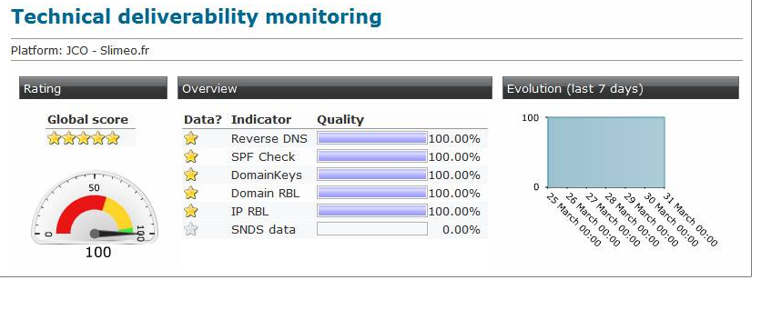

# Leverbaarheid controleren{#monitoring-deliverability}

Hieronder vindt u meer informatie over de verschillende bewakingstools die door Adobe Campaign worden geboden en enkele aanvullende richtlijnen voor het bewaken van de leverbaarheid.

## Monitoringinstrumenten {#monitoring-tools}

Gebruik de functies van Adobe Campaign om de prestaties van uw platform te controleren.

Het leveringspakket biedt toegang tot:

* Technisch traceringsrapport voor de prestaties van de dagelijks te leveren prestaties (technische controle). Met dit rapport, dat op aanvraag beschikbaar is, kunt u dagelijks een rapport ontvangen via e-mail op een opgegeven adres. Neem voor meer informatie hierover contact op met het team voor klantenservice van Adobe.
* Het [Inbox-renderrapport](../../delivery/using/inbox-rendering.md) waarmee u uw berichten kunt bekijken bij belangrijke e-mailclients om de inhoud en reputatie te scannen.
* Overzicht van berichtkwaliteit (inbox, spam).

U kunt ook de volgende gereedschappen gebruiken:

* Het **[!UICONTROL Delivery throughput]** rapport geeft u een overzicht van de productie van het volledige platform voor een bepaalde periode. Zie [deze sectie](../../reporting/using/global-reports.md#delivery-throughput)voor meer informatie.
* Het **[!UICONTROL Technical deliverability monitoring]** rapport bevat een aantal kwaliteitsindicatoren voor de prestaties van uw platform. Zie [deze sectie](#technical-deliverability-monitoring)voor meer informatie.
* Het [leveringsdashboard](../../delivery/using/monitoring-a-delivery.md#delivery-dashboard) geeft u toegang tot het overzicht [van de](../../delivery/using/monitoring-a-delivery.md#delivery-summary)Levering, de [leveringslogboeken en geschiedenis](../../delivery/using/monitoring-a-delivery.md#delivery-logs-and-history) en de [het Volgen logboeken](../../delivery/using/monitoring-a-delivery.md#tracking-logs). Zij tonen de details van het verzenden, die doel is uitgesloten en waarom, evenals de het volgen informatie zoals opent en klikt. <!--For more on this, see [Monitoring a delivery](../../delivery/using/monitoring-a-delivery.md).-->
* U kunt ook controleren hoeveel berichten u wilt verzenden, verwerken en verzenden. Zie [deze sectie voor meer informatie](../../delivery/using/monitoring-a-delivery.md#number-of-messages-sent)
   <!--[SpamAssassin](../../installation/using/configuring-spamassassin.md)?-->

## Monitoringrichtsnoeren {#monitoring-guidelines}

Hier volgen enkele aanvullende richtlijnen voor het controleren van de leverbaarheid:

* Controleer regelmatig de [leveringsproductie](../../reporting/using/global-reports.md#delivery-throughput) voor het gehele platform om te verifiëren of het met de originele opstelling verenigbaar is.
* Controleer of [opnieuw proberen](../../delivery/using/understanding-delivery-failures.md#retries-after-a-delivery-temporary-failure) correct is ingesteld (30 minuten voor herprobeert en meer dan 20 pogingen) in leveringssjablonen.
* Verifieer regelmatig dat de [stuiterende](../../delivery/using/understanding-delivery-failures.md#bounce-mail-management) brievenbus toegankelijk is en dat de rekening niet op het punt staat te verlopen.
* Controleer elke leveringsproductie om ervoor te zorgen dat het met de geldigheid van de leveringsinhoud (b.v. &#39;Flash-verkoop&#39; moet in minuten worden geleverd, niet in dagen).
* Wanneer het gebruiken van [golven](../../delivery/using/steps-sending-the-delivery.md#sending-using-multiple-waves), verifieer dat elke golf genoeg tijd heeft om te beëindigen alvorens volgende wordt teweeggebracht.
* Controleer of het aantal fouten en nieuwe [quarantines](../../delivery/using/understanding-quarantine-management.md) consistent zijn met andere leveringen.
* Raadpleeg zorgvuldig de [leveringslogboeken](../../delivery/using/monitoring-a-delivery.md#delivery-logs-and-history) om het soort fouten te controleren die worden benadrukt (grijze of zwarte lijst, DNS kwesties, anti-spamregels, enz.).

## Spam {#signal-spam}

Spam van het signaal is de Franse dienst die anonymized terugkoppel meldt voor Franse ISPs (Orange, SFR).

* Deze dienst staat u toe om de reputatie van Franse ISPs te volgen en de activiteitenevolutie van klanten te volgen.

* Spam van het signaal verstrekt ook directe klachten dat het eind - gebruikers door een specifieke interface registreren. Die klachten worden dan in quarantaine geplaatst van het e-mailadresgegevensbestand.

## 250ok {#deliverability-250ok}

[250ok](https://250ok.com/) is een complementaire monitoringsoplossing voor de interne hulpprogramma&#39;s van Adobe voor het leveren van items. Deze oplossing biedt IP-, domein- en reputatie-indicatoren.

De verstrekte informatie is real-time, wat een pro-actieve bijstand mogelijk maakt.

## Technisch rapport over de aflevering {#technical-deliverability-monitoring}

Het technische rapport voor de bewaking van de leverantie wordt dagelijks bijgewerkt en is beschikbaar door naar **[!UICONTROL Monitoring]** > **[!UICONTROL Overview]** te navigeren en op de **[!UICONTROL Technical monitoring]** koppeling op het **[!UICONTROL Home]** tabblad Adobe Campagne te klikken. Het bevat een aantal kwaliteitsindicatoren voor de prestaties van uw platform.

Deze indicatoren worden dagelijks om 9.00 uur bijgewerkt.

>[!NOTE]
>
>Bovendien kunt u een dagelijks rapport per e-mail op een bepaald adres ontvangen. Laat ons het gewenste e-mailadres weten via e-mail of via het Adobe Campagne Extranet.

In het verslag worden de volgende indicatoren gebruikt:

* **[!UICONTROL Reverse DNS]** : De Campagne van Adobe controleert of omgekeerde DNS voor een IP adres wordt gegeven en dat dit correct naar IP wijst.

* **[!UICONTROL SPF]** (Beleidskader voor verzender): Een authentificatiemechanisme dat ISPs en brievenbusleveranciers toelaat om te controleren of de e-mailafzender op het verzendende domein wordt gemachtigd.

* **[!UICONTROL DomainKeys]** : Een service die door Yahoo is ontwikkeld en waarmee de identiteit van een e-mailafzender wordt gecertificeerd.

* **[!UICONTROL IP and RBL domain]** (Lijst voor realtime zwarte gaten): Een lijst van IP adressen en domeinen die door blocklist organisaties voor slechte verzendende reputatie zijn gemarkeerd. Deze lijsten worden bijgehouden door speciale organisaties zoals Spamhaus, Spamcop, SURBL/URIBL, enz. De Campagne van Adobe verwerkt momenteel controles tegen RBLs die een significant leverbaarheidseffect hebben. Deze RBLs wijzen op het verzenden van reputatie, en kan door ISPs worden van verwijzingen voorzien alvorens om uw e-mails te aanvaarden.

* **[!UICONTROL SNDS]** (Smart Network Data Services): Een [Windows Live Hotmail-service](https://sendersupport.olc.protection.outlook.com/snds/FAQ.aspx)tegen spam. Hotmail is enige ISP die dit type van informatie verstrekt. Benchmarkscores zijn een groen filterresultaat, een klachtenpercentage van minder dan 0,1% en geen spamvallen.

<!--### Delivery Reports - Broadcast Statistics {#broadcast-statistics}

Each delivery will generate a broadcast statistics report when you open a delivery in the “Deliveries List”, which includes some reputation metrics that may impact your deliverability.-->
