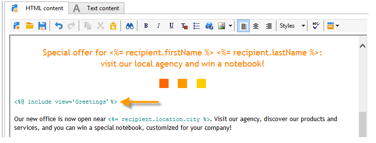
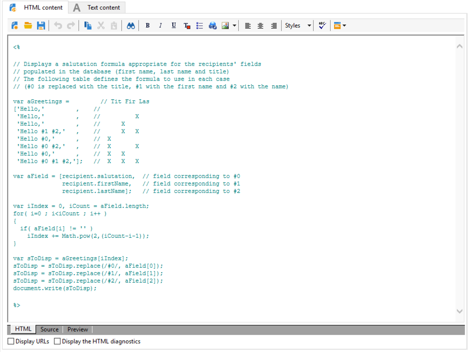
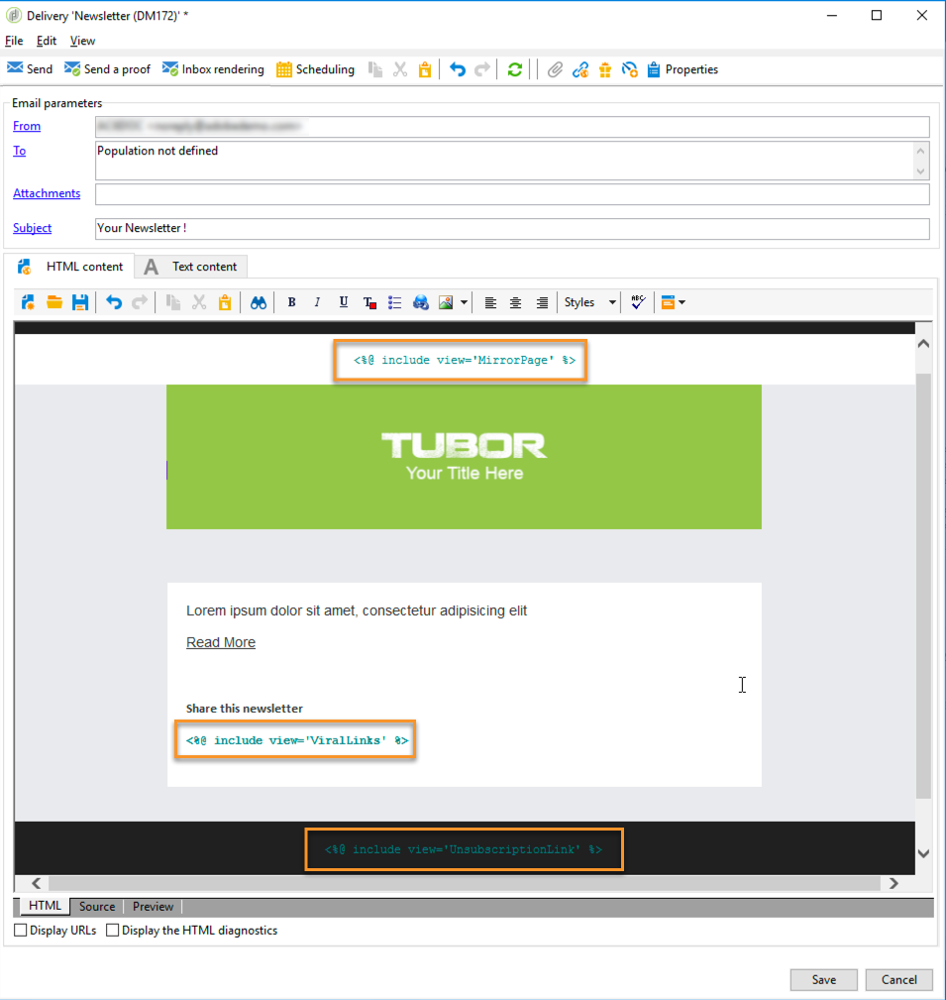

# Aanpassingsblokken{#personalization-blocks}

De blokken van de verpersoonlijking zijn dynamisch, gepersonaliseerd en bevatten een specifiek teruggeven dat u in uw leveringen kunt opnemen. U kunt bijvoorbeeld een logo, een begroetingsbericht of een koppeling naar een spiegelpagina toevoegen. Zie [Aanmaakblokken](#inserting-personalization-blocks)invoegen.

>[!NOTE]
>
>De blokken van de verpersoonlijking zijn ook beschikbaar bij **[!UICONTROL Digital Content Editor (DCE)]** . Raadpleeg [deze pagina](../../web/using/editing-content.md#inserting-a-personalization-block)voor meer informatie.

U kunt aanpassingsblokken openen via het **[!UICONTROL Resources > Campaign Management > Personalization blocks]** knooppunt van de Adobe Campaign-verkenner. Verscheidene blokken zijn beschikbaar door gebrek (zie uit- [van-de-doos verpersoonlijkingsblokken](#out-of-the-box-personalization-blocks)).

U hebt de mogelijkheid om nieuwe blokken te definiëren waarmee u uw leveringen kunt optimaliseren. Voor meer op dit, verwijs naar het [bepalen van de blokken](#defining-custom-personalization-blocks)van de douaneverpersoonlijking.

## Aanmaakblokken invoegen {#inserting-personalization-blocks}

Volg onderstaande stappen om een verpersoonlijkingsblok in te voegen in een bericht:

1. Klik in de inhoudseditor van de wizard voor levering op het pictogram van het gepersonaliseerde veld en selecteer het **[!UICONTROL Include]** menu.
1. Selecteer een verpersoonlijkingsblok van de lijst (de lijst toont de 10 laatst gebruikte blokken), of klik het **[!UICONTROL Other...]** menu om tot de volledige lijst toegang te hebben.

   

1. Het **[!UICONTROL Other...]** menu geeft toegang tot alle uit-van-de-doos en douane verpersoonlijkingsblokken (zie [uit-van-de-doos verpersoonlijkingsblokken](#out-of-the-box-personalization-blocks) en het [bepalen van de blokken](#defining-custom-personalization-blocks)van de douaneverpersoonlijking).

   

1. Het verpersoonlijkingsblok wordt dan opgenomen als manuscript. Het wordt automatisch aangepast aan het ontvankelijke profiel wanneer de verpersoonlijking wordt geproduceerd.

   

1. Klik op het **[!UICONTROL Preview]** tabblad en selecteer een ontvanger om de personalisatie weer te geven.

   

U kunt de broncode van een verpersoonlijkingsblok in de leveringsinhoud omvatten. Selecteer deze optie **[!UICONTROL Include the HTML source code of the block]** wanneer u deze wilt selecteren.


De HTML-broncode wordt ingevoegd in de leveringsinhoud. Het **[!UICONTROL Greetings]** aanpassingsblok wordt bijvoorbeeld als volgt weergegeven:



## Voorbeeld van aanpassingsblokken {#personalization-blocks-example}

In dit voorbeeld maken we een e-mail waarin we personalisatieblokken gebruiken om de ontvanger in staat te stellen de spiegelpagina te bekijken, de nieuwsbrief te delen op sociale netwerken en ons af te melden voor toekomstige leveringen.

Om dit te doen, moeten wij de volgende verpersoonlijkingsblokken opnemen:

* **[!UICONTROL Link to mirror page]** .
* **[!UICONTROL Social network sharing links]** .
* **[!UICONTROL Unsubscription link]** .

>[!NOTE]
>
>Raadpleeg [De spiegelpagina](../../delivery/using/sending-messages.md#generating-the-mirror-page)genereren voor meer informatie over het genereren van spiegelpagina&#39;s.

1. Maak een nieuwe levering of open een bestaande e-maillevering.
1. Klik in de wizard voor aflevering **[!UICONTROL Subject]** om het onderwerp van het bericht te bewerken en voer een onderwerp in.
1. Neem de verpersoonlijkingsblokken in het berichtlichaam op. Klik hiertoe in de berichtinhoud, klik op het pictogram van het gepersonaliseerde veld en selecteer het **[!UICONTROL Include]** menu.
1. Selecteer het eerste blok dat u wilt invoegen. Vernieuw de procedure om de twee andere blokken op te nemen.

   

1. Klik op het **[!UICONTROL Preview]** tabblad om het resultaat van de aanpassing weer te geven. U moet een ontvanger selecteren om het bericht van die ontvanger te tonen.

   

1. Controleer of de inhoud van het blok correct wordt weergegeven.

## Buiten-de-doos verpersoonlijkingsblokken {#out-of-the-box-personalization-blocks}

Een lijst van verpersoonlijkingsblokken is beschikbaar door gebrek om u te helpen de inhoud van uw bericht personaliseren.

>[!NOTE]
>
>De lijst van verpersoonlijkingsblokken hangt van de modules en de opties af die op uw instantie zijn geïnstalleerd.


* **[!UICONTROL Greetings]** : voegt begroetingen met de naam van de ontvanger in. Voorbeeld: &quot;Hallo JanDoe,&quot;.
* **[!UICONTROL Insert logo]** : neemt een uit-van-de-doos embleem op dat wanneer het vormen van de instantie is bepaald.
* **[!UICONTROL Powered by Adobe Campaign]** : voegt het logo &quot;Powered by Adobe Campaign&quot; in.
* **[!UICONTROL Mirror page URL]** : voegt de URL van de spiegelpagina in, waardoor de leveringsontwerpers de koppeling kunnen controleren.

   >[!NOTE]
   >
   >Raadpleeg [De spiegelpagina](../../delivery/using/sending-messages.md#generating-the-mirror-page)genereren voor meer informatie over het genereren van spiegelpagina&#39;s.

* **[!UICONTROL Link to mirror page]** : voegt een koppeling naar de spiegelpagina in: &quot;Klik hier als je dit bericht niet juist kunt weergeven.&quot;
* **[!UICONTROL Unsubscription link]** : voegt een koppeling in waarmee u zich kunt afmelden bij alle leveringen (zwarte lijst).
* **[!UICONTROL Formatting function for proper nouns]** : Hiermee wordt de functie **[!UICONTROL toSmartCase]** JavaScript gegenereerd. De eerste letter van elk woord wordt in hoofdletters gewijzigd. Dit blok moet in de broncode van de levering, in **`<script>...</script>`** markeringen worden opgenomen.

   In het onderstaande voorbeeld wordt de functie gebruikt om het element &quot;Mijn koptekst&quot; te vervangen door &quot;Mijn nieuwe koptekst&quot; door hoofdletters bij elk woord:

   ```
   <h1 id="sample">My header</h1>
   <script><%@ include view='toSmartCase'%>;
   document.getElementById("sample").innerHTML = toSmartCase("My new header");
   </script>
   ```

   

* **[!UICONTROL Registration page URL]** : voegt een abonnement-URL in (zie [Informatie over services en abonnementen](../../delivery/using/about-services-and-subscriptions.md)).
* **[!UICONTROL Registration link]** : voegt een abonnementkoppeling in. die is gedefinieerd tijdens het configureren van de instantie.
* **[!UICONTROL Registration link (with referrer)]** : voegt een abonnementkoppeling in, waarmee de bezoeker en de levering kunnen worden geïdentificeerd. De koppeling is gedefinieerd tijdens het configureren van de instantie.

   >[!NOTE]
   >
   >Dit blok kan alleen worden gebruikt bij leveringen voor bezoekers.

* **[!UICONTROL Registration confirmation]** : voegt een koppeling in waarmee u het abonnement kunt bevestigen.
* **[!UICONTROL Social network sharing links]** : voegt knoppen in waarmee de ontvanger een koppeling naar de inhoud van de spiegel kan delen met de e-mailclient, Facebook, Twitter, Google + en LinkedIn (zie [Viral marketing: door naar een vriend](../../delivery/using/viral-and-social-marketing.md#viral-marketing--forward-to-a-friend)).
* **[!UICONTROL Style of content emails]** en **[!UICONTROL Notification style]** : genereren code waarmee een e-mailbericht wordt opgemaakt met vooraf gedefinieerde HTML-stijlen. Deze blokken moeten in de broncode van de levering, in de **[!UICONTROL ...]** sectie, in **`<style>...</style>`** markeringen worden opgenomen.
* **[!UICONTROL Offer acceptance URL in unitary mode]** : voegt een URL in waarmee een interactieaanbieding kan worden ingesteld op **[!UICONTROL Accepted]** (zie [deze sectie](../../interaction/using/offer-analysis-report.md)).

## Aangepaste aanpassingsblokken definiëren {#defining-custom-personalization-blocks}

U kunt nieuwe verpersoonlijkingsgebieden bepalen die van het gepersonaliseerde gebiedspictogram via het **[!UICONTROL Include...]** menu moeten worden opgenomen. Deze gebieden worden bepaald in verpersoonlijkingsblokken.

Ga naar de verkenner en voer de volgende stappen uit om een verpersoonlijkingsblok te maken:

1. Klik op het **[!UICONTROL Resources > Campaign Management > Personalization blocks]** knooppunt.
1. Klik met de rechtermuisknop op de lijst met blokken en selecteer **[!UICONTROL New]** .
1. Vul de instellingen van het verpersoonlijkingsblok in:

   

   * Voer het label van het blok in. Dit label wordt weergegeven in het invoegvenster van het aanpassingsveld.
   * Selecteer deze optie **[!UICONTROL Visible in the customization menus]** om dit blok toegankelijk te maken via het invoegpictogram van het aanpassingsveld.
   * Selecteer indien nodig twee aparte blokken **[!UICONTROL The content of the personalization block depends upon the format]** voor e-mailberichten in HTML-indeling en blokken in tekstindeling.

      Er worden dan twee tabbladen weergegeven in de onderste sectie van deze editor (HTML-inhoud en tekstinhoud) om de bijbehorende inhoud te definiëren.

      

   * Voer de inhoud in (in HTML, tekst, JavaScript, enz.) van het (de) personalisatieblok(ken) en klik **[!UICONTROL Save]** .
