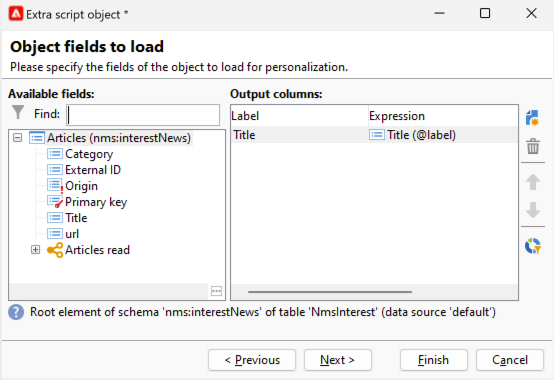

# Personalisatievelden{#personalization-fields}

Personalisatievelden worden gebruikt voor personalisatie op het eerste niveau van de content van geleverde berichten. De velden die u in hoofdcontent invoegt, geven de positie aan waar de gegevens uit de geselecteerde gegevensbron moeten worden ingevoegd.

Bijvoorbeeld, vertelt het verpersoonlijkingsgebied met **&lt;%= receiver.LastName %>** syntaxis Adobe Campaign om de naam van de ontvanger in het gegevensbestand (ontvankelijke lijst) op te nemen.

 [Ontdek deze functie in video](#personalization-fields-video)

>[!CAUTION]
>
>Inhoud van aanpassingsvelden mag niet langer zijn dan 1024 tekens.

## Gegevensbronnen {#data-sources}

De gebieden van de verpersoonlijking kunnen uit twee types van gegevensbron, volgens de geselecteerde leveringswijze komen:

* De Adobe Campaign-database is de gegevensbron. Dit is het meest gangbare geval, bijvoorbeeld met &#39;personalisatievelden voor ontvangers&#39;. Dit zijn alle velden die zijn gedefinieerd in de tabel met ontvangers, of het nu standaardvelden zijn (gewoonlijk: achternaam, voornaam, adres, plaats, geboortedatum, enz.) of door de gebruiker gedefinieerde velden.
* Een extern bestand is de gegevensbron. Dit zijn alle velden die zijn gedefinieerd in de kolommen van het bestand dat wordt weergegeven als invoer tijdens een levering met behulp van de gegevens in een extern bestand.

>[!NOTE]
>
>Een Adobe Campaign verpersoonlijkingsmarkering heeft altijd de volgende vorm **&lt;%=table.field%>**.

## Een aanpassingsveld invoegen {#inserting-a-personalization-field}

Als u verpersoonlijkingsvelden wilt invoegen, klikt u op het vervolgkeuzepictogram dat toegankelijk is vanuit een bewerkveld voor koptekst, onderwerp of berichttekst.

Na de selectie van een gegevensbron (ontvangende velden of bestandsveld) neemt deze invoeging de vorm aan van een opdracht die wordt geïnterpreteerd door Adobe Campaign en wordt vervangen door de waarde van het veld voor een bepaalde ontvanger. De fysieke vervanging kan vervolgens worden weergegeven op het tabblad **[!UICONTROL Preview]** .

## Voorbeeld van aanpassingsvelden {#personalization-fields-example}

We maken een e-mail waarin we eerst de naam van de ontvanger invoegen en vervolgens de aanmaakdatum van het profiel in de hoofdtekst van het bericht toevoegen. Dit doet u als volgt:

1. Maak een nieuwe levering of open een bestaande e-maillevering.
1. Klik in de bezorgingsassistent op **[!UICONTROL Subject]** om het onderwerp van het bericht te bewerken en een onderwerp in te voeren.
1. Voer &quot; **[!UICONTROL Special offer for]** &quot; in en gebruik de knop op de werkbalk om een aanpassingsveld in te voegen. Selecteer **[!UICONTROL Recipients>Title]**.

   

1. Herhaal de bewerking om de naam van de ontvanger in te voegen. Voeg spaties in tussen alle verpersoonlijkingsvelden.
1. Klik op **[!UICONTROL OK]** om te valideren.
1. Voeg de personalisatie in de berichttekst in. Klik hiertoe in de berichtinhoud en klik op de knop voor het invoegen van het veld.
1. Selecteer **[!UICONTROL Recipient>Other...]**.

   

1. Selecteer het veld met de informatie die u wilt weergeven en klik op **[!UICONTROL OK]** .

   

1. Klik op het tabblad **[!UICONTROL Preview]** om het resultaat van de aanpassing weer te geven. U moet een ontvanger selecteren om het bericht van die ontvanger te tonen.

   

   >[!NOTE]
   >
   >Wanneer een levering deel uitmaakt van een workflow, kunt u de gegevens uit de tabel met tijdelijke werkstromen gebruiken. Deze gegevens worden gegroepeerd in het menu **[!UICONTROL Target extension]** . Raadpleeg [deze sectie](../../workflow/using/data-life-cycle.md#target-data) voor meer informatie.

## Aanpassing optimaliseren {#optimizing-personalization}

U kunt personalisatie optimaliseren met behulp van een speciale optie: **[!UICONTROL Prepare the personalization data with a workflow]** , beschikbaar op het tabblad **[!UICONTROL Analysis]** van de leveringseigenschappen. Voor meer bij het analyseren van de levering, zie [ deze sectie ](steps-validating-the-delivery.md#analyzing-the-delivery).

Tijdens de leveringsanalyse, leidt deze optie automatisch tot en voert een werkschema uit dat alle gegevens met betrekking tot het doel in een tijdelijke lijst, met inbegrip van gegevens van lijsten verbonden in FDA opslaat.

Als u deze optie inschakelt, kunnen de prestaties van de leveringsanalyse aanzienlijk worden verbeterd wanneer een groot aantal gegevens wordt verwerkt, vooral als de personalisatiegegevens afkomstig zijn van een externe tabel via FDA. Voor meer op dit, zie [ Toegang hebbend tot een extern gegevensbestand (FDA) ](../../installation/using/about-fda.md).

Bijvoorbeeld, als u prestatieskwesties wanneer het leveren aan een hoog aantal ontvangers terwijl het gebruiken van veel verpersoonlijkingsgebieden en/of verpersoonlijkingsblokken in de inhoud van uw berichten ervaart, kan deze optie de behandeling van verpersoonlijking en daarom het leveren van uw berichten versnellen.

Volg onderstaande stappen om deze optie te gebruiken:

1. Maak een campagne. Raadpleeg [deze sectie](../../campaign/using/setting-up-marketing-campaigns.md#creating-a-campaign) voor meer informatie.
1. In het **[!UICONTROL Targeting and workflows]** lusje van uw campagne, voeg de activiteit van de a **Vraag** aan uw werkschema toe. Voor meer bij het gebruiken van deze activiteit, verwijs naar [ deze sectie ](../../workflow/using/query.md).
1. Voeg een **[!UICONTROL Email delivery]** activiteit aan het werkschema toe en open het. Voor meer bij het gebruiken van deze activiteit, verwijs naar [ deze sectie ](../../workflow/using/delivery.md).
1. Ga naar de tab **[!UICONTROL Analysis]** van de **[!UICONTROL Delivery properties]** en selecteer de optie **[!UICONTROL Prepare the personalization data with a workflow]** .

   

1. Configureer de levering en start de workflow om de analyse te starten.

Zodra de analyse wordt gedaan, worden de verpersoonlijkingsgegevens opgeslagen in een tijdelijke lijst door een tijdelijke technische werkschema dat op de vlucht tijdens de analyse wordt gecreeerd.

Deze workflow is niet zichtbaar in de Adobe Campaign-interface. Het is alleen bedoeld als een technisch middel om personalisatiegegevens snel op te slaan en af te handelen.

Wanneer de analyse is voltooid, gaat u naar de workflow **[!UICONTROL Properties]** en selecteert u het tabblad **[!UICONTROL Variables]** . Daar kunt u de naam van de tijdelijke lijst zien die u kunt gebruiken om een SQL vraag te maken om identiteitskaarts te tonen die het bevat.

## Timing uit verpersoonlijkingsfase {#timing-out-personalization}

Om leveringsbescherming te verbeteren, kunt u een onderbreking voor de verpersoonlijkingsfase plaatsen.

Selecteer op het tabblad **[!UICONTROL Delivery]** van **[!UICONTROL Delivery properties]** een maximumwaarde in seconden voor de optie **[!UICONTROL Maximum personalization run time]** .

Als tijdens de voorvertoning of het verzenden de maximale tijd die u in dit veld instelt, wordt overschreden, wordt het proces afgebroken met een foutbericht en mislukt de levering.

De standaardwaarde is 5 seconden.

Als u deze optie instelt op 0, is er geen tijdslimiet voor de verpersoonlijkingsfase.

## Het tabblad Personalization {#personalization-tab}

In de leveringseigenschappen hebt u een Personalization-tabblad.

U kunt daar de mogelijkheid vinden om gegevens aan de profielvraag van de het richten afmeting toe te voegen door op **te klikken &quot;geef het ontvankelijke profiel ladende vraag&quot;** uit. U kunt de gegevens die u rechtstreeks in een expressie hebt geëxtraheerd, gebruiken om te extraheren wat u echt nodig hebt. Deze gegevens worden aan de context toegevoegd.

{zoomable="yes"}

Als de gegevens u wilt toevoegen niet in de het richten afmeting is, kunt u op **klikken &quot;voeg voorwerpen in de uitvoeringscontext van de manuscripten toe&quot;**.

{zoomable="yes"}

U kunt daar het objecten schema selecteren dat u nodig hebt, dan kunt u die gegevens binnen uw code gebruiken JavaScript, die tijdens de leveringsvoorbereiding zal worden uitgevoerd.

{zoomable="yes"}

Door het objectschema toe te voegen, kunt u de velden selecteren die u aan de context wilt toevoegen:

{zoomable="yes"}

## Video over zelfstudie {#personalization-fields-video}

Leer hoe u een personalisatieveld toevoegt aan de onderwerpregel en de content van een e-maillevering.

>[!VIDEO](https://video.tv.adobe.com/v/24925?quality=12)

De extra Campaign Classic hoe te video&#39;s zijn beschikbaar [ hier ](https://experienceleague.adobe.com/docs/campaign-classic-learn/tutorials/overview.html?lang=nl).
