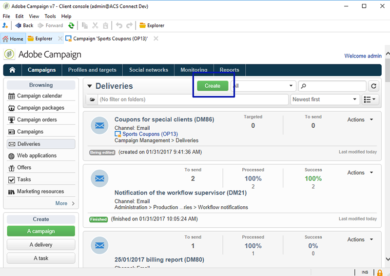

# Persoonlijke coupons{#personalized-coupons}

Door coupons toe te voegen aan uw leveringen kunnen uw ontvangers meer waarde krijgen voor producten en services. Met de module Campagne-coupon kunt u een set coupons maken die u naar verwachting aan toekomstige marketingaanbiedingen wilt toevoegen. Als u klaar bent om een levering te maken, wijst u de toepasselijke coupons toe. Aangezien coupons geldig zijn voor een bepaalde periode, wordt een toegewezen coupon op unieke wijze gekoppeld aan het bijbehorende leveringsbericht. Bovendien bevestigt Campaign dat er voldoende coupons zijn voor het aantal berichten voordat de levering wordt verzonden.

>[!NOTE]
>
>Couponbeheer is een pakket dat moet worden geïnstalleerd. Als u wilt bevestigen dat u Coupon-beheer hebt, controleert u **[!UICONTROL Administration > Configuration > Package management > Installed packages.]**
>
>Coupongegevens kunnen worden geïmporteerd en geëxporteerd in CSV- en XML-indeling. Raadpleeg [deze sectie](../../platform/using/generic-imports-and-exports.md)voor meer informatie over importeren en exporteren.

## Een coupon maken {#creating-a-coupon}

In de module coupon kunt u twee opties instellen voor het maken van coupons:

* **Anoniem**: Een algemene coupon voor geselecteerde ontvangers of lijsten met ontvangers.
* **Individueel**: Een gepersonaliseerde coupon voor geselecteerde ontvangers.

Voordat u de onderstaande stappen uitvoert, moet u weten welk type coupon u wilt maken.

1. Ga in de Campagneboom naar **[!UICONTROL Resources > Campaign management > Coupons]**.

   

1. Klik op de **[!UICONTROL New]** knop.
1. Voer in het **[!UICONTROL Label]** veld de naam van de coupon in. Er wordt automatisch een unieke code ingevoerd **[!UICONTROL Coupon code]**. U kunt de code behouden of een nieuwe invoeren.

   

1. Kies **[!UICONTROL Start date]** **[!UICONTROL End date]** en stel de periode in waarin de coupon geldig is.
1. Kies bij **[!UICONTROL Coupon type]** Anonieme of Individuele.

   **[!UICONTROL Anonymous coupons]** : Een anonieme coupon is identiek voor alle ontvangers. Controleer of Anoniem is geselecteerd in het menu **Coupon type** en klik op **Opslaan** om de coupon te genereren.

   **[!UICONTROL Individual coupons]** : Een afzonderlijke coupon kan verder worden gepersonaliseerd met extra couponcodes. Er wordt bijvoorbeeld een afzonderlijke coupon gemaakt voor verkoop in een winkel voor sportapparatuur. De lijst van ontvangers is echter lang en zij delen niet hetzelfde enthousiasme voor één enkele sport. U kunt codenamen toevoegen voor de afzonderlijke coupon op basis van een sport (bijvoorbeeld voetbal, voetbal, honkbal, enz.) en verstuur elke code naar de toepasselijke ontvangers.

   1. Als u Individueel kiest, wordt linksonder een nieuw tabblad, Coupons, weergegeven. Ga naar het **[!UICONTROL Coupons]** tabblad en klik **[!UICONTROL Add]**.
   1. Voer een unieke code voor de afzonderlijke coupon in als u hierom wordt gevraagd door het pop-upvenster.
   1. Klik **[!UICONTROL Save]** om de coupon te genereren.
   Zie Afzonderlijke coupons [configureren voor meer informatie over het tabblad Coupons](#configuring-individual-coupons).

   >[!NOTE]
   >
   >Individuele coupons kunnen bulksgewijs worden ingevoerd. Raadpleeg [deze sectie](../../platform/using/generic-imports-and-exports.md)voor meer informatie over importeren en exporteren.

### Afzonderlijke coupons configureren {#configuring-individual-coupons}

Het tabblad Coupons is alleen beschikbaar voor afzonderlijke coupons. Nadat een coupon is gekoppeld aan een levering, geeft het tabblad Coupons de volgende details:

* **[!UICONTROL Status]** : Beschikbaarheid coupon.
* **[!UICONTROL Redeemed on]** : De datum waarop de coupon wordt afgelost.
* **[!UICONTROL Channel]** : Het kanaal dat wordt gebruikt om de coupon te verzenden.
* **[!UICONTROL Address]** : De e-mailadressen van de ontvangers.

Waarden voor **[!UICONTROL status]**, **[!UICONTROL channel]** en **[!UICONTROL address]** worden automatisch voltooid. De waarden voor **[!UICONTROL redeemed on]** worden echter niet hersteld door Campagne. U kunt deze gegevens invullen door een bestand te importeren dat de gegevens voor het inwisselen van coupons bevat.

## Een coupon invoegen in een e-maillevering {#inserting-a-coupon-into-an-email-delivery}

In het onderstaande voorbeeld wordt de levering gemaakt op de startpagina. Raadpleeg [deze sectie](../../delivery/using/about-email-channel.md)voor gedetailleerde instructies over het maken van een levering. U kunt ook een coupon toevoegen aan een levering in een workflow.

1. Ga naar **[!UICONTROL Campaigns]** en kies **[!UICONTROL Deliveries]**.
1. Klik **[!UICONTROL Create]**.

   

1. Voer een naam in **[!UICONTROL Label]** en klik op **[!UICONTROL Continue]**.
1. Klik **[!UICONTROL To]** om ontvangers toe te voegen.
1. Klik **[!UICONTROL Add]** om ontvangers voor de levering te kiezen. Nadat u de ontvangers hebt geselecteerd, klikt u **[!UICONTROL Ok]** om terug te keren naar de levering.

   

1. Voer een onderwerp in en voeg inhoud toe aan het bericht.

   

1. Klik op de werkbalk **[!UICONTROL Properties]** en kies het **[!UICONTROL Advanced]** tabblad.
1. Klik op het mappictogram voor **[!UICONTROL Coupon management]**.

   

1. Kies de coupon en klik op **[!UICONTROL Ok]**. Klik **[!UICONTROL Ok]** opnieuw.

   

1. Klik op het bericht om aan te geven waar u de coupon wilt plaatsen.

   

1. Klik op het verpersoonlijkingspictogram om een van de volgende opties te kiezen op basis van het type coupon:

   * Anonieme coupon: **[!UICONTROL Coupon > Coupon code]**

      

   * Afzonderlijke coupon: **[!UICONTROL Coupon value > Coupon code]**

      

      De coupon wordt in het bericht ingevoegd als code in plaats van de naam die u hebt toegewezen. De code wordt gebruikt binnen het standaardgegevensmodel van de Campagne.
   

1. Voer een test uit om de naam te bevestigen die u aan de coupon hebt toegewezen. Ga naar het **[!UICONTROL Preview]** tabblad en klik **[!UICONTROL Test personalization]**. Kies een ontvanger voor de test.

   

   Na de test moet de coupon worden weergegeven als de toegewezen naam in plaats van als de code.

   

1. Klik in de werkbalk op **[!UICONTROL Send]** (linksboven) en kies hoe u de levering wilt verzenden.

   

1. Klik **[!UICONTROL Analyze]**. Als het analyselogboek bevestigt dat er genoeg coupons voor alle ontvangers zijn, klikt u **[!UICONTROL Confirm delivery]** om het te verzenden.

   

>[!NOTE]
>
>Zie Onvoldoende coupons [beheren voor instructies over hoe u ontoereikende coupons voor een levering kunt beheren](#managing-insufficient-coupons)

Bevestig dat de levering succesvol was:

1. Ga naar **[!UICONTROL Explorer > Resources > Campaign management > Coupons]**.
1. Klik op het **[!UICONTROL Deliveries]** tabblad.

   

   De status kan worden gelezen als **[!UICONTROL Finished]** voor een geslaagde levering.

>[!NOTE]
>
>Standaard gebruikt de module couponbeheer een tabel **nms:ontvanger** . Zie [Schema&#39;s](../../configuration/using/data-schemas.md)bewerken voor instructies over het gebruik van andere tabellen.

## Onvoldoende coupons beheren {#managing-insufficient-coupons}

De leveringsanalyse stopt als er minder coupons zijn dan berichten. In dat geval kunt u meer coupons importeren of het aantal berichten beperken. Volg de onderstaande instructies als u het aantal berichten wilt beperken.

1. Ga naar het venster E-maillevering.
1. Klik **[!UICONTROL To]**.
1. Ga in **[!UICONTROL Select target]** naar de **[!UICONTROL Exclusions]** tab.

   

1. Klik in de sectie met uitsluitingsinstellingen op **[!UICONTROL Edit]**.
1. Voer het aantal berichten in dat u wilt verzenden **[!UICONTROL Limit delivery to...messages]** en klik op **[!UICONTROL Ok]**. U kunt de levering verzenden.

   

>[!NOTE]
>
>Als u een beperkt aantal coupons beheert, kunt u de levering splitsen op basis van uw criteria. Het is een goede optie als u coupons naar een bepaalde populatie wilt sturen zonder het doel te beperken.
