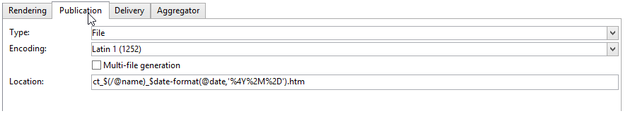

# Publicatiesjablonen{#publication-templates}

## Publicatiesjablonen {#about-publication-templates}

De publicatiesjabloon verwijst naar de middelen die in het publicatieproces worden gebruikt, namelijk:

* het gegevensschema,
* het invoerformulier,
* de transformatiesjablonen voor elk uitvoerdocument.

## Identificatie van een publicatiesjabloon {#identification-of-a-publication-template}

Een publicatiesjabloon wordt aangeduid met de naam en naamruimte ervan.

De identificatiecode van een stijlpagina is een tekenreeks die bestaat uit de naamruimte en de naam die door een dubbele punt wordt gescheiden, bijvoorbeeld: **focus:nieuwsbrief**.

>[!NOTE]
>
>In de praktijk wordt het aanbevolen dezelfde sleutel te gebruiken voor het schema, het formulier en de publicatiesjabloon.

## De sjabloon maken en configureren {#creating-and-configuring-the-template}

Publicatiesjablonen worden standaard opgeslagen in het dialoogvenster **[!UICONTROL Administration > Configuration > Publication templates]** knooppunt. Als u een nieuwe sjabloon wilt maken, klikt u op de **[!UICONTROL New]** boven de lijst met sjablonen.

Als u de publicatiesjabloon wilt configureren, vult u de naam van de sjabloon (d.w.z. de identificatiecode die bestaat uit de naam en de naamruimte), het label, het gegevensschema en het invoerformulier waaraan de sjabloon is gekoppeld.


>[!NOTE]
>
>Het label wordt weergegeven wanneer inhoud wordt gemaakt op basis van deze publicatiesjabloon.

De **Status controleren om het genereren van inhoud te valideren** Hiermee wordt een controle van de status &quot;Gevalideerd&quot; van de inhoudsinstanties afgedwongen om het genereren van bestanden toe te staan. Raadpleeg voor meer informatie hierover [Publicatie](#publication).

Voor elk uitvoerdocument moet een transformatiesjabloon worden toegevoegd. U kunt zo veel transformatiesjablonen maken als nodig is.

De **[!UICONTROL Name of template]** field is een gratis label dat het type rendering bij de uitvoer beschrijft. Voor elke transformatiesjabloon zijn de publicatie-instellingen beschikbaar op de tabbladen.

### Renderen {#rendering}

De **[!UICONTROL Rendering]** -tabblad kiest u:

* het type rendering dat wordt gebruikt voor projectie van het uitvoerdocument: XSL-stijlpagina of JavaScript-sjabloon;
* de indeling van het uitvoerdocument: HTML, Tekst, XML of RTF;
* de sjabloon die de constructiegegevens bevat, d.w.z. de te gebruiken stijlpagina of JavaScript-sjabloon.

### Publicatie {#publication}

Bij publicatie wordt het uitvoerdocument gegenereerd in de vorm van een bestand, als het geselecteerde type **[!UICONTROL File]**.



De volgende publicatieopties zijn beschikbaar:

* De tekenset van het uitvoerbestand kan worden geforceerd via de **[!UICONTROL Encoding]** veld. De tekenset Latin 1 (1252) wordt standaard gebruikt.
* De **[!UICONTROL Multi-file generation]** Hiermee activeert u een speciale documentpublicatiemodus. Deze optie bestaat uit het vullen van een verdelingstag aan het begin van elke pagina van het uitvoerdocument. Als u de inhoud genereert, wordt er een bestand gemaakt voor elke gevulde partitioneringstag. Deze modus wordt gebruikt om minisites te genereren op basis van een inhoudsblok. zie voor meer informatie : [Meerdere bestanden genereren](#multi-file-generation).
* De **[!UICONTROL Location]** bevat de naam van het uitvoerbestand. De naam kan uit variabelen worden samengesteld om een automatische filename te produceren.

  Een variabele wordt gevuld met de volgende indeling: **`$(<xpath>)`**, waarbij **`<xpath>`** Dit is het pad van een veld in het gegevensschema van de publicatiesjabloon.

  De naam van een bestand kan een datumveld zijn. Als u dit veld correct wilt opmaken, gebruikt u de opdracht **$date-format** gebruiken, met het pad van het veld en de uitvoerindeling als parameters.

  Standaard gebruikt de constructieindeling van de bestandsnaam de variabelen in de velden &quot;@name&quot; en &quot;@date&quot;:

  ```
  ct_$(@name)_$date-format(@date,'%4Y%2M%2D').htm
  ```

  De gegenereerde bestandsnaam ziet er als volgt uit: ct_news12_20110901.htm.

  >[!NOTE]
  >
  >Voor meer informatie over het genereren van inhoud raadpleegt u [Een inhoudsinstantie maken](using-a-content-template.md#creating-a-content-instance).

### Levering {#delivery}

Op dit tabblad kunt u een scenario selecteren om een levering rechtstreeks op de inhoud te starten. De inhoud van het e-mailbericht wordt automatisch ingevuld op basis van de uitvoerindeling (HTML of Tekst).


>[!NOTE]
>
>Voor een voorbeeld van het maken van leveringen op basis van inhoud raadpleegt u [Een inhoudsinstantie leveren](using-a-content-template.md#delivering-a-content-instance).

### aggregator {#aggregator}

Door de gegevens uit een script of querylijst te bundelen, kunt u het XML-document verrijken met de inhoudsgegevens. Het doel is bepaalde informatie waarnaar wordt verwezen door links aan te vullen of elementen uit de database toe te voegen.

### Meerdere bestanden genereren {#multi-file-generation}

Als u meerdere bestanden wilt genereren, selecteert u de **[!UICONTROL Multi-file generation]** in het publicatiemodel. Met deze optie kunt u scheidingsmarkeringen opgeven in de stijlpagina voor het begin van elke pagina van het uitvoerdocument. Het genereren van de inhoud levert een bestand op voor elke partitioneringstag die wordt aangetroffen.

De partitioneringstag die in de stijlpagina moet worden geïntegreerd, ziet er als volgt uit:

**`<xsl:comment> #nl:output_replace(<name_of_file>) </xsl:comment>`** waar **`<name_of_file>`** is de bestandsnaam van de pagina die moet worden gegenereerd.

**Voorbeeld:** Meerdere bestanden genereren met het schema &quot;cus:book&quot;.

Het beginsel is dat een hoofdpagina met een lijst van de hoofdstukken wordt gemaakt, met de mogelijkheid om de details van het hoofdstuk op een externe pagina weer te geven.


De bijbehorende stijlpagina (&quot;cus:book.xsl&quot;) ziet er als volgt uit:

```
<?xml version="1.0" encoding="ISO-8859-1" ?>
<xsl:stylesheet xmlns:xsl="http://www.w3.org/1999/XSL/Transform" version="1.0">
  <xsl:output encoding="ISO-8859-1" method="html"/>

  <!-- Style sheet entry point -->
  <xsl:template match="/book">
    <html>
      <body>
        <h1><xsl:value-of select="@name"/></h1>
        <lu>
          <xsl:for-each select="chapter">
            <li><a target="_blank" href="chapter{@id}.htm"><xsl:value-of select="@name"/></a></li>  
          </xsl:for-each>
       </lu>
      </body>
    </html>
   </xsl:template>
</xsl:stylesheet>
```

Een tweede stijlblad (&quot;cus:chapter.xsl&quot;) is vereist om de details van de hoofdstukken te produceren:

```
<?xml version="1.0" encoding="ISO-8859-1" ?>
<xsl:stylesheet xmlns:xsl="http://www.w3.org/1999/XSL/Transform" version="1.0">
  <xsl:output encoding="ISO-8859-1" method="html"/>

  <!-- Detail of a chapter -->
  <xsl:template match="chapter">
    <!-- Cut tag -->   
    <xsl:comment> #nl:output_replace($(path)/chapter<xsl:value-of select="@id"/>.htm)</xsl:comment>
    
    <html>
      <body>
        <h1><xsl:value-of select="@name"/></h1>
        <xsl:value-of select="page" disable-output-escaping="yes"/>
      </body>
    </html>
  </xsl:template>

  <!-- Style sheet entry point -->
  <xsl:template match="/book">
    <xsl:apply-templates/>
   </xsl:template>
</xsl:stylesheet>
```

De partitioneringstag wordt gevuld aan het begin van de pagina die moet worden opgenomen in het te genereren bestand.

```
<xsl:comment> #nl:output_replace($(path)/<xsl:value-of select="@id"/>.htm)</xsl:comment>
```

De bestandsnaam wordt samengesteld met de **$(pad)** variabele met het publicatiepad en **`<xsl:value-of select="@id" />`**, die overeenkomt met de id van het hoofdstuk in het invoerdocument.

In het publicatiemodel moeten de twee opmaakmodellen &quot;cus:book.xsl&quot; en &quot;cus:chapter.xsl&quot; worden ingevuld.

De **[!UICONTROL Multi-file generation]** Deze optie moet actief zijn in het transformatiemodel van het hoofdstuk:


De **[!UICONTROL Location]** wordt niet gebruikt bij het genereren van meerdere bestanden, maar u moet dit veld toch vullen om een fout bij het publiceren te voorkomen.
