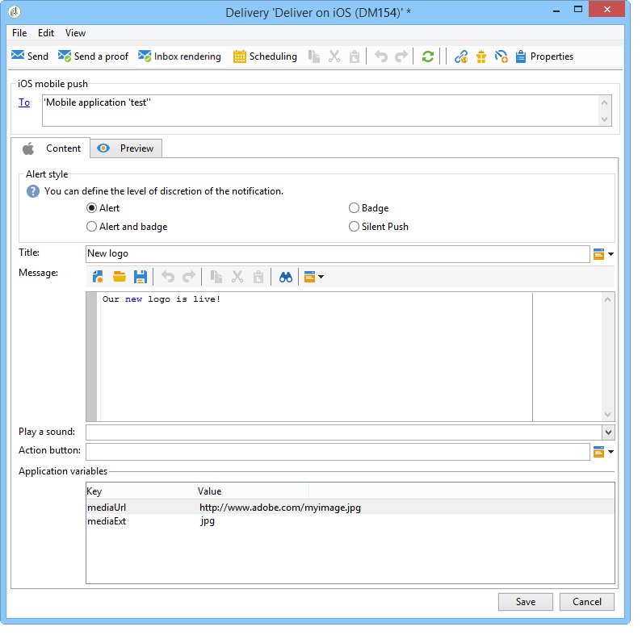

# Mobiel app-kanaal instellen{#setting-up-mobile-app-channel}

## Inleiding {#introduction}

>[!CAUTION]
>
>De implementatie van het mobiele toepassingskanaal moet worden uitgevoerd door deskundige gebruikers. Neem contact op met de manager of de Professional-servicepartner van Adobe-accounts als u hulp nodig hebt.

U kunt verschillende versies van uw mobiele toepassing maken (iOS, Android): Met de optie Mobile App Channel kunt u meldingen verzenden naar terminals waarop de toepassing is geïnstalleerd.

Als u de functies van het Adobe Campagne Mobile App Channel wilt gebruiken, moet u uw mobiele toepassing wijzigen of aanpassen om deze te integreren in het Adobe Campagne-platform.

Er zijn twee klassieke SDK&#39;s voor campagnes beschikbaar, één voor Android en één voor iOS, voor een eenvoudige integratie van uw mobiele toepassing met Adobe Campagne. Een grondige technische kennis van Java en doelstelling-C is vereist. Een gedetailleerde beschrijving van de campagne-SDK vindt u in de [integratie van de campagne-SDK in de mobiele toepassing](#integrating-campaign-sdk-into-the-mobile-application).

>[!NOTE]
>
>Bibliotheken die worden geleverd door Adobe Campaign, zijn ontworpen voor gebruik met Xcode (iOS) en Android Studio (Android).

## Aansluitingen {#connectors}

### iOS-aansluitingen {#ios-connectors}

Voor iOS zijn twee connectors beschikbaar:

* De binaire iOS-connector verzendt berichten op de verouderde binaire APNS-server.
* De iOS HTTP/2-connector verzendt berichten naar de HTTP/2 APNS.

Voer de volgende stappen uit om te kiezen welke aansluiting u wilt gebruiken:

1. Ga naar **[!UICONTROL Administration > Platform > External accounts]**.
1. Selecteer de iOS die externe account routeert.
1. Vul op het **[!UICONTROL Connector]** tabblad het **[!UICONTROL Access URL of the connector]** veld in:

   Voor binair iOS: https://localhost:8080/nms/jsp/ios.jsp

   Voor iOS HTTP2: http://localhost:8080/nms/jsp/iosHTTP2.jsp

   

### Android-aansluitingen {#android-connectors}

Voor Android zijn twee connectors beschikbaar:

* De V1 schakelaar die één verbinding per kind MTA toestaat.
* De V2-connector die gelijktijdige verbindingen met de FCM-server mogelijk maakt om de doorvoer te verbeteren.

Voer de volgende stappen uit om te kiezen welke aansluiting u wilt gebruiken:

1. Ga naar **[!UICONTROL Administration > Platform > External accounts]**.
1. Selecteer de **[!UICONTROL Android routing]** externe account.
1. Vul op het **[!UICONTROL Connector]** tabblad het **[!UICONTROL JavaScript used in the connector]** veld in:

   Voor Android V1: https://localhost:8080/nms/jsp/androidPushConnector.js

   Voor Android V2: https://localhost:8080/nms/jsp/androidPushConnectorV2.js

   

1. Voor Android V2 is er één extra parameter beschikbaar in het configuratiebestand van Adobe Server (serverConf.xml):

   * **maxGCMConnectPerChild**: Maximale limiet van parallelle HTTP-aanvragen voor de FCM die door elke onderliggende server worden geïnitieerd (standaard 8).

## Configuratiestappen {#configuration-steps}

### De toepassing maken {#creating-the-application}

Als u geen mobiele toepassing (app) hebt, moet de ontwikkelaar van de toepassing deze maken en de SDK integreren. Als de mobiele toepassing bestaat, moet de ontwikkelaar deze aanpassen door de Adobe Campagne SDK te integreren en de specifieke instellingen voor de service toe te voegen. Voor een beschrijving van de SDK raadpleegt u de [Integrating Campaign SDK in de mobiele toepassing](#integrating-campaign-sdk-into-the-mobile-application).

>[!CAUTION]
>
>De toepassing moet zijn geconfigureerd voor pushacties voordat deze kan worden geïntegreerd in de Adobe Campagne SDK.
>
>Indien dit niet het geval is, gelieve [deze pagina](https://developer.apple.com/library/archive/documentation/NetworkingInternet/Conceptual/RemoteNotificationsPG/)te raadplegen.

### Informatie verzamelen {#collecting-information-}

Als u de toepassing wilt configureren, moet u de technische specificaties verzamelen die de set parameters definiëren waarmee Adobe Campagne en de mobiele toepassing kunnen communiceren. Deze parameters zijn:

* **de integratiesleutel**: elke toepassing heeft een unieke sleutel. Met deze sleutel kunt u de Adobe Campaign-service en de mobiele toepassing koppelen. Zie [Algemene informatie](#general-information).
* **de variabelen**: definieert het gedrag van de toepassing wanneer u het bericht activeert. Zie [Algemene informatie](#general-information).
* **de abonnementsinstellingen**: Standaard herstelt Adobe Campaign het veld **@userKey** waarmee u mobiele apparaten kunt combineren met de ontvangers in de database. Als u aanvullende gegevens wilt verzamelen (zoals een complexe afstemmingssleutel), kunt u abonnementsinstellingen definiëren. Zie [Abonnementsinstellingen](#subscription-settings).
* **de geluiden** (alleen iOS): als het geselecteerde geluid geen systeemgeluid is, moet het geluidsbestand worden ingesloten in de mobiele toepassing. Zie [Toepassingsgeluiden](#application-sounds).
* **de URL van de marketingserver en de traceringsserver**: de beheerder van de Campagne van Adobe moet de toepassingsontwikkelaar van URLs van de marketing server en URLs van de volgende server voorzien. Raadpleeg voor meer informatie: Campagne SDK [integreren in de mobiele toepassing](#integrating-campaign-sdk-into-the-mobile-application).

### De service maken {#creating-the-service}

De beheerder van de Campagne van Adobe moet de dienst tot stand brengen en vormen verbonden aan de mobiele toepassing. Raadpleeg [De mobiele toepassing configureren in Adobe Campagne](#configuring-the-mobile-application-in-adobe-campaign)voor meer informatie.

### De toepassing testen {#testing-the-application}

Op iOS moet u een toepassing maken die de sandboxmodus gebruikt voor tests en goedkeuringen. Maak vervolgens binnen dezelfde Adobe Campagne-service een nieuwe toepassing voor het productietype en voer het relevante certificaat in. Raadpleeg voor meer informatie de documentatie bij de service voor kennisgevingen van Apple.

Op Android hoeft u slechts één toepassing te maken. Test het volledige abonnement en de inzamelingsproces van de levering op uw toepassing alvorens het openbaar te maken.

## Gegevenspad {#data-path}

In de volgende schema&#39;s worden de stappen beschreven waarmee een mobiele toepassing gegevens kan uitwisselen met Adobe Campaign. Dit proces omvat drie entiteiten:

* de mobiele toepassing
* de kennisgevingsdienst: APNS (Apple Push Notification Service) voor Apple en FCM (Firebase Cloud Messaging) voor Android
* Adobe-campagne

De drie belangrijkste stappen van het kennisgevingsproces zijn: registratie van de toepassing in Adobe Campaign (abonnementsinzameling), leveringen en tracering.

### Stap 1: Abonnementsverzameling {#step-1--subscription-collection}

De mobiele toepassing wordt door de gebruiker gedownload van de App Store of van Google Play. Deze toepassing bevat de verbindingsinstellingen (iOS-certificaat en de projectsleutel voor Android) en de integratietoets. De eerste keer dat de toepassing wordt geopend (afhankelijk van de configuratie), kan de gebruiker worden gevraagd registratiegegevens in te voeren (@userKey: e-mail- of accountnummer bijvoorbeeld). Tegelijkertijd vraagt de toepassing de meldingsservice om een bericht-id (push-id) te verzamelen. Al deze gegevens (verbindingsinstellingen, integratiesleutel, bericht-id, userKey) worden naar Adobe Campagne verzonden.


### Stap 2: Aflevering {#step-2--delivery}

Marketers richten zich op toepassingsabonnees. Het leveringsproces verzendt de verbindingsmontages naar de berichtdienst (iOS certificaat en projectsleutel voor Android), bericht identiteitskaart (duw identiteitskaart) en de inhoud van het bericht. De kennisgevingsdienst stuurt meldingen naar de beoogde terminals.

De volgende informatie is beschikbaar in de Campagne van Adobe:

* Alleen Android: aantal apparaten dat de melding heeft weergegeven (afbeeldingen)
* Android en iOS: aantal klikken op het bericht


De Adobe Campaign-server moet contact kunnen opnemen met de APNS-server op de volgende poorten:

* 2195 (verzenden) en 2186 (feedbackservice) voor binaire iOS-connector
* 443 voor iOS HTTP/2-connector

Om te controleren dat het correct werkt, gebruik de volgende bevelen:

* Voor tests:

   ```
   telnet gateway.sandbox.push.apple.com
   ```

* In productie:

   ```
   telnet gateway.push.apple.com
   ```

Als een binaire iOS-connector wordt gebruikt, moeten de MTA en de webserver contact kunnen opnemen met de APNS op poort 2195 (verzenden), moet de workflowserver contact kunnen opnemen met de APNS op poort 2196 (feedbackservice).

Als een iOS HTTP/2-connector wordt gebruikt, moeten de MTA-, webserver- en workflowserver contact kunnen opnemen met de APNS op poort 443.

## Campagne SDK integreren in de mobiele toepassing {#integrating-campaign-sdk-into-the-mobile-application}

Campagne-SDK&#39;s voor iOS en Android zijn een van de onderdelen van de module Mobile App Channel.

>[!NOTE]
>
>Neem contact op met de klantenservice van Adobe om de Campagne SDK (voorheen bekend als Neolane SDK) op te halen.

Het doel van de SDK is om de integratie van een mobiele toepassing in het Adobe Campaign-platform te vergemakkelijken.

Raadpleeg de [compatibiliteitsmatrix](https://helpx.adobe.com/campaign/kb/compatibility-matrix.html#MobileSDK) voor meer informatie over de verschillende ondersteunde Android- en iOS-versies.

### Campagne SDK laden {#loading-campaign-sdk}

* **In Android**: het **bestand neolane_sdk-release.aar** moet aan het project zijn gekoppeld.

   Met de volgende machtigingen krijgt u toegang tot de Adobe Campagneserver:

   ```
   Neolane.getInstance().setIntegrationKey("your Adobe mobile app integration key");
   Neolane.getInstance().setMarketingHost("https://yourMarketingHost:yourMarketingPort/");
   Neolane.getInstance().setTrackingHost("https://yourTrackingHost:yourTrackingPort/");
   ```

   Met de volgende machtiging kunt u de unieke id van een telefoon herstellen:

   ```
   <uses-permission android:name="android.permission.READ_PHONE_STATE" /> 
   ```

   Vanaf versie 1.0.24 van de SDK wordt deze machtiging alleen gebruikt voor versies ouder dan Android 6.0.

   Vanaf versie 1.0.26 van de SDK wordt deze machtiging niet meer gebruikt.

* **In iOS**: de bestanden **libNeolaneSDK.a** en **Neolane_SDK.h** moeten aan het project zijn gekoppeld. Vanaf versie 1.0.24 van de SDK wordt de optie **ENABLE_BITCODE** geactiveerd.

   >[!NOTE]
   >
   >Voor versie 1.0.25 van de SDK zijn de vier architecturen beschikbaar in het bestand **Neolane_SDK.h** .

### Integratie-instellingen declareren {#declaring-integration-settings}

Als u de campagne-SDK wilt integreren in de mobiele toepassing, moet de functionele beheerder de ontwikkelaar de volgende informatie geven:

* **Een integratiesleutel**: om het Adobe Campagne-platform in staat te stellen de mobiele toepassing te identificeren.

   >[!NOTE]
   >
   >Deze integratietoets wordt ingevoerd in de Adobe Campagne Console, op het **[!UICONTROL Information]** tabblad Service dat is toegewezen aan de mobiele toepassing. Zie [Algemene informatie](#general-information).

* **Een URL** voor bijhouden: die overeenkomt met het adres van de Adobe Campagne Tracking-server.
* **Een marketing-URL**: om de inzameling van abonnementen toe te laten.

* **In Android**:

   ```
   Neolane.getInstance().setIntegrationKey("your Adobe mobile app integration key");
   Neolane.getInstance().setMarketingHost("https://yourMarketingHost:yourMarketingPort/");
   Neolane.getInstance().setTrackingHost("https://yourTrackingHost:yourTrackingPort/"); 
   ```

* **In iOS**:

   ```
   Neolane_SDK *nl = [Neolane_SDK getInstance];
   [nl setMarketingHost:strMktHost];
   [nl setTrackingHost:strTckHost];
   [nl setIntegrationKey:strIntegrationKey];
   ```

### Registratiefunctie {#registration-function}

Met de registratiefunctie kunt u:

* Stuur de bericht-id of push-id (deviceToken for iOS en registrationID for Android) naar Adobe Campagne.
* de afstemmingssleutel of de gebruikersnaam herstellen (bijvoorbeeld e-mail- of accountnummer)

* **In Android**:

   ```
   void registerInNeolane(String registrationId, String userKey, Context context)
   {
    try{
     Neolane.getInstance().registerDevice(registrationToken, userKey, null, context);
    } catch (NeolaneException e){
     //...
    } catch (IOException e){
     //...
    }
   }
   ```

   Als u FCM (Firebase Cloud Messaging) gebruikt, raden we u aan de functie **registerDevice** te gebruiken wanneer u de functie **onTokenRefresh** aanroept om Adobe Campaign op de hoogte te stellen van de wijziging in het token voor mobiele apparaten van de gebruiker.

   ```
   public class NeoTripFirebaseInstanceIDService extends FirebaseInstanceIdService {
     @Override
     public void onTokenRefresh() {
       String registrationToken = FirebaseInstanceId.getInstance().getToken();
       NeolaneAsyncRunner neolaneAs = new NeolaneAsyncRunner(Neolane.getInstance());
       ...
       ...
       // Neolane Registration
       neolaneAs.registerDevice(registrationToken, userKey, additionnalParam, this, new NeolaneAsyncRunner.RequestListener() {
       public void onComplete(String e, Object state) { ... }
       public void onNeolaneException(NeolaneException e, Object state) { ... }
       public void onIOException(IOException e, Object state) { ... }
       });
       ...
       ...
     }
   }
   ```

* **In iOS**:

   ```
   // Callback called on successful registration to the APNS
   - (void)application:(UIApplication*)application didRegisterForRemoteNotificationsWithDeviceToken:(NSData*)deviceToken
   {
       // Pass the token to Adobe Campaign
       Neolane_SDK *nl = [Neolane_SDK getInstance];
       [nl registerDevice:tokenString:self.userKey:dic];
   }
   ```

### Traceerfunctie {#tracking-function}

* **In Android**:

   Met de trackingfuncties kunt u berichtactities (geopend) en berichtweergaven (screenshot) bijhouden.

   Volg de onderstaande implementatie om de berichtweergave bij te houden (uitgevoerd door de functie **notifyReceive** van de SDK aan te roepen). Als u FCM (Firebase Cloud Messaging) gebruikt, raden we u aan de functie **notifyReceive** te gebruiken wanneer de functie **onMessageReceived** door het Android-systeem wordt aangeroepen.

   ```
   package com.android.YourApplication;
   
   import android.content.Context;
   import android.content.SharedPreferences;
   import android.os.Bundle;
   import android.util.Log;
   
   import com.google.firebase.messaging.FirebaseMessagingService;
   import com.google.firebase.messaging.RemoteMessage;
   
   import java.util.Iterator;
   import java.util.Map;
   import java.util.Map.Entry;
   
   public class YourApplicationFirebaseMessagingService extends FirebaseMessagingService {
     private static final String TAG = "MyFirebaseMsgService";
   
     @Override
     public void onMessageReceived(RemoteMessage message) {
       Log.d(TAG, "Receive message from: " + message.getFrom());
       Map<String,String> payloadData = message.getData();
       final Bundle extras = new Bundle();
       final Iterator<Entry<String, String>> iter = payloadData.entrySet().iterator();
       while(iter.hasNext())
       {
         final Entry<String, String>  entry =iter.next();
         extras.putString(entry.getKey(), entry.getValue());
       }
   
       SharedPreferences settings = this.getSharedPreferences(YourApplicationActivity.APPLICATION_PREF_NAME, Context.MODE_PRIVATE);
       String mesg = payloadData.get("_msg");
       String title = payloadData.get("title");
       String url = payloadData.get("url");
       String messageId = payloadData.get("_mId");
       String deliveryId = payloadData.get("_dId");
       YourApplicationActivity.handleNotification(this, mesg, title, url, messageId, deliveryId, extras);
     }
   }
   ```

   ```
   public static void handleNotification(Context context, String message, String title, String url, String messageId, String deliveryId, Bundle extras){
       if( message == null ) message = "No Content";
       if( title == null )   title = "No title";
       if( url == null )     url = "https://www.tripadvisor.fr";
       int iconId = R.drawable.notif_neotrip;
   
       // notify Neolane that a notification just arrived
       NeolaneAsyncRunner nas = new NeolaneAsyncRunner(Neolane.getInstance());
       nas.notifyReceive(Integer.valueOf(messageId), deliveryId, new NeolaneAsyncRunner.RequestListener() {
         public void onNeolaneException(NeolaneException arg0, Object arg1) {}
         public void onIOException(IOException arg0, Object arg1) {}
         public void onComplete(String arg0, Object arg1){}
       });
       if (yourApplication.isActivityVisible())
       {
         Log.i("INFO", "The application has the focus" );
         ...
       }
       else
       {
         // notification creation :
         NotificationManager notificationManager = (NotificationManager) context.getSystemService(Context.NOTIFICATION_SERVICE);
         Notification notification;
   
         // Activity to start :
         Intent notifIntent = new Intent(context.getApplicationContext(), NotificationActivity.class);
         notifIntent.putExtra("notificationText", message);
         notifIntent.putExtra(NotificationActivity.NOTIFICATION_URL_KEYNAME, url);
         notifIntent.putExtra("_dId", deliveryId);
         notifIntent.putExtra("_mId", messageId);
         notifIntent.addFlags(Intent.FLAG_ACTIVITY_NEW_TASK);
         PendingIntent contentIntent = PendingIntent.getActivity(context, 1, notifIntent, PendingIntent.FLAG_UPDATE_CURRENT);
   
         notification = new Notification.Builder(context)
                 .setContentTitle(title)
                 .setContentText(message)
                 .setSmallIcon(iconId)
                 .setContentIntent(contentIntent)
                 .build();
   
         // launch the notification :
         notification.flags |= Notification.FLAG_AUTO_CANCEL;
         notificationManager.notify(Integer.valueOf(messageId), notification);
       }
   }
   ```

   Hier volgt een implementatievoorbeeld voor het bijhouden van een bericht dat is geopend (uitgevoerd door het aanroepen van de functie **notifyOpening** van de SDK). De **klasse NotificationActivity** komt overeen met de klasse die in het vorige voorbeeld is gebruikt om het **object notifyIntent** te maken.

   ```
   public class NotificationActivity extends Activity {
    public static final String NOTIFICATION_URL_KEYNAME = "NotificationUrl";
    .....
    public void onCreate(Bundle savedBundle) {
     super.onCreate(savedBundle);
     setContentView(R.layout.notification_viewer);  
     .....  
     Bundle extra = getIntent().getExtras();  
     .....  
     //get the messageId and the deliveryId to do the tracking  
     String deliveryId = extra.getString("_dId");
     String messageId = extra.getString("_mId");
     if (deliveryId != null && messageId != null) {
      NeolaneAsyncRunner neolaneAs = new NeolaneAsyncRunner(Neolane.getInstance());
      neolaneAs.notifyOpening(Integer.valueOf(messageId), deliveryId, new NeolaneAsyncRunner.RequestListener() {
       public void onNeolaneException(NeolaneException arg0, Object arg1) {}
       public void onIOException(IOException arg0, Object arg1) {}
       public void onComplete(String arg0, Object arg1) {}
       });
     }
    }
   }
   ```

* **In iOS**:

   Met de functie voor bijhouden kunt u bijhouden wanneer meldingen zijn geactiveerd (wordt geopend).

   ```
   (void)application:(UIApplication *)application didReceiveRemoteNotification:(NSDictionary *)launchOptions
   fetchCompletionHandler:(void (^)(UIBackgroundFetchResult))completionHandler
   {
   if( launchOptions ) { // Retrieve notification parameters here ... // Track application opening Neolane_SDK
   *nl = [Neolane_SDK getInstance]; [nl track:launchOptions:NL_TRACK_CLICK]; } 
   ...  
   completionHandler(UIBackgroundFetchResultNoData);
   }
   ```

   >[!NOTE]
   >
   >Vanaf versie 7.0 roept het besturingssysteem deze functie alleen aan als de functie **application:didReceiveRemoteNotification:fetchCompletionHandler** is geïmplementeerd. De functie **application:didReceiveRemoteNotification** wordt daarom niet aangeroepen.

### Beheer van stille meldingen {#silent-notification-tracking}

Met iOS kunt u geen meldingen verzenden, een melding of gegevens die rechtstreeks naar een mobiele toepassing worden verzonden zonder deze weer te geven. Met Adobe Campaign kunt u deze bijhouden.

Volg het onderstaande voorbeeld om je melding op te volgen:

```
// AppDelegate.m
...
...
#import "AppDelegate.h"
#import "Neolane_SDK.h"
...
...
// Callback called when the application is already launched (whether the application is running foreground or background)
- (void)application:(UIApplication *)application didReceiveRemoteNotification:(NSDictionary *)launchOptions fetchCompletionHandler:(void (^)(UIBackgroundFetchResult))completionHandler
{
 NSLog(@"IN didReceiveRemoteNotification:fetchCompletionHandler");
 if (launchOptions) NSLog(@"IN launchOptions: %@", [launchOptions description]);
 NSLog(@"Application state: %ld", (long)application.applicationState);

 // Silent Notification (specific case, can use NL_TRACK_RECEIVE as the user doesn't have click/open the notification)
 if ([launchOptions[@"aps"][@"content-available"] intValue] == 1 )
       {
  NSLog(@"Silent Push Notification");
  ...  
  ...
  //Call receive tracking
        Neolane_SDK *nl = [Neolane_SDK getInstance];
  [nl track:launchOptions:NL_TRACK_RECEIVE];

  completionHandler(UIBackgroundFetchResultNoData); //Do not show notification
  return;
 }  
 ...
 ...
        completionHandler(UIBackgroundFetchResultNoData);
}
```

### RegisterDeviceStatus-gedelegeerde {#registerdevicestatus-delegate}

>[!NOTE]
>
>Dit is exclusief voor iOS.

In iOS, staat het afgevaardigde protocol u toe om het resultaat van de vraag **registerDevice** te krijgen en kan worden gebruikt om te weten of een fout tijdens registratie voorkwam.

Het prototype **registerDeviceStatus** is:

```
- (void) registerDeviceStatus: (ACCRegisterDeviceStatus) status:(NSString *) errorReason;
```

**Met Status** kunt u weten of een registratie is geslaagd of dat een fout is opgetreden.

**ErrorReason** verstrekt u van meer informatie over de fouten die voorkwamen. Raadpleeg de onderstaande tabel voor meer informatie over beschikbare fouten en beschrijvingen.

<table> 
 <thead>
  <tr>
   <th> Status<br /> </th>
   <th> Beschrijving<br /> </th>
   <th> ErrorReason<br /> </th>
  </tr>
 </thead>
 <tbody>
  <tr>
   <td> ACCRegisterDeviceStatusSuccess <br /> </td>
   <td> Registratie voltooid<br /> </td>
   <td> LEEG<br /> </td>
  </tr>
  <tr> 
   <td> ACCRegisterDeviceStatusFailedMarketingServerHostnameEmpty <br /> </td>
   <td> De hostnaam van de ACC-marketingserver is leeg of niet ingesteld.<br /> </td>
   <td> LEEG<br /> </td>
  </tr>
  <tr> 
   <td> ACCRegisterDeviceStatusFailedIntegrationKeyEmpty <br /> </td>
   <td> De integratietoets is leeg of niet ingesteld.<br /> </td>
   <td> LEEG<br /> </td>
  </tr>
  <tr> 
   <td> ACCRegisterDeviceStatusFailedConnectionIssue<br /> </td>
   <td> Verbindingsprobleem met ACC<br /> </td>
   <td> Meer informatie (in huidige taal van besturingssysteem)<br /> </td>
  </tr>
  <tr> 
   <td> ACCRegisterDeviceStatusFailedUnknownUID<br /> </td>
   <td> De opgegeven UUID (integratiesleutel) is onbekend.<br /> </td>
   <td> LEEG<br /> </td>
  </tr>
  <tr> 
   <td> ACCRegisterDeviceStatusFailedUnexpectedError<br /> </td>
   <td> Onverwachte fout die aan server ACC is teruggekeerd.<br /> </td>
   <td> The error message returned to ACC.<br /> </td>
  </tr>
 </tbody>
</table>

**Neolane_SDKDelegate** protocol en **registerDeviceStatus** gedelegeerde definitie is als volgt:

```
//  Neolane_SDK.h
//  Neolane SDK
..
.. 
// Register Device Status Enum
typedef NS_ENUM(NSUInteger, ACCRegisterDeviceStatus) {
 ACCRegisterDeviceStatusSuccess,                               // Resistration Succeed
 ACCRegisterDeviceStatusFailureMarketingServerHostnameEmpty,   // The ACC marketing server hostname is Empty or not set
 ACCRegisterDeviceStatusFailureIntegrationKeyEmpty,            // The integration key is empty or not set
 ACCRegisterDeviceStatusFailureConnectionIssue,                // Connection issue with ACC, more information in errorReason
 ACCRegisterDeviceStatusFailureUnknownUUID,                    // The provided UUID (integration key) is unknown
 ACCRegisterDeviceStatusFailureUnexpectedError                 // Unexpected error returned by ACC server, more information in errorReason
};
// define the protocol for the registerDeviceStatus delegate
@protocol Neolane_SDKDelegate <NSObject>
@optional
- (void) registerDeviceStatus: (ACCRegisterDeviceStatus) status :(NSString *) errorReason;
@end
@interface Neolane_SDK: NSObject {
} 
...
...
// registerDeviceStatus delegate
@property (nonatomic, weak) id <Neolane_SDKDelegate> delegate;
...
...
@end
```

Voer de volgende stappen uit om **registerDeviceStatus** -gedelegeerde te implementeren:

1. Voer **setDelegate** tijdens de initialisering van SDK uit.

   ```
   // AppDelegate.m
   ...
   ... 
   - (BOOL)application:(UIApplication *)application didFinishLaunchingWithOptions:(NSDictionary *)launchOptions
   {
   ...
   ...
    // Get the stored settings
   
    NSUserDefaults *defaults = [NSUserDefaults standardUserDefaults];
    NSString *strMktHost = [defaults objectForKey:@"mktHost"];
    NSString *strTckHost = [defaults objectForKey:@"tckHost"];
    NSString *strIntegrationKey = [defaults objectForKey:@"integrationKey"];
    userKey = [defaults objectForKey:@"userKey"];
   
    // Configure Neolane SDK on first launch
    Neolane_SDK *nl = [Neolane_SDK getInstance];
    [nl setMarketingHost:strMktHost];
    [nl setTrackingHost:strTckHost];
    [nl setIntegrationKey:strIntegrationKey];
    [nl setDelegate:self];    // HERE
   ...
   ...
   }
   ```

1. Voeg het protocol in de **@interface** van uw klasse toe.

   ```
   //  AppDelegate.h
   
   #import <UIKit/UIKit.h>
   #import <CoreLocation/CoreLocation.h>
   #import "Neolane_SDK.h"
   
   @class LandingPageViewController;
   
   @interface AppDelegate : UIResponder <UIApplicationDelegate, CLLocationManagerDelegate, Neolane_SDKDelegate> {
       CLLocationManager *locationManager;
       NSString *userKey;
       NSString *mktServerUrl;
       NSString *tckServerUrl;
       NSString *homeURL;
       NSString *strLandingPageUrl;
       NSTimer *timer;
   }
   ```

1. Voer de afgevaardigde in **AppDelegate** uit.

   ```
   //  AppDelegate.m
   
   #import "AppDelegate.h"
   #import "Neolane_SDK.h"
   #import "LandingPageViewController.h"
   #import "RootViewController.h"
   ...
   ...
   - (void) registerDeviceStatus: (ACCRegisterDeviceStatus) status :(NSString *) errorReason
   {
       NSLog(@"registerStatus: %lu",status);
   
       if ( errorReason != nil )
           NSLog(@"errorReason: %@",errorReason);
   
       if( status == ACCRegisterDeviceStatusSuccess )
       {
           // Registration successful
           ...
           ...
       }
       else { // An error occurred
           NSString *message;
           switch ( status ){
               case ACCRegisterDeviceStatusFailureUnknownUUID:
                   message = @"Unkown IntegrationKey (UUID)";
                   break;
               case ACCRegisterDeviceStatusFailureMarketingServerHostnameEmpty:
                   message = @"Marketing URL not set or Empty";
                   break;
               case ACCRegisterDeviceStatusFailureIntegrationKeyEmpty:
                   message = @"Integration Key not set or empty";
                   break;
               case ACCRegisterDeviceStatusFailureConnectionIssue:
                   message = [NSString stringWithFormat:@"%@ %@",@"Connection issue:",errorReason];
                   break;
               case ACCRegisterDeviceStatusFailureUnexpectedError:
               default:
                   message = [NSString stringWithFormat:@"%@ %@",@"Unexpected Error",errorReason];
                   break;
           }
    ...
    ...
       }
   }
   @end
   ```

### Variabelen {#variables}

Met de variabelen kunt u het gedrag van mobiele toepassingen definiëren nadat u een melding hebt ontvangen. Deze variabelen moeten worden gedefinieerd in de mobiele toepassingscode en in de Adobe Campagne-console, op het **[!UICONTROL Variables]** tabblad in de toegewijde service voor mobiele toepassingen (zie [Algemene informatie](#general-information)). Hier is een voorbeeld van een code waarmee een mobiele toepassing toegevoegde variabelen in een melding kan verzamelen. In ons voorbeeld gebruiken we de variabele &quot;VAR&quot;.

* **In Android**:

   ```
   public void onReceive(Context context, Intent intent) {
        ...
       String event = intent.getStringExtra("VAR");
        ...
   }
   ```

* **In iOS**:

   ```
   - (BOOL)application:(UIApplication *)application didFinishLaunchingWithOptions:(NSDictionary *)launchOptions
   {
       ....
       if( launchOptions )
       {
           // When application is not already launched, the notification data if any are stored in the key 'UIApplicationLaunchOptionsRemoteNotificationKey'
           NSDictionary *localLaunchOptions = [launchOptions objectForKey:@"UIApplicationLaunchOptionsRemoteNotificationKey"];
           if( localLaunchOptions )
           {
            ...
            [localLaunchOptions objectForKey:@"VAR"];
           ...
           }
      }
   }
   
   // Callback called when the application is already launched (whether the application is running foreground or background)
   - (void)application:(UIApplication *)application didReceiveRemoteNotification:(NSDictionary *)launchOptions
   {
       if( launchOptions )
       {
        ...
           [launchOptions objectForKey:@"VAR"];
       }
   }
   ```

>[!CAUTION]
>
>Adobe raadt u aan korte variabelenamen te kiezen, omdat de berichtgrootte voor iOS en Android beperkt is tot 4 kB.

## De mobiele toepassing configureren in Adobe Campagne {#configuring-the-mobile-application-in-adobe-campaign}

U vindt onder een configuratiemonster een product dat is gebaseerd op een bedrijf dat pakketten voor online feestdagen verkoopt. Zijn mobiele toepassing (Neotrips) is beschikbaar aan zijn klanten in twee versies: Neotrips voor Android en Neotrips voor iOS. Om de mobiele toepassing in de Campagne van Adobe te vormen, moet u:

1. Maak een **[!UICONTROL Mobile application]** type- [informatiedienst](#creating-the-service-and-collecting-subscriptions) voor de mobiele toepassing Neotrips.
1. Voeg de iOS- en Android-versies van de toepassing toe aan deze service.


>[!NOTE]
>
>Ga naar het **[!UICONTROL Subscriptions]** tabblad van de service om de lijst met abonnees van de service weer te geven, dat wil zeggen alle personen die de toepassing op hun mobiele telefoon hebben geïnstalleerd en ermee hebben ingestemd meldingen te ontvangen.

### De service maken en abonnementen verzamelen {#creating-the-service-and-collecting-subscriptions}

1. Ga naar het **[!UICONTROL Profiles and Targets > Services and subscriptions]** knooppunt en klik **[!UICONTROL New]**.

   

1. Definieer een **[!UICONTROL Label]** en een **[!UICONTROL Internal name]**.
1. Ga naar het **[!UICONTROL Type]** veld en selecteer **[!UICONTROL Mobile application]**.

   >[!NOTE]
   >
   >De standaarddoelafbeelding is gekoppeld aan de tabel met ontvangers. **[!UICONTROL Subscriber applications (nms:appSubscriptionRcp)]** Als u een verschillende doelafbeelding wilt gebruiken, moet u een nieuwe doelafbeelding tot stand brengen en het ingaan op het **[!UICONTROL Target mapping]** gebied van de dienst. Voor meer bij het creëren van doelafbeelding, verwijs naar de gids [van de](../../configuration/using/about-custom-recipient-table.md)Configuratie.

1. Klik vervolgens op de **[!UICONTROL Add]** knop om de verschillende versies van uw mobiele toepassing (iOS, Android) te definiëren.

   

Zie hieronder voor een gedetailleerde presentatie van de configuratiestappen voor elke versie.

>[!NOTE]
>
>Wanneer u een iOS-toepassing maakt, nodigt de wizard u uit om de ontwikkelingsversie (sandbox) van de toepassing en de productieversie te configureren. Nadat de twee versies van de toepassing zijn gemaakt, worden deze toegevoegd.

### Algemene informatie {#general-information}


1. Begin door het **[!UICONTROL Label]** in te voeren.
1. Zorg ervoor dat dit **[!UICONTROL Integration key]** is gedefinieerd in de Adobe-campagne en in de toepassingscode (via de SDK). Raadpleeg voor meer informatie: Campagne SDK [integreren in de mobiele toepassing](#integrating-campaign-sdk-into-the-mobile-application). Met deze integratietoets, die specifiek is voor elke toepassing, kunt u de mobiele toepassing koppelen aan het Adobe Campagne-platform.
1. Als uw toepassing een toepassingspictogram (linkerbovenhoek van het bericht) behandelt, kunt u het hier toevoegen zodat de voorvertoning trouw is aan de daadwerkelijke stijl van de levering. Als u een afbeelding wilt toevoegen aan de inhoud (met uitgebreide meldingen), raadpleegt u de sectie [Rijke meldingen](#rich-notifications) .

   >[!CAUTION]
   >
   >De verwachte afbeeldingsresolutie is 48x48 pixels voor iOS.

1. Voer bij Android de verbindingsinstellingen van de toepassing in: Voer de projectsleutel in die door de ontwikkelaar van de mobiele toepassing is opgegeven.
1. Voer vervolgens de toepassingsvariabelen in.

   

   Met variabelen kunt u het gedrag van de toepassing bepalen na ontvangst van een melding: bijvoorbeeld, kunt u een toepassingsspecifiek scherm vormen om omhoog te komen wanneer de gebruiker het bericht activeert. Deze variabelen moeten worden gedefinieerd in de code van uw mobiele toepassing. Klik op de **[!UICONTROL Add]** knop om de bestanden aan de Adobe-campagne toe te voegen.

   Met de wizard voor levering kunt u de waarden van deze variabelen definiëren. Zie [Meldingen](../../delivery/using/creating-notifications.md)maken.

### Abonnementsinstellingen {#subscription-settings}

>[!NOTE]
>
>Dit tabblad hoeft alleen te worden geconfigureerd als u aanvullende gegevens wilt verzamelen.


Standaard slaat Adobe Campagne een sleutel op in het veld **[!UICONTROL User identifier]** (@userKey) van de **[!UICONTROL Subscriber applications (nms:appSubscriptionRcp)]** tabel. Met deze sleutel kunt u een abonnement koppelen aan een ontvanger. Als u aanvullende gegevens wilt verzamelen (zoals een complexe afstemmingssleutel), moet u de volgende configuratie toepassen:

1. Maak een extensie van het **[!UICONTROL Subscriber applications (nms:appsubscriptionRcp)]** schema en definieer de nieuwe velden.
1. Definieer de toewijzing op het **[!UICONTROL Subscription parameters]** tabblad.

   >[!CAUTION]
   >
   >Zorg ervoor dat de configuratienamen op het **[!UICONTROL Subscription parameters]** tabblad gelijk zijn aan die in de code van de mobiele toepassing. Raadpleeg de [Integrating Campaign SDK in de sectie over mobiele toepassingen](#integrating-campaign-sdk-into-the-mobile-application) .

### Toepassingsgeluiden {#application-sounds}

>[!NOTE]
>
>Dit tabblad is alleen beschikbaar voor iOS-versies van de toepassingen.


Als uw iOS-toepassing ingesloten geluiden bevat, kunt u deze op dit tabblad toevoegen. Vervolgens kunt u de wizard voor levering gebruiken om een van de geluiden te selecteren die moeten worden afgespeeld wanneer het bericht wordt ontvangen. Raadpleeg [Meldingen verzenden op iOS](../../delivery/using/creating-notifications.md#sending-notifications-on-ios)voor meer informatie.

>[!NOTE]
>
>Systeemgeluiden kunnen ook in dit scherm worden gedefinieerd.

In het **[!UICONTROL Application setting]** scherm moet het **[!UICONTROL Internal name]** veld de naam bevatten van het bestand dat is ingesloten in de toepassing of de naam van het systeemgeluid. De waarde die in het **[!UICONTROL Label]** veld wordt ingevoerd, wordt weergegeven in de **[!UICONTROL Play a sound]** vervolgkeuzelijst van de wizard voor levering.

### Certificaat {#certificate}

>[!NOTE]
>
>Dit tabblad is alleen beschikbaar voor iOS-versies van de toepassingen.

Voer in dit scherm de verbindingsinstellingen van de toepassing in.


Klik op de **[!UICONTROL Enter the certificate...]** koppeling en selecteer vervolgens het verificatiecertificaat en voer het wachtwoord in dat door de ontwikkelaar van de mobiele toepassing is opgegeven.

>[!NOTE]
>
>Zorg ervoor dat u niet hetzelfde certificaat gebruikt voor de ontwikkelingsversie (sandbox) en de productieversie van de toepassing.

## Rijke meldingen {#rich-notifications}

Met een uitgebreide melding kunt u andere soorten media in uw meldingen opnemen, zoals afbeeldingen, video&#39;s, enzovoort.

### Android {#android}

Met Adobe Campaign kunt u toepassingsvariabelen definiëren naast de inhoud (zie Meldingen [verzenden op Android](../../delivery/using/creating-notifications.md#sending-notifications-on-android)). Deze variabelen kunnen worden gebruikt om informatie zoals beeld URL aan de mobiele toepassing te verstrekken. De mobiele toepassing kan vervolgens een aangepaste melding genereren.

U moet eerst een mobiele toepassing maken in Adobe Campaign en de toepassingsvariabelen voor die toepassing definiëren.

1. Ga naar **[!UICONTROL Profiles and Targets]** > **[!UICONTROL Services and Subscriptions]**.
1. Klik **[!UICONTROL New]** om de dienst tot stand te brengen.
1. Selecteer op het **[!UICONTROL Edit]** tabblad **[!UICONTROL Mobile application]** de opties **[!UICONTROL Type]** en **[!UICONTROL Subscriber application]** (nms:appSubscriptionRcp) als **[!UICONTROL Target mapping]**.
1. Voeg in de **[!UICONTROL List of mobile applications that use the service]** toepassing een nieuwe toepassing toe en selecteer **[!UICONTROL Create an Android application]**.
1. Klik **[!UICONTROL Next]**.
1. Voer op het **[!UICONTROL Information]** tabblad van de wizard Maken een label in.
1. Voeg in het **[!UICONTROL Application variables]** veld de parameters toe die u wilt gebruiken voor het verzenden van een uitgebreide push:

   * titel
   * sub
   * geldigheid
   * imageURL
   * webpageURL

1. Klik op de service **[!UICONTROL Finish]** en sla deze op.

   

Vervolgens moet u een nieuwe leveringssjabloon maken en deze koppelen aan de mobiele toepassing die u hebt gemaakt.

1. Ga naar **[!UICONTROL Resources]** > **[!UICONTROL Templates]** > **[!UICONTROL Delivery templates]**.
1. Dupliceer de **[!UICONTROL Deliver on Android]** sjabloon.
1. Wijzig het label en klik **[!UICONTROL Continue]**.
1. Klik op de **[!UICONTROL To]** koppeling om de abonnees van de toepassing als doel in te stellen.
1. Wijzig de **[!UICONTROL Target mapping]** in **[!UICONTROL Subscriber applications (nms:appSubscriptionRcp)]**.

   

1. Klik **[!UICONTROL Add]**, selecteer **[!UICONTROL Subscribers of an Android mobile application]** en klik **[!UICONTROL Next]**.
1. Voer een label in, selecteer de service die u hebt gemaakt en de mobiele toepassing die u binnen deze service hebt gemaakt.

   

1. Klik **[!UICONTROL Finish]**.

De parameters die u in uw mobiele toepassing hebt gemaakt, worden weergegeven in het veld **Toepassingsvariabelen** .


Ten slotte maakt u een nieuwe levering van Android en voegt u de gewenste waarden toe voor de parameters die u in de mobiele toepassing hebt gedefinieerd.

1. Ga naar **[!UICONTROL Campaign management]** > **[!UICONTROL Deliveries]**.
1. Klik **[!UICONTROL New]**.
1. Selecteer de leveringssjabloon die u net hebt gemaakt en klik op **[!UICONTROL Continue]**.
1. Voeg in het **[!UICONTROL Application variables]** veld de gewenste waarden voor de verschillende parameters toe.

   

1. Klik en verzend uw levering. **[!UICONTROL Save]**

De afbeelding en webpagina moeten worden weergegeven in het pushbericht wanneer deze worden ontvangen op de mobiele Android-apparaten van de abonnees.

### iOS {#ios}

Met iOS 10 of hoger is het mogelijk om rijke meldingen te genereren. Adobe Campagne kan meldingen verzenden met behulp van variabelen waarmee het apparaat een uitgebreide melding kan weergeven.

>[!NOTE]
>
>Als u rijke meldingen wilt gebruiken, moet u de iOS HTTP/2-connector gebruiken. Raadpleeg de sectie [Connectors](#connectors) .

In Adobe Campaign moeten de volgende parameters naar de mobiele toepassing worden verzonden:

* Schakel het **[!UICONTROL Mutable content]** vakje in het meldingsvenster voor bewerkingen in. Hierdoor kan de mobiele toepassing media-inhoud downloaden.
* Het **[!UICONTROL Category]** veld moet worden ingesteld. De waarde moet overeenkomen met een van de inhoudsextensies van de mobiele toepassing (parameter **UNNotificationExtensionCategory**).
* Voeg in de toepassingsvariabelen de URL toe van het mediabestand dat de mobiele toepassing moet downloaden en weergeven.

   

Als u uitgebreide berichten wilt implementeren in de mobiele toepassing, moet u de volgende extensies toevoegen aan uw project:

* Meldingsservice-extensie
* De Uitbreiding van de Inhoud van het bericht (één of meerdere volgens uw implementatie)

**Meldingsservice-extensie**

De media moeten worden gedownload op het niveau van de berichtdienst uitbreiding.

```
#import "NotificationService.h"

@interface NotificationService ()

@property (nonatomic, strong) void (^contentHandler)(UNNotificationContent *contentToDeliver);
@property (nonatomic, strong) UNMutableNotificationContent *bestAttemptContent;

@end

@implementation NotificationService

- (void)didReceiveNotificationRequest:(UNNotificationRequest *)request withContentHandler:(void (^)(UNNotificationContent * _Nonnull))contentHandler {
    NSDictionary *userInfo = nil;
    NSString *url = nil;

    self.contentHandler = contentHandler;
    self.bestAttemptContent = [request.content mutableCopy];

    userInfo = request.content.userInfo;
    if ( userInfo != nil )
    {
        url = userInfo[@"mediaUrl"];  // Get the url of the media to download (Adobe Campaign additional variable)
    }
    ...
    // Perform the download to local storage
```

**Extensie meldingsinhoud**

Op dit niveau moet u:

* Wijs de extensie van de inhoud toe aan de categorie die wordt verzonden door Adobe Campaign:

   Als u wilt dat uw mobiele toepassing een afbeelding weergeeft, kunt u de categoriewaarde instellen op &quot;image&quot; in Adobe Campagne en in uw mobiele toepassing. U maakt dan een meldingsextensie met de parameter **UNNotificationExtensionCategory** ingesteld op &quot;image&quot;. Wanneer het pushbericht op het apparaat wordt ontvangen, wordt de extensie aangeroepen op basis van de gedefinieerde categoriewaarde.

* De lay-out voor uw melding definiëren

   U moet een lay-out definiëren met de relevante widgets. Voor een afbeelding krijgt de widget de naam **UIImageView**.

* Uw media weergeven

   U moet code toevoegen om de mediagegevens aan de widget te kunnen doorgeven. Hier volgt een voorbeeld van code voor een afbeelding:

   ```
   #import "NotificationViewController.h"
   #import <UserNotifications/UserNotifications.h>
   #import <UserNotificationsUI/UserNotificationsUI.h>
   
   @interface NotificationViewController () <UNNotificationContentExtension>
   
   @property (strong, nonatomic) IBOutlet UIImageView *imageView;
   @property (strong, nonatomic) IBOutlet UILabel *notifContent;
   @property (strong, nonatomic) IBOutlet UILabel *label;
   
   @end
   
   @implementation NotificationViewController
   
   - (void)viewDidLoad {
       [super viewDidLoad];
       // Do any required interface initialization here.
   }
   
   - (void)didReceiveNotification:(UNNotification *)notification {
       self.label.text = notification.request.content.title;
       self.notifContent.text = notification.request.content.body;
       UNNotificationAttachment *attachment = [notification.request.content.attachments objectAtIndex:0];
       if ([attachment.URL startAccessingSecurityScopedResource])
       {
         NSData * imageData = [[NSData alloc] initWithContentsOfURL:attachment.URL];
         self.imageView.image =[UIImage imageWithData: imageData];
         [attachment.URL stopAccessingSecurityScopedResource];
       }
   }
   @end
   ```
