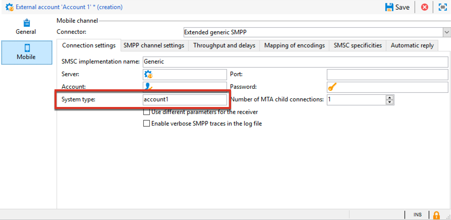
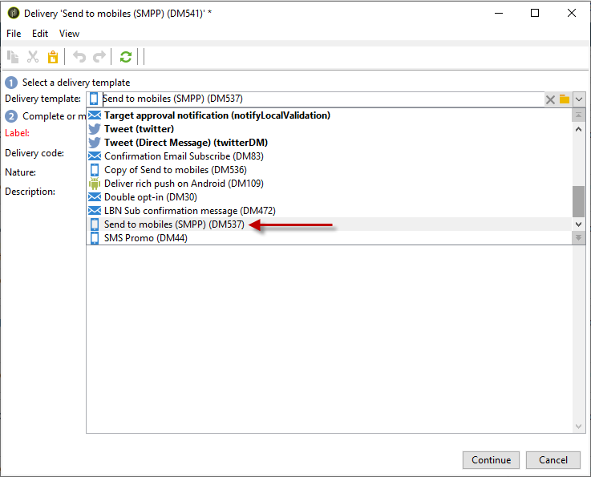
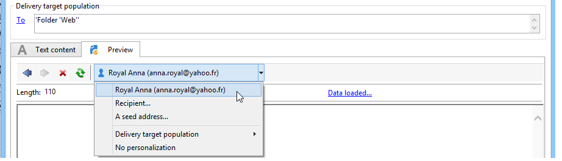

# Sms-kanaal{#sms-channel}

Met Adobe Campaign kunt u op grote schaal gepersonaliseerde leveringen van SMS-berichten uitvoeren. De ontvangende profielen moeten ten minste een mobiel telefoonnummer bevatten.

>[!NOTE]
>
>Met Adobe Campaign kunt u ook berichten verzenden op mobiele terminals via de optie **Adobe Campaign Mobile App Channel (NMAC)** .
> 
>Raadpleeg voor meer informatie de sectie [Over het kanaal](../../delivery/using/about-mobile-app-channel.md) van de mobiele app.

In de onderstaande secties vindt u informatie die specifiek is voor het SMS-kanaal. Raadpleeg[deze sectie](../../delivery/using/steps-about-delivery-creation-steps.md)voor algemene informatie over het maken van een levering.

## SMS-kanaal instellen {#setting-up-sms-channel}

Als u naar een mobiele telefoon wilt verzenden, hebt u het volgende nodig:

1. Een externe account die een connector en type bericht opgeeft.

   Merk op dat de volgende schakelaars vanaf versie 20.2 zullen worden afgekeurd: NetSize, Generic SMPP (SMPP versie 3.4 die binaire wijze steunt), Sybase365 (SAP SMS 365), CLX Mededelingen, Tele2, O2 en iOS. Verouderde mogelijkheden zijn nog steeds beschikbaar, maar deze worden niet verder verbeterd en worden niet ondersteund. Raadpleeg [deze pagina](https://helpx.adobe.com/nl/campaign/kb/deprecated-and-removed-features.html) voor meer informatie.

1. Een leveringssjabloon waarin naar deze externe account wordt verwezen.

### Creating an SMPP external account {#creating-an-smpp-external-account}

Als u SMS naar een mobiele telefoon wilt verzenden, moet u eerst uw SMPP-externe account maken.
Voor meer informatie over het protocol en instellingen van sms raadpleegt u deze [technische opmerking](https://helpx.adobe.com/nl/campaign/kb/sms-connector-protocol-and-settings.html).

Volg de onderstaande stappen om dit te doen:

1. Klik in het knooppunt **[!UICONTROL Platform]** > **[!UICONTROL External accounts]** van de structuur op het **[!UICONTROL New]** pictogram.
1. Definieer het accounttype als **Verpletterend**, het kanaal als **Mobiel (SMS)**, en de leveringswijze als **Bulk levering**.

   

1. Schakel het **[!UICONTROL Enabled]** selectievakje in.
1. Selecteer op het **[!UICONTROL Mobile]** tabblad een optie in de **[!UICONTROL Extended generic SMPP]** **[!UICONTROL Connector]** vervolgkeuzelijst.

   

   >[!CAUTION]
   >
   > Vanaf versie 20.2 zijn verouderde connectors vervangen en niet ondersteund. Wij adviseren gebruikend de **[!UICONTROL Extended generic SMPP]** schakelaar. Raadpleeg deze [pagina](https://helpx.adobe.com/nl/campaign/kb/sms-connector.html)voor meer informatie over het migreren naar de aanbevolen connector.

1. The **[!UICONTROL Enable verbose SMPP traces in the log file]** option allows you to dump all SMPP traffic in log files. Deze optie moet zijn ingeschakeld om problemen met de connector op te lossen en om vergelijkingen te maken met het verkeer dat door de provider wordt waargenomen.

1. Neem contact op met uw SMS-serviceprovider die u zal uitleggen hoe u de verschillende externe accountvelden op het **[!UICONTROL Connection settings]** tabblad kunt invullen.

   Neem vervolgens contact op met uw provider, afhankelijk van de gekozen provider. Deze geeft u de waarde die u in het **[!UICONTROL SMSC implementation name]** veld wilt invoeren.

   U kunt het aantal verbindingen aan de leverancier per MTA kind bepalen. De standaardwaarde is 1.

1. Standaard voldoet het aantal tekens in een SMS aan de GSM-standaarden.

   Sms-berichten met gsm-codering mogen maximaal 160 tekens bevatten of 153 tekens per sms voor berichten die in meerdere delen worden verzonden.

   >[!NOTE]
   >
   >Bepaalde tekens tellen als twee tekens: accolades, vierkante haakjes, het euroteken, enzovoort. 
   >
   >De lijst met beschikbare GSM-tekens wordt hieronder weergegeven.

   Desgewenst kunt u tekentransliteratie autoriseren door het betreffende vakje in te schakelen.

   

   Raadpleeg [deze sectie](#about-character-transliteration) voor meer informatie.

1. In the **[!UICONTROL Throughput and delays]** tab, you can specify the maximum throughput of outbound messages (&quot;MT&quot;, Mobile Terminated) in MT per second. Als u ‘0’ invoert in het overeenkomstige veld, is de doorvoer onbeperkt.

   De waarden van alle velden die corresponderen met een tijdsduur, moeten in seconden worden ingevuld.

1. Op het **[!UICONTROL Mapping of encodings]** tabblad kunt u coderingen definiëren.

   Raadpleeg [deze sectie](#about-text-encodings) voor meer informatie.

1. Op het **[!UICONTROL SMSC specificities]** tabblad is de **[!UICONTROL Send full phone number]** optie standaard uitgeschakeld. Laat het niet toe als u het protocol wilt respecteren SMPP en slechts cijfers naar de server van de leverancier van SMS (SMSC) overbrengen.

   Aangezien bepaalde providers het gebruik van het voorvoegsel &#39;+&#39; vereisen, wordt u echter geadviseerd contact op te nemen met uw provider en wordt u aangeraden deze optie indien nodig in te schakelen.

   The **[!UICONTROL Enable TLS over SMPP]** checkbox allows you to encrypt SMPP traffic. For more on this, refer to this [technical note](https://helpx.adobe.com/nl/campaign/kb/sms-connector-protocol-and-settings.html).

1. Als u een **[!UICONTROL Extended generic SMPP]** schakelaar vormt, kunt u opstelling automatische antwoorden.

   Raadpleeg [deze sectie](#automatic-reply) voor meer informatie.

### Informatie over tekentransliteratie {#about-character-transliteration}

Tekentransliteratie kan worden ingesteld in een externe account voor levering via SMPP mobile, onder het **[!UICONTROL Mobile]** tabblad.

Transliteratie houdt in dat een teken van een sms door een ander teken wordt vervangen wanneer dat teken niet in aanmerking wordt genomen door de gsm-standaard.

* If transliteration is **[!UICONTROL authorized]**, each character that is not taken into account is replaced by a GSM character when the message is sent. De letter ‘ë’ wordt bijvoorbeeld vervangen door ‘e’. Het bericht is daarom enigszins gewijzigd, maar de tekenlimiet blijft hetzelfde.
* When transliteration is **[!UICONTROL not authorized]**, each message that contains characters that are not taken into account is sent in binary format (Unicode): all of the characters are therefore sent as they are. De sms-berichten met Unicode zijn echter beperkt tot 70 tekens (of 67 tekens per sms voor berichten die in meerdere delen worden verzonden). Als het maximum aantal tekens wordt overschreden, worden verschillende berichten verzonden, wat extra kosten kan veroorzaken.

>[!IMPORTANT]
>
>Als u personalisatievelden invoegt in de content van uw sms-bericht, worden mogelijk tekens ingevoegd die niet in aanmerking worden genomen door de gsm-codering.

Standaard is transliteratie van tekens uitgeschakeld. Als u alle tekens in uw sms-berichten wilt behouden zoals ze zijn, bijvoorbeeld om geen eigennamen te wijzigen, wordt u aangeraden deze optie niet in te schakelen.

Als uw sms-berichten echter veel tekens bevatten die Unicode-berichten genereren, kunt u deze optie inschakelen om de kosten voor het verzenden van uw berichten te beperken.

In de volgende tabel worden de tekens weergegeven waarmee de GSM-standaard rekening houdt. Alle tekens die in de hoofdtekst van het bericht worden ingevoegd, met uitzondering van de onderstaande tekens, converteren het volledige bericht naar de binaire indeling (Unicode) en beperken het tot 70 tekens.

**Standaardtekens**

<table> 
 <tbody> 
  <tr> 
   <td> @ </td> 
   <td>  </td> 
   <td> SP </td> 
   <td> 0 </td> 
   <td> ¡ </td> 
   <td> P </td> 
   <td> ¿ </td> 
   <td> p </td> 
  </tr> 
  <tr> 
   <td> £ </td> 
   <td> _ </td> 
   <td> ! </td> 
   <td> 1 </td> 
   <td> A </td> 
   <td> Q </td> 
   <td> a </td> 
   <td> q </td> 
  </tr> 
  <tr> 
   <td> $ </td> 
   <td>  </td> 
   <td> ’ </td> 
   <td> 2 </td> 
   <td> B </td> 
   <td> R </td> 
   <td> b </td> 
   <td> r </td> 
  </tr> 
  <tr> 
   <td> ¥ </td> 
   <td>  </td> 
   <td> # </td> 
   <td> 3 </td> 
   <td> C </td> 
   <td> S </td> 
   <td> c </td> 
   <td> s </td> 
  </tr> 
  <tr> 
   <td> è </td> 
   <td>  </td> 
   <td> ¤ </td> 
   <td> 4 </td> 
   <td> D </td> 
   <td> T </td> 
   <td> d </td> 
   <td> t </td> 
  </tr> 
  <tr> 
   <td> é </td> 
   <td>  </td> 
   <td> % </td> 
   <td> 5 </td> 
   <td> E </td> 
   <td> U </td> 
   <td> e </td> 
   <td> u </td> 
  </tr> 
  <tr> 
   <td> ù </td> 
   <td>  </td> 
   <td> &amp; </td> 
   <td> 6 </td> 
   <td> F </td> 
   <td> V </td> 
   <td> f </td> 
   <td> v </td> 
  </tr> 
  <tr> 
   <td> ì </td> 
   <td>  </td> 
   <td> ' </td> 
   <td> 7 </td> 
   <td> G </td> 
   <td> W </td> 
   <td> g </td> 
   <td> w </td> 
  </tr> 
  <tr> 
   <td> ò </td> 
   <td>  </td> 
   <td> ( </td> 
   <td> 8 </td> 
   <td> H </td> 
   <td> X </td> 
   <td> h </td> 
   <td> x </td> 
  </tr> 
  <tr> 
   <td> Ç </td> 
   <td>  </td> 
   <td> ) </td> 
   <td> 9 </td> 
   <td> I </td> 
   <td> Y </td> 
   <td> i </td> 
   <td> y </td> 
  </tr> 
  <tr> 
   <td> LF </td> 
   <td>  </td> 
   <td> * </td> 
   <td> : </td> 
   <td> J </td> 
   <td> Z </td> 
   <td> j </td> 
   <td> z </td> 
  </tr> 
  <tr> 
   <td> Ø </td> 
   <td> ESC </td> 
   <td> + </td> 
   <td> ; </td> 
   <td> K </td> 
   <td> Ä </td> 
   <td> k </td> 
   <td> ä </td> 
  </tr> 
  <tr> 
   <td> ø </td> 
   <td> Æ </td> 
   <td> , </td> 
   <td> &lt; </td> 
   <td> L </td> 
   <td> Ö </td> 
   <td> l </td> 
   <td> ö </td> 
  </tr> 
  <tr> 
   <td> CR </td> 
   <td> æ </td> 
   <td> - </td> 
   <td> = </td> 
   <td> M </td> 
   <td> Ñ </td> 
   <td> m </td> 
   <td> ñ </td> 
  </tr> 
  <tr> 
   <td> Å </td> 
   <td> ß </td> 
   <td> . </td> 
   <td> &gt; </td> 
   <td> N </td> 
   <td> Ü </td> 
   <td> n </td> 
   <td> ü </td> 
  </tr> 
  <tr> 
   <td> å </td> 
   <td> É </td> 
   <td> / </td> 
   <td> ? </td> 
   <td> O </td> 
   <td> § </td> 
   <td> o </td> 
   <td> à </td> 
  </tr> 
 </tbody> 
</table>

SP: Spatie

ESC: Escape

LF: Nieuwe regel

CR: Enter-teken

**Geavanceerde tekens (twee keer geteld)**

^ { } `[ ~ ]` | €

### Informatie over tekstcoderingen {#about-text-encodings}

Wanneer u een sms-bericht verzendt, kan Adobe Campaign een of meer tekstcoderingen gebruiken. Elke codering heeft een eigen specifieke tekenset en bepaalt het aantal tekens dat in een sms-bericht past.

Wanneer u een nieuwe externe account voor levering via SMPP voor mobiele apparaten configureert, kunt u deze definiëren **[!UICONTROL Mapping of encodings]** op het **[!UICONTROL Mobile]** tabblad: in het **[!UICONTROL data_coding]** veld kan Adobe Campaign meedelen welke codering wordt gebruikt voor het SMSC.

>[!NOTE]
>
>De toewijzing tussen de waarde **data_coding** en de werkelijk gebruikte codering wordt gestandaardiseerd. Nevertheless, certain SMSC have their own specific mapping: in this case, your **Adobe Campaign** administrator needs to declare this mapping. Neem contact op met uw provider om meer informatie te krijgen.

You can declare **data_codings** and force the encoding if necessary: to do this, specify a single encoding in the table.

* Wanneer geen afbeelding van coderingen wordt bepaald, neemt de schakelaar een generisch gedrag over:

   * Er wordt geprobeerd gsm-codering te gebruiken waaraan de waarde **data_coding = 0** wordt toegewezen.
   * Als gsm-codering mislukt, wordt **UCS2** -codering gebruikt waaraan de waarde **data_coding = 8** wordt toegewezen.

* Wanneer u de coderingen definieert die u wilt gebruiken en de gekoppelde **[!UICONTROL data_coding]** veldwaarden, probeert Adobe Campaign de eerste codering in de lijst te gebruiken, gevolgd door de volgende codering als de eerste codering onmogelijk blijkt.

>[!IMPORTANT]
>
>De volgorde van de declaratie is belangrijk. U wordt aangeraden de lijst in oplopende volgorde **van kosten** te plaatsen om voorrang te geven aan de coderingen, zodat u in elk sms-bericht zoveel mogelijk tekens kunt plaatsen.
>
>Declareer alleen de coderingen die u wilt gebruiken. Als sommige coderingen die door het SMSC worden verstrekt niet met uw doel van gebruik zouden moeten beantwoorden, verklaar hen niet in de lijst.

### Automatische reactie {#automatic-reply}

Wanneer vestiging een uitgebreide generische schakelaar SMPP, kunt u automatische antwoorden vormen.

Wanneer een abonnee op een SMS-bericht reageert dat via Adobe Campaign naar hem is verzonden en zijn bericht een trefwoord bevat zoals &quot;STOP&quot;, kunt u berichten configureren die automatisch naar hem worden teruggestuurd in de **[!UICONTROL Automatic reply sent to the MO]** sectie.

>[!NOTE]
>
>De trefwoorden zijn niet hoofdlettergevoelig.

Voor elk sleutelwoord, specificeer een korte code, die een aantal is dat gewoonlijk wordt gebruikt om leveringen te verzenden en als afzendernaam zal dienen, dan ga het bericht in dat naar de abonnee zal worden verzonden.

U kunt ook een actie koppelen aan uw automatische reactie: **[!UICONTROL Send to quarantine]** of **[!UICONTROL Remove from quarantine]**. Bijvoorbeeld, als een ontvanger het sleutelwoord &quot;STOP&quot;verzendt, zullen zij automatisch een unsubscription bevestiging ontvangen en naar quarantaine verzonden.


Als u de **[!UICONTROL Remove from quarantine]** actie aan een automatische reactie verbindt, worden de ontvangers die het overeenkomstige sleutelwoord verzenden automatisch verwijderd uit quarantaine.

Ontvangers worden vermeld in de **[!UICONTROL Non deliverables and addresses]** tabel die beschikbaar is via **[!UICONTROL Administration]** > **[!UICONTROL Campaign Management]** > **[!UICONTROL Non deliverables Management]** .

* Als u hetzelfde antwoord wilt verzenden, ongeacht de korte code, laat u de **[!UICONTROL Short code]** kolom leeg.
* Als u hetzelfde antwoord wilt verzenden, ongeacht het trefwoord, laat u de **[!UICONTROL Keyword]** kolom leeg.
* Als u een actie wilt uitvoeren zonder een reactie te verzenden, laat u de **[!UICONTROL Response]** kolom leeg. Zo kunt u bijvoorbeeld een gebruiker die met een ander bericht dan &quot;STOP&quot; reageert, uit quarantaine verwijderen.

Als u veelvoudige externe rekeningen gebruikend de Uitgebreide generische schakelaar SMPP met de zelfde leveranciersrekening hebt, kan de volgende kwestie gebeuren: wanneer u een antwoord op een korte code verzendt, kan dit antwoord op een van uw externe accountverbindingen worden ontvangen. Het automatische antwoord dat wordt verzonden, kan dan ook niet het verwachte bericht zijn.
U kunt dit voorkomen door een van de volgende oplossingen toe te passen, afhankelijk van de provider die u gebruikt:

* Maak één leverancieraccount voor elke externe account.
* Gebruik het **[!UICONTROL System type]** veld op het tabblad **[!UICONTROL Mobile]** **[!UICONTROL Connection settings]** > om elke korte code van elkaar te onderscheiden. Vraag uw provider om een andere waarde voor elke account.

   

De stappen voor vestiging een externe rekening gebruikend de Uitgebreide generische schakelaar SMPP zijn gedetailleerd in het [Creëren van een externe rekening](../../delivery/using/sms-channel.md#creating-an-smpp-external-account) SMPP.

### De leveringssjabloon wijzigen {#changing-the-delivery-template}

Adobe Campaign biedt u een sjabloon voor levering aan mobiele apparaten. Deze sjabloon is beschikbaar in het **[!UICONTROL Resources > Templates > Delivery templates]** knooppunt. For more on this, refer to the [About templates](../../delivery/using/about-templates.md) section.

Om via het kanaal van SMS te leveren, moet u een malplaatje tot stand brengen waarin de kanaalschakelaar van verwijzingen wordt voorzien.

Om het inheemse leveringsmalplaatje te houden, adviseren wij dat u het dupliceert en dan het vormt.

In het onderstaande voorbeeld maken we een sjabloon voor het verzenden van berichten via de SMPP-account die eerder is ingeschakeld. Dit doet u als volgt:

1. Go to the **[!UICONTROL Delivery templates]** node.
1. Klik met de rechtermuisknop op de **[!UICONTROL Send to mobiles]** sjabloon en selecteer **[!UICONTROL Duplicate]**.

   

1. Wijzig het label van de sjabloon, bijvoorbeeld **Verzenden naar mobiele apparaten (SMPP)**.

   

1. Klik op **[!UICONTROL Properties]**.
1. Op het **[!UICONTROL General]** lusje, selecteer een verpletterende wijze die aan de externe rekening beantwoordt die u in de vorige stappen creeerde.

   

1. Klik **[!UICONTROL Save]** om de sjabloon te maken.

   

Je hebt nu een externe account en een leveringstemplate waarmee je via SMS kunt leveren.

## Een SMS-levering maken {#creating-a-sms-delivery}

### Het leveringskanaal selecteren {#selecting-the-delivery-channel}

Volg onderstaande stappen om een nieuwe SMS-levering te maken:

>[!NOTE]
>
>Algemene concepten voor het maken van leveringen worden in [deze sectie](../../delivery/using/steps-about-delivery-creation-steps.md)beschreven.

1. Maak een nieuwe levering, bijvoorbeeld via het dashboard Levering.
1. Selecteer het leveringsmalplaatje **Verzonden naar mobiele telefoons (SMPP)** dat u vroeger creeerde. For more on this, refer to the [Changing the delivery template](#changing-the-delivery-template) section.

   

1. Identificeer uw levering met een etiket, code, en beschrijving. Raadpleeg [deze sectie](../../delivery/using/steps-create-and-identify-the-delivery.md#identifying-the-delivery) voor meer informatie.
1. Klik **[!UICONTROL Continue]** om deze informatie te bevestigen en het venster van de berichtconfiguratie te tonen.

## De SMS-inhoud definiëren {#defining-the-sms-content}

Voer de volgende stappen uit om de inhoud van het SMS te maken:

1. Voer de inhoud van het bericht in het **[!UICONTROL Text content]** gedeelte van de wizard in. Met de werkbalkknoppen kunt u inhoud importeren, opslaan of doorzoeken. De laatste knoop wordt gebruikt om verpersoonlijkingsgebieden op te nemen.

   

   Het gebruik van verpersoonlijkingsgebieden wordt voorgesteld in de [Ongeveer verpersoonlijkingssectie](../../delivery/using/about-personalization.md) .

1. Klik **[!UICONTROL Preview]** bij de bodem van de pagina om het teruggeven van het bericht met zijn verpersoonlijking te bekijken. Selecteer een ontvanger met de **[!UICONTROL Test personalization]** knop op de werkbalk om de voorvertoning te starten. U kunt een ontvanger selecteren uit de gedefinieerde doelen of een andere ontvanger kiezen.

   

   Je kunt het SMS-bericht goedkeuren. U kunt de inhoud van SMS ook bekijken op het scherm van de mobiele telefoon dat op het recht van de inhoudredacteur wordt getoond. Klik op het scherm en gebruik de muis om door de inhoud te schuiven.

   

1. Klik op de **[!UICONTROL Data loaded]** koppeling om de informatie over de ontvanger weer te geven.

   

   >[!NOTE]
   >
   >SMS-berichten mogen niet langer zijn dan 160 tekens als de codepagina Latin-1 (ISO-8859-1) wordt gebruikt. Als het bericht in Unicode wordt geschreven, moet het niet 70 karakters overschrijden. Bepaalde speciale tekens kunnen de lengte van het bericht beïnvloeden. Raadpleeg voor meer informatie over de lengte van berichten de sectie [Informatie over tekenomzetting](#about-character-transliteration) .
   >
   >Wanneer verpersoonlijkingsgebieden of voorwaardelijke inhoudsgebieden aanwezig zijn, varieert de grootte van het bericht van één ontvanger aan andere. De lengte van het bericht moet worden geëvalueerd wanneer de personalisatie is uitgevoerd.
   >
   >Wanneer u de analyse start, wordt de lengte van berichten gecontroleerd en wordt een waarschuwing weergegeven in geval van overloop.

1. Als u de schakelaar NetSize of een schakelaar SMPP gebruikt, kunt u de naam van de leveringsafzender personaliseren. For more on this, refer to the [Advanced parameters](#advanced-parameters) section.

## De doelpopulatie selecteren {#selecting-the-target-population}

Het gedetailleerde proces bij het selecteren van de doelpopulatie van een levering wordt in [deze sectie](../../delivery/using/steps-defining-the-target-population.md)weergegeven.

Voor meer over het gebruik van verpersoonlijkingsgebieden, verwijs naar [Ongeveer verpersoonlijking](../../delivery/using/about-personalization.md).

Voor meer over de opneming van een zaadlijst, verwijs naar [Ongeveer zaadadressen](../../delivery/using/about-seed-addresses.md).

## SMS-berichten verzenden {#sending-sms-messages}

Om uw bericht goed te keuren en het naar de ontvangers van de levering te verzenden die wordt gecreeerd, klik **[!UICONTROL Send]**.

Het gedetailleerde proces voor het valideren en verzenden van een levering wordt in de volgende secties weergegeven:

* [De levering valideren](../../delivery/using/steps-validating-the-delivery.md)
* [De levering verzenden](../../delivery/using/steps-sending-the-delivery.md)

### Geavanceerde parameters {#advanced-parameters}

De **[!UICONTROL Properties]** knoop geeft toegang tot de geavanceerde leveringsparameter. De parameters specifiek voor de levering van SMS zijn in de **[!UICONTROL SMS parameters]** sectie van het **[!UICONTROL Delivery]** lusje.

De volgende opties zijn beschikbaar:

* **Adres** afzender: Hiermee kunt u de naam van de afzender aanpassen met een reeks alfanumerieke tekens die zijn beperkt tot elf tekens. Het veld mag niet uitsluitend uit cijfers bestaan. U kunt een voorwaarde definiëren om bijvoorbeeld verschillende namen weer te geven op basis van de gebiedscode van de ontvanger:

   ```
   <% if( String(recipient.mobilePhone).indexOf("+1") == 0){ %>NeoShopUS<%} else %>
   ```

   >[!IMPORTANT]
   >
   >Controleer de wet in je land met betrekking tot het bewerken van namen van afzenders. Vraag de operator ook of deze functionaliteit wordt aangeboden.

* **Transmissiemodus**: berichtenverzending door SMS.
* **Prioriteit**: het niveau van belang dat aan een boodschap wordt toegekend. **[!UICONTROL Normal]** De prioriteit wordt standaard geselecteerd. Vraag uw serviceprovider naar de kosten van SMS-berichten met **[!UICONTROL High]** prioriteit.
* **Type aanvraag**: Kies de toepassing die u aan uw SMS-levering wilt toewijzen. De **[!UICONTROL Direct Marketing]** optie is standaard geselecteerd en wordt het meest gebruikt.

**Parameters specifiek voor de NetSize-connector**


* **Gebruik verschillende SMS-berichten voor één bericht**: hiermee kunt u een bericht van meer dan 160 tekens verzenden via verschillende SMS-berichten.

**Parameters specifiek voor een schakelaar SMPP**


* **Maximum aantal SMS per bericht**: Met deze optie kunt u het aantal SMS instellen dat moet worden gebruikt om een bericht te verzenden. Als het aantal aan 0 wordt geplaatst, kunt u SMS gebruiken om uw bericht te leveren. Als het aantal SMS bijvoorbeeld op 1 of 2 wordt geplaatst, en het bericht deze drempel overschrijdt, zal het niet worden verzonden.

## Bewaking en tracering van SMS-leveringen {#monitoring-and-tracking-sms-deliveries}

Nadat u berichten hebt verzonden, kunt u de leveringen controleren en volgen. Raadpleeg deze secties voor meer informatie hierover:

* [Een levering controleren](../../delivery/using/monitoring-a-delivery.md)
* [Leveringsfouten begrijpen](../../delivery/using/understanding-delivery-failures.md)
* [Berichttracering](../../delivery/using/about-message-tracking.md)

## Binnenkomende berichten verwerken {#processing-inbound-messages}

De **nlserver sms** module vraagt de router van SMS met regelmatige intervallen. Op deze manier kan Adobe Campaign de voortgang van de leveringen volgen en de statusrapporten en aanvragen voor abonnementen bij ontvangers afhandelen.

* **Statusrapporten**: Bekijk leveringslogboeken om de status van uw berichten te controleren.

   >[!NOTE]
   >
   >Elk verzonden SMS-bericht is gekoppeld aan een externe account met de primaire sleutel. Zo:
   >
   > * Statusrapporten van een verwijderde externe SMS-account worden niet correct verwerkt.
   > * Een SMS-account kan alleen aan één externe account worden gekoppeld om ervoor te zorgen dat statusrapporten aan de juiste account worden toegewezen


* **Abonnement opzeggen**: ontvangers die de levering van SMS willen ophouden kunnen een bericht terugkeren dat het woord STOP bevat. Als uw leverancier het onder de voorwaarden van het contract toestaat, kunt u berichten via de **Binnenkomende het werkschemaactiviteit van SMS** terugwinnen en dan een vraag creëren om **niet meer contact deze ontvankelijke** optie voor de betrokken ontvangers toe te laten.

   Raadpleeg de [handleiding voor workflows](../../workflow/using/architecture.md) .

## InSMS-schema {#insms-schema}

Het InSMS-schema bevat relevante informatie over inkomende SMS. Een beschrijving van deze velden is beschikbaar via het desc-kenmerk.

* **bericht**: inhoud van het ontvangen SMS.
* **oorsprong**: mobiel nummer bij de oorsprong van het bericht.
* **providerId**: Identificatiecode van het door het SMSC geretourneerde bericht (berichtcentrum).
* **gemaakt**: datum waarop het inkomende bericht in Adobe Campaign is ingevoegd.
* **extAccount**: Adobe Campaign externe account.

   >[!IMPORTANT]
   >
   >De volgende velden zijn specifiek voor NetSize.
   >
   >Als de gebruikte operator geen NetSize is, worden deze velden als leeg beschouwd.

* **alias**: alias van binnenkomend bericht.
* **scheidingsteken**: scheidingsteken tussen de alias en de hoofdtekst van het bericht.
* **messageDate**: berichtdatum gegeven door de exploitant.
* **receivalDate**: databericht van de exploitant is ontvangen door SMSC (berichtcentrum).
* **leveringsdatum**: datumbericht verzonden door SMSC (berichtcentrum).
* **largeAccount**: de code van de klantenrekening verbonden aan inkomende SMS.
* **countryCode**: de landcode van de exploitant.
* **operatorCode**: netcode van de exploitant.
* **linkedSmsId**: Adobe Campaign-id (broadlogId) gekoppeld aan uitgaande SMS, waarbij dit SMS het antwoord is.

## Automatische antwoorden beheren (Amerikaanse verordening) {#managing-automatic-replies--american-regulation-}

Wanneer de abonnees op een bericht van SMS antwoorden dat werd verzonden naar hen via Adobe Campaign, en zij gebruiken een sleutelwoord zoals STOP, HELP, of JA, is het noodzakelijk, op de markt van de V.S., om berichten te vormen die automatisch zijn teruggekeerd.

Als ontvangers bijvoorbeeld het trefwoord STOP verzenden, ontvangen ze automatisch een bevestigingsbericht met de mededeling dat ze het abonnement hebben opgezegd.

De afzendernaam voor dit type van bericht is een korte code gewoonlijk wordt gebruikt om leveringen te verzenden.

>[!IMPORTANT]
>
>De volgende gedetailleerde procedure is slechts geldig voor schakelaars SMPP, behalve de uitgebreide generische schakelaar SMPP. Raadpleeg voor meer informatie de sectie Externe [SMPP-account](#creating-an-smpp-external-account) maken.
>
>Het maakt deel uit van het certificeringsproces dat door Amerikaanse marktdeelnemers wordt uitgevoerd voor marketingcampagnes in de VS. Deze reacties op SMS-berichten van abonnees die het trefwoord bevatten, moeten onmiddellijk na ontvangst van een bericht van de abonnee worden teruggestuurd naar de abonnee.

1. Dit type XML-bestand maken:

   ```
   <autoreply>
     <shortcode name="12345">
       <reply keyword="STOP" text="You will not receive SMS anymore" />
       <reply keyword="HELP" text="Powered by Adobe Campaign" />
     </shortcode>
     <shortcode name="43115">
       <reply keyword="STOP" text="Vous ne recevrez plus de SMS" />
       <reply keyword="HELP" text="Service rendu par Adobe Campaign" />
     </shortcode>
     <shortcode name="*">
       <reply keyword="ADOBE" text="This text is replied when you send ADOBE to any short code" />
     </shortcode>
   </autoreply>
   ```

1. Geef voor het kenmerk **name** van de **`<shortcode>`** tag de korte code op die wordt weergegeven in de plaats van de naam van de afzender van het bericht.

   In elke **`<reply>`** markering, ga het **sleutelwoordattribuut** met een sleutelwoord en het **tekstattribuut** met het bericht in dat u voor dit sleutelwoord wilt verzenden.

   >[!NOTE]
   >
   >Elk trefwoord moet in hoofdletters worden geschreven.

   Als u het zelfde bericht voor verscheidene sleutelwoorden wilt verzenden, dupliceer de overeenkomstige lijn.

   Bijvoorbeeld:

   ```
   <reply keyword="STOP" text="You will not receive SMS anymore" />
   <reply keyword="QUIT" text="You will not receive SMS anymore" />
   ```

1. Sla dit bestand op onder de naam **smsAutoReply.xml** nadat u het hebt voltooid.

   De naam van het bestand is hoofdlettergevoelig in Linux.

1. Kopieer dit bestand naar de map **conf** in Adobe Campaign, op dezelfde plaats als de webserver.

>[!IMPORTANT]
>
>Dit soort automatische berichten houden geen geschiedenis bij. Daarom worden ze niet weergegeven in het [leveringsdashboard](../../delivery/using/monitoring-a-delivery.md#delivery-dashboard).
>
>Deze berichten worden niet beschouwd als onderdeel van de [handelsdrukregels](../../campaign/using/pressure-rules.md).
