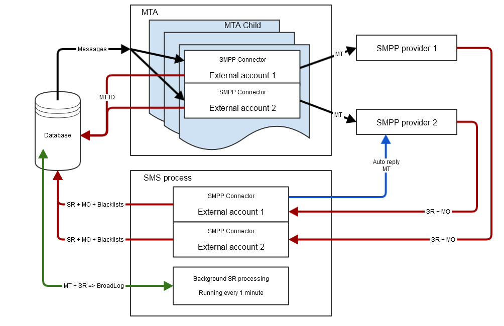

# Protocol en instellingen voor sms-connector {#sms-connector-protocol}

>[!NOTE]
>
>Door dit document, verwijzen alle verwijzingen naar details over het protocol, gebiedsnamen en waarden naar [ SMPP 3.4 specificatie ](https://smpp.org/SMPP_v3_4_Issue1_2.pdf).
>

## Overzicht {#overview}

SMS kan beperkt zijn tot het verzenden van korte tekstberichten zonder opmaak, maar de eenvoud ervan maakt het een waardevol communicatiekanaal.

Er zijn twee belangrijke manieren om SMS te verzenden:

* Verzend het manueel van een telefoon, de gebruikelijke manier om rechtstreeks tussen mensen te communiceren.
* Verzend het via internet, zoals Adobe Campaign berichten verzendt. Hiervoor hebt u een SMS-serviceprovider nodig die verbinding maakt met het mobiele netwerk.
Adobe Campaign gebruikt het protocol SMPP om SMS naar een dienstverlener te verzenden.

In dit document wordt de verbinding tussen Adobe Campaign en een SMPP-provider besproken.

SMPP-aanbieders kunnen soms afwijken van de officiële specificaties, maar de SMS-connector in Adobe Campaign biedt veel mogelijkheden om het gedrag aan te passen zodat het compatibel is met de meeste aanbieders.

>[!IMPORTANT]
>
>De vestiging een verbinding aan een nieuwe leverancier kan sommige technische vaardigheden, kennis van TCP, binaire, hexadecimale vertegenwoordiging en tekstcoderingen vereisen. Het zal ook actieve samenwerking met de leverancier vereisen.

### Typen SMS {#sms-types}

Wanneer u SMS-berichten verzendt via een SMS-provider, worden er drie verschillende soorten SMS-berichten weergegeven:

* **MT van SMS (Vertaalde Mobiele)**: Een SMS dat door Adobe Campaign naar mobiele telefoons door de leverancier SMPP wordt uitgestoten.

* **MO van SMS (Mobiele Oorspronkelijke)**: een SMS dat door een mobiel naar Adobe Campaign door de leverancier SMPP wordt verzonden.

* **SMS SR (het Rapport van de Status) of DR. of DLR (Ontvangstbewijs)**: een terugkeerontvangstbewijs dat door mobiel naar Adobe Campaign door de leverancier wordt verzonden SMPP erop wijst die dat SMS met succes is ontvangen. Adobe Campaign kan ook SR ontvangen om aan te geven dat het bericht niet kan worden verzonden, vaak met een beschrijving van de fout.

U moet tussen erkenning (RESP PDU, een deel van het protocol SMPP) en SR onderscheid maken: SR is een soort SMS dat door het netwerk van begin tot eind wordt verzonden, terwijl een erkenning slechts een bevestiging is dat één overdracht succesvol is geweest.

Zowel erkenningen als SR kunnen fouten teweegbrengen, die tussen twee onderscheiden zal helpen het oplossen van problemen.

### Informatie die via een SMS wordt verzonden {#information-sms}

Een SMS bevat meer informatie dan tekst. Hier een lijst van wat u in SMS kunt verwachten te vinden:

* De tekst, die is beperkt tot 140 bytes, wat betekent tussen 70 en 160 karakters afhankelijk van de codering. Zie [ tekst het coderen van SMS ](sms-protocol.md#sms-text-encoding) hieronder voor details en beperkingen.

* Een geadresseerd adres, ook wel `ADC` of `MSISDN` genoemd. Dat is het nummer van de mobiele telefoon die het SMS zal ontvangen.

* Een verzendadres dat `oADC` of soms `sender id` kan worden genoemd. Dat kan een telefoonaantal in daggebruik, een korte code zijn wanneer verzonden door een leverancier of een naam. Naam is een facultatieve eigenschap, in dat geval kunt u niet op SMS antwoorden.

* Een markering die aangeeft of het bericht een Flash-bericht is. Een flitsbericht is een pop-up die niet in geheugen wordt opgeslagen.

* Een vlag die aangeeft of een SR wordt verwacht of niet.

* Een geldigheidsdatum, waarna geen netwerkmateriaal wordt toegestaan om opnieuw te proberen.

* Een veld `data_coding` dat de codering van de tekst aangeeft.

## SMPP-protocol {#smpp-protocol}

Adobe Campaign Classic ondersteunt versie 3.4 van het SMPP-protocol. Dit is een wijdverbreid protocol dat het verzenden van SMS naar een leverancier (SMSC) en het ontvangen van SMS evenals ontvangstbewijzen toestaat. Voor meer op dit, verwijs naar de [ documentatie SMPP ](https://smpp.org/SMPP_v3_4_Issue1_2.pdf).

Het netwerkmateriaal op de dienstverlener van SMS wordt vaak genoemd SMSC.

### SMPP-verbindingen {#smpp-connections}

Adobe Campaign maakt via TCP verbinding met de netwerkapparatuur van de SMS-serviceprovider. Het protocol SMPP plaatst permanente verbindingen van TCP van Adobe Campaign aan de leverancier. TCP-verbindingen worden altijd geïnitieerd door Adobe Campaign, zelfs om berichten te ontvangen.
SMPP opent 1 of 2 verbindingen van TCP, afhankelijk van zijn wijze. Alle verbindingen worden altijd geïnitieerd door Adobe Campaign.

Het protocol SMPP kan in twee wijzen werken:

* **Transmitter+receiver (of TX+RX)**: twee afzonderlijke verbindingen van TCP worden gebruikt voor het overbrengen van en het ontvangen van berichten.
* **Transceiver (of TRX)**: één enkele verbinding van TCP wordt gebruikt voor het overbrengen van en het ontvangen van berichten.

>[!NOTE]
>
> Adobe Campaign Classic ondersteunt alleen de TX+RX-modus. Deze beperking komt door de technische architectuur ervan.

### SMPP PDU {#smpp-pdu}

De transmissieeenheden van SMPP (&quot;pakketten&quot;) worden genoemd PDUs. A **PDU** bevat een bevel, een status, een opeenvolgingsaantal en gegevens.

Elke PDU moet door een `SMPP RESP PDU` (synchrone reactie) worden erkend. Aanvragen kunnen via pijpleidingen worden verzonden: de afzender kan vele opdrachten verzenden zonder op `RESP` te wachten. Het aantal verzoeken dat op elk moment via een pijpleiding kan worden verzonden, wordt het venster genoemd. `RESP PDU` kan in om het even welke orde aankomen, los van de orde van hun overeenkomstige initiator PDU.

In de gescheiden **Transmitter+receiver** wijze, hangt de gebruikte verbinding van het soort verzonden bericht af. De transmissieverbinding wordt gebruikt voor MT, en de ontvangerverbinding wordt gebruikt voor MO en SR. De verzoeken en de reacties voor elk soort bericht worden verzonden over de zelfde verbinding van TCP.

Wanneer u bijvoorbeeld een MT verzendt, wordt de transmissieverbinding gebruikt en wordt de `RESP` die bevestigt dat de MT ook via het transmissiekanaal wordt verzonden. Wanneer u een MO (of een SR) ontvangt, wordt de ontvangerverbinding gebruikt om MO te ontvangen en `RESP` te verzenden die MO erkent.


Als u in Adobe Campaign Classic SR wilt koppelen aan de bijbehorende MT, geeft het SMSC een id met de stappen `SUBMIT_SM_RESP` en `DELIVER_SM` . De id wordt opgeslagen in het veld `providerId` van de `nms::providerMsgId` -tabel en is gekoppeld aan `broadLogId` en `deliveryId` . Deze passende verrichting wordt gedaan door het proces van SMS wanneer het schrijven aan het gegevensbestand.

Een geslaagde `SUBMIT_SM_RESP PDU` activeert de status van het &quot;verzonden&quot; bericht in het verzendende logbestand terwijl een geslaagde `DELIVER_SM (SR) PDU` de status van het &quot;ontvangen&quot; bericht activeert.

### Beveiligingsaspecten {#security-aspects}

Het protocol zelf is niet gecodeerd. De meeste leveranciers voeren een variant van IP op lijst van gewenste personen uit zodat moeten de serverIP van Adobe Campaign adressen aan de leverancier worden verklaard.

Adobe Campaign ondersteunt het doorgeven van een aanmelding en een wachtwoord tijdens de bind fase. Ook SMPP via TLS wordt ondersteund. Er zij op gewezen dat certificaten vereist zijn voor een goede beveiliging. Hoewel met de SMPP-connector certificaatcontroles kunnen worden overgeslagen, mag deze alleen worden gebruikt voor tests, aangezien TLS zonder certificaten een aanzienlijk lager beveiligingsniveau biedt.

De schakelaar gebruikt de standaardcertificaten die door de systeem `openssl` bibliotheek worden verstrekt. Meestal wordt deze opgegeven door de map `/etc/ssl/certs` op Debian. Deze map wordt standaard geleverd door het pakket &quot;ca-certificates&quot;, maar kan worden aangepast.

### Informatie in elke soort PDU {#information-pdu}

Elk type PDU heeft verschillende gebieden die verschillende stukken van informatie dragen. Deze PDU wordt gedetailleerd in [ SMPP 3.4 specificatie ](https://smpp.org/SMPP_v3_4_Issue1_2.pdf).

Elke sectie beschrijft hieronder zowel PDU als zijn synchrone reactie (`*_RESP PDU`). Alle PDU&#39;s moeten worden herkend door een corresponderende `RESP` . Dit is een verplicht onderdeel van de specificatie.

PDU&#39;s kunnen optionele velden hebben. Alleen de meest voorkomende velden worden hier beschreven. Verwijs naar [ SMPP 3.4 specificatie ](https://smpp.org/SMPP_v3_4_Issue1_2.pdf) voor meer informatie.

**BIND_TRANSMITTER / BIND_RECEIVER / BIND_TRANSCEIVER**

Deze PDU wordt gebruikt om een verbinding met SMSC in werking te stellen. **Transmitter**, **Ontvanger** en **Transceiver** wijzen veranderen slechts het soort SMS dat wordt toegestaan om over deze verbinding, specifiek worden overgebracht:

| Modus | Typen SMS toegestaan |
|:-:|:-:|
| Transmitter | MT |
| Ontvanger | MO + SR |
| Transceiver | MT + MO + SR |

Noteerbare velden in een `BIND_* PDU` :

* **system_id**: Login die voor authentificatie wordt gebruikt. Instellen in de externe account.

* **wachtwoord**: Wachtwoord gebruikt voor authentificatie. Instellen in de externe account.

* **system_type**: Vereist om bij een specifieke waarde voor sommige leveranciers worden geplaatst. Instellen in de externe account, beschikbaar in alle versies. Vaak wordt onderscheid gemaakt tussen verschillende soorten contracten, kanalen, landen, enz.

* **addr_ton** en **addr_npi**: Vereist door sommige leveranciers. Wordt ingesteld door de instellingen `Bind TON` en `Bind NPI` in de externe account.

* **address_range**: Vereist door sommige leveranciers. Meestal is dit een lijst met toegestane snelcodes voor deze verbinding. Instellen in de externe account.

`BIND_*_RESP` heeft geen specifiek veld. Hiermee wordt bevestigd of de verbinding is gelukt of niet.

#### ONBINDEN {#unbind}

Deze PDU moet door het systeem worden verzonden alvorens los te maken van. De overeenkomende `UNBIND_RESP` PDU moet wachten voordat de verbinding wordt gesloten.

Als u SMSC in overeenstemming acht, mag de verbinding niet worden gesloten, wordt de TCP-verbinding bestuurd door de Adobe Campaign-connector.

#### VERZENDEN_SM {#submit-sm}

Deze PDU verzendt een MT naar SMSC. Zijn reactie PDU geeft identiteitskaart van MT.

Noteerbare velden in een `SUBMIT_SM` PDU:

* **service_type**: vereist door sommige leveranciers. Instellen in de eigenschappen van de levering.

* **source_addr_ton** en **source_addr_npi**: wijst op welk soort bronadres wordt overgebracht. De betekenis van deze gebieden wordt gestandaardiseerd, maar aangezien sommige leveranciers het verschillend gebruiken, zou u de leverancier om zijn correcte waarde moeten vragen. Instellen in de externe account.

* **source_addr**: het bronadres / oADC van MT. Het wordt weergegeven op de mobiele telefoon. De waarde in de levering wordt in de externe account en in de levering ingesteld en heeft voorrang op de waarde van de externe account.

* **dest_addr_ton** en **dest_addr_npi**: wijst op welk soort bestemmingsadres (b.v. lokaal of internationaal formaat) wordt overgebracht. De betekenis van deze gebieden wordt gestandaardiseerd, maar aangezien sommige leveranciers het verschillend gebruiken, zou u de leverancier om zijn correcte waarde moeten vragen. Instellen in de externe account.

* **destination_addr**: ontvankelijk adres, telefoonaantal of MSISDN.

* **esm_class**: gebruikt om te vertellen als UDH of niet op het tekstgebied wordt gebruikt. Automatisch ingeschakeld door de connector voor gesplitste SMS als de modus `message_payload` niet wordt gebruikt.

* **priority_flag**: prioriteit van dit bericht over anderen. Dit hangt samen met de prioriteit van de levering zelf.

* **validity_period**: timestamp waarna geen retry zou moeten worden geprobeerd. In de levering zelf instellen.

* **registered_delivery**: vertelt of een SR wordt gevraagd of niet. Adobe Campaign stelt deze markering altijd in, behalve voor automatische reacties. Bij multipart-berichten wordt de markering alleen ingesteld voor het eerste deel. Alle versies hebben hetzelfde gedrag.

* **data_coding**: wijst op het coderen die op het tekstgebied wordt gebruikt. Zie de [ tekst het coderen van SMS ](sms-protocol.md#sms-text-encoding) sectie voor meer informatie.

* **short_message**: de tekst van het bericht. Als UDH wordt gebruikt, bevat dit ook de UHD-header.

Adobe Campaign ondersteunt de volgende optionele velden:

* **dest_addr_subunit**: gebruikt om het doel van SMS te specificeren: flits, mobiele of SIM kaart. Instellen in de eigenschappen van de levering.

* **message_payload**: wanneer toegelaten in de externe rekening, zullen de lange berichten in één enkele PDU worden verzonden en de tekst zal op dit gebied eerder dan het `short_message` gebied worden overgebracht.

#### SUBMIT_SM_RESP {#submit-sm-resp}

Deze PDU zal identiteitskaart van MT bevatten. Dit is handig om deze aan te passen aan de binnenkomende SR.

>[!IMPORTANT]
>
>Vele leveranciers brengen identiteitskaart MT in hexadecimaal over. Zorg ervoor dat u het **formaat van identiteitskaart in MT erkenning** plaatsen correct in de externe rekening plaatst.

Sommige providers verzenden `SUBMIT_SM_RESP` nadat de SR is verzonden. Om van dat gedrag rekenschap te geven, wacht Adobe Campaign 30 seconden alvorens **Ongeldige berichtidentiteitskaart** aan een SR met onbekende identiteitskaart te antwoorden.

#### DELIVER_SM {#delivery-sm}

Deze PDU wordt door SMSC naar Adobe Campaign verzonden. Het bevat een MO of een SR.

De meeste velden hebben dezelfde betekenis als de `SUBMIT_SM` -tegenhanger. Hier volgt een lijst met nuttige velden:

* **source_addr**: bronadres van MO/SR. Meestal is dit een telefoonnummer.

* **destination_addr**: korte code die MO of SR ontving.

* **esm_class**: gebruikt om te vertellen als PDU een MO of een SR is.

* **short_message**: tekst van het bericht. Voor SR bevat dit de gegevens die worden beschreven in aanhangsel B van de specificatie van het SMPP-protocol. Zie [ Sr- foutenbeheer ](sms-protocol.md#sr-error-management) voor meer details.

Adobe Campaign kan bericht-id lezen in het optionele veld `receipted_message_id` met een bepaalde configuratie.

#### DELIVER_SM_RESP {#deliver-sm-resp}

Deze PDU wordt door Adobe Campaign verzonden om SR en MO te erkennen.

Adobe Campaign Classic erkent SR en MO zodra deze in de database zijn ingevoegd. Er kunnen verwerkingsfouten optreden, zelfs als een `DELIVER_SM_RESP` PDU met succes is verzonden. Deze beperking wordt veroorzaakt door de softwarearchitectuur van Adobe Campaign Classic.

#### INQUIRE_LINK {#enquire-links}

Deze PDU wordt alleen gebruikt om te controleren of de verbinding live is. De frequentie moet worden vastgesteld op basis van de behoeften van de aanbieder.

De standaardconfiguratie 60 seconden moet overeenkomen met de meeste configuraties die zijn ingesteld in de externe account.

#### INQUIRE_LINK_RESP {#enquire-links-resp}

Deze PDU erkent dat de verbinding levend is.

### Multipart SMS (lang SMS) {#multipart}

>[!IMPORTANT]
>
> Adobe Campaign ondersteunt alleen multipart SMS of long SMS voor verzending. UDH en `message_payload` worden niet ondersteund voor binnenkomende SMS (MO), wat betekent dat MO beperkt is tot 160 tekens.

Multipart SMS, of lange SMS, zijn SMS die in veelvoudige delen worden verzonden. Vanwege technische beperkingen in het mobiele netwerkprotocol kan een SMS niet groter zijn dan 140 bytes of moet het worden gesplitst. Zie de [ tekst het coderen van SMS ](sms-protocol.md#sms-text-encoding) sectie om meer op het aantal karakters te leren die in een SMS kunnen passen.

Elk deel van een lang bericht is een individueel SMS. Deze onderdelen reizen onafhankelijk op het netwerk en worden door de ontvangende mobiele telefoon gemonteerd. Om herpogingen en connectiviteitsproblemen te behandelen, verzendt Adobe Campaign deze delen in omgekeerde orde en verzoekt slechts om SR op het eerste deel van het bericht, het laatst verzonden. Aangezien de mobiele telefoon alleen een bericht weergeeft wanneer het eerste deel ervan is ontvangen, worden bij nieuwe pogingen op extra onderdelen geen duplicaten op de mobiele telefoon gegenereerd.

Het maximumaantal SMS per bericht kan per levering worden geplaatst gebruikend het **Maximum aantal SMS per bericht** plaatsend in het **malplaatje van de Levering**. Berichten die deze limiet overschrijden, mislukken tijdens het verzenden met een te lange reden voor SMS-fout.

Er zijn twee manieren om lange SMS te verzenden:

* **UDH**: het gebrek en geadviseerde manier om lange berichten te verzenden. Op deze wijze, verdeelt de schakelaar het bericht in veelvoudige `SUBMIT_SM PDU` s met informatie UDH in hen. Dit protocol wordt gebruikt door mobiele telefoons zelf. Dit betekent dat Adobe Campaign de meeste controle heeft over het genereren van berichten, waardoor het precies kan berekenen hoeveel onderdelen zijn verzonden en hoe ze zijn gesplitst.

* **message_payload**: de manier om het gehele lange bericht in één enkele `SUBMIT_SM PDU` te verzenden. De aanbieder moet het opsplitsen, wat betekent dat het voor Adobe Campaign onmogelijk is precies te weten hoeveel onderdelen zijn verzonden. Sommige providers vereisen deze modus, maar we raden u aan deze alleen te gebruiken als ze UDH niet ondersteunen.

Zie de beschrijving van `esm_class`, `short_message` en `message_payload` gebieden van [ SUBMIT_SM PDU ](sms-protocol.md#information-pdu) voor meer details over het protocol en de formaten.

### Vastzetten en ramen van doorvoer {#throughput-capping}

De meeste leveranciers vereisen een productielimiet voor elke verbinding SMPP. Dit kan worden bereikt door een aantal SMS in te stellen in de externe account. Merk op dat de productiesnelheid per verbinding gebeurt, is de totale efficiënte productie de grens per verbinding die door het totale aantal verbindingen wordt vermenigvuldigd. Dit wordt gedetailleerd in de [ Gelijktijdige verbindingen ](sms-protocol.md#connection-settings) sectie.

Om maximum mogelijke productie te bereiken, zult u het maximum verzendende venster moeten verfijnen. Het verzendende venster is het aantal `SUBMIT_SM PDU` s dat zonder het wachten op `SUBMIT_SM_RESP` kan worden verzonden. Zie het [ Verzendende venster plaatsend ](sms-protocol.md#throughput-timeouts) sectie voor meer details.

### SR- en foutbeheer (&quot;Bijlage B&quot;) {#sr-error-management}

Het protocol SMPP bepaalt standaard synchrone fouten in `RESP PDU` s, maar het bepaalt geen foutencodes voor SR. Elke provider gebruikt zijn eigen foutcodes met hun betekenis.

Een aanbeveling wordt gemaakt in de sectie van Bijlage B van de [ SMPP protocolspecificatie ](https://smpp.org/SMPP_v3_4_Issue1_2.pdf) (pagina 167), maar dit maakt geen lijst van de daadwerkelijke foutencodes noch hun betekenis.

Om zich aan foutenbeheer aan te passen, is het systeem van het uitzendingsbericht van Adobe Campaign gebruikt aan behoorlijk leveringsfouten en hun strengheid (hard, zacht, enz.).

Zoals hierboven vermeld, zijn er twee verschillende soorten fouten:

* synchrone antwoorden in de `SUBMIT_SM_RESP` die onmiddellijk plaatsvinden nadat het bericht naar het SMSC is verzonden
* ontvangstbewijzen die veel later kunnen komen wanneer de mobiele telefoon het bericht ontving of wanneer uit het bericht timed. In dat geval wordt de fout gevonden in een SR.

Wanneer een SR wordt ontvangen, kunnen de status en de fout in zijn `short_message` gebied (voorbeeld voor Bijlage B conformerende implementaties) worden gevonden. Het `short_message` gebied van PDU wordt vaak genoemd het **tekstgebied** aangezien het tekst in MT bevat. In geval van SR, bevat het technische informatie plus een subgebied genoemd **Tekst**. Deze 2 gebieden zijn verschillend en `short_message` bevat eigenlijk het **2} gebied van de Tekst {en andere informatie.**

Adobe Campaign Classic-connectors (met uitzondering van Extended SMPP) gebruiken een gehard gedrag dat afhankelijk is van de geselecteerde provider. Algemene SMPP maakt alleen onderscheid tussen succes en fout, zonder detail. Het leveringslogboek kan bepaalde informatie bevatten die niet gegarandeerd is.

#### Indeling van het tekstveld SR {#sr-text-field-format}

De specificatie raadt u aan deze indeling te gebruiken voor het tekstveld SR. Het is een lijst van subvelden, spaties gescheiden met een dubbele punt om de veldnaam en de waarde ervan te scheiden. Veldnamen zijn niet hoofdlettergevoelig.

Voorbeeld van een SR-tekstveld dat overeenkomt met de aanbeveling in aanhangsel B:

```
id:1234567890 sub:001 dlvrd:001 submit date:1608011415 done date:1608011417 stat:DELIVRD err:000 Text:Hello Adobe world
```

Het id-veld is de id die is ontvangen in de `SUBMIT_SM_RESP PDU` , de id die de MT bevestigt.

`sub` en `dlvrd` worden geacht de hoeveelheid geleverde onderdelen en geleverde berichten te tellen, maar dit wordt niet door Adobe Campaign gebruikt omdat het breedbandsysteem betere en meer geïntegreerde informatie biedt.

`submit date` - en `done date` -velden zijn indicatieve tijdstempels van het moment waarop de MT is verzonden en het tijdstip waarop de mobiele versie de SR heeft verzonden. Verwacht enkele problemen met tijdzones of zelfs onjuiste tijdstempels die worden gegeven door mobiele apparaten met een onjuiste datumset.

Het statusveld is belangrijk omdat het de status van het bericht aangeeft. De enige belangrijke status zijn `DELIVRD` , `UNDELIV` en `REJECTD` . De status `DELIVRD` geeft aan dat de bewerking is geslaagd, de andere twee geven een fout aan. Andere waarden zijn mogelijk, maar doorgaans zijn het tussentijdse meldingen, zoals de MT die de mobiele provider heeft bereikt, maar niet de mobiele telefoon. Deze tussentijdse meldingen worden genegeerd door Adobe Campaign.

Het foutveld bevat de providerspecifieke foutcode. De provider moet een tabel met mogelijke foutcodes en de betekenis ervan opgeven om deze waarde te kunnen interpreteren.

Ten slotte bevat het tekstveld gewoonlijk het begin van de tekst van de MT. Dit wordt genegeerd door Adobe Campaign en sommige providers verzenden het niet om PII-lekkage en netwerkbandbreedteverbruik te voorkomen. Het kan tijdens het oplossen van problemen worden gebruikt om SR te vlekken die een test MT door dit gebied gemakkelijker aanpast te lezen.

### Voorbeeld van SR-verwerking in Adobe Campaign Classic Extended algemeen SMPP {#sr-processing}

In dit voorbeeld wordt het geval van een implementatie weergegeven volgens de aanbeveling in appendix B, de standaardwaarden in de externe account en een geslaagde SMS MT.

```
id:1234567890 sub:001 dlvrd:001 submit date:1608011415 done date:1608011417 stat:DELIVRD err:000 Text:Hello Adobe world
```

Eerst wordt de `id extraction` regex toegepast om de id te extraheren en deze af te stemmen op de overeenkomstige MT.

Vervolgens worden `status extraction` regex en `error code extraction` regex toegepast om deze velden te extraheren en aan de tekenreeks toegevoegd.

Het breedbandbericht wordt geconstrueerd met deze informatie, en het originele onveranderde koord wordt toegevoegd voor verwijzing:

```
SR ExampleProvider DELIVRD 000|MESSAGE=id:1234567890 sub:001 dlvrd:001 submit date:1608011415 done date:1608011417 stat:DELIVRD err:000 Text:Hello Adobe world
```

Het bericht wordt dan genormaliseerd, verwijderend het deel van het BERICHT om veelvoudige berichten met de zelfde staat en err codes te kunnen aanpassen.

```
SR ExampleProvider DELIVRD 000|#MESSAGE#
```

Als het bericht niet reeds provisioned in de lijst van het uitzendingsbericht is, zal een nieuwe ingang worden gecreeerd, gebruikend het volledige bericht als **firstText** en het genormaliseerde bericht. Vervolgens gebruikt de connector het succes en `error` regex om te bepalen of dit een succes of een mislukking was:

* Als deze overeenkomt met de `success` regex, wordt deze beschouwd als een succes.

* Als het overeenkomt met `error` regex, wordt het bericht gekwalificeerd als een fout.

* Als geen van deze twee regex-overeenkomsten overeenkomen, wordt de SR genegeerd. Het zou een tussenmelding kunnen zijn, die niet door Adobe Campaign wordt behandeld.

Standaard worden alle fouten weergegeven als schermfouten. Dit betekent dat harde fouten met de hand moeten worden opgelost.

### SMS-tekstcodering {#sms-text-encoding}

U zou **altijd de leverancier moeten contacteren SMSC in het geval van het coderen problemen**. Alleen de SMSC-aanbieders hebben kennis van de codering die zij ondersteunen en van de speciale regels die van toepassing kunnen zijn vanwege beperkingen in hun technische platform.

SMS-berichten gebruiken een speciale 7-bits codering, vaak de GSM7-codering genoemd.

In het protocol SMPP, zal de tekst GSM7 tot 8 beetjes per karakter voor het gemakkelijkere oplossen van problemen worden uitgebreid. Het SMSC zal het in 7 beetjes per karakter verpakken alvorens het naar mobiel wordt verzonden. Dit betekent dat het `short_message` gebied van SMS tot 160 bytes lang in het kader SMPP kan zijn terwijl het tot 140 bytes wanneer verzonden op het mobiele netwerk beperkt is.

In het geval van coderingsproblemen moet u een aantal belangrijke zaken controleren:

* Zorg ervoor dat u weet tot welke tekens codering behoort. GSM7 steunt niet volledig diakritische tekens of accenten. Vooral in het Frans, waar é en è deel uitmaken van GSM7, maar ê, â of ï niet. Hetzelfde geldt voor het Spaans.

* De C met cedilla (ç) is alleen in hoofdletters aanwezig in het GSM7 alfabet, maar sommige telefoons geven het in kleine letters of &quot;slimme&quot; gevallen terug. De algemene aanbeveling is om dit volledig te vermijden en het cedilla of de overschakeling op UCS-2 te verwijderen.

* **gebruikt geen ASCII in SMS** tenzij uitdrukkelijk gevraagd door de leverancier SMSC. Deze codering verspilt ruimte omdat deze 8-bits tekens bevat en minder dekking heeft dan GSM7. Deze codering kan vereist zijn voor CDMA-netwerken die in Noord-Amerika worden gebruikt.

* Latin-1 wordt niet altijd ondersteund. Controleer de compatibiliteit met uw SMSC-provider voordat u Latin-1 gaat gebruiken.

* Tabellen voor nationale taalverschuiving worden niet ondersteund door de Adobe Campaign-connector. U moet in plaats hiervan UCS-2 of een andere `data_coding` gebruiken.

* UCS-2 en UTF-16 worden vaak gemengd door telefoons. Dit is een probleem wanneer emojis en andere karakters worden gebruikt niet aanwezig in UCS-2.

* De meeste telefoons hebben doopvontglyphs niet voor alle karakters UCS-2. Smartphones kunnen zeldzame karakters vrij gemakkelijk tonen, maar eigenschaptelefoons hebben over het algemeen beperkte steun aan wat in de inheemse tong van het land nuttig is zij werden gekocht. Als u emoji of ASCII-kunst wilt gebruiken, test het op een grote verscheidenheid van telefoons alvorens te verzenden. In de Adobe Campaign-voorvertoning worden ontbrekende glyphs niet gesimuleerd en worden symbolen weergegeven die beschikbaar zijn in de webbrowser.

In het veld `data_coding` wordt aangegeven welke codering wordt gebruikt. Een groot probleem is dat de waarde 0 standaard SMSC-codering in de specificatie betekent, die meestal naar GSM7 verwijst. Vraag de SMSC-partner welke codering is gekoppeld aan `data_coding` = 0 die alleen door Adobe Campaign wordt ondersteund. Andere `data_coding` -waarden volgen meestal de specificatie, maar de enige manier om zeker te zijn is om contact op te nemen met de SMSC-provider.

De maximumgrootte van een bericht hangt van zijn codering af. In deze tabel worden alle relevante gegevens samengevat:

| Codering | Gebruikelijke gegevens_codering | Berichtgrootte (tekens) | Onderdeelformaat voor SMS met meerdere onderdelen | Beschikbare tekens |
|:-:|:-:|:-:|:-:|:-:|
| GSM7 | 0 | 160 | 152 | GSM7 basis tekenset + extensie (uitgebreide tekens nemen 2 tekens in beslag) |
| Latin-1 | 3 | 140 | 134 | ISO-8859-1 |
| UCS-2 <br> UTF-16 | 8 | 70 | 67 | Unicode (varieert van telefoon tot telefoon) |

## SMPP-parameters voor externe account {#SMPP-parameters-external}

Elke implementatie van het protocol SMPP heeft vele variaties. Om de compatibiliteit en het aanpassingsvermogen te verbeteren, zijn er veel instellingen beschikbaar om het gedrag van de SMPP-connector te wijzigen. Deze sectie beschrijft elke parameter en zijn gevolgen op de schakelaar.

### Algemene parameters en routering {#general-parameters-routing}

**MTA instanties van de Grens voor deze rekening**

Het is mogelijk om een grens aan het aantal MTA instanties te plaatsen die met de leverancier SMPP mogen verbinden. Wanneer gecontroleerd, kunt u specificeren hoeveel MTAs maximaal kan worden gebruikt.

Deze optie staat fijnere controle over het aantal verbindingen toe, zie [ Gelijktijdige verbindingen ](sms-protocol.md#connection-settings).

Als u een waarde hoger dan het aantal lopende MTAs plaatst, zullen alle MTAs normaal lopen: deze optie is slechts een grens en kan geen extra MTAs kweken.

Als u het aantal verbindingen, b.v. leveranciersvereiste moet nauwkeurig controleren, wordt het geadviseerd om deze optie altijd te plaatsen zelfs als de huidige plaatsing het juiste aantal lopende MTAs heeft. Als extra MTAs daarna wordt toegevoegd, zal de verbindingsgrens nog worden geëerbiedigd.

### Verbindingsinstellingen {#connection-settings}

#### Naam van SMSC-implementatie {#smsc-implementation-name}

Hier geeft u de naam van de SMSC-implementatie op. Deze moet op de naam van uw provider worden ingesteld. Neem contact op met de beheerder of het leveringsteam om te weten wat u in dit veld wilt toevoegen. De rol van dit gebied wordt beschreven in de [ sectie van het foutenbeheer van SR ](sms-protocol.md#sr-error-management).

>[!NOTE]
>
>De betrokkenheid van het leveringsteam is gebaseerd op een contract en klanten dienen contact op te nemen met hun Adobe voor informatie over de leveringsservice.

#### Server {#server}

De DNS naam of IP adres van de server om met te verbinden.

#### Poort {#port}

De TCP-poort voor verbinding.

#### Account {#account}

De aanmelding van de verbinding. Wordt doorgegeven in het veld `system_id` van de PDU BIND.

#### Wachtwoord {#password}

Wachtwoord van de SMPP-verbinding. Wordt doorgegeven in het wachtwoordveld van de PDU BIND.

#### Systeemtype {#system-type}

Waarde die wordt doorgegeven in het veld `system_id` van de PDU BIND. Sommige providers hebben hier een specifieke waarde nodig.

#### Aantal MTA kindverbindingen {#number-mta-child}

In Adobe Campaign Classic wordt het aantal verbindingen per MTA-onderliggend item gedefinieerd.

De Adobe Campaign Classic Extended SMPP-connector kan het aantal verbindingen per MTA-onderliggend item bepalen. Om de globale grens van verbindingen te controleren, zult u het aantal MTA kindprocessen moeten beperken, wat vaak het hebben van een specifiek midsourcingsplatform voor SMS betekent.

Voor Adobe Campaign Classic kan het aantal ontvangers- en transmissieverbindingen verschillen:

* **Transmitter verbindingen = Aantal MTA kindverbindingen * aantal MTA kindprocessen * aantal MTA (als auto-antwoord wordt geplaatst) * aantal MTA kindverbindingen**

Zoals hierboven gesuggereerd, opent het proces van Adobe Campaign Classic SMS meer transmissieverbindingen als het auto-antwoord wordt toegelaten. Deze extra verbindingen worden gebruikt om de automatische antwoorden te verzenden.

* **Ontvangerverbindingen = Aantal MTA kindverbindingen**

Als u opstelling automatische antwoorden, zal het proces van SMS zenders/ontvangerparen openen, die het aantal transmissieverbindingen verhogen. Als u geen automatische reactie hebt ingesteld, worden alleen de ontvangerverbindingen geopend.

#### TLS inschakelen via SMPP {#enable-TLS}

Gebruik TLS om verbinding te maken met de provider. De verbinding wordt versleuteld. De TLS-verbinding wordt beheerd door de OpenSSL-bibliotheek en alles wat op OpenSSL van toepassing is, geldt voor deze verbinding.

#### Brede SMPP-sporen inschakelen in het logbestand {#enable-verbose-log-file}

Deze instelling dumpt al SMPP-verkeer in logbestanden. Het wordt vaak vereist om parameters tijdens aanvankelijke opstelling aan te passen. Dit moet worden toegelaten wanneer het oplossen van problemen de schakelaar en vergeleken met het verkeer dat door de leverancier wordt gezien.

In Adobe Campaign Classic bevindt de loguitvoer zich in het MTA-logboek voor MT-gerelateerd verkeer en in het SMS-logboek voor MO- en SR-gerelateerd verkeer.

### Verbindingsinstelling ontvanger {#receiver-connection}

Deze sectie is slechts zichtbaar op gescheiden **zender+receiver** wijze.

#### Verschillende parameters gebruiken voor de ontvanger {#receiver-parameters}

Als het selectievakje is uitgeschakeld, worden dezelfde instellingen gebruikt voor zender en ontvanger.

Wanneer de doos wordt gecontroleerd, zullen de montages in de **montages van de Verbinding** sectie op de zender van toepassing zijn en de montages in de **Ontvanger verbindings** montages zullen op de ontvanger van toepassing zijn.

**Ontvangerserver, haven, rekening, wachtwoord, systeemtype**

Deze instellingen zijn van toepassing op de ontvanger in de modus zender+ontvanger. Ze werken als het zenderdeel, zie hierboven voor meer details.

### SMPP-kanaalinstellingen {#smpp-channel-settings}

#### Tekentransliteratie toestaan {#allow-character-transliteration}

Transliteratie is het zoeken naar tekens die equivalent zijn aan ontbrekende tekens. Het Franse &quot;ê&quot;-teken (e met omstreeks accent) ontbreekt bijvoorbeeld in GSM-codering, maar kan worden vervangen door &quot;e&quot; zonder dat dit de leesbaarheid aantast.

Als dit selectievakje is uitgeschakeld, mislukt de tekstcodering als de tekenreeks niet exact zo kan worden gecodeerd.

Als dit selectievakje is ingeschakeld, probeert de tekstcodering de tekenreeks om te zetten in een versie die bij benadering overeenkomt in plaats van te mislukken. Als sommige tekens geen equivalent hebben in de doelcodering, mislukt de tekstcodering.

Zie [ een specifieke afbeelding van coderingen bepalen die ](sms-protocol.md#SMSC-specifics) voor een meer algemene verklaring van het het coderen proces plaatsen.

#### Inkomende MO opslaan in de database {#incoming-mo-storing}

Als deze optie is ingeschakeld, wordt de inkomende MO opgeslagen in de inSMS-tabel van de database. Deze lijst kan worden gevraagd gebruikend de vraagactiviteit van om het even welke werkschema.

Adobe Campaign Classic slaat altijd alle MO&#39;s op in de InSMS-database, zodat deze optie niet beschikbaar is.

#### Real-time KPI-updates inschakelen tijdens SR-verwerking {#real-time-kpi}

Indien toegelaten, KPIs zal in real time op de belangrijkste leveringspagina worden bijgewerkt wanneer het ontvangen van foutSR.

Het nadeel kan lage prestaties wegens het gegevensbestandgeschil zijn het produceert. Als gehandicapt, worden de statistieken bijgewerkt door het **syncfromexec** werkschema, dat om de 20 minuten in werking stelt.

Adobe Campaign Classic heeft een geheel ander mechanisme voor KPI&#39;s, dus deze optie is niet beschikbaar.

#### Source-nummer {#source-number}

Bepaalt het standaardbronadres voor berichten. Deze instelling is alleen van toepassing als het bronnummer leeg is gelaten in de levering.

Het veld Bronnummer wordt standaard niet doorgegeven, zodat de provider dit veld vervangt door de korte code.

Dit laat de de opheffingseigenschap van het afzenderadres/oADC toe.

#### Korte code {#short-code}

Geeft de korte hoofdcode van de account aan. Als er meerdere korte codes worden gebruikt voor deze account of als de korte code onbekend is, laat u dit veld leeg.

Het opgeven van korte code is handig voor twee functies:

* In de voorvertoning wordt de korte code weergegeven als er geen bronnummer is opgegeven. Het zal het echte gedrag op de mobiele telefoon weerspiegelen.

* De lijst van gewezen personen die van de auto antwoordeigenschap plaatst verzendt slechts naar quarantaine de gebruiker voor een specifieke korte code.

#### Source TON/NPI, TON/NPI bestemming {#ton-npi}

TON (Type van Aantal) en NPI (de Indicator van het Plan van de Nummering) worden beschreven in sectie 5.2.5 van de [ SMPP 3.4 specificatie ](https://smpp.org/SMPP_v3_4_Issue1_2.pdf) (pagina 117). Deze waarden moeten op de behoeften van de leverancier worden ingesteld.

Ze worden ongewijzigd verzonden in de velden `source_addr_ton` , `source_addr_npi` , `dest_addr_ton` en `dest_addr_npi` van de `SUBMIT_SM PDU` .

#### Servicetype {#service-type}

Dit veld wordt ongewijzigd verzonden in het `service_type` -veld van `SUBMIT_SM PDU` . Stel dit in op de behoeften van de provider.

### Doorvoer en time-outs {#throughput-timeouts}

Deze montages controleren alle timingsaspecten van het kanaal SMPP. Sommige leveranciers vereisen zeer nauwkeurige controle van het berichttarief, venster en retry timings. Deze instellingen moeten worden ingesteld op waarden die overeenkomen met de capaciteit van de aanbieder en de voorwaarden die in het contract zijn vermeld.

#### Venster verzenden {#sending-window}

Het venster is het aantal `SUBMIT_SM PDU` s dat zonder het wachten op een aanpassing `SUBMIT_SM_RESP` kan worden verzonden.

Voorbeeld van een transmissie met een maximum venster van 4:


De vensterhulp verhoogt de productie wanneer de netwerkverbinding een hoge latentie heeft.  De waarde van het venster moet ten minste het aantal SMS/s zijn, vermenigvuldigd met de latentie van de koppeling
in seconden zodat de connector nooit op een `SUBMIT_SM_RESP` wacht voordat het volgende bericht wordt verzonden.
Als het venster te groot is, kunt u meer dubbele berichten verzenden in het geval van verbindingsproblemen. Bovendien hebben de meeste providers een zeer strikte limiet voor het venster en weigeren berichten die de limiet overschrijden.

Hoe te om de optimale verzendende vensterformule te berekenen:

* Meet de maximale latentie tussen `SUBMIT_SM` en `SUBMIT_SM_RESP` .

* Vermenigvuldig deze waarde in seconden tot de maximale MT-doorvoer. Dit geeft de optimale waarde voor het verzendende venster.

Voorbeeld: als u 300 SMS/s hebt ingesteld in maximale MT-doorvoer en er gemiddeld 100 ms latentie tussen `SUBMIT_SM` en `SUBMIT_SM_RESP` is, is de optimale waarde `300×0.1 = 30` .

#### Maximale MT-doorvoer {#max-mt-throughput}

Maximum aantal MT per seconde en per verbinding. Deze instelling wordt strikt gehandhaafd, de MTA zal nooit berichten sneller dan deze grens duwen. Het is nuttig voor leveranciers die nauwkeurige vertraging vereisen.

Om de totale productielimiet te kennen, vermenigvuldig dit aantal met het totale aantal verbindingen zoals die in de bovenstaande formule worden beschreven.

0 betekent geen limiet, de MTA zal MT zo snel mogelijk verzenden.

Over het algemeen wordt aanbevolen deze instelling onder de 1000 te houden, aangezien het onmogelijk is een exacte doorvoer boven dit aantal te garanderen, tenzij deze op de uiteindelijke architectuur is gebaseerd en specifiek om een SMPP-leverancier is verzocht. Het kan beter zijn om het aantal verbindingen te verhogen om boven 1000 MT/s te gaan.

#### Tijd vóór opnieuw verbinden {#time-reconnection}

Wanneer de verbinding van TCP wordt verloren, zal de schakelaar dit aantal seconden wachten alvorens te proberen om een verbinding te maken.

#### Vervalperiode van de MT {#expiration-period}

Time-out tussen `SUBMIT_SM` en de overeenkomende `SUBMIT_SM_RESP` . Als `RESP` niet tijdig wordt ontvangen, zal het bericht als ontbroken worden beschouwd en zal het globale terugkeerbeleid van MTA van toepassing zijn.

#### Time-out binden {#bind-timeout}

Time-out tussen de poging van TCP verbinden en het `BIND_*_RESP` antwoord. Wanneer de verbinding uitvalt, wordt deze door de Adobe Campaign-connector gesloten en wacht deze op Tijd voordat u opnieuw verbinding maakt. Probeer het opnieuw.

#### request_link period {#enquire-link-period}

`enquire_link` is een speciaal soort PDU die wordt verzonden om de verbinding levend te houden. Deze periode is in seconden. De campagnector verzendt alleen `enquire_link` wanneer de verbinding niet-actief is om bandbreedte te besparen. Als geen RESP na tweemaal deze periode wordt ontvangen, zal de verbinding als dood worden beschouwd en zal een reconnectieproces worden teweeggebracht.

### SMSC-specificaties {#SMSC-specifics}

Deze instellingen zijn geavanceerde instellingen die de Adobe Campaign-aansluiting aanpassen aan de meeste specifieke kenmerken van de SMPP-implementatie.

**bepaal een specifieke afbeelding van coderingen**

Zie de [ tekst het coderen van SMS ](sms-protocol.md#sms-text-encoding) sectie voor details op tekstcodering.

Met deze instelling kunt u een aangepaste coderingstoewijzing definiëren die afwijkt van de specificatie. U kunt een lijst met coderingen declareren, samen met de waarde `data_coding` ervan.

De MTA zal proberen te coderen gebruikend het eerste coderen in de lijst. Als dit mislukt, probeert het de volgende codering in de lijst te gebruiken, enzovoort. Als het bericht niet kan worden gecodeerd, treedt er een fout op. Nadat de codering is gevonden, maakt de MTA de `SUBMIT_SM PDU` met de gecodeerde tekst en de `data_coding` -veldset met de waarde die in de tabel is opgegeven.

De volgorde van items in de tabel is belangrijk: coderingen zijn pogingen van boven naar beneden. Plaats de goedkoopste of meest aanbevolen codering boven aan de lijst, gevolgd door meer en duurdere coderingen.

Houd er rekening mee dat UCS-2 nooit zal mislukken omdat het alle tekens kan coderen die in Adobe Campaign worden ondersteund en dat de maximale lengte van een UCS-2 SMS veel kleiner is: alleen 70 tekens.

U kunt deze instelling ook gebruiken om een specifieke codering te forceren die altijd moet worden gebruikt door slechts 1 regel in de toewijzingstabel te declareren.

De standaardtoewijzing die wordt gebruikt wanneer het selectievakje niet is ingeschakeld, is gelijk aan de volgende tabel:

| data_coding | Codering |
|---|---|
| 0 | GSM |
| 9 | UCS-2 |

Dit betekent dat de MTA zal proberen de boodschap in GSM te coderen. Als het lukt, wordt het verzonden met `data_coding` ingesteld op 0.

Als het bericht niet in GSM kan worden gecodeerd, wordt het gecodeerd in UCS-2 en wordt `data_coding` ingesteld op 8.

#### message_payload inschakelen {#enable-message-payload}

Wanneer ongecontroleerd, lang SMS door MTA zal worden verdeeld en in veelvoudige `SUBMIT_SM PDU` s met UDH verzonden. Het bericht wordt opnieuw samengesteld door de mobiele telefoon na UDH-gegevens.

Wanneer gecontroleerd, lange SMS zal in één SUBMIT_SM PDU worden verzonden, die de tekst in het bericht_payload facultatieve gebied zetten. Zie de [ specificatie SMPP ](sms-protocol.md#ACS-SMPP-connector) voor details over dit.

Als deze functie is ingeschakeld, kan Adobe Campaign geen SMS-onderdelen afzonderlijk tellen: alle berichten worden geteld zoals ze in één deel zijn verzonden.

#### Het volledige telefoonnummer verzenden {#send-full-phone-number}

Wanneer dit selectievakje niet is ingeschakeld, worden alleen cijfers van het telefoonnummer verzonden naar de provider (`destination_addr` veld van het `SUBMIT_SM` veld). Dit is het standaardgedrag aangezien de internationale aantalindicator, gewoonlijk a + prefix, door TON en NPI gebieden in SMPP wordt vervangen.

Als het selectievakje is ingeschakeld, wordt het telefoonnummer ongewijzigd verzonden, zonder voorbehandeling en mogelijke spaties, plus voorvoegsel- of hekje-/sterborden.

Deze eigenschap heeft ook een effect op het gedrag van de auto functie van de lijst van gewezen personen van de repliek: wanneer checkbox niet wordt gecontroleerd, zal een + prefix aan telefoonaantallen worden toegevoegd die in de quarantainetabel worden opgenomen om te compenseren + prefix die van het telefoonaantal door het protocol SMPP zelf wordt verwijderd.

#### TLS-certificaatcontrole overslaan {#skip-tls}

Wanneer TLS is ingeschakeld, slaat u alle certificaatcontroles over.

Wanneer gecontroleerd, is de verbinding niet veilig meer, zou het niet in productie moeten worden toegelaten.

Het kan nuttig voor het zuiveren of testdoeleinden zijn.

U kunt kiezen uit drie verschillende waarden voor de certificaatvalidatie:

* Volledige certificatiecontrole (met inbegrip van hostname), gebrek.
* De verificatie van de hostnaam overslaan.
* Sla de verificatie van het certificaat over.

#### Binden TON/NPI {#bind-ton-npi}

TON (Type van Aantal) en NPI (de Indicator van het Plan van de Nummering) die in sectie 5.2.5 van de [ wordt beschreven SMPP 3.4 specificatie ](https://smpp.org/SMPP_v3_4_Issue1_2.pdf) (pagina 117). Deze waarden moeten worden ingesteld op wat de provider nodig heeft.

Ze worden als zodanig verzonden in `addr_ton` - en `addr_npi` -velden van de BIND PDU.

#### Adresbereik {#address-range}

Verzonden as-is op het address_range gebied van BIND PDU. Deze waarde moet worden ingesteld op wat de provider nodig heeft.

#### Aantal voor ongeldige id-erkenning {#invalid-id}

Beperkt het aantal **ongeldige identiteitskaart van het Bericht** `DELIVER_SM_RESP` die voor één enkele SR kan worden verzonden.

**dit zou slechts voor het oplossen van problemendoel als alternerende actie** moeten worden gebruikt en aan 0 in normale voorwaarden worden geplaatst.

Voorbeeld bij instelling op 2:

* De leverancier verzendt SR (`DELIVER_SM`) met identiteitskaart &quot;1234&quot;.

* ID &quot;1234&quot; is niet gevonden in de database.

* De schakelaar telt 1 **Ongeldige identiteitskaart** fout voor die identiteitskaart, zodat verzendt het `DELIVER_SM_RESP` met de &quot;ongeldige&quot;foutencode van identiteitskaart van het Bericht&quot;(normaal gedrag).

* De provider probeert dezelfde SR opnieuw met ID &quot;1234&quot;.

* De id &quot;1234&quot; is nog steeds niet gevonden in de database.

* De schakelaar telt 2 **Ongeldige identiteitskaart** fout voor die identiteitskaart, zodat verzendt het `DELIVER_SM_RESP` &quot;OK&quot;, zelfs als het niet correct werd verwerkt.

* Deze functie is bedoeld om SR-buffers op de providerzijde te verwijderen wanneer een ongeldig SR-blok legitiem is dat berichten niet kunnen worden verwerkt.

Het plaatsen van dit gebied aan 0 maakt het mechanisme onbruikbaar waar **ongeldige identiteitskaart van het Bericht** altijd is teruggekeerd, is dit normaal gedrag.

Als u dit veld instelt op 1, reageert de connector altijd op OK, zelfs als de id ongeldig is. Dit zou slechts aan 1 moeten worden geplaatst onder toezicht, voor het oplossen van problemen en voor de minimumhoeveelheid tijd, bijvoorbeeld om van een leverancier-zijkwestie terug te krijgen.

#### Extractieregex van de id in de SR {#regex-extraction}

SR-indeling wordt niet strikt afgedwongen door de specificatie van het SMPP-protocol. Het is slechts een aanbeveling die in [ wordt beschreven Bijlage B ](sms-protocol.md#sr-error-management) (pagina 167) van de specificatie. Sommige implementatoren van SMPP formatteren dit gebied verschillend, zodat heeft Adobe Campaign een manier nodig om het correcte gebied te halen.

Standaard worden maximaal 10 alfanumerieke tekens na `id:` vastgelegd.

De regex moet precies één vastleggroep hebben met een onderdeel tussen haakjes. Haakjes moeten rond het id-onderdeel staan. De regex-indeling is PCRE.

Wanneer u deze instelling aanpast, moet u zoveel mogelijk context opnemen om onjuiste triggers te voorkomen. Als er specifieke voorvoegsels zijn, zoals `id:` in de standaard, neemt u deze op in de regex. Gebruik ook woordscheidingstekens (\b) zoveel mogelijk om te voorkomen dat tekst in het midden van een woord wordt vastgelegd.

Als u niet genoeg context in de regex opneemt, kan er een klein veiligheidsprobleem ontstaan: de feitelijke inhoud van het bericht kan in de SR worden opgenomen. Als u alleen een specifieke id-indeling aanpast zonder context, bijvoorbeeld een UUID, wordt de werkelijke tekstinhoud mogelijk geparseerd, bijvoorbeeld een UUID die is ingesloten in het tekstveld, in plaats van de ID.

#### Regex is toegepast om de status van geslaagd/fout te bepalen {#regex-applied}

Wanneer berichten met een onbekende stat/err gebiedscombinatie worden ontmoet, worden deze regex toegepast op het staatsgebied om te bepalen of SR een succes of een fout was. SR met statuswaarden die niet overeenkomen met een van deze regexes wordt genegeerd.

Door gebrek, zullen de staatswaarden die met `DELIV` beginnen, bijvoorbeeld `DELIVRD` in [ Bijlage B ](sms-protocol.md#sr-error-management), als met succes worden beschouwd en alle staatswaarden die fouten aanpassen, b.v. `REJECTED`, `UNDELIV`, worden beschouwd als fouten.

#### ID-indeling in MT-bevestiging {#id-format-mt}

Dit geeft de indeling van de id aan die wordt geretourneerd in het veld `message_id` van `SUBMIT_SM_RESP PDU` .

* **wijzigt niet**: identiteitskaart wordt opgeslagen zoals-is in het gegevensbestand, als ASCII-Gecodeerde tekst. Er vindt geen voorbewerking of filtering plaats.

* **Decimaal aantal**: Identiteitskaart wordt verwacht om een decimaal aantal in vorm te zijn ASCII. Voorloopspaties, volgspaties en voorloopnullen worden verwijderd wanneer deze instelling wordt gebruikt.

* **Hexadecimaal aantal**: Identiteitskaart wordt verwacht om een hexadecimaal aantal in vorm ASCII, zonder belangrijke 0x of het slepen h te zijn. De id wordt vervolgens omgezet in een decimaal getal voordat deze in de database wordt opgeslagen.

* **Hexadecimale koord**: Identiteitskaart wordt verwacht om een ASCII-Gecodeerde tekst te zijn die zelf een koord van bytes is die als hexadecimaal worden gecodeerd. In de PDU vindt u bijvoorbeeld `0x34 0x31 0x34 0x32 0x34 0x33` , dat naar ASCII &#39;414243&#39; vertaalt. Deze tekenreeks wordt vervolgens gedecodeerd als een hexadecimale reeks bytes en u krijgt als resultaat &quot;ABC&quot;: u slaat de id &quot;ABC&quot; op in de database.

#### ID-indeling in SR {#id-format-sr}

Dit geeft de indeling aan van de id die is vastgelegd door de `Extraction` regex van de id in de SR. Waarden hebben dezelfde betekenis en hetzelfde gedrag als de notatie in MT hierboven.

**identiteitskaart van SR of foutencode op facultatief gebied**

>[!NOTE]
>
>Alleen beschikbaar in de Adobe Campaign Classic Extended SMPP-connector.

Als deze optie is ingeschakeld, wordt de inhoud van optionele velden toegevoegd aan de tekst die wordt verwerkt door bovenstaande regexes. De tekst heeft de opmaak `0xTAG:VALUE` , waarbij `0xTAG` de hexadecimale waarde van 4 cijfers van de tag in hoofdletters is, bijvoorbeeld `0x002E` .

U kunt bijvoorbeeld de id vastleggen in het veld `receipted_message_id` . Hiervoor schakelt u dit selectievakje in en wordt de volgende tekst aan de status toegevoegd:

```
0x001E:05e3299e-8d37-49d0-97c6-8e4fe60c7739
```

In dit voorbeeld is 0x001E de tag van het optionele veld en is UUID de waarde van het veld.

Als u deze waarde wilt vastleggen, kunt u nu de volgende regex instellen in het vak Extractie van de id in het veld SR:

```
\b0x001E:([0-9a-f]{8}-[0-9a-f]{4}-[0-9a-f]{4}-[0-9a-f]{4}-[0-9a-f]{12})\b
```

>[!IMPORTANT]
>
>U kunt alleen optionele velden vastleggen die tekstwaarden (ASCII/UTF-8) hebben. Specifiek, kunnen de binaire gebieden niet betrouwbaar met het huidige regex systeem worden gevangen.

**identiteitskaart van SR of foutencode op tekstgebied**

Als gecontroleerd, zal het **gebied van de Tekst** tijdens verwerking van de statustekst van SR worden gehouden.

Dit is handig als de provider belangrijke gegevens in dit veld plaatst, zoals de id of de status. Dit veld kan gewoonlijk veilig worden verwijderd, omdat het tekst met een niet-ASCII-codering kan bevatten en de verwerking van regex kan verstoren.

Als u deze optie inschakelt, kan dit leiden tot een zeer klein beveiligingsprobleem als de `Extraction` regex van de id in het veld SR niet specifiek genoeg is. De inhoud van het **gebied van de Tekst** kan als identiteitskaart worden ontleed en een aanvaller kan het gebruiken om vervalste IDs te injecteren, die tot een gedeeltelijke ontkenning van de dienstsituatie kan leiden.

**markering van identiteitskaart van de Dienst**

Hiermee kunt u een aangepaste TLV toevoegen. In dit veld wordt het taggedeelte ingesteld. De waarde kan per levering in de **waarde van identiteitskaart van de Dienst of van het programma** in de geavanceerde parameters van de levering worden aangepast.

Met deze instelling kunt u slechts één TLV-optie per bericht toevoegen.

### Automatisch antwoord verzonden aan de MO {#automatic-reply}

>[!IMPORTANT]
>
>In Adobe Campaign Classic en in een hybride architectuur, vereist het toepassen van auto-antwoord voor de uitgebreide schakelaar SMPP om schrijftoegang voor de middelste exploitant op de **Externe rekening** omslag toe te voegen.

Met deze functie kunt u snel tekst op de MO beantwoorden en per korte code naar de lijst van gewezen personen verzenden.

Het **Sleutelwoord** en **Korte code** kolommen bepalen voorwaarden om het autoantwoord teweeg te brengen. Als beide velden overeenkomen, wordt de MO verzonden en wordt de aanvullende actie geactiveerd. Als u een jokerteken wilt opgeven, laat u het veld leeg. Trefwoorden komen overeen met het eerste alfanumerieke woord in de MO-tekst, waarbij leestekens en voorloopruimten worden genegeerd. Het betekent dat het **1} gebied van het Sleutelwoord {geen ruimten kan bevatten en één enkel woord moet zijn.**

Het **Trefwoord** plaatsen is een prefix. Als u bijvoorbeeld &quot;AD&quot; opgeeft, komt deze overeen met &quot;AD&quot;, &quot;ADAPT&quot; en &quot;ADOBE&quot;. Als u meerdere trefwoorden met een algemeen voorvoegsel hebt, moet u rekening houden met de volgorde, aangezien de trefwoorden van boven naar beneden worden verwerkt.

De **kolom van het Antwoord** is de tekst om te antwoorden. Er is geen personalisatie beschikbaar op dit gebied. Als u dit veld leeg laat, wordt er geen bericht geantwoord, maar wordt de aanvullende actie toch geactiveerd.

De **Extra actie** kolom verstrekt een extra actie wanneer zowel **Trefwoord** als **Korte code** gelijke, lege korte code alle korte codes aanpast. U kunt naar quarantaine verzenden of uit quarantaine verwijderen, waarde geen antwoorden op de tekst. Als u een **Aanvullende actie** specificeert maar het **antwoordt** gebied leeg verlaat, zal de actie worden uitgevoerd maar geen antwoord zal worden verzonden. Quarantaine wordt alleen toegepast voor de opgegeven korte code of voor alle korte codes als het veld leeg blijft.

>[!IMPORTANT]
>
>De instelling voor het volledige telefoonnummer verzenden heeft invloed op het gedrag van het quarantainemechanisme voor automatische antwoorden: als het volledige telefoonnummer niet wordt gecontroleerd, wordt het telefoonnummer dat in quarantaine wordt geplaatst, vooraf bepaald door een plusteken (&quot;+&quot;), zodat het compatibel is met de indeling voor het internationale telefoonnummer.

Alle items in de tabel worden in de opgegeven volgorde verwerkt, totdat één regel overeenkomt. Als de veelvoudige regels een MO aanpassen, slechts zal de hoogste regel worden toegepast.

## Sjabloonparameters voor verzending via SMS {#sms-delivery-template-parameters}

Sommige parameters kunnen per leveringsmalplaatje worden geplaatst.

### Van veld {#from-field}

Dit veld is optioneel. Het staat met voeten treedt afzenderadres (oADC) toe. De inhoud van dit veld wordt in het veld `source_addr` van `SUBMIT_SM PDU` geplaatst.

Het veld is door de SMPP-specificatie beperkt tot 21 tekens, maar sommige providers staan mogelijk langere waarden toe. Houd er rekening mee dat in sommige landen zeer strikte beperkingen kunnen worden toegepast, zoals lengte, inhoud en toegestane tekens.

### Leveringsparameters {#delivery-parameters}

#### Maximum aantal SMS per bericht {#maximum-sms}

Dit het plaatsen werkt slechts als het **nuttige lading van het Bericht** plaatsen gehandicapt is. Als het bericht meer SMS dan deze waarde vereist, zal een fout worden teweeggebracht.

Het protocol van SMS beperkt SMS tot 255 delen, maar sommige mobiele telefoons hebben moeite samenstellend lange berichten met meer dan 10 delen zo, hangt de grens van het nauwkeurige model af. We raden u aan niet meer dan 5 delen per bericht te verzenden.

Vanwege de manier waarop gepersonaliseerde berichten in Adobe Campaign werken, kan de grootte van berichten variëren. Een grote hoeveelheid lange berichten zou de verzendkosten kunnen verhogen.

#### Transmissiemodus {#transmission-mode}

In dit veld wordt het type SMS aangegeven dat u wilt overbrengen: normale of flash-berichten, die op de mobiele kaart of de simkaart worden opgeslagen.

Deze instelling wordt verzonden in het optionele veld `dest_addr_subunit` in `SUBMIT_SM PDU` .

* **Niet gespecificeerd** verzendt geen facultatief gebied in PDU.

* **Flash** plaatst de waarde aan 1. Er wordt een Flash-bericht verzonden dat op de mobiele telefoon verschijnt en niet in het geheugen is opgeslagen.

* **Normaal** plaatst de waarde aan 0. Het stuurt een normaal bericht.

* **sparen op mobiele** plaatst de waarde aan 2. Het vertelt de telefoon om SMS in intern geheugen op te slaan.

* **sparen op terminal** plaatst de waarde aan 3. Het vertelt de telefoon om SMS in de kaart op te slaan SIM.

#### Geldigheidsperiode {#validity-period}

De geldigheidsperiode wordt verzonden in het `validity_period` veld van `SUBMIT_SM PDU` . De datum wordt altijd opgemaakt als een absolute UTC-tijdnotatie. Het datumveld eindigt met &quot;00+&quot;.

## Uitgebreide algemene SMPP-connector {#acc-extended-connector}



Pijlen vertegenwoordigen gegevensstromen.

Wanneer het verzenden van leveringsdelen, paait MTA kinderen MTA. Het aantal MTA kindprocessen is dynamisch en hangt van een configuratie in serverConf.xml af. Elk kind MTA concretiseert de schakelaar `CSmppConnectorWorker` die met de leverancier SMPP verbindt. De verbindingen worden levend gehouden zolang het kind MTA levend wordt gehouden, ook configureerbaar in serverConf.xml.

Het proces van SMS verwerkt slechts SR, het verbindt met de leverancier en verlaat de verbinding open. Het proces verbindt opnieuw om de 10 minuten om nieuwe montages opnieuw te laden, dit is normale verrichting.

### Overeenkomende MT-, SR- en Broadlog-vermeldingen {#matching-mt}

Een tussenliggende tabel `nmsProviderMsgId` wordt gebruikt om MT- en SR-gegevens tijdelijk op te slaan voordat deze asynchroon worden toegewezen aan de broadlog.

`nmsProviderMsgId` table heeft 3 groepen kolommen:

* Kolommen die worden bijgewerkt wanneer een MT wordt verzonden en bevestigd: `iBroadLogId`, `iDeliveryId`

* Kolommen die worden bijgewerkt wanneer een SR wordt ontvangen: `iMsgId`, `iStatus`

* Kolommen die altijd worden bijgewerkt: `tsCreated`, `sProviderId`

Wanneer zowel MT als SR verwerking beëindigde, zou u volledige lijnen, met zowel breedbandinformatie als statusinformatie moeten hebben.

Hier wordt `iMsgId` gekoppeld aan de `nmsBroadLogMsg` -tabel om het volledige status-/foutbericht aan te geven.

Het proces van SMS controleert volledige lijnen elke minuut, dan verwerkt hen asynchroon:

* De volledige regel wordt gelezen.
* Het proces van SMS berekent de naam van de uitzendingstabel die op de leveringsafbeelding wordt gebaseerd.
* Het proces van SMS werkt de uitzendingstabel met berichtidentiteitskaart en de status bij.

**Productie en parallelle verbindingen**

Elk kind MTA leidt tot een configureerbare hoeveelheid verbindingen, zo beperkend het aantal kind MTA zal het aantal verbindingen beperken. Omdat de correlatie tussen MTA kindprocessen en verkeer gecorreleerd is, kan dit enigszins gecontroleerd maar nog een beetje onvoorspelbaar zijn.

## Voordat u live gaat {#checklist}

Deze checklist bevat een lijst met dingen die u moet controleren voordat u live gaat. Een onvolledige opstelling kan tot vele kwesties leiden.

### Controleren op conflicten met externe accounts {#external-account-conflict}

Controleer of je geen oude externe SMS-accounts hebt. Als u de testaccount uitschakelt, loopt u het risico dat deze weer wordt ingeschakeld in het productiesysteem en dat er potentiële conflicten ontstaan.

Als u meerdere accounts op dezelfde Adobe Campaign-instantie hebt die verbinding maken met dezelfde provider, neemt u contact op met de provider om ervoor te zorgen dat ze daadwerkelijk een onderscheid maken tussen deze accounts. Voor meerdere accounts met dezelfde aanmelding is een extra configuratie vereist.

### Brede SMPP-sporen tijdens controles inschakelen {#enable-verbose}

U zou uitgebreide sporen SMPP tijdens controles altijd moeten toelaten.
Zelfs als u niet de logboeken kunt controleren zelf, zal het voor [ de Zorg van de Klant van de Adobe ](https://helpx.adobe.com/nl/enterprise/admin-guide.html/enterprise/using/support-for-experience-cloud.ug.html) gemakkelijker zijn om u te helpen.

### Je SMS testen {#test}

* **verzend SMS met allerlei karakters**
Als u SMS met niet-GSM of niet-ASCII karakters moet verzenden, probeer verzendend sommige berichten met zo vele diverse karakters mogelijk. Als u een aangepaste tekentoewijzingstabel instelt, moet u ten minste één SMS verzenden voor alle mogelijke `data_coding` -waarden.

* **Controle dat SR behoorlijk wordt verwerkt**
Het SMS moet worden gemarkeerd als ontvangen in het leveringslogboek. Het leveringslogboek zou succesvol moeten zijn en als het volgende kijken:
  `SR yourProvider stat=DELIVRD err=000|#MESSAGE`
Controleer of u de naam van de leverancier van de levering hebt gewijzigd. Het leveringslogboek zou nooit **Generische Sr** op productiemilieu&#39;s moeten bevatten.

* **Controle dat MO wordt verwerkt**
Als u MO moet verwerken (automatische antwoorden, MO in het gegevensbestand opslaan, enz.) probeer om sommige tests te doen. Verzend een paar SMS voor alle automatische antwoordsleutelwoorden en controleer als het antwoord snel genoeg, niet meer dan een paar seconden is.
Controleer het logboek dat Adobe Campaign met succes `DELIVER_SM_RESP` beantwoordt (command_status=0).

### PDU&#39;s controleren {#check-pdus}

Zelfs als de berichten succesvol kijken, is het belangrijk om te controleren dat PDUs behoorlijk geformatteerd is.

Deze stap is nodig wanneer u verbinding maakt met een provider die nog niet eerder verbinding had met Adobe Campaign.

#### BIND {#bind}

Controleer of `BIND_* PDUs` correct is verzonden. Het belangrijkste om te controleren is dat de leverancier altijd succesvol `BIND_*_RESP PDUs` terugkeert (command_status = 0).

Controleer dat er niet teveel `BIND_* PDU` s zijn. Als er te veel zijn, zou het erop kunnen wijzen dat de verbinding instabiel is. Zie de [ Kwesties met instabiele verbindingen ](sms-protocol.md#issues-unstable-connection) sectie voor meer informatie.

#### INQUIRE_LINK {#enquire-link-pdus}

Controleer dat `ENQUIRE_LINK PDU` s regelmatig wordt geruild wanneer de verbinding nutteloos is.

**SUBMIT_SM / DELIVER_SM**

Verzend een bericht en zoek in de logboeken naar de bijbehorende `SUBMIT_SM`, `SUBMIT_SM_RESP`, `DELIVER_SM` en `DELIVER_SM_RESP PDU` s.

Met de lus `SUBMIT_SM PDU` :

* Controleer of `data_coding` correct is, standaard 0.
* Controleer of `short_message` correct is gecodeerd. Decoderen met een hexadecimale converter die meerdere coderingen ondersteunt.

Met de lus `SUBMIT_SM_RESP PDU` :

* Controleer of dit gelukt was, command_status = 0.
* Controleer of de hoofdtekst een correct opgemaakte id bevat, gevolgd door de byte &#39;0&#39;.

Met de lus `DELIVER_SM PDU` :

* Decodeer het hexadecimale `short_message` veld.
* Controleer met een regex controlehulpmiddel dat regex in `Extraction` regex van identiteitskaart in SR precies één vangstgroep terugkeert en dat het volledige identiteitskaart in het bericht vangt.
* Controleer of de geëxtraheerde id overeenkomt met de id in `SUBMIT_SM_RESP` .
* Controleer of de regex die is gedefinieerd in `Extraction` regex van de status in de SR, de inhoud van het statusveld retourneert.
* Controleer of de regex die is gedefinieerd in `Extraction` regex van de fout in de SR, de inhoud van het foutveld retourneert.

Met de lus `DELIVER_SM_RESP PDU` :

* Controleer of deze snel is verzonden nadat de `DELIVER_SM PDU` is ontvangen, meestal minder dan 1 seconde.
* Controleer of dit gelukt was, command_status = 0.

### Raadpleeg uw provider {#provider}

Zelfs als uw SMS succesvol is, contacteer de leverancier om te zien of is alles in orde.

### Brede SMPP-sporen uitschakelen {#disable-verbose}

Zodra alle controles volledig zijn, moet het laatste ding **uitgebreide sporen van SMPP** onbruikbaar maken om niet teveel logboeken te produceren. U kunt hen voor het oplossen van problemendoeleinden opnieuw toelaten zelfs op productiesystemen.
