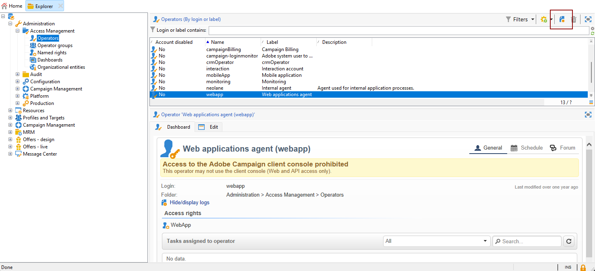
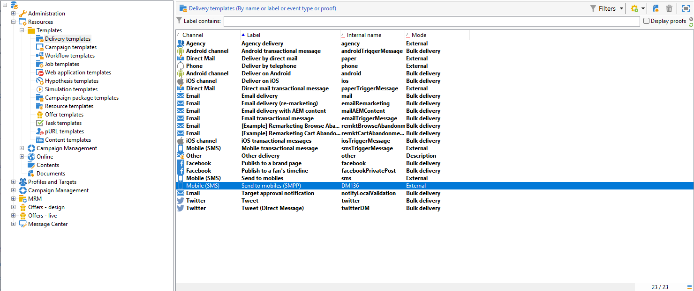

# SMS-kanaal configureren op een infrastructuur voor midsourcing {#setting-up-sms-channel}

Om naar een mobiele telefoon met midservers te verzenden, hebt u het volgende nodig:

1. Een exploitant van SMS die op de middelste server wordt gecreeerd voor de externe rekening van SMS die op de server van de Marketing wordt gecreeerd.

1. Een externe account op de marketingserver die de kanaalmodus en de leveringsmodus aangeeft.

1. Een externe account op de middelste server, met vermelding van de connector en het berichttype.

1. Een leveringsmalplaatje dat verwijzingen de externe rekening om het verzendende proces te stroomlijnen.

>[!NOTE]
>
> Voor SMS-leveringen moet de typologie een specifieke SMS-affiniteit gebruiken die in **één** specifieke toepassingsservercontainer. [Meer informatie](../../installation/using/configure-delivery-settings.md#managing-outbound-smtp-traffic-with-affinities)

## Maak de SMS-operator op de middelste server {#create-sms-operator}

Om het configuratieproces te beginnen, moet u een exploitant van SMS op de middelste-server specifiek voor de externe rekening tot stand brengen.

>[!IMPORTANT]
>
>Voor elke SMS-connector is een unieke SMS-operator vereist.

1. In de **[!UICONTROL Administration]** > **[!UICONTROL Access management]** > **[!UICONTROL Operators node]** knoop van de boom, klik **[!UICONTROL New]** pictogram.

   

1. Geef de gebruikersnamen op **[!UICONTROL Identification parameters]**, inclusief hun aanmelding, wachtwoord en naam. De aanmelding en het wachtwoord zijn nodig om de operator op veilige wijze aan te melden bij Adobe Campaign.

   Let erop dat de **[!UICONTROL Name (login)]** moet later worden gebruikt om uw externe rekening SMPP in de middelste-server te noemen.

   

1. Selecteer de toestemmingen aan de exploitant in de sectie van de toegangsrechten van de Exploitant worden verleend die.

   Als u rechten wilt toewijzen aan de operator, klikt u op de knop **[!UICONTROL Add]** boven de lijst met rechten. Selecteer vervolgens een **[!UICONTROL Operator group]** of **[!UICONTROL Named rights]** in de lijst met beschikbare groepen.

   

1. Klikken **[!UICONTROL Save]** de totstandbrenging van de operator voltooien. Het profiel is nu opgenomen in de lijst met bestaande operatoren.

## Een externe SMS-account maken op de marketingserver {#create-accound-mkt}

Als u een SMS-bericht naar een mobiele telefoon met mediaservers wilt verzenden, moet u eerst uw SMS-externe account op de marketingserver maken.

1. In de **[!UICONTROL Platform]** > **[!UICONTROL External accounts]** knoop van de boom, klik **[!UICONTROL New]** pictogram.

   

1. Typ uw **[!UICONTROL Label]** en **[!UICONTROL Internal name]**. Merk op dat de Interne naam later moet worden gebruikt om uw externe rekening SMPP in de Midden-server te noemen.

1. Het accounttype definiëren als **[!UICONTROL Routing]**, het kanaal als **[!UICONTROL Mobile (SMS)]** en de leveringsmodus als **[!UICONTROL Mid-sourcing]**.

   

1. In de **[!UICONTROL Mid-Sourcing]** , geeft u de parameters voor de serververbinding voor midsourcing op.

   Voer de gegevens in van de [eerder gemaakte SMS-connector](#create-sms-operator) in de **[!UICONTROL Account]** en **[!UICONTROL Password]** velden.

   

1. Bevestig uw configuratie door te klikken **[!UICONTROL Test the connection]**.

1. Klik op **[!UICONTROL Save]**.

## Een externe SMPP-account maken op de mediumserver {#creating-smpp-mid}

>[!IMPORTANT]
>
>Het gebruik van hetzelfde account en wachtwoord voor meerdere externe SMS-accounts kan leiden tot conflicten en overlapping tussen de accounts. Zie de [De pagina voor probleemoplossing via SMS](troubleshooting-sms.md#external-account-conflict).

Zodra u met succes uw externe rekening van SMS op de server van de Marketing hebt opgezet, is de volgende stap uw externe rekening SMPP op de middentserver te vestigen.

Voor meer informatie over het protocol en de montages van SMS, verwijs naar dit [page](sms-protocol.md).

Hiervoor voert u de volgende stappen uit:

1. In de **[!UICONTROL Platform]** > **[!UICONTROL External accounts]** knoop van de boom, klik **[!UICONTROL New]** pictogram.

1. Typ uw **[!UICONTROL Label]** en **[!UICONTROL Internal name]**.

   >[!WARNING]
   >
   >Wanneer u een **[!UICONTROL Internal name]**, zorg ervoor dat u de opgegeven naamgevingsconventie volgt:
   >  `SMS Operator Name_Internal Name of the Marketing SMS external account`

   

1. Het accounttype definiëren als **Routering**, het kanaal als **Mobiel (SMS)** en de leveringsmodus als **Bulklevering**.

   

1. Controleer de **[!UICONTROL Enabled]** doos.

1. In de **[!UICONTROL Mobile]** tab, selecteert u **[!UICONTROL Extended generic SMPP]** van de **[!UICONTROL Connector]** vervolgkeuzelijst.

   

1. De **[!UICONTROL Enable verbose SMPP traces in the log file]** optie staat u toe om al verkeer SMPP in logboekdossiers te dumpen. Deze optie zou slechts moeten worden toegelaten om de schakelaar problemen op te lossen en met het verkeer te vergelijken dat door de leverancier wordt gezien.

1. Neem contact op met uw SMS-serviceprovider die u zal uitleggen hoe u de verschillende velden voor externe accounts kunt invullen via de **[!UICONTROL Connection settings]** tab.

   Neem vervolgens contact op met uw provider, afhankelijk van de gekozen provider, die u de waarde geeft die u in de **[!UICONTROL SMSC implementation name]** veld.

   U kunt het aantal verbindingen aan de leverancier per MTA kind bepalen. De standaardwaarde is 1.

1. Standaard voldoet het aantal tekens in een SMS aan de GSM-standaarden.

   Sms-berichten met gsm-codering mogen maximaal 160 tekens bevatten of 153 tekens per sms voor berichten die in meerdere delen worden verzonden.

   >[!NOTE]
   >
   >Bepaalde tekens tellen als twee tekens (accolades, vierkante haken, het euroteken, enz.).
   >
   >De lijst met beschikbare GSM-tekens wordt weergegeven in [deze sectie](sms-set-up.md#about-character-transliteration).

   U kunt ook tekentransliteratie autoriseren door het desbetreffende vak in te schakelen.

   

1. In de **[!UICONTROL Throughput and delays]** kunt u de maximale doorvoer van uitgaande berichten (&quot;MT&quot;, Mobiel beëindigd) in MT per seconde opgeven. Als u ‘0’ invoert in het overeenkomstige veld, is de doorvoer onbeperkt.

   De waarden van alle velden die corresponderen met een tijdsduur, moeten in seconden worden ingevuld.

1. In de **[!UICONTROL Mapping of encodings]** kunt u coderingen definiëren.

   Raadpleeg [deze sectie](sms-set-up.md#about-text-encodings) voor meer informatie.

1. In de **[!UICONTROL SMSC specificities]** de **[!UICONTROL Send full phone number]** is standaard uitgeschakeld. Laat het niet toe als u het protocol wilt respecteren SMPP en slechts cijfers naar de server van de leverancier van SMS (SMSC) overbrengen.

   Aangezien bepaalde providers het gebruik van het voorvoegsel &#39;+&#39; vereisen, wordt u echter geadviseerd contact op te nemen met uw provider en wordt u aangeraden deze optie indien nodig in te schakelen.

   De **[!UICONTROL Enable TLS over SMPP]** checkbox staat u toe om verkeer te coderen SMPP. Raadpleeg [deze pagina](sms-protocol.md) voor meer informatie.

1. Als u een **[!UICONTROL Extended generic SMPP]** , kunt u automatische antwoorden instellen.

   Raadpleeg [deze sectie](sms-set-up.md#automatic-reply) voor meer informatie.

## De leveringssjabloon wijzigen {#changing-the-delivery-template}

Adobe Campaign biedt een mobiele leveringssjabloon in de **[!UICONTROL Resources > Templates > Delivery templates]** knooppunt. Raadpleeg voor meer informatie de [Over sjablonen](about-templates.md) sectie.

Om berichten door het kanaal van SMS te verzenden, moet u een malplaatje creëren dat een verwijzing naar de kanaalschakelaar omvat.

Om het inheemse leveringsmalplaatje te houden, adviseren wij dat u het dupliceert en dan het vormt.

In het onderstaande voorbeeld genereren we een sjabloon om de levering van berichten via de eerder gemaakte SMPP-account te vergemakkelijken. Dit doet u als volgt:

1. In de **[!UICONTROL Resources]** > **[!UICONTROL Templates]** > **[!UICONTROL Delivery templates]** knoop van de boom, klik met de rechtermuisknop aan **[!UICONTROL Send to mobiles]** en selecteer **[!UICONTROL Duplicate]**.

   

1. Het label van de sjabloon wijzigen, bijvoorbeeld **Verzonden naar mobiele apparaten (SMPP)**.

   

1. Klik op **[!UICONTROL Properties]**.

1. In de **[!UICONTROL General]** tab, selecteer een verpletterende wijze die aan de externe rekening beantwoordt die u in de sectie creeerde [Een externe SMS-account maken op de marketingserver](#create-accound-mkt).

   

1. Klikken **[!UICONTROL Save]** om de sjabloon te maken.

   

Je hebt nu een externe account en een leveringstemplate waarmee je via SMS kunt leveren.

## Verwante onderwerpen {#related-topics}

* [Vertaling van SMS-tekens](sms-set-up.md#about-character-transliteration)
* [Tekstcoderingen](sms-set-up.md#about-text-encodings)
* [Automatische reactie](sms-set-up.md#automatic-reply)
