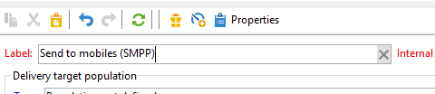

# SMS-kanaal configureren op een zelfstandige instantie {#setting-up-sms-channel}

Als u naar een mobiele telefoon wilt verzenden, hebt u het volgende nodig:

1. Een extern account met een connector en type bericht.

   Merk op dat de erfenisschakelaars nu verouderd zijn. Afgeschafte mogelijkheden zijn nog steeds beschikbaar, maar ze zullen niet verder worden verbeterd of ondersteund. Meer informatie vindt u [op deze pagina](../../rn/using/deprecated-features.md).

1. Een leveringssjabloon waarin naar deze externe account wordt verwezen.

>[!NOTE]
>
> Voor de leveringen van SMS, zou de typologie een specifieke affiniteit van SMS moeten gebruiken die in **wordt gecreeerd één** specifieke container van de toepassingsserver. [Meer informatie](../../installation/using/configure-delivery-settings.md#managing-outbound-smtp-traffic-with-affinities)

## Maak een extern SMPP-account aan {#creating-an-smpp-external-account}

>[!IMPORTANT]
>
>Het gebruik van hetzelfde account en wachtwoord voor meerdere externe SMS-accounts kan leiden tot conflicten en overlapping tussen de accounts. Verwijs naar de [ het oplossen van problemenpagina van SMS ](troubleshooting-sms.md#external-account-conflict).

Als u SMS naar een mobiele telefoon wilt verzenden, moet u eerst uw SMPP-externe account maken.
Voor meer informatie over het protocol en de montages van SMS, verwijs naar deze [ pagina ](sms-protocol.md).

Hiervoor voert u de volgende stappen uit:

1. Klik in het knooppunt **[!UICONTROL Platform]** > **[!UICONTROL External accounts]** van de structuur op het pictogram **[!UICONTROL New]** .
1. Definieer het accounttype als **Routing**, het kanaal als **mobiel (sms)** en de bezorgingsmodus als **bulklevering**.

   

1. Vink het **[!UICONTROL Enabled]** vakje aan.
1. Selecteer op het tabblad **[!UICONTROL Mobile]** **[!UICONTROL Extended generic SMPP]** in de vervolgkeuzelijst **[!UICONTROL Connector]** .

   

   >[!CAUTION]
   >
   > Vanaf versie 20.2 zijn verouderde connectors vervangen en niet ondersteund. We raden u aan de **[!UICONTROL Extended generic SMPP]** -connector te gebruiken. Voor meer informatie over hoe te om aan de geadviseerde schakelaar te migreren, verwijs naar deze [ pagina ](unsupported-connector-migration.md).

1. Met de optie **[!UICONTROL Enable verbose SMPP traces in the log file]** kunt u al het SMPP-verkeer in logbestanden dumpen. Deze optie moet zijn ingeschakeld om problemen met de connector op te lossen en om vergelijkingen te maken met het verkeer dat door de provider wordt waargenomen.

1. Neem contact op met uw SMS-serviceprovider die u uitleg geeft over het invullen van de verschillende externe accountvelden op het tabblad **[!UICONTROL Connection settings]** .

   Neem vervolgens contact op met uw provider, afhankelijk van de gekozen provider, die u de waarde geeft die u in het veld **[!UICONTROL SMSC implementation name]** wilt invoeren.

   U kunt het aantal verbindingen aan de leverancier per MTA kind bepalen. De standaardwaarde is 1.

1. Standaard voldoet het aantal tekens in een SMS aan de GSM-standaarden.

   Sms-berichten met gsm-codering mogen maximaal 160 tekens bevatten of 153 tekens per sms voor berichten die in meerdere delen worden verzonden.

   >[!NOTE]
   >
   >Bepaalde tekens tellen als twee tekens (accolades, vierkante haken, het euroteken, enz.).
   >
   >De lijst met beschikbare GSM-tekens wordt hieronder weergegeven.

   Desgewenst kunt u tekentransliteratie autoriseren door het betreffende vakje in te schakelen.

   

   Raadpleeg [deze sectie](#about-character-transliteration) voor meer informatie.

1. Op het tabblad **[!UICONTROL Throughput and delays]** kunt u de maximale doorvoer van uitgaande berichten (&quot;MT&quot;, Mobile Terminated) in MT per seconde opgeven. Als u ‘0’ invoert in het overeenkomstige veld, is de doorvoer onbeperkt.

   De waarden van alle velden die corresponderen met een tijdsduur, moeten in seconden worden ingevuld.

1. Op het tabblad **[!UICONTROL Mapping of encodings]** kunt u coderingen definiëren.

   Raadpleeg [deze sectie](#about-text-encodings) voor meer informatie.

1. Op het tabblad **[!UICONTROL SMSC specificities]** is de optie **[!UICONTROL Send full phone number]** standaard uitgeschakeld. Laat het niet toe als u het protocol wilt respecteren SMPP en slechts cijfers naar de server van de leverancier van SMS (SMSC) overbrengen.

   Aangezien bepaalde providers het gebruik van het voorvoegsel &#39;+&#39; vereisen, wordt u echter geadviseerd contact op te nemen met uw provider en wordt u aangeraden deze optie indien nodig in te schakelen.

   Met het selectievakje **[!UICONTROL Enable TLS over SMPP]** kunt u SMPP-verkeer coderen. Raadpleeg [deze pagina](sms-protocol.md) voor meer informatie.

1. Als u een **[!UICONTROL Extended generic SMPP]** -connector configureert, kunt u automatische reacties instellen.

   Raadpleeg [deze sectie](#automatic-reply) voor meer informatie.

## Vertaling van SMS-tekens {#about-character-transliteration}

Tekentransliteratie kan worden ingesteld in een externe account voor levering via SMPP mobile, onder het tabblad **[!UICONTROL Mobile]** .

Transliteratie houdt in dat een teken van een sms door een ander teken wordt vervangen wanneer dat teken niet in aanmerking wordt genomen door de gsm-standaard.

* Als transliteratie **[!UICONTROL authorized]** is, wordt elk teken dat niet in aanmerking wordt genomen, vervangen door een GSM-teken wanneer het bericht wordt verzonden. De letter ‘ë’ wordt bijvoorbeeld vervangen door ‘e’. Het bericht is daarom enigszins gewijzigd, maar de tekenlimiet blijft hetzelfde.
* Wanneer transliteratie **[!UICONTROL not authorized]** is, wordt elk bericht dat karakters bevat die niet in aanmerking worden genomen verzonden in binaire formaat (Unicode): alle karakters worden daarom verzonden aangezien zij zijn. De sms-berichten met Unicode zijn echter beperkt tot 70 tekens (of 67 tekens per sms voor berichten die in meerdere delen worden verzonden). Als het maximum aantal tekens wordt overschreden, worden verschillende berichten verzonden, wat extra kosten kan veroorzaken.

>[!IMPORTANT]
>
>Als u personalisatievelden invoegt in de inhoud van uw SMS-bericht, worden mogelijk tekens ingevoegd waarmee de GSM-codering geen rekening houdt.

Standaard is transliteratie van tekens uitgeschakeld. Als u alle tekens in uw sms-berichten wilt behouden zoals ze zijn, bijvoorbeeld om geen eigennamen te wijzigen, wordt u aangeraden deze optie niet in te schakelen.

Als uw sms-berichten echter veel tekens bevatten die Unicode-berichten genereren, kunt u deze optie inschakelen om de kosten voor het verzenden van uw berichten te beperken.

In de volgende tabel worden de tekens weergegeven waarmee de GSM-standaard rekening houdt. Alle karakters die in het berichtlichaam worden opgenomen, buiten die hieronder vermeld, zetten het volledige bericht in binair formaat (Unicode) om en beperken daarom het tot 70 karakters.

**Standaardtekens**

<table> 
 <tbody> 
  <tr> 
   <td> @ </td> 
   <td>  </td> 
   <td> SP </td> 
   <td> 0 </td> 
   <td> TP </td> 
   <td> P </td> 
   <td> voor </td> 
   <td> p </td> 
  </tr> 
  <tr> 
   <td> £ </td> 
   <td> _ </td> 
   <td> ! </td> 
   <td> 1 </td> 
   <td> A </td> 
   <td> Q </td> 
   <td> a </td> 
   <td> q </td> 
  </tr> 
  <tr> 
   <td> $ </td> 
   <td>  </td> 
   <td> ’ </td> 
   <td> 2 </td> 
   <td> B </td> 
   <td> R </td> 
   <td> b </td> 
   <td> r </td> 
  </tr> 
  <tr> 
   <td> ¥ </td> 
   <td>  </td> 
   <td> Aantal </td> 
   <td> 3 </td> 
   <td> C </td> 
   <td> S </td> 
   <td> c </td> 
   <td> s </td> 
  </tr> 
  <tr> 
   <td> è </td> 
   <td>  </td> 
   <td> ¤ </td> 
   <td> 4 </td> 
   <td> D </td> 
   <td> T </td> 
   <td> d </td> 
   <td> t </td> 
  </tr> 
  <tr> 
   <td> é </td> 
   <td>  </td> 
   <td> % </td> 
   <td> 5 </td> 
   <td> E </td> 
   <td> U </td> 
   <td> e </td> 
   <td> u </td> 
  </tr> 
  <tr> 
   <td> ù </td> 
   <td>  </td> 
   <td> &amp; </td> 
   <td> 6 </td> 
   <td> F </td> 
   <td> V </td> 
   <td> f </td> 
   <td> v </td> 
  </tr> 
  <tr> 
   <td> ì </td> 
   <td>  </td> 
   <td> ' </td> 
   <td> 7 </td> 
   <td> G </td> 
   <td> W </td> 
   <td> g </td> 
   <td> w </td> 
  </tr> 
  <tr> 
   <td> ò </td> 
   <td>  </td> 
   <td> ( </td> 
   <td> 8 </td> 
   <td> H </td> 
   <td> X </td> 
   <td> h </td> 
   <td> x </td> 
  </tr> 
  <tr> 
   <td> Functie </td> 
   <td>  </td> 
   <td> ) </td> 
   <td> 9 </td> 
   <td> Ik </td> 
   <td> Y </td> 
   <td> Ik </td> 
   <td> y </td> 
  </tr> 
  <tr> 
   <td> LF </td> 
   <td>  </td> 
   <td> * </td> 
   <td> : </td> 
   <td> J </td> 
   <td> Z </td> 
   <td> j </td> 
   <td> z </td> 
  </tr> 
  <tr> 
   <td> Ø </td> 
   <td> ESC </td> 
   <td> + </td> 
   <td> ; </td> 
   <td> K </td> 
   <td> Ä </td> 
   <td> k </td> 
   <td> ä </td> 
  </tr> 
  <tr> 
   <td> ø </td> 
   <td> AE </td> 
   <td> , </td> 
   <td> &lt; </td> 
   <td> L </td> 
   <td> Ö Ö </td> 
   <td> l </td> 
   <td> ö </td> 
  </tr> 
  <tr> 
   <td> CR </td> 
   <td> æ </td> 
   <td> - </td> 
   <td> = </td> 
   <td> M </td> 
   <td> - </td> 
   <td> m </td> 
   <td> ñ </td> 
  </tr> 
  <tr> 
   <td> Å </td> 
   <td> ß </td> 
   <td> . </td> 
   <td> &gt; </td> 
   <td> N </td> 
   <td> Ü </td> 
   <td> n </td> 
   <td> ü </td> 
  </tr> 
  <tr> 
   <td> å </td> 
   <td> É </td> 
   <td> / </td> 
   <td> ? </td> 
   <td> O </td> 
   <td> § </td> 
   <td> o </td> 
   <td> à </td> 
  </tr> 
 </tbody> 
</table>

SP: Spatie

ESC: Escape

LF: Nieuwe regel

CR: Enter-teken

**Geavanceerde tekens (twee keer geteld)**

^ { } `[ ~ ]` | €

## Tekstcoderingen {#about-text-encodings}

Wanneer u een sms-bericht verzendt, kan Adobe Campaign een of meer tekstcoderingen gebruiken. Elke codering heeft een eigen specifieke tekenset en bepaalt het aantal tekens dat in een sms-bericht past.

Wanneer u een nieuwe externe account voor levering via SMPP voor mobiele apparaten configureert, kunt u de **[!UICONTROL Mapping of encodings]** op het tabblad **[!UICONTROL Mobile]** definiëren: in het veld **[!UICONTROL data_coding]** kan Adobe Campaign meedelen welke codering wordt gebruikt voor de SMSC.

>[!NOTE]
>
>De toewijzing tussen de waarde **data_coding** en de werkelijk gebruikte codering wordt gestandaardiseerd. Niettemin, hebben bepaalde SMSC hun eigen specifieke afbeelding: in dit geval, moet uw **Adobe Campaign** beheerder deze afbeelding verklaren. Neem contact op met uw provider om meer informatie te krijgen.

U kunt **data_codings** verklaren en het coderen dwingen indien nodig: om dit te doen, één enkele het coderen in de lijst specificeren.

* Wanneer er geen toewijzing van coderingen is gedefinieerd, neemt de connector een algemeen gedrag aan:

   * Er wordt geprobeerd gsm-codering te gebruiken waaraan de waarde **data_coding = 0** wordt toegewezen.
   * Als gsm-codering mislukt, wordt **UCS2** -codering gebruikt waaraan de waarde **data_coding = 8** wordt toegewezen.

* Wanneer u de coderingen definieert die u wilt gebruiken en de gekoppelde veldwaarden van **[!UICONTROL data_coding]** , probeert Adobe Campaign de eerste codering in de lijst te gebruiken, gevolgd door de volgende codering als de eerste codering onmogelijk blijkt.

>[!IMPORTANT]
>
>De volgorde van de declaratie is belangrijk. U wordt aangeraden de lijst in oplopende volgorde **van kosten** te plaatsen om voorrang te geven aan de coderingen, zodat u in elk sms-bericht zoveel mogelijk tekens kunt plaatsen.
>
>Declareer alleen de coderingen die u wilt gebruiken. Als sommige coderingen die door het SMSC worden verstrekt niet met uw doel van gebruik zouden moeten beantwoorden, verklaar hen niet in de lijst.

## Automatische reactie {#automatic-reply}

Wanneer vestiging een uitgebreide generische schakelaar SMPP, kunt u automatische antwoorden vormen.

Wanneer een abonnee op een SMS-bericht reageert dat via Adobe Campaign naar hem is verzonden en zijn bericht een trefwoord zoals &quot;STOP&quot; bevat, kunt u berichten configureren die automatisch naar hem worden teruggestuurd in de sectie **[!UICONTROL Automatic reply sent to the MO]** .

>[!NOTE]
>
>De trefwoorden zijn niet hoofdlettergevoelig.

Voor elk sleutelwoord, specificeer een korte code, die een aantal is dat gewoonlijk wordt gebruikt om leveringen te verzenden en als afzendernaam zal dienen, dan ga het bericht in dat naar de abonnee zal worden verzonden.

Je kunt ook een actie koppelen aan je automatische reactie: **[!UICONTROL Send to quarantine]** of **[!UICONTROL Remove from quarantine]**. Als een ontvanger bijvoorbeeld het trefwoord &quot;STOP&quot; verzendt, ontvangt hij automatisch een bevestiging van de uitschrijving en wordt hij in quarantaine geplaatst.

Als u de **[!UICONTROL Remove from quarantine]** actie koppelt aan een automatisch antwoord, worden de ontvangers die het bijbehorende trefwoord verzenden, automatisch uit quarantaine verwijderd.

Ontvangers worden vermeld in de tabel **[!UICONTROL Non deliverables and addresses]** die beschikbaar is via het menu **[!UICONTROL Administration]** > **[!UICONTROL Campaign Management]** > **[!UICONTROL Non deliverables Management]** .

* Als u hetzelfde antwoord wilt verzenden, ongeacht de korte code, laat u de kolom **[!UICONTROL Short code]** leeg.
* Als u hetzelfde antwoord wilt verzenden, ongeacht het trefwoord, laat u de kolom **[!UICONTROL Keyword]** leeg.
* Als u een actie wilt uitvoeren zonder een reactie te verzenden, laat u de kolom **[!UICONTROL Response]** leeg. Zo kunt u bijvoorbeeld een gebruiker die met een ander bericht dan &quot;STOP&quot; reageert, uit quarantaine verwijderen.

Als u veelvoudige externe rekeningen gebruikend de Uitgebreide generische schakelaar SMPP met de zelfde leveranciersrekening hebt, kan de volgende kwestie gebeuren: wanneer het verzenden van een antwoord naar een korte code, kan het op om het even welk van uw externe rekeningsverbindingen worden ontvangen. Het automatische antwoord dat wordt verzonden, kan dan ook niet het verwachte bericht zijn.
U kunt dit voorkomen door een van de volgende oplossingen toe te passen, afhankelijk van de provider die u gebruikt:

* Maak één leverancieraccount voor elke externe account.
* Gebruik het veld **[!UICONTROL System type]** op de tab **[!UICONTROL Mobile]** > **[!UICONTROL Connection settings]** om elke korte code van elkaar te onderscheiden. Vraag uw provider om een andere waarde voor elke account.

  

De stappen voor vestiging een externe rekening die de Uitgebreide generische schakelaar gebruiken SMPP worden gedetailleerd in [ creeer een externe rekening SMPP ](#creating-an-smpp-external-account) sectie.

## De leveringssjabloon wijzigen {#changing-the-delivery-template}

Adobe Campaign biedt u een sjabloon voor levering aan mobiele apparaten. Deze sjabloon is beschikbaar in het knooppunt **[!UICONTROL Resources > Templates > Delivery templates]** . Voor meer op dit, verwijs naar [ Ongeveer malplaatjes ](about-templates.md) sectie.

Om via het kanaal van SMS te leveren, moet u een malplaatje tot stand brengen waarin de kanaalschakelaar van verwijzingen wordt voorzien.

Om het inheemse leveringsmalplaatje te houden, adviseren wij dat u het dupliceert en dan het vormt.

In het onderstaande voorbeeld maken we een sjabloon om berichten af te leveren via het SMPP-account dat eerder is ingeschakeld. Dit doet u als volgt:

1. Ga naar het **[!UICONTROL Delivery templates]** knooppunt.
1. Klik met de rechtermuisknop op de sjabloon **[!UICONTROL Send to mobiles]** en selecteer **[!UICONTROL Duplicate]** .

   

1. Verander het etiket van het malplaatje, bijvoorbeeld **Verzonden aan mobiles (SMPP)**.

   

1. Klik op **[!UICONTROL Properties]**.
1. Selecteer op het tabblad **[!UICONTROL General]** een routeringsmodus die overeenkomt met de externe account die u in de vorige stappen hebt gemaakt.

   

1. Klik op **[!UICONTROL Save]** om de sjabloon te maken.

   

Je hebt nu een externe account en een leveringstemplate waarmee je via SMS kunt leveren.
