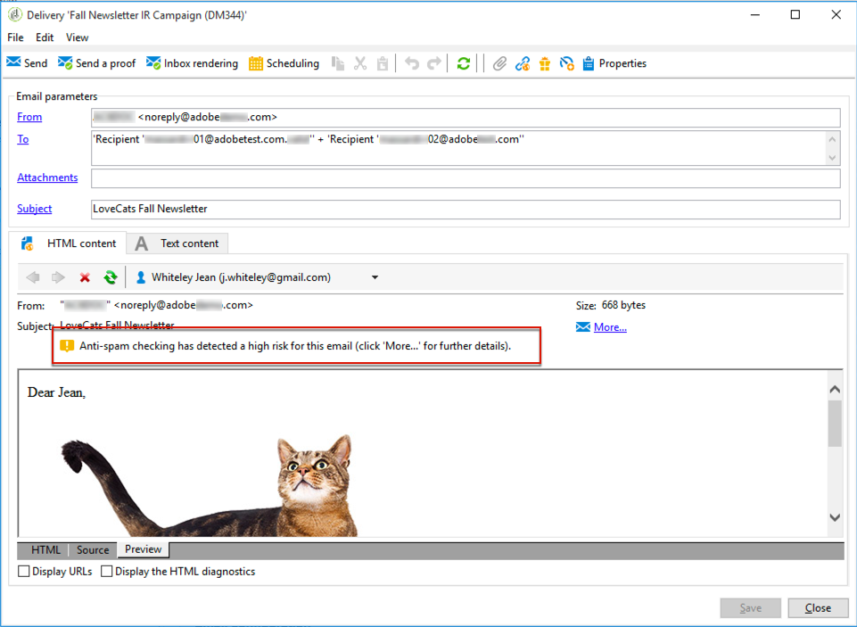

# SpamAssassin{#spamassassin}

## Info over SpamAssassin {#about-spamassassin}

Adobe Campaign kan worden gevormd om met [SpamAssassin](https://spamassassin.apache.org) te werken, een derdedienst die voor e-mailspamfiltratie wordt gebruikt. Dit staat u toe om e-mailberichten te scoren om te bepalen of een bericht het risico loopt om als spam door de anti-anti-spamhulpmiddelen worden beschouwd die op ontvangstbewijs worden gebruikt.

SpamAssassin maakt gebruik van diverse spamdetectietechnieken, waaronder:

* DNS-gebaseerde en op vage controlesom gebaseerde spamdetectie
* Bayesiaans filteren
* Externe programma&#39;s
* Lijsten van gewezen personen
* Online databases

>[!NOTE]
>
>SpamAssassin moet op de de toepassingsserver van Adobe Campaign worden geïnstalleerd en worden gevormd. Raadpleeg [deze sectie](../../installation/using/configuring-spamassassin.md) voor meer informatie.
>
>De regels die bepalen of een element al dan niet spam is worden beheerd via SpamAssassin en kunnen door een beheerder met voorrechten worden uitgegeven.

## SpamAssassin {#using-spamassassin} gebruiken

Nadat u de e-maillevering hebt gemaakt en de inhoud ervan hebt gedefinieerd, volgt u de onderstaande stappen om de risico&#39;s te evalueren.

Raadpleeg [deze sectie](../../delivery/using/about-email-channel.md) voor meer informatie over het maken en ontwerpen van een levering.

1. Ga naar het tabblad **[!UICONTROL Preview]**. 
1. Selecteer een ontvanger om een voorvertoning van uw levering weer te geven.

   

   >[!NOTE]
   >
   >Als u geen ontvanger selecteert, kan de anti-spamcontrole niet worden uitgevoerd.

1. Het resultaat van de test wordt aangegeven met een waarschuwingsbericht. Als een hoog risiconiveau wordt gedetecteerd, wordt het volgende waarschuwingsbericht weergegeven:

   

1. Klik op de koppeling **[!UICONTROL More...]** naast de waarschuwing.
1. Selecteer het tabblad **[!UICONTROL Anti-spam checking]**. 
1. Ga naar **[!UICONTROL Points / Rule / Description]** sectie om de redenen voor dit risico te bekijken.

   

>[!NOTE]
>
>Telkens als u **[!UICONTROL Anti-spam checking]** klikt, wordt de dienst SpamAssassin geroepen en het bericht wordt opnieuw geanalyseerd voor anti-spamopsporing. Controleer of u de inhoud hebt gewijzigd voordat u de anti-spamanalyse opnieuw uitvoert.
