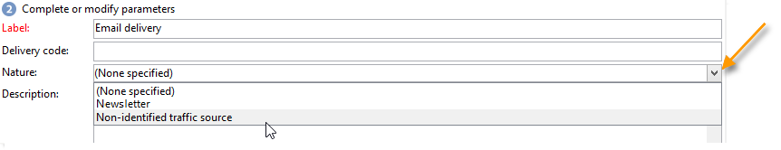

# De levering maken en identificeren {#create-and-identify-the-delivery}

## De levering maken {#creating-the-delivery}

U kunt een levering maken via het overzicht of via het **[!UICONTROL Create > Delivery]** menu.

Als u een levering wilt maken, klikt u **[!UICONTROL Create]** boven de lijst met leveringen. Wanneer u een nieuwe levering creeert, moet u op het gebruikte leveringskanaal wijzen. Om dit te doen, selecteer het aangewezen leveringsmalplaatje van de drop-down lijst op het **[!UICONTROL Delivery template]** gebied.

Voor elk kanaal dat u hebt geïnstalleerd, is een standaardsjabloon beschikbaar: direct mail, e-mail, fax, telefoon, mobiel kanaal (SMS), Facebook, Twitter, enz.

>[!NOTE]
>
>Welke kanalen in de lijst worden aangeboden, is afhankelijk van uw licentieovereenkomst.

U kunt nieuwe leveringsmalplaatjes tot stand brengen om specifieke parameters vooraf te vormen om uw behoeften aan te passen. Zie [deze sectie](../../delivery/using/about-templates.md)voor meer informatie over sjablonen.

## Identificatie van de levering {#identifying-the-delivery}

U moet parameters voltooien om de levering te identificeren. Dit doet u als volgt:

1. Voer in het **[!UICONTROL Label]** veld een naam in voor de levering.

   Een leveringscode kan ook aan de levering worden toegewezen. De naam van de levering en de bijbehorende code worden weergegeven in de lijst met leveringen, maar kunnen niet door de ontvangers worden gezien.

1. Voeg een beschrijving toe aan het **[!UICONTROL Description]** veld.
1. Selecteer de leveringsaard op het relevante gebied. Deze informatie is handig voor het bijhouden van de levering: u kunt filteren op basis van dit criterium in de leveringslijst of query&#39;s maken aan de hand van dit selectiecriterium.

   

1. Klik **[!UICONTROL Continue]** om deze informatie te bevestigen en het venster van de berichtconfiguratie te tonen.

De leveringsinhoud is klaar om te worden gevormd. De definitie van de inhoud van de levering is specifiek voor elk kanaal. Raadpleeg de desbetreffende sectie voor meer informatie hierover:

* [De e-mailinhoud definiëren](../../delivery/using/defining-the-email-content.md)
* [De SMS-inhoud definiëren](../../delivery/using/sms-channel.md#defining-the-sms-content)
* [De inhoud voor direct mail definiëren](../../delivery/using/defining-the-direct-mail-content.md)
* [Pushmeldingen](../../delivery/using/about-mobile-app-channel.md)

