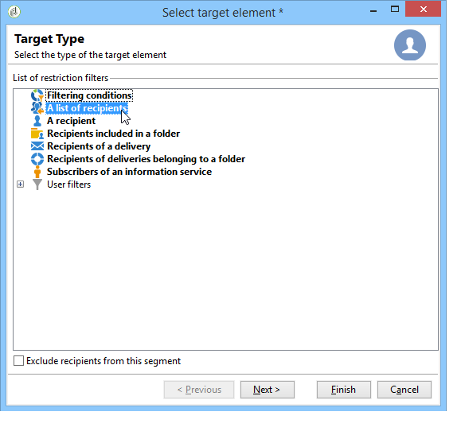

# Doelpopulatie definiëren {#defining-the-target-population}

Voor elke levering kunt u verschillende typen doelpopulaties definiëren:

* **Hoofdpubliek**: profielen die berichten ontvangen. [Meer informatie](steps-defining-the-target-population.md#selecting-the-main-target)
* **Proef**: ontvangers van bewijsberichten, betrokken bij de bevestigingscyclus. [Meer informatie](steps-defining-the-target-population.md#defining-a-specific-proof-target)
* **Zaadadressen**: ontvangers die buiten het leveringsdoel vallen, maar de levering zullen ontvangen (alleen in het kader van een marketingcampagne). [Meer informatie](about-seed-addresses.md)
* **Controlegroepen**: bevolking die de levering niet zal ontvangen, wordt gebruikt om het gedrag en de impact van de campagne te volgen (alleen in het kader van een marketingcampagne). [Meer informatie](../../campaign/using/marketing-campaign-target.md#defining-a-control-group).

## Selecteer de belangrijkste ontvangers van de levering {#selecting-the-main-target}

In de meeste gevallen wordt het hoofddoel opgehaald uit de Adobe Campaign-database (standaardmodus). Ontvangers kunnen echter ook in een extern bestand worden opgeslagen. Lees meer in [deze sectie](steps-defining-the-target-population.md#selecting-external-recipients).

Volg onderstaande stappen om de ontvangers van een levering te selecteren:

1. Selecteer in de leveringseditor de optie **[!UICONTROL To]**.
1. Als de ontvangers in het gegevensbestand worden opgeslagen, kies de eerste optie.

   

1. Selecteer de doeltoewijzing in het dialoogvenster **[!UICONTROL Target mapping]** vervolgkeuzelijst. Standaard Adobe Campaign-doeltoewijzing is **[!UICONTROL Recipients]**, gebaseerd op **nms:ontvanger** schema.

   Andere doeltoewijzingen zijn beschikbaar, en sommige kunnen met uw specifieke configuratie verwant zijn. Raadpleeg voor meer informatie over doeltoewijzingen [Doeltoewijzing selecteren](selecting-a-target-mapping.md).

1. Klik op de knop **[!UICONTROL Add]** om beperkingsfilters te definiëren.

   Vervolgens kunt u het type filter selecteren dat u wilt toepassen:

   

   U kunt ontvangers selecteren aan de hand van de doeltypen die in de database zijn gedefinieerd. Als u een doeltype wilt gebruiken, selecteert u het en klikt u op **[!UICONTROL Next]**. Voor elk doel kunt u de betrokken ontvangers weergeven door op de knop **[!UICONTROL Preview]** tab. Voor bepaalde typen doelsoorten wordt de **[!UICONTROL Refine target]** Met deze knop kunt u verschillende doelcriteria combineren.

   De volgende doeltypen worden standaard aangeboden:

   * **[!UICONTROL Filtering conditions]** : met deze optie kunt u een query definiëren en het resultaat weergeven. De methode voor het definiëren van query&#39;s wordt weergegeven in [deze sectie](../../platform/using/creating-filters.md#creating-an-advanced-filter).
   * **[!UICONTROL Subscribers of an information service]** : met deze optie kunt u een nieuwsbrief selecteren waarop de ontvangers moeten worden geabonneerd om op de levering te kunnen worden gericht die wordt gemaakt.

     

   * **[!UICONTROL Recipients of a delivery]** : met deze optie kunt u de ontvangers van een bestaande levering definiëren als een doelcriterium. U moet dan de levering in de lijst selecteren:

     

   * **[!UICONTROL Delivery recipients belonging to a folder]** : met deze optie kunt u een leveringsmap selecteren en de ontvangers van de leveringen in die map als doel instellen.

     

     U kunt het gedrag van ontvangers filteren door een keuze te maken in de vervolgkeuzelijst:

     

     >[!NOTE]
     >
     >De **[!UICONTROL Include sub-folders]** Met deze optie kunt u zich ook richten op de leveringen in mappen in de boomstructuur onder het geselecteerde knooppunt.

   * **[!UICONTROL Recipients included in a folder]** : met deze optie kunt u de profielen in een specifieke map van de boomstructuur als doel instellen.
   * **[!UICONTROL A recipient]** : met deze optie kunt u een specifieke ontvanger selecteren uit de profielen in de database.
   * **[!UICONTROL A list of recipients]** : met deze optie kunt u een lijst met ontvangers als doel instellen. Lijsten worden weergegeven in het dialoogvenster [deze sectie](../../platform/using/creating-and-managing-lists.md).
   * **[!UICONTROL User filters]** : met deze optie hebt u toegang tot de vooraf geconfigureerde filters om deze te gebruiken als filtercriteria voor profielen in de database. Vooraf geconfigureerde filters worden weergegeven in [deze sectie](../../platform/using/creating-filters.md#saving-a-filter).
   * De optie **[!UICONTROL Exclude recipients corresponding to this segment]** Hiermee kunt u zich richten op ontvangers die niet voldoen aan de gedefinieerde doelcriteria. Als u deze optie wilt gebruiken, selecteert u het desbetreffende vak en past u vervolgens de focus toe, zoals eerder is gedefinieerd, om de resulterende profielen uit te sluiten.

     

1. Voer een naam in voor dit doel in het dialoogvenster **[!UICONTROL Label]** veld. Standaard is het label het label van het eerste doelcriterium. Voor een combinatie is het beter om een expliciete naam te gebruiken.
1. Klikken **[!UICONTROL Finish]** om het gevormde richten te bevestigen.

   De gedefinieerde doelcriteria worden samengevat in het centrale gedeelte van het hoofdtabblad voor doelconfiguratie. Klik op een criterium om de inhoud ervan weer te geven (configuratie en voorvertoning). Als u een criterium wilt verwijderen, klikt u op het kruisje dat zich na het label bevindt.

   

### Externe ontvangers selecteren {#selecting-external-recipients}

U kunt een levering starten bij ontvangers die niet in de database zijn opgeslagen, maar wel in een extern bestand. We sturen hier bijvoorbeeld een levering naar ontvangers die zijn geïmporteerd uit een tekstbestand.

Dit doet u als volgt:

1. Klik op de knop **[!UICONTROL To]** koppeling om de ontvangers van uw levering te selecteren.
1. Selecteer de **[!UICONTROL Defined in an external file]** -optie.

   

1. Ontvangers worden standaard in de database geïmporteerd. U moet de optie **[!UICONTROL Target mapping]**. Raadpleeg voor meer informatie over doeltoewijzingen [Doeltoewijzing selecteren](selecting-a-target-mapping.md)

   U kunt ook **[!UICONTROL Do not import the recipients into the database]**.

1. Klik bij het importeren van de ontvangers op de knop **[!UICONTROL File format definition...]** koppeling gebruiken om het externe bestand te selecteren en te configureren.

   Voor meer informatie over het importeren van gegevens raadpleegt u [deze sectie](../../platform/using/executing-import-jobs.md#step-2---source-file-selection).

1. Klikken **[!UICONTROL Finish]** en configureer uw levering als standaardlevering.

>[!CAUTION]
>
>Wanneer het bepalen van de inhoud van het bericht voor e-maillevering, omvat niet de verbinding aan de spiegelpagina; het kan niet op deze leveringswijze worden geproduceerd.

### Uitsluitingsinstellingen definiëren {#define-exclusion-settings}

Adresfouten en kwaliteitsbeoordelingen worden geleverd door de serviceprovider (IAP). Deze informatie wordt automatisch bijgewerkt in het ontvangende profiel na leveringsacties en met dossiers die door dienstverleners zijn teruggekeerd. Deze kan alleen-lezen in het profiel worden weergegeven.

U kunt adressen uitsluiten die een bepaald aantal opeenvolgende fouten hebben bereikt, of waarvan de kwaliteitsclassificatie onder een drempel is die in dit venster wordt gespecificeerd. U kunt ook kiezen of u niet-gekwalificeerde adressen waarvoor geen gegevens zijn geretourneerd, wilt autoriseren.

>[!NOTE]
>
>Als twee ontvangers dezelfde voornaam, achternaam, postcode en plaats in een directe postbestelling hebben, zal een dubbele fout voorkomen en zal het duplicaat niet in aanmerking worden genomen.

De **[!UICONTROL Exclusions]** wordt gebruikt om het aantal berichten te beperken.

>[!NOTE]
>
>Standaardparameters worden aanbevolen, maar u kunt de instellingen naar wens aanpassen. Deze opties mogen echter alleen door een deskundige gebruiker worden gewijzigd om elk misbruik en elke fout te voorkomen.

Klik op de knop **[!UICONTROL Edit...]** koppeling om de standaardconfiguratie te wijzigen.

De volgende opties zijn beschikbaar:

* **[!UICONTROL Exclude duplicate addresses during delivery]**. Deze optie is standaard actief: hiermee kunt u dubbele e-mailadressen tijdens de levering verwijderen. De toegepaste strategie kan variëren afhankelijk van hoe Adobe Campaign wordt gebruikt en het type gegevens in het gegevensbestand.

  De standaardwaarde van de optie kan voor elke leveringsmalplaatje worden gevormd.

  Bijvoorbeeld:

   * Levering van een nieuwsbrief of elektronische documentlevering. In sommige gevallen wordt geen uitsluiting van duplicaten toegepast als de gegevens geen native duplicaten hebben. Een paar dat zich abonneert op hetzelfde e-mailadres, kan verwachten twee specifieke persoonlijke e-mailberichten te ontvangen: een die op naam aan elk individu is gericht. In dit geval kan deze optie niet zijn geselecteerd.
   * Aflevering van een marketingcampagne: dubbele uitsluiting is van essentieel belang om te voorkomen dat te veel berichten naar dezelfde ontvanger worden gestuurd. In dat geval kunt u deze optie selecteren.

     Als u deze optie uitschakelt, hebt u toegang tot een extra optie: **[!UICONTROL Keep duplicate records (same identifier)]**. Hiermee kunt u meerdere leveringen toestaan aan ontvangers die aan verschillende doelcriteria voldoen.

     

* **[!UICONTROL Exclude recipients who no longer want to be contacted]** , d.w.z. ontvangers waarvan het e-mailadres in de lijst van gewezen personen staat (&#39;Weigeren&#39;). Deze optie moet geselecteerd blijven om de beroepsethiek van e-marketing en de wetgeving inzake e-handel te eerbiedigen.
* **[!UICONTROL Exclude quarantined recipients]**. Met deze optie kunt u profielen met een adres dat niet reageert, uitsluiten van het doel. We raden u ten zeerste aan deze optie geselecteerd te houden.

  >[!NOTE]
  >
  >Voor meer informatie over quarantainebeheer raadpleegt u [quarantainebeheer begrijpen](understanding-quarantine-management.md).

* **[!UICONTROL Limit delivery]** naar een bepaald aantal berichten. Met deze optie kunt u het maximum aantal berichten invoeren dat moet worden verzonden. Als de inhoud van het doel het aangegeven aantal berichten overschrijdt, wordt een willekeurige selectie toegepast op het doel.

### De omvang van de doelpopulatie verminderen {#reducing-the-size-of-the-target-population}

U kunt de grootte van de doelpopulatie verminderen. Geef hiertoe het aantal ontvangers op dat u wilt exporteren in het dialoogvenster **[!UICONTROL Requested quantity]** veld.

## Ontvangers van proefdrukberichten selecteren {#selecting-the-proof-target}

De proef is een speciaal bericht dat u een levering laat testen alvorens het naar het belangrijkste doel te verzenden. Ontvangers van het bewijs zijn verantwoordelijk voor het goedkeuren van zowel de vorm als de inhoud van het bericht.

 [Ontdek deze functie in video](#seeds-and-proofs-video)

Voer de onderstaande stappen uit om het doel van de proefdrukken te selecteren:

1. Klik op de koppeling **[!UICONTROL To]**.
1. Klik op de knop **[!UICONTROL Target of the proofs]** tab.
1. Klik op de knop **[!UICONTROL Targeting mode]** veld waarin u de toe te passen methode kunt kiezen: **[!UICONTROL Definition of a specific proof target]** , **[!UICONTROL Substitution of the address]** , **[!UICONTROL Seed addresses]** of **[!UICONTROL Specific target and seed addresses]**.

>[!NOTE]
>
>Gewoonlijk kan het doel voor de proefdruk worden toegevoegd aan het hoofddoel. Selecteer hiertoe in de onderste sectie van het dialoogvenster **[!UICONTROL Main target]** tab.

## Een specifiek proefdrukdoel definiëren {#defining-a-specific-proof-target}

Als u het proefdrukdoel selecteert, wordt **[!UICONTROL Definition of a specific proof target]** Met deze optie kunt u de ontvangers van de proefdrukken selecteren uit de profielen in de database.

Selecteer deze optie om ontvangers te kiezen met de **[!UICONTROL Add]** , zoals bij het definiëren van het hoofddoel. Zie [Selecteer het hoofddoel](steps-defining-the-target-population.md#selecting-the-main-target).

Voor meer informatie over het verzenden van bewijzen raadpleegt u [deze sectie](steps-validating-the-delivery.md#sending-a-proof).

### Adres vervangen in proefdruk gebruiken {#using-address-substitution-in-proof}

In plaats van speciale ontvangers in de database te selecteren, kunt u de opdracht **[!UICONTROL Substitution of the address]** -optie.

Met deze optie kunt u de profielen van de ontvangers van de levering gebruiken en hun e-mailadressen vervangen door een of meer andere adressen waarop de proefdruk wordt uitgevoerd.

Als deze optie is geselecteerd, worden de proefdrukadressen ingevuld in een speciale editor waarmee u de vervanging(en) kunt configureren.

De configuratie wordt uitgevoerd als volgt:

1. Klik op de knop **[!UICONTROL Add]** pictogram om een vervanging te definiëren.
1. Voer het gewenste adres in dat u wilt gebruiken of selecteer het adres in de lijst.
1. Selecteer het profiel dat u wilt gebruiken in de proefdruk: sla het profiel op **[!UICONTROL Random]** waarde in de **[!UICONTROL Profile to use]** kolom om de gegevens van om het even welk profiel van het doel in de proef te gebruiken.

   

1. Klik op de knop **[!UICONTROL Detail]** om een profiel te selecteren in het hoofddoel, zoals in het volgende voorbeeld:

   

   U kunt zo veel vervangende adressen definiëren als nodig is.

## zaadadressen gebruiken als proefdruk {#using-seed-addresses-as-proof}

U kunt **[!UICONTROL Seed addresses]** als doel van de proefdrukken: met deze optie kunt u een lijst met bestaande zaadadressen gebruiken of importeren.

>[!NOTE]
>
>Zaadadressen worden weergegeven in [Informatie over zaadadressen](about-seed-addresses.md).

U kunt de definitie van een specifiek proefdrukdoel en het gebruik van zaadadressen combineren gebruikend **[!UICONTROL Specific target and Seed addresses]** -optie. De gerelateerde configuraties worden vervolgens in twee aparte subtabbladen gedefinieerd.

Zie ook:

* [Proofingdoel selecteren](#selecting-the-proof-target)
* [Seedadressen](about-seed-addresses.md)
* [Gebruiksscenario: seedadressen selecteren op criteria](use-case-selecting-seed-addresses-on-criteria.md)

## Video over zelfstudie {#seeds-and-proofs-video}

In deze video leert u hoe u zaden en proefdrukken aan een bestaande e-mail kunt toevoegen en hoe u deze kunt verzenden.

>[!VIDEO](https://video.tv.adobe.com/v/25606?quality=12)

Er zijn aanvullende Campaign Classic-to-video&#39;s beschikbaar [hier](https://experienceleague.adobe.com/docs/campaign-classic-learn/tutorials/overview.html?lang=nl).
