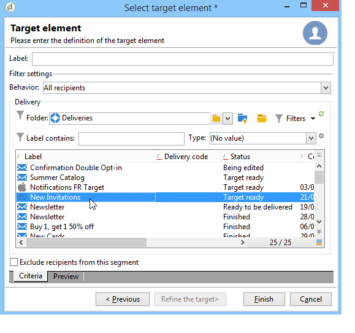

# Bepaling van de doelpopulatie {#defining-the-target-population}

## Over doelpopulaties {#about-target-populations}

Voor elke levering kunt u verschillende typen doelpopulaties definiëren. In de onderstaande sectie vindt u meer informatie over het selecteren van:

* **De belangrijkste ontvangers van de levering**. [Lees meer](../../delivery/using/steps-defining-the-target-population.md#selecting-the-main-target).
* **De ontvangers van bewijsberichten**, om een validatiecyclus op te zetten. [Lees meer](../../delivery/using/steps-defining-the-target-population.md#defining-a-specific-proof-target).

Bovendien, kunt u [zaadadressen](../../delivery/using/about-seed-addresses.md), en [controlegroepen](../../campaign/using/marketing-campaign-deliveries.md#defining-a-control-group)ook bepalen. indien de levering in een afzetcampagne is opgenomen.

## De belangrijkste ontvangers van de levering selecteren {#selecting-the-main-target}

In de meeste gevallen wordt het hoofddoel opgehaald uit de Campagne-database (standaardmodus).

Ontvangers kunnen ook in een extern bestand worden opgeslagen. De configuratie van dit type van levering wordt voorgesteld in het [Selecteren van externe ontvangers](../../delivery/using/steps-defining-the-target-population.md#selecting-external-recipients).

Voer de volgende stappen uit om de ontvangers van de levering te selecteren:

1. Klik op de **[!UICONTROL To]** koppeling.
1. Als de ontvangers in het gegevensbestand worden opgeslagen, selecteer de eerste optie.

   

1. Selecteer de doelafbeelding in de **[!UICONTROL Target mapping]** vervolgkeuzelijst. Standaard doeltoewijzing voor Adobe Campagne is **[!UICONTROL Recipients]**.

   Andere doeltoewijzingen zijn beschikbaar, en sommige kunnen met uw specifieke configuratie verwant zijn. Zie [Doeltoewijzing](../../delivery/using/selecting-a-target-mapping.md)selecteren voor meer informatie over doeltoewijzingen.

1. Klik op de **[!UICONTROL Add]** knop om beperkingsfilters te definiëren.

   Vervolgens kunt u het type filter selecteren dat u wilt toepassen:

   

   U kunt ontvangers selecteren aan de hand van de doeltypen die in de database zijn gedefinieerd. Als u een doeltype wilt gebruiken, selecteert u het en klikt u **[!UICONTROL Next]**. Voor elk doel kunt u de betrokken ontvangers weergeven door op het **[!UICONTROL Preview]** tabblad te klikken. Voor bepaalde soorten doel kunt u met de **[!UICONTROL Refine target]** knop verschillende doelcriteria combineren.

   De volgende doeltypen worden standaard aangeboden:

   * **[!UICONTROL Filtering conditions]** : Met deze optie kunt u een query definiëren en het resultaat weergeven. De methode om vragen te bepalen wordt voorgesteld in [deze sectie](../../platform/using/creating-filters.md#creating-an-advanced-filter).
   * **[!UICONTROL Subscribers of an information service]** : met deze optie kunt u een nieuwsbrief selecteren waarop de ontvangers moeten worden geabonneerd om de levering die wordt gemaakt als doel te hebben.

      

   * **[!UICONTROL Recipients of a delivery]** : met deze optie kunt u de ontvangers van een bestaande levering definiëren als een doelcriterium. U moet dan de levering in de lijst selecteren:

      

   * **[!UICONTROL Delivery recipients belonging to a folder]** : Met deze optie kunt u een leveringsmap selecteren en de ontvangers van de leveringen in die map als doel instellen.

      

      U kunt het gedrag van ontvangers filteren door een keuze te maken in de vervolgkeuzelijst:

      

      >[!NOTE]
      >
      >Met de **[!UICONTROL Include sub-folders]** optie kunt u ook de leveringen in mappen in de boomstructuur onder het geselecteerde knooppunt als doel instellen.

   * **[!UICONTROL Recipients included in a folder]** : met deze optie kunt u de profielen in een specifieke map van de boomstructuur als doel instellen.
   * **[!UICONTROL A recipient]** : met deze optie kunt u een specifieke ontvanger selecteren uit de profielen in de database.
   * **[!UICONTROL A list of recipients]** : met deze optie kunt u een lijst met ontvangers als doel instellen. Lijsten worden weergegeven in de [onderhavige sectie](../../platform/using/creating-and-managing-lists.md).
   * **[!UICONTROL User filters]** : met deze optie hebt u toegang tot de vooraf geconfigureerde filters om deze te gebruiken als filtercriteria voor profielen in de database. Vooraf geconfigureerde filters worden in [deze sectie](../../platform/using/creating-filters.md#saving-a-filter)weergegeven.
   * Met deze optie **[!UICONTROL Exclude recipients corresponding to this segment]** kunt u zich richten op ontvangers die niet aan de gedefinieerde doelcriteria voldoen. Als u deze optie wilt gebruiken, selecteert u het desbetreffende vak en past u vervolgens de focus toe, zoals eerder is gedefinieerd, om de resulterende profielen uit te sluiten.

      

1. Voer in het **[!UICONTROL Label]** veld een naam in voor dit doel. Standaard is het label het label van het eerste doelcriterium. Voor een combinatie is het beter om een expliciete naam te gebruiken.
1. Klik **[!UICONTROL Finish]** om het gevormde richten te bevestigen.

   De gedefinieerde doelcriteria worden samengevat in het centrale gedeelte van het hoofdtabblad voor doelconfiguratie. Klik op een criterium om de inhoud ervan weer te geven (configuratie en voorvertoning). Als u een criterium wilt verwijderen, klikt u op het kruisje dat zich na het label bevindt.

   

### Externe ontvangers selecteren {#selecting-external-recipients}

U kunt een levering starten bij ontvangers die niet in de database zijn opgeslagen, maar wel in een extern bestand. We sturen hier bijvoorbeeld een levering naar ontvangers die zijn geïmporteerd uit een tekstbestand.

Dit doet u als volgt:

1. Klik op de **[!UICONTROL To]** koppeling om de ontvangers van de levering te selecteren.
1. Selecteer de **[!UICONTROL Defined in an external file]** optie.

   

1. Ontvangers worden standaard in de database geïmporteerd. U moet de **[!UICONTROL Target mapping]** optie selecteren. Raadpleeg Een doeltoewijzing [selecteren voor meer informatie over doeltoewijzingen](../../delivery/using/selecting-a-target-mapping.md)

   U kunt ook kiezen **[!UICONTROL Do not import the recipients into the database]**.

1. Wanneer het invoeren van de ontvangers, klik de **[!UICONTROL File format definition...]** verbinding om het externe dossier te selecteren en te vormen.

   Raadpleeg [deze sectie](../../platform/using/importing-data.md#step-2---source-file-selection)voor meer informatie over het importeren van gegevens.

1. Klik **[!UICONTROL Finish]** en vorm uw levering als standaardlevering.

>[!CAUTION]
>
>Neem bij het definiëren van de inhoud van het bericht voor verzending via e-mail niet de koppeling naar de spiegelpagina op; het kan niet op deze leveringswijze worden geproduceerd.

### Uitsluitingsinstellingen instellen {#customizing-exclusion-settings}

Adresfouten en kwaliteitsbeoordelingen worden geleverd door de serviceprovider (IAP). Deze informatie wordt automatisch bijgewerkt in het ontvangende profiel na leveringsacties en met dossiers die door dienstverleners zijn teruggekeerd. Deze kan alleen-lezen in het profiel worden weergegeven.

U kunt adressen uitsluiten die een bepaald aantal opeenvolgende fouten hebben bereikt, of waarvan de kwaliteitsclassificatie onder een drempel is die in dit venster wordt gespecificeerd. U kunt ook kiezen of u niet-gekwalificeerde adressen waarvoor geen gegevens zijn geretourneerd, al dan niet wilt autoriseren.

>[!NOTE]
>
>Als twee ontvangers dezelfde voornaam, achternaam, postcode en plaats in een directe postbestelling hebben, zal een dubbele fout voorkomen en zal het duplicaat niet in aanmerking worden genomen.

Het **[!UICONTROL Exclusions]** tabblad wordt gebruikt om het aantal berichten te beperken.

>[!NOTE]
>
>Standaardparameters worden aanbevolen, maar u kunt de instellingen naar wens aanpassen. Deze opties mogen echter alleen door een deskundige gebruiker worden gewijzigd om elk misbruik en elke fout te voorkomen.

Klik op de **[!UICONTROL Edit...]** koppeling om de standaardconfiguratie te wijzigen.

De volgende opties zijn beschikbaar:

* **[!UICONTROL Exclude duplicate addresses during delivery]**. Deze optie is standaard actief: hiermee kunt u dubbele e-mailadressen tijdens de levering verwijderen. De toegepaste strategie is afhankelijk van de manier waarop Adobe Campaign wordt gebruikt en het type gegevens in de database.

   De standaardwaarde van de optie kan voor elke leveringsmalplaatje worden gevormd.

   Bijvoorbeeld:

   * Levering van een nieuwsbrief of elektronische documentlevering. In sommige gevallen wordt geen uitsluiting van duplicaten toegepast als de gegevens geen native duplicaten hebben. Een paar dat zich abonneert op hetzelfde e-mailadres, kunnen twee specifieke persoonlijke e-mailberichten ontvangen: één gericht tot elke persoon op naam. In dit geval kan deze optie niet zijn geselecteerd.
   * Aflevering van een marketingcampagne: dubbele uitsluiting is van essentieel belang om te voorkomen dat te veel berichten naar dezelfde ontvanger worden verzonden . In dat geval kunt u deze optie selecteren.

      Als u deze optie uitschakelt, hebt u toegang tot een extra optie: **[!UICONTROL Keep duplicate records (same identifier)]**. Hiermee kunt u meerdere leveringen toestaan aan ontvangers die aan verschillende doelcriteria voldoen.

      

* **[!UICONTROL Exclude recipients who no longer want to be contacted]** , d.w.z. ontvangers wier e-mailadressen op een zwarte lijst staan (&#39;Weigeren&#39;). Deze optie moet geselecteerd blijven om de beroepsethiek van e-marketing en de wetgeving inzake e-handel te eerbiedigen.
* **[!UICONTROL Exclude quarantined recipients]**. Met deze optie kunt u profielen met een adres dat niet reageert, uitsluiten van het doel. We raden u ten zeerste aan deze optie geselecteerd te houden.

   >[!NOTE]
   >
   >Voor meer informatie over quarantainebeheer, verwijs naar het [Begrip van quarantainebeheer](../../delivery/using/understanding-quarantine-management.md).

* **[!UICONTROL Limit delivery]** naar een bepaald aantal berichten. Met deze optie kunt u het maximum aantal berichten invoeren dat moet worden verzonden. Als de inhoud van het doel het aangegeven aantal berichten overschrijdt, wordt een willekeurige selectie toegepast op het doel.

### De omvang van de doelpopulatie verminderen {#reducing-the-size-of-the-target-population}

U kunt de grootte van de doelpopulatie verminderen. Hiervoor geeft u het aantal ontvangers op dat in het **[!UICONTROL Requested quantity]** veld moet worden geëxporteerd.

## Ontvangers van proefdrukberichten selecteren {#selecting-the-proof-target}

De proef is een speciaal bericht dat u een levering laat testen alvorens het naar het belangrijkste doel te verzenden. Ontvangers van het bewijs zijn verantwoordelijk voor het goedkeuren van zowel de vorm als de inhoud van het bericht.

Voer de onderstaande stappen uit om het doel van de proefdrukken te selecteren:

1. Klik op de **[!UICONTROL To]** koppeling.
1. Klik op het **[!UICONTROL Target of the proofs]** tabblad.
1. Klik op het **[!UICONTROL Targeting mode]** veld om de toe te passen methode te kiezen: **[!UICONTROL Definition of a specific proof target]** , **[!UICONTROL Substitution of the address]** , **[!UICONTROL Seed addresses]** of **[!UICONTROL Specific target and seed addresses]**.

>[!NOTE]
>
>Gewoonlijk kan het doel voor de proefdruk worden toegevoegd aan het hoofddoel. Selecteer hiertoe de gewenste optie in de onderste sectie van het **[!UICONTROL Main target]** tabblad.

## Een specifiek proefdrukdoel definiëren {#defining-a-specific-proof-target}

Als u het proefdrukdoel selecteert, kunt u met de **[!UICONTROL Definition of a specific proof target]** optie de proefdrukontvangers selecteren in de profielen in de database.

Selecteer deze optie om ontvangers te kiezen met de **[!UICONTROL Add]** knop, zoals bij het definiëren van het hoofddoel. Zie [Het hoofddoel](../../delivery/using/steps-defining-the-target-population.md#selecting-the-main-target)selecteren.

Raadpleeg [deze sectie](../../delivery/using/steps-validating-the-delivery.md#sending-a-proof)voor meer informatie over het verzenden van bewijzen.

### Het vervangen van adressen gebruiken in proef {#using-address-substitution-in-proof}

In plaats van speciale ontvangers in de database te selecteren, kunt u de **[!UICONTROL Substitution of the address]** optie gebruiken.

Met deze optie kunt u de profielen van de ontvangers van de levering gebruiken en hun e-mailadressen vervangen door een of meer andere adressen waarop de proefdruk wordt uitgevoerd.

Als deze optie is geselecteerd, worden de proefdrukadressen ingevuld in een speciale editor waarmee u de vervanging(en) kunt configureren.

De configuratie wordt uitgevoerd als volgt:

1. Klik op het **[!UICONTROL Add]** pictogram om een vervanging te definiëren.
1. Voer het gewenste adres in dat u wilt gebruiken of selecteer het adres in de lijst.
1. Selecteer het profiel dat u wilt gebruiken in de proefdruk: Sla de **[!UICONTROL Random]** waarde in de **[!UICONTROL Profile to use]** kolom op als u de gegevens van een willekeurig profiel van het doel in de proefdruk wilt gebruiken.

   

1. Klik op het **[!UICONTROL Detail]** pictogram om een profiel in het hoofddoel te selecteren, zoals in het volgende voorbeeld:

   

   U kunt zo veel vervangende adressen definiëren als nodig is.

## zaadadressen gebruiken als proef {#using-seed-addresses-as-proof}

U kunt de proefdrukken als doel **[!UICONTROL Seed addresses]** gebruiken: met deze optie kunt u een lijst met bestaande zaadadressen gebruiken of importeren.

>[!NOTE]
>
>De zaadadressen worden voorgesteld in [Ongeveer zaadadressen](../../delivery/using/about-seed-addresses.md).

U kunt de definitie van een specifiek proefdrukdoel en het gebruik van zaadadressen combineren gebruikend de **[!UICONTROL Specific target and Seed addresses]** optie. De gerelateerde configuraties worden vervolgens in twee aparte subtabbladen gedefinieerd.
