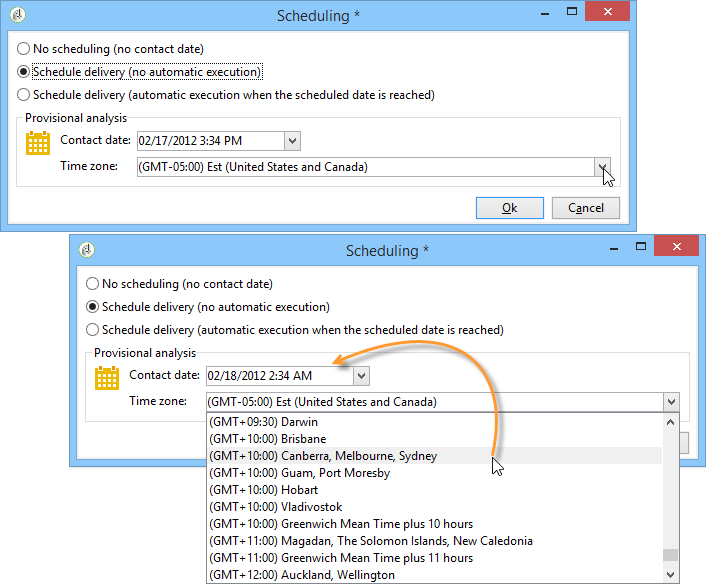
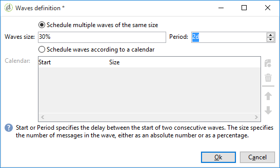

# De levering configureren en verzenden {#configuring-and-sending-the-delivery}

>[!NOTE]
>
>Alleen de eigenaar van de levering kan een levering starten. Als een andere operator (of een operatorgroep) een levering wil starten, moet u deze als controleurs toevoegen in het **[!UICONTROL Delivery start:]** veld.
>
>Zie [deze paragraaf](../../campaign/using/marketing-campaign-approval.md#selecting-reviewers) voor meer informatie.

## Aanvullende parameters voor levering {#delivery-additiona-parameters}

Voordat u de levering verzendt, kunt u de verzendende parameters in de leveringseigenschappen definiëren via het **[!UICONTROL Delivery]** tabblad.

* **[!UICONTROL Delivery priority]**: Met deze optie kunt u de verzendvolgorde voor uw leveringen beïnvloeden door hun prioriteitsniveau (normaal, hoog of laag) op te geven. Hierdoor kunt u de volgorde voor bepaalde, meer urgente leveringen voorrang geven boven andere.

* **[!UICONTROL Message batch quantity]**: Met deze optie kunt u het aantal berichten definiëren dat is gegroepeerd binnen hetzelfde XML-leveringspakket. Als de parameter op 0 wordt geplaatst, worden de berichten automatisch gegroepeerd. De pakketgrootte wordt bepaald door de berekening `<delivery size>/1024`, met minimaal 8 en maximaal 256 berichten per pakket.

   >[!CAUTION]
   >
   >Wanneer de levering wordt gedupliceerd, wordt de parameter opnieuw ingesteld.

* **[!UICONTROL Send using multiple waves]**: Meer informatie hierover vindt u in [Verzenden met meerdere golven](#sending-using-multiple-waves).

* **[!UICONTROL Test SMTP delivery]**: Deze optie staat u toe om het verzenden van een levering via SMTP te testen. De levering wordt verwerkt tot verbinding aan de server SMTP maar niet verzonden.

   >[!NOTE]
   >
   >Het wordt niet aangeraden deze optie te gebruiken wanneer u medio-sourcing gebruikt om mta niet aan te roepen.
   >
   >Voor meer informatie bij het vormen van een server SMTP, verwijs naar [deze sectie](../../installation/using/configuring-campaign-server.md#personalizing-delivery-parameters).

* **[!UICONTROL Archive emails]**: Met deze optie kunt u e-mailberichten op een extern systeem opslaan via BCC door eenvoudig een BCC-e-mailadres toe te voegen aan uw berichtdoel. Raadpleeg E-mails [archiveren voor meer informatie](../../delivery/using/sending-messages.md#archiving-emails).

Zodra de levering wordt gevormd en klaar om worden verzonden, zorg ervoor u de analyse [van de](../../delivery/using/steps-validating-the-delivery.md#analyzing-the-delivery)Levering in werking hebt gesteld. Klik eenmaal **[!UICONTROL Confirm delivery]** om de levering van berichten te starten.

U kunt de leveringstovenaar dan sluiten en de uitvoering van de levering van het **[!UICONTROL Delivery]** lusje volgen, dat via de details van deze levering of via de lijst van leveringen toegankelijk is.

Nadat u berichten hebt verzonden, kunt u de leveringen controleren en volgen. Raadpleeg de volgende secties voor meer informatie:

* [Toezicht op levering](../../delivery/using/monitoring-a-delivery.md)
* [Leveringsfouten begrijpen](../../delivery/using/understanding-delivery-failures.md)
* [Over berichten bijhouden](../../delivery/using/about-message-tracking.md)

## De verzending van de levering plannen {#scheduling-the-delivery-sending}

U kunt de levering van berichten uitstellen om de levering te plannen of om verkoopdruk te beheren en te voorkomen dat een populatie te groot wordt.

1. Klik op de **[!UICONTROL Send]** knop en selecteer de **[!UICONTROL Postpone delivery]** optie.

1. Geef een begindatum op in het **[!UICONTROL Contact date]** veld.

1. U kunt dan de leveringsanalyse beginnen, dan bevestig de levering verzendend. De verzending van de levering begint echter pas op de in het **[!UICONTROL Contact date]** veld vermelde datum.

>[!CAUTION]
>
>Wanneer u met de analyse bent begonnen, is de contactdatum die u hebt bepaald vast. Als u deze datum wijzigt, moet u de analyse opnieuw starten, zodat rekening wordt gehouden met uw wijzigingen.

In de leveringslijst wordt de levering weergegeven met de **[!UICONTROL Pending]** status.

De planning kan ook upstream via de **[!UICONTROL Scheduling]** knoop van de levering worden gevormd.

U kunt de levering uitstellen tot een latere datum of de levering opslaan in de voorlopige kalender.

* Met de **[!UICONTROL Schedule delivery (no automatic execution)]** optie kunt u een voorlopige analyse van de levering plannen.

   Wanneer deze configuratie wordt opgeslagen, verandert de levering in **[!UICONTROL Targeting pending]** status. De analyse wordt op de opgegeven datum gestart.

* Met de **[!UICONTROL Schedule delivery (automatic execution on planned date)]** optie kunt u de leveringsdatum opgeven.

   Klik **[!UICONTROL Send]** en selecteer **[!UICONTROL Postpone delivery]** dan lanceer de analyse en bevestig levering. Wanneer de analyse volledig is, is het leveringsdoel klaar en de berichten zullen automatisch worden verzonden op de gespecificeerde datum.

Datums en tijden worden uitgedrukt in de tijdzone van de huidige operator. In de **[!UICONTROL Time zone]** vervolgkeuzelijst onder het invoerveld voor de contactdatum kunt u de ingevoerde datum en tijd automatisch omzetten in de geselecteerde tijdzone.

Bijvoorbeeld, als u een levering plant die automatisch om 8 uur de tijd van Londen moet worden uitgevoerd, wordt de tijd automatisch omgezet in de geselecteerde tijdzone:

## Verzenden met meerdere golven {#sending-using-multiple-waves}

Als u de lading in evenwicht wilt brengen, kunt u leveringen in verscheidene partijen verdelen. Configureer het aantal partijen en hun verhouding ten opzichte van de volledige levering.

>[!NOTE]
>
>U kunt alleen de grootte en de vertraging tussen twee opeenvolgende golven definiëren. De ontvankelijke selectiecriteria voor elke golf kunnen niet worden gevormd.

1. Open het venster met de leveringseigenschappen en klik op het **[!UICONTROL Delivery]** tabblad.
1. Selecteer de **[!UICONTROL Send using multiple waves]** optie en klik op de **[!UICONTROL Define waves...]** koppeling.

   

1. Om golven te vormen, kunt u of:

   * Bepaal de grootte voor elke golf. Bijvoorbeeld, als u op het overeenkomstige gebied ingaat, zal elke golf 30% van de berichten vertegenwoordigen inbegrepen in de levering, behalve laatste, die 10% van de berichten zal vertegenwoordigen. **[!UICONTROL 30%]**

      Geef in het **[!UICONTROL Period]** veld de vertraging op tussen het begin van twee opeenvolgende golven. Als u bijvoorbeeld invoert, begint de eerste golf onmiddellijk, de tweede golf over twee dagen, de derde golf over vier dagen, enzovoort. **[!UICONTROL 2d]**

      

   * Definieer een kalender voor het verzenden van elke golf.

      Geef in de **[!UICONTROL Start]** kolom de vertraging op tussen het begin van twee opeenvolgende golven. Voer in de **[!UICONTROL Size]** kolom een vast getal of een percentage in.

      In het volgende voorbeeld vertegenwoordigt de eerste golf 25% van het totale aantal berichten inbegrepen in de levering en zal onmiddellijk beginnen. De volgende twee golven voltooien de levering en zijn geplaatst om met intervallen van zes uur te beginnen.

      
   Een specifieke typologieregel, **[!UICONTROL Wave scheduling check]** zorgt ervoor dat de laatste golf vóór de grens van de leveringsgeldigheid wordt gepland. De typologieën van de campagne en hun regels, die op het **[!UICONTROL Typology]** lusje van de leveringseigenschappen worden gevormd, worden voorgesteld in het proces van de [Bevestiging met typologieën](../../delivery/using/steps-validating-the-delivery.md#validation-process-with-typologies).

   >[!CAUTION]
   >
   >Zorg ervoor de laatste golven niet de leveringsdeadline overschrijden, die in het **[!UICONTROL Validity]** lusje wordt bepaald. Anders kunnen sommige berichten niet worden verzonden.
   >
   >U moet ook genoeg tijd voor pogingen toestaan wanneer het vormen van de laatste golven. Zie [deze sectie](../../delivery/using/steps-sending-the-delivery.md#configuring-retries).

1. Ga naar de leveringslogboeken om uw verzendingen te controleren. Zie [deze pagina](../../delivery/using/monitoring-a-delivery.md#delivery-logs-and-history).

   U kunt de leveringen zien die reeds in de verwerkte golven (status) werden verzonden en de leveringen die in de resterende golven (**[!UICONTROL Sent]****[!UICONTROL Pending]** status) moeten worden verzonden.

De twee onderstaande voorbeelden zijn de meest gebruikte voorbeelden voor het gebruik van meerdere golven.

* **Tijdens het opvoerproces**

   Wanneer e-mails met een nieuw platform worden verzonden, zijn internetproviders (ISP&#39;s) verdacht van IP-adressen die niet worden herkend. Als er plotseling grote hoeveelheden e-mails worden verzonden, markeren de ISP&#39;s deze vaak als spam.

   Als u wilt voorkomen dat spam wordt gemarkeerd, kunt u het verzonden volume progressief verhogen met golven. Dit zou een vlotte ontwikkeling van de startfase moeten verzekeren en u toelaten om het algemene tarief van ongeldige adressen te verminderen.

   Gebruik hiervoor de **[!UICONTROL Schedule waves according to a calendar]** optie. Stel bijvoorbeeld de eerste golf in op 10%, de tweede op 15% enzovoort.

   

* **Campagnes die een callcenter impliceren**

   Wanneer het leiden van een campagne van de telefoonloyaliteit, heeft uw organisatie een beperkte capaciteit om het aantal vraag te verwerken om abonnees te contacteren.

   Gebruikend golven, kunt u het aantal berichten tot 20 per dag beperken, die de dagelijkse verwerkingscapaciteit van een vraagcentrum is.

   Selecteer de **[!UICONTROL Schedule multiple waves of the same size]** optie om dit te doen. Voer deze optie in **[!UICONTROL 20]** als de grootte van de golf en **[!UICONTROL 1d]** in het **[!UICONTROL Period]** veld.

   

## Opnieuw proberen configureren {#configuring-retries}

Voor tijdelijk niet-geleverde berichten als gevolg van een **Zachte** of **Genegeerde** fout wordt het automatisch opnieuw proberen uitgevoerd. De types en de redenen van de leveringsmislukking worden voorgesteld in deze [sectie](../../delivery/using/understanding-delivery-failures.md#delivery-failure-types-and-reasons).

De centrale sectie van het **[!UICONTROL Delivery]** lusje voor leveringsparameters wijst op hoeveel herpogingen de dag na de levering en de minimumvertraging tussen herpogingen zouden moeten worden uitgevoerd.

Door gebrek, zijn vijf herpogingen gepland voor de eerste dag van de levering met een minimuminterval van één uur uitgespreid over de 24 uren van de dag. Elke dag opnieuw proberen wordt geprogrammeerd na dat en tot de leveringsdeadline, die in het **[!UICONTROL Validity]** lusje wordt bepaald (zie het [Definiëren van geldigheidsperiode](../../delivery/using/steps-sending-the-delivery.md#defining-validity-period)).

>[!NOTE]
>
>Voor gehoste of hybride installaties, als u aan Verbeterde MTA hebt bevorderd, worden de retry montages in de levering niet meer gebruikt door Campagne. De zachte stuitpogingen en de tijdsduur tussen hen worden bepaald door Verbeterde MTA gebaseerd op het type en de strengheid van de stuiteringsreacties die van het e-maildomein van het bericht terugkomen.
>
>Alle gevolgen worden beschreven in het document [Verbeterde MTA](https://helpx.adobe.com/campaign/kb/campaign-enhanced-mta.html) van de Campagne van Adobe.

## Geldigheidsduur definiëren {#defining-validity-period}

Wanneer de levering is gestart, kunnen de berichten (en eventuele nieuwe pogingen) worden verzonden tot de leveringstermijn. Dit wordt aangegeven in de leveringseigenschappen, via het **[!UICONTROL Validity]** tabblad.

* In het **[!UICONTROL Delivery duration]** veld kunt u de limiet voor algemene leveringspogingen invoeren. Dit betekent dat de Campagne van Adobe de berichten verzendt die op de begindatum beginnen, en dan, voor berichten die een fout slechts terugkeren, regelmatig, configureerbare herpogingen worden uitgevoerd tot de geldigheidsgrens wordt bereikt.

   U kunt ook datums opgeven. Selecteer **[!UICONTROL Explicitly set validity dates]** deze optie. In dit geval kunt u ook de tijd opgeven op basis van de uiterste datum voor levering en geldigheid. De huidige tijd wordt standaard gebruikt, maar u kunt deze rechtstreeks wijzigen in het invoerveld.

* **Geldigheidslimiet van middelen**: Het **[!UICONTROL Validity limit]** veld wordt gebruikt voor geüploade bronnen, voornamelijk voor de spiegelpagina en afbeeldingen. De bronnen op deze pagina zijn gedurende een beperkte tijd geldig (om schijfruimte te besparen).

   De waarden in dit veld kunnen worden uitgedrukt in de eenheden die in [deze sectie](../../platform/using/adobe-campaign-workspace.md#default-units)worden vermeld.

>[!NOTE]
>
>Voor gehoste of hybride installaties, als u aan Verbeterde MTA hebt bevorderd, zal het plaatsen in uw levering van de Campagne slechts worden gebruikt als reeks aan **[!UICONTROL Delivery duration]** 3.5 **** dagen of minder. Als u een waarde definieert die hoger is dan 3,5 dagen, wordt hiermee geen rekening gehouden.
>
>Alle gevolgen worden beschreven in het document [Verbeterde MTA](https://helpx.adobe.com/campaign/kb/campaign-enhanced-mta.html) van de Campagne van Adobe.
