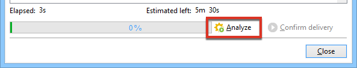
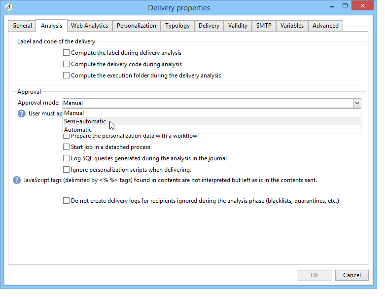

# De levering valideren {#validating-the-delivery}

Wanneer een levering is gecreeerd en gevormd, moet u het bevestigen alvorens het naar het belangrijkste doel te verzenden.

Dit doet u als volgt:

1. **De levering** analyseren: met deze stap kunt u de te leveren berichten voorbereiden. Raadpleeg [De levering](#analyzing-the-delivery)analyseren.

   De regels die tijdens analyse worden toegepast worden voorgesteld in het [Validatieproces met typologiesectie](#validation-process-with-typologies) . De beschikbare validatiemodi worden gedetailleerd beschreven in het gedeelte [De goedkeuringsmodus](#changing-the-approval-mode) wijzigen.

1. **Proefdrukken** verzenden: Met deze stap kunt u inhoud, URL&#39;s, personalisatievelden, enzovoort goedkeuren. Zie Een proefdruk  verzenden en een specifiek proefdrukdoel definiëren.

>[!IMPORTANT]
>
>Beide stappen moeten noodzakelijk na elke wijziging van de berichtinhoud worden uitgevoerd.

## De levering analyseren {#analyzing-the-delivery}

De analyse is het stadium waarin de doelpopulatie wordt berekend en de leveringsinhoud wordt voorbereid. Zodra het volledig is, is de levering klaar om worden verzonden.

### De analyse starten {#launching-the-analysis}

1. Klik op **[!UICONTROL Send]** om de leveringanalyse te starten.
1. Selecteer **[!UICONTROL Deliver as soon as possible]**.

   

1. Klik **[!UICONTROL Analyze]** om de analyse handmatig te starten.

   Op de voortgangsbalk ziet u de voortgang van de analyse.

   

   >[!NOTE]
   >
   >De validatieregels die tijdens de analyse worden gebruikt, worden beschreven in de sectie [Validatie met typologieën](../../delivery/using/steps-validating-the-delivery.md#validation-process-with-typologies) .

1. U kunt de analyse op elk gewenst moment stoppen door op **[!UICONTROL Stop]** te klikken.

   

   Tijdens de voorbereidingsfase worden geen berichten verzonden. U kunt de analyse daarom zonder risico starten of annuleren.

   >[!IMPORTANT]
   >
   >Wanneer de analyse loopt, bevriest de levering (of het bewijs). Elke wijziging in de levering (of het bewijs) moet worden gevolgd door een andere analyse voordat zij van toepassing wordt.

1. Wacht tot de analyse is voltooid.

   Wanneer de analyse is voltooid, geeft de bovenste sectie van het venster aan of de voorbereiding van de levering is voltooid of dat er fouten zijn opgetreden. Alle validatiestappen, waarschuwingen en fouten worden weergegeven. De gekleurde pictogrammen tonen het berichttype:
   * Het blauwe pictogram geeft een informatief bericht aan.
   * Het gele pictogram geeft een niet-kritieke verwerkingsfout aan.
   * Het rode pictogram geeft een kritieke fout aan die het verzenden van de levering verhindert.
   

1. Klik **[!UICONTROL Close]** om eventuele fouten te corrigeren.

1. Nadat u de wijzigingen hebt aangebracht, klikt u opnieuw op de analyse **[!UICONTROL Analyze]**.

Na het controleren van het resultaat van de analyse, zult u kunnen klikken om het bericht naar het gespecificeerde doel **[!UICONTROL Confirm delivery]** te verzenden. Met een bevestigingsbericht kunt u de levering starten.

>[!NOTE]
>
>Klik op de **[!UICONTROL Change the main delivery target]** koppeling als het aantal te verzenden berichten niet overeenkomt met uw configuratie. Zo kunt u de definitie van de doelpopulatie wijzigen en de analyse opnieuw starten.

### Parameters voor analyse {#analysis-parameters}

Op het **[!UICONTROL Analysis]** tabblad van de leveringseigenschappen kunt u een set gegevens definiëren voor de voorbereiding van berichten tijdens de analysefase.

Op dit tabblad hebt u toegang tot de volgende opties:

* **[!UICONTROL Label and code of the delivery]** : de opties in deze sectie worden gebruikt om de waarden van deze velden tijdens de fase van de leveringsanalyse te berekenen. In het **[!UICONTROL Compute the execution folder during the delivery analysis]** veld wordt de naam berekend van de map die deze leveringsactie tijdens de analysefase zal bevatten.
* **[!UICONTROL Approval mode]** : in dit veld kunt u handmatig of automatisch afleveren definiëren wanneer de analyse is voltooid. De validatiemodi worden weergegeven in de sectie [De goedkeuringsmodus](#changing-the-approval-mode) wijzigen.
* **[!UICONTROL Prepare the delivery parts in the database]** : met deze optie kunt u de prestaties van de leveringsanalyse verbeteren. Zie [deze sectie](#improving-delivery-analysis)voor meer informatie.
* **[!UICONTROL Prepare the personalization data with a workflow]** : met deze optie kunt u de aanpassingsgegevens in uw levering voorbereiden in een automatische workflow, waardoor u een aanzienlijke prestatieverhoging voor het uitvoeren van personalisatie kunt realiseren. Zie Verpersoonlijking [optimaliseren voor meer informatie](../../delivery/using/personalization-fields.md#optimizing-personalization).
* **[!UICONTROL Start job in a detached process]** : met deze optie kunt u de leveringsanalyse in een afzonderlijk proces starten. De analysefunctie gebruikt standaard het serverproces voor de Adobe Campagne-toepassing (webserver). Als u deze optie selecteert, zorgt u ervoor dat de analyse ook wordt voltooid wanneer de toepassingsserver uitvalt.
* **[!UICONTROL Log SQL queries generated during the analysis in the journal]** : deze optie voegt de SQL vraaglogboeken aan het leveringsdagboek tijdens de analysefase toe.
* **[!UICONTROL Ignore personalization scripts during sending]** : Met deze optie kunt u de interpretatie van JavaScript-instructies in HTML-inhoud omzeilen. Ze worden op dezelfde manier weergegeven als in de geleverde inhoud. Deze richtlijnen worden geïntroduceerd met de tag **&lt;%=** ).

### De prestaties van de leveringsanalyse verbeteren {#improving-delivery-analysis}

Om de voorbereiding van de levering te versnellen, kunt u de **[!UICONTROL Prepare the delivery parts in the database]** optie controleren alvorens de analyse te lanceren.

Wanneer deze optie wordt toegelaten, wordt de levering voorbereiding uitgevoerd direct binnen het gegevensbestand, dat de analyse kan beduidend versnellen.

Deze optie is momenteel alleen beschikbaar als aan de volgende voorwaarden is voldaan:
* De levering moet een e-mail zijn. De andere kanalen worden momenteel niet ondersteund.
* U moet niet midsourcing of extern verpletteren, slechts bulklevering gebruiken die type verplettert. U kunt het verpletteren controleren die op het **[!UICONTROL General]** lusje van **[!UICONTROL Delivery properties]**. wordt gebruikt.
* U kunt geen populatie richten die uit een extern dossier komt. Voor één levering, klik de **[!UICONTROL To]** verbinding van **[!UICONTROL Email parameters]** en controleer dat de **[!UICONTROL Defined in the database]** optie wordt geselecteerd. Voor levering die in een werkschema wordt gebruikt, controleer dat de ontvangers **[!UICONTROL Specified by the inbound event(s)]** op het **[!UICONTROL Delivery]** tabel zijn.
* U moet een PostSQL-database gebruiken.

### De prioriteit van de analyse configureren {#analysis-priority-}

Wanneer de levering deel uitmaakt van een campagne, biedt het **[!UICONTROL Advanced]** tabblad een extra optie. Zo kunt u de verwerkingsvolgorde voor leveringen in dezelfde campagne ordenen.

Elke levering wordt geanalyseerd voordat deze wordt verzonden. De duur van de analyse is afhankelijk van het extractiebestand van de levering. Hoe groter de grootte van het bestand, des te langer de analyse duurt, waardoor de volgende leveringen wachten.

Met de opties voor de **[!UICONTROL Message preparation by the scheduler]** component kunt u de leveringsanalyse in een campagneworkflow als prioriteit instellen.

Als een levering te groot is, is het beter om een lage prioriteit aan het toe te wijzen om de analyse van andere werkschemaleveringen te vermijden vertragen.

>[!NOTE]
>
>Om ervoor te zorgen dat de grotere leveringsanalyses de vooruitgang van uw werkschema&#39;s niet vertragen, kunt u hun uitvoeringen plannen door te tikken **[!UICONTROL Schedule execution for a time of low activity]**.

## Een proefafdruk verzenden {#sending-a-proof}

Adobe raadt u ten zeerste aan een validatiecyclus voor levering in te stellen om mogelijke fouten in de berichtconfiguratie op te sporen. Zorg ervoor dat de inhoud zo vaak als nodig wordt goedgekeurd door proefdrukken naar testontvangers te verzenden. Telkens wanneer een wijziging wordt aangebracht, moet voor de goedkeuring van de inhoud een bewijs worden verzonden.

>[!NOTE]
>
>* De beschikbare validatiemodi worden gedetailleerd weergegeven in de [goedkeuringsmodus](../../delivery/using/steps-validating-the-delivery.md#changing-the-approval-mode)wijzigen.
>* De configuratie van het proefdrukdoel wordt verklaard in het [bepalen van een specifiek proefdrukdoel](../../delivery/using/steps-defining-the-target-population.md#defining-a-specific-proof-target).
>

Volg onderstaande stappen om een proefdruk te verzenden:

1. Controleer of het proefdrukdoel is geconfigureerd zoals wordt beschreven in [Een specifiek proefdrukdoel](../../delivery/using/steps-defining-the-target-population.md#defining-a-specific-proof-target)definiëren.
1. Klik **[!UICONTROL Send a proof]** op de bovenste balk van de wizard voor levering.

   

1. Analyse van berichten starten. Zie De levering [analyseren](../../delivery/using/steps-validating-the-delivery.md#analyzing-the-delivery).
1. U kunt de levering nu verzenden (zie De levering [verzenden](../../delivery/using/steps-sending-the-delivery.md)).

   Nadat de levering is verzonden, wordt de proefdruk weergegeven in de leveringslijst en wordt deze automatisch gemaakt en genummerd. Deze kan worden bewerkt als u toegang wilt krijgen tot de inhoud en eigenschappen van de sjabloon. Raadpleeg deze [pagina](../../delivery/using/monitoring-a-delivery.md#delivery-dashboard)voor meer informatie.

   

   >[!NOTE]
   >
   >Als er verschillende indelingen voor de levering zijn gemaakt (HTML en Tekst), kunt u de indeling kiezen van de berichten die naar de ontvangers van de proefdrukken in de onderste sectie van het venster worden verzonden.

   

Mogelijk wilt u de inhoud van de levering wijzigen als gevolg van opmerkingen van de validatiegroep die de proefafdruk ontvangt. Nadat u de wijzigingen hebt aangebracht, moet u de analyse opnieuw starten en een andere proefdruk verzenden. Elke nieuwe proef wordt genummerd en het programma geopend in het leveringsdagboek.

Nadat de levering is geanalyseerd, kunt u de verschillende proefdrukken weergeven die via het **[!UICONTROL Proofs]** subtabblad van het logbestand (**[!UICONTROL Audit]** tabblad) zijn verzonden.

U moet zoveel proefdrukken verzenden als nodig zijn totdat de inhoud van de levering is voltooid. Daarna kunt u de levering naar het hoofddoel verzenden en de validatiecyclus sluiten.

Op het **[!UICONTROL Advanced]** tabblad met leveringseigenschappen kunt u de eigenschappen van de proefdruk definiëren. Indien nodig, kunt u de ontvankelijke uitsluitingsregels met voeten treden.

De volgende opties zijn beschikbaar:

* Met de eerste optie kunt u de proefdrukverdubbelingen behouden.
* Met beide volgende opties kunt u ontvangers op de zwarte lijst en adressen in quarantaine houden. Zie de beschrijving van deze opties voor het hoofddoel in [Uitsluitingsinstellingen](../../delivery/using/steps-defining-the-target-population.md#customizing-exclusion-settings)aanpassen. In tegenstelling tot het doel van een levering, waar deze adressen door gebrek worden uitgesloten, worden zij gehouden door gebrek voor het doel van een proef.
* Met de **[!UICONTROL Keep the delivery code for the proof]** optie kunt u dezelfde leveringscode opgeven als voor de levering waarop de optie betrekking heeft. Deze code wordt gespecificeerd in de eerste stap van de leveringstovenaar.
* Standaard wordt het onderwerp van de proefdruk voorafgegaan door &#39;Bewijs nr.&#39;, waarbij # het nummer van de proefdruk is. U kunt dit voorvoegsel wijzigen in het **[!UICONTROL Label prefix]** veld.

## Validatieproces met typologieën {#validation-process-with-typologies}

Alvorens om het even welke berichten te verzenden, zou u de campagne moeten analyseren om zijn inhoud en configuratie goed te keuren. De controleregels die tijdens de analysefase worden toegepast, worden in een **typologie** gedefinieerd. Voor e-mails worden standaard de volgende punten in de analyse behandeld:

* Het object goedkeuren
* URL&#39;s en afbeeldingen goedkeuren
* De URL-labels goedkeuren
* De koppeling voor annuleren goedkeuren
* De grootte van proefdrukken controleren
* De geldigheidsperiode controleren
* De planning van golven controleren

De typologie die voor elke levering moet worden toegepast, wordt in de leveringsparameters op het **[!UICONTROL Typologies]** tabblad geselecteerd.

U kunt de goedkeuringsregels, de inhoud, de volgorde van uitvoering en de volledige beschrijving via het **[!UICONTROL Administration > Campaign execution > Typology management > Typology rules]** knooppunt weergeven en bewerken.

U kunt nieuwe regels tot stand brengen en nieuwe typologieën van deze knoop bepalen. Deze taken zijn echter voorbehouden aan ervaren gebruikers die JavaScript kennen.

Zie [Informatie over campagnetypologieën](../../campaign/using/about-campaign-typologies.md)voor meer informatie over typologische regels.

Als u de huidige typologie wilt bewerken, klikt u op het **[!UICONTROL Edit link]** pictogram rechts van het **[!UICONTROL Typology]** veld.

Het **[!UICONTROL Rule]** tabblad bevat een lijst met de typologische regels die moeten worden toegepast. Selecteer een regel en klik op het **[!UICONTROL Detail...]** pictogram om de configuratie ervan weer te geven:

>[!NOTE]
>
>**[!UICONTROL Arbitration]** typologieën van het type worden gebruikt in het kader van het beheer van de verkoopdruk . For more on this, refer to [this section](../../campaign/using/about-marketing-resource-management.md).

## De goedkeuringsmodus wijzigen {#changing-the-approval-mode}

Op het tabblad **[!UICONTROL Analysis]** voor leveringseigenschappen kunt u de validatiemodus selecteren. Als tijdens de analyse waarschuwingen worden gegenereerd (bijvoorbeeld als bepaalde tekens worden geaccentueerd in het onderwerp van de levering, enz.), kunt u de levering zodanig configureren dat wordt bepaald of deze nog moet worden uitgevoerd. Door gebrek, moet de gebruiker het verzenden van berichten aan het eind van de analysefase bevestigen: dit is **handmatige** validatie.

Selecteer een andere goedkeuringsmodus in de vervolgkeuzelijst in het desbetreffende veld.

De volgende goedkeuringsmodi zijn beschikbaar:

* **[!UICONTROL Manual]**: Aan het einde van de analysefase moet de gebruiker de levering bevestigen om te beginnen met het verzenden. Klik hiertoe op de **[!UICONTROL Start]** knop om de levering te starten.
* **[!UICONTROL Semi-automatic]**: Het verzenden begint automatisch als de analysefase geen waarschuwingsberichten produceert.
* **[!UICONTROL Automatic]**: De verzending begint automatisch aan het einde van de analysefase, ongeacht het resultaat.
