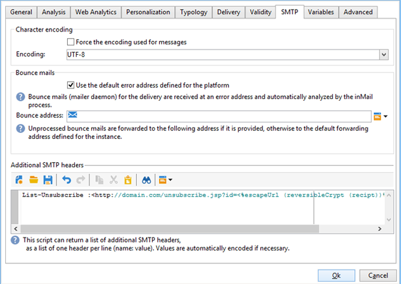

# Technische aanbevelingen{#technical-recommendations}

Hieronder vindt u een overzicht van verschillende technieken, configuraties en gereedschappen die u kunt gebruiken om de snelheid van de te leveren items te verbeteren.

## Configuratie {#configuration}

### DNS omkeren {#reverse-dns}

 De Campagne van Adobe controleert of omgekeerde DNS voor een IP adres wordt gegeven en dat dit correct naar IP wijst.

Een belangrijk punt in de netwerkconfiguratie zorgt ervoor dat correcte omgekeerde DNS voor elk van de IP adressen voor uitgaande berichten wordt bepaald. Dit betekent dat voor een bepaald IP adres, er een omgekeerd DNS verslag (PTR verslag) met een passende DNS (een verslag van A) die terug naar het aanvankelijke IP adres van een lus voorzien is.

De domeinkeus voor omgekeerde DNS heeft een effect wanneer het behandelen van bepaalde ISPs. AOL, in het bijzonder, keurt slechts terugkoppelt lijnen met een adres in het zelfde domein als omgekeerde DNS (zie de lijn [van de](#feedback-loop)Terugkoppeling) goed.

Een hulpmiddel is beschikbaar om de configuratie van een domein te verifiëren: [https://mxtoolbox.com/SuperTool.aspx](https://mxtoolbox.com/SuperTool.aspx).

### MX-regels {#mx-rules}

MX-regels (Mail eXchanger) zijn de regels die de communicatie tussen een verzendende server en een ontvangende server beheren.

Meer bepaald, worden zij gebruikt om de snelheid te controleren waarbij de Campagne MTA (de Agent van de Overdracht van het Bericht) e-mail naar elk individueel e-maildomein of ISP (b.v. hotmail.com, comcast.net) verzendt. Deze regels zijn typisch gebaseerd op grenzen die door ISPs worden gepubliceerd (bijvoorbeeld omvatten niet meer dan 20 berichten per elke verbinding SMTP).

Raadpleeg de [desbetreffende sectie](../../installation/using/email-deliverability.md#mx-configuration)voor meer informatie over MX-beheer.

### TLS {#tls}

TLS (Transport Layer Security) is een versleutelingsprotocol dat kan worden gebruikt om de verbinding tussen twee e-mailservers te beveiligen en de inhoud van een e-mailbericht te beschermen tegen lezen door andere personen dan de beoogde ontvangers.

## Verificatie {#authentication}

### SPF {#spf}

SPF (het Kader van het Beleid van de Afzender) is een norm van de e-mailauthentificatie die de eigenaar van een domein toestaat om te specificeren welke e-mailservers e-mail namens dat domein mogen verzenden. Deze standaard gebruikt het domein in de &quot;terugkeer-Weg&quot;kopbal van e-mail (die ook als &quot;Omhulsel van&quot;adres wordt bedoeld).

Er is een hulpprogramma beschikbaar om een SPF-record te controleren: [https://www.kitterman.com/spf/validate.html](https://www.kitterman.com/spf/validate.html)

SPF is een techniek die, tot op zekere hoogte, u toelaat om ervoor te zorgen dat de domeinnaam die in een e-mail wordt gebruikt niet wordt vervalst. Wanneer een bericht van een domein wordt ontvangen, wordt de DNS server van het domein gevraagd. De reactie is een kort verslag (het SPF verslag) dat details welke servers worden gemachtigd om e-mail van dit domein te verzenden. Als wij veronderstellen dat slechts de eigenaar van het domein de middelen heeft om dit verslag te veranderen, kunnen wij in overweging nemen dat deze techniek niet het afzenderadres om toelaat te vervalsen, minstens niet het deel van het recht van &quot;@&quot;.

In de definitieve specificatie [](https://www.rfc-editor.org/info/rfc4408)RFC 4408, worden twee elementen van het bericht gebruikt om het domein te bepalen dat als afzender wordt beschouwd: Het domein dat door het bevel van SMTP &quot;HELO&quot;(of &quot;EHLO&quot;) wordt gespecificeerd en het domein dat door het adres van de &quot;terugkeer-Weg&quot;(of &quot;MAIL VAN&quot;) kopbal wordt gespecificeerd, die ook het stuiteradres is. Op grond van verschillende overwegingen kan slechts met een van deze waarden rekening worden gehouden; wij adviseren ervoor te zorgen dat beide bronnen het zelfde domein specificeren.

Het controleren van SPF verstrekt een evaluatie van de geldigheid van het domein van de afzender:

* **Geen**: Er kan geen evaluatie worden uitgevoerd,
* **Neutraal**: Het gevraagde domein laat geen evaluatie toe,
* **Doorgeven**: Het domein wordt als authentiek beschouwd,
* **Mislukt**: Het domein wordt vervalst en het bericht moet worden verworpen,
* **SoftFail**: Het domein is waarschijnlijk gesmeed, maar de boodschap mag niet alleen op basis van dit resultaat worden verworpen,
* **TempError**: Een tijdelijke fout heeft de evaluatie gestopt. Het bericht kan worden verworpen,
* **PermError**: De SPF-records van het domein zijn ongeldig.

Opgemerkt zij dat de verslagen die op het niveau van de DNS servers worden gemaakt tot 48 uren kunnen vergen om in aanmerking worden genomen. Deze vertraging hangt af van hoe vaak de DNS geheime voorgeheugens van de ontvangende servers worden verfrist.

### DKIM {#dkim}

De (DomainKeys Identified Mail) authentificatie DKIM is een opvolger van SPF en gebruikt openbare zeer belangrijke cryptografie die de ontvangende e-mailserver toestaat om te verifiëren dat een bericht in feite werd verzonden door de persoon of de entiteit het beweert werd verzonden door, en of de berichtinhoud binnen tussen de tijd werd veranderd het oorspronkelijk werd verzonden (en DKIM &quot;ondertekend&quot;) en de tijd het werd ontvangen. Deze standaard gebruikt doorgaans het domein in de kop &quot;Van&quot; of &quot;Afzender&quot;. Om het veiligheidsniveau van DKIM te verzekeren, is 1024b de Beste praktijken geadviseerde encryptiegrootte. De lagere sleutels DKIM zullen niet als geldig door de meerderheid van toegangsleveranciers worden beschouwd.

DKIM komt uit een combinatie DomainKeys, Yahoo! en Cisco identificeerde de authentificatieprincipes van de Post van Internet en wordt gebruikt om de authenticiteit van het afzenderdomein te controleren en de integriteit van het bericht te waarborgen.

DKIM heeft **DomainKeys** -verificatie vervangen.

>[!IMPORTANT]
>
>Voor gehoste of hybride installaties, als u aan Verbeterde MTA hebt bevorderd, wordt de e-mailauthentificatie DKIM ondertekend door Verbeterde MTA. DKIM-signing door de native Campagne MTA zal binnen de **[!UICONTROL Domain management]** lijst als deel van de Verbeterde verbetering MTA worden uitgezet.
>
>Raadpleeg dit [document](https://helpx.adobe.com/campaign/kb/campaign-enhanced-mta.html)voor meer informatie over de verbeterde MTA voor Adobe-campagne.

Voor het gebruik van DKIM zijn enkele voorwaarden vereist:

* **Beveiliging**: encryptie is een zeer belangrijk element van DKIM en om het veiligheidsniveau van DKIM sinds het voorjaar 2013 te verzekeren, is 1024b de Beste praktijken geadviseerde encryptiegrootte. De lagere sleutels DKIM zullen niet als geldig door de meerderheid van toegangsleveranciers worden beschouwd.
* **Reputatie**: de reputatie is gebaseerd op IP en/of het domein, maar de minder transparante selecteur DKIM is ook een zeer belangrijk element dat in aanmerking moet worden genomen. Het is belangrijk dat u de kiezer kiest: vermijden dat de &quot; wanbetaling &quot; , die door iedereen gebruikt zou kunnen worden , behouden blijft en dus een zeer zwakke reputatie heeft . U moet een verschillende selecteur voor **behoud vs. verwervingsmededelingen** en voor authentificatie uitvoeren.
* **Optiedeclaratie** Adobe Campagne: in de campagne van Adobe is de privé sleutel DKIM gebaseerd op een selecteur DKIM en een domein. Het is momenteel niet mogelijk om meerdere persoonlijke sleutels voor hetzelfde domein of subdomein te maken met verschillende kiezers. Het is niet mogelijk om te bepalen welk selecteerdomein/subdomein voor de authentificatie in noch het platform noch e-mail moet worden gebruikt. Het platform zal alternatief één van de privé sleutels selecteren, wat betekent de authentificatie een hoge kans heeft om te ontbreken.

>[!NOTE]
>
>* Als u DomainKeys voor uw instantie van de Campagne van Adobe hebt gevormd, moet u enkel **dkim** in de domein behandelende regels selecteren. Indien niet, volg de zelfde configuratiestappen (privé/openbare sleutel) zoals voor DomainKeys.
>* Het is niet noodzakelijk om zowel DomainKeys als DKIM voor het zelfde domein toe te laten aangezien DKIM een betere versie van DomainKeys is.
>* De volgende domeinen valideren momenteel DKIM: AOL, Gmail.


### DMARC {#dmarc}

DMARC (Domain-based Message Authentication, Reporting and Conformance) is de meest recente vorm van e-mailverificatie en is afhankelijk van zowel SPF- als DKIM-verificatie om te bepalen of een e-mail wel of niet wordt verzonden. DMARC is uniek en krachtig op twee zeer belangrijke manieren:

* Conformiteit - het staat de afzender toe om ISPs te instrueren over wat met om het even welk bericht te doen dat er niet in slaagt voor authentiek te verklaren (b.v. keurt het niet goed).
* Het melden - het verstrekt de afzender van een gedetailleerd rapport dat alle berichten toont die authentificatie DMARC, samen met het &quot;Van&quot;domein en IP adres ontbrak dat voor elk wordt gebruikt. Dit staat een bedrijf toe om wettige e-mail te identificeren die authentificatie ontbreekt en één of ander type van &quot;moeilijke situatie&quot;(b.v. het toevoegen van IP adressen aan hun SPF verslag), evenals de bronnen en de prevalentie van phishingpogingen op hun e-maildomeinen vereist.

DMARC kan de rapporten gebruiken die door [250ok](https://250ok.com/)worden geproduceerd.

<!--#### Configuring the application {#configuring-the-application}

To define the domain used for the HELO command, edit the instance's configuration file (conf/config-instance.xml) and define a "localDomain" attribute as follows:

```
<serverConf>
  <shared>
    <dnsConfig localDomain="mydomain.net"/>
  </shared>
</serverConf>
```

The MAIL FROM domain is the domain used in technical bounce messages. This address is defined in the deployment wizard or via the NmsEmail_DefaultErrorAddr option.

#### DNS configuration {#dns-configuration}

An SPF record can currently be defined on a DNS server as a TXT type record (code 16) or an SPF type record (code 99). An SPF record takes the form of a character string. For example:

```
v=spf1 ip4:12.34.56.78/32 ip4:12.34.56.79/32 ~all
```

defines the 2 IP addresses 12.34.56.78 and 12.34.56.79 as authorized to send emails for the domain. **~all** means that any other address should be interpreted as a SoftFail.

Recommendations for defining an SPF record:

* Add **~all** (SoftFail) or **-all** (Fail) at the end to reject all servers other than those defined. Without this, servers will be able to forge this domain (with a Neutral evaluation).
* Do not add **ptr** (openspf.org recommends against this as costly and unreliable).-->

## Feedbacklus {#feedback-loop}

Een feedbacklijn werkt door op het ISP niveau een bepaald e-mailadres voor een waaier van IP adressen te verklaren die voor het verzenden van berichten worden gebruikt. ISP zal naar deze brievenbus, op een gelijkaardige manier verzenden zoals wat voor stuitberichten wordt gedaan, die berichten die door ontvangers als spam worden gemeld. Het platform moet zo worden geconfigureerd dat toekomstige leveringen aan gebruikers die een klacht hebben ingediend, worden geblokkeerd. Het is belangrijk dat zij niet langer contact met hen opnemen, ook al hebben zij niet de juiste opt-out-link gebruikt. Op basis van deze klachten zal een ISP een IP-adres op een zwarte lijst zetten. Afhankelijk van ISP, zal een klachtentarief van rond 1% in de zwarte lijst van een IP adres resulteren.

Er wordt momenteel een standaard ontwikkeld voor het definiëren van de indeling van feedbacklusberichten: de [Misbruikrapportage-indeling (ARF)](https://tools.ietf.org/html/rfc6650).

Het implementeren van een feedbacklus voor een instantie vereist:

* Een brievenbus specifiek aan de instantie, die de stuiterende brievenbus kan zijn
* IP die adressen verzendt specifiek aan de instantie

Bij het implementeren van een eenvoudige feedbacklus in Adobe Campaign wordt de functionaliteit voor het verzenden van berichten gebruikt. De terugkoppelt lijnbrievenbus wordt gebruikt als stuiterende brievenbus en een regel wordt bepaald om deze berichten te ontdekken. De e-mailadressen van de ontvangers die het bericht als spam hebben gemeld, worden toegevoegd aan de quarantainelijst.

* Creeer of wijzig een stuiterende postregel, **Feedback_loop**, in **[!UICONTROL Administration > Campaign Management > Non deliverables Management > Mail rule sets]** met de reden **Verworpen** en het type **Hard**.
* Als een brievenbus speciaal voor de terugkoppel lijn is bepaald, bepaal de parameters om tot het toegang te hebben door een nieuwe externe rekening van Bounce Mails binnen te creëren **[!UICONTROL Administration > Platform > External accounts]**.

Het mechanisme is onmiddellijk operationeel voor het verwerken van kennisgevingen van klachten. Om ervoor te zorgen deze regel correct werkt, kunt u de rekeningen tijdelijk deactiveren zodat zij deze berichten niet verzamelen, dan controleren de inhoud van terugkoppelt lijnbrievenbus manueel. Voer op de server de volgende opdrachten uit:

```
nlserver stop inMail@instance,
nlserver inMail -instance:instance -verbose.
```

Als u gedwongen bent om één enkel te gebruiken terugkoppelt lijnadres voor veelvoudige instanties, moet u:

* Herhaal de ontvangen berichten op zo veel brievenbussen aangezien er instanties zijn,
* Heb elke brievenbus die door één enkele instantie wordt opgepakt,
* Vorm de instanties zodat zij slechts de berichten verwerken die hen aangaan: De instance-informatie is opgenomen in de Message-ID-header van berichten die door Adobe Campaign worden verzonden en bevindt zich daarom ook in de feedbacklusberichten. U geeft gewoon de parameter **checkInstanceName** op in het configuratiebestand van de instantie (de instantie wordt standaard niet geverifieerd en dit kan ertoe leiden dat bepaalde adressen onjuist in quarantined worden geplaatst):

   ```
   <serverConf>
     <inMail checkInstanceName="true"/>
   </serverConf>
   ```

Met de leveringsservice van Adobe Campaign wordt uw abonnement op feedbacklusservices voor de volgende ISP&#39;s beheerd: AOL, BlueTime, Comcast, Cox, EarthLink, FastMail, Gmail, Hotmail, HostedEmail, Libero, Mail.ru, MailTrust, OpenSRS, QQ, RoadRunner, Synacor, Telenor, Terra, UnitedOnline, USA, XS4ALL, Yahoo, Yandex, Zoho.

## List-Unsubscribe {#list-unsubscribe}

### Info over List-Unsubscribe {#about-list-unsubscribe}

Het toevoegen van een kopbal SMTP genoemd **lijst-Unsubscribe** is verplicht om optimaal leveringsbeheer te verzekeren.

Deze kopbal kan als alternatief aan het &quot;Rapport als SPAM&quot;pictogram worden gebruikt. De koppeling wordt als een koppeling zonder abonnement weergegeven in de e-mailinterface.

Als u deze functie gebruikt, wordt uw reputatie beschermd en wordt feedback uitgevoerd als een abonnement.

>[!NOTE]
>
>Deze functionaliteit is beschikbaar in Build 6831.

Als u List-Unsubscribe wilt gebruiken, moet u een bevellijn gelijkend op als volgt ingaan:

```
List-Unsubscribe: mailto: client@newsletter.example.com?subject=unsubscribe?body=unsubscribe
```

>[!IMPORTANT]
>
>Het bovenstaande voorbeeld is gebaseerd op de tabel met ontvangers. Als de gegevensbestandimplementatie van een andere lijst wordt gedaan, zorg ervoor om de bevellijn met de correcte informatie te herformuleren.

De volgende bevellijn kan worden gebruikt om een dynamische **lijst-op te zeggen** tot stand te brengen:

```
List-Unsubscribe: mailto: %=errorAddress%?subject=unsubscribe%=message.mimeMessageId%
```

Gmail, Outlook.com en Microsoft Outlook ondersteunen deze methode en een knop voor afmelden is rechtstreeks beschikbaar in hun interface. Deze techniek verlaagt de klachtenpercentages.


U kunt **lijst-opzeggen** uitvoeren door:

* direct toevoegend de bevellijn in het leveringsmalplaatje - zie [deze sectie](#adding-a-command-line-in-a-delivery-template),
* of, het creëren van een typologieregel - zie [deze sectie](#creating-a-typology-rule).

### Een opdrachtregel toevoegen in een leveringssjabloon {#adding-a-command-line-in-a-delivery-template}

De bevellijn moet in de extra sectie van de kopbal van SMTP van e-mail worden toegevoegd.

Deze toevoeging kan in elke e-mail, of in bestaande leveringsmalplaatjes worden gedaan. U kunt ook een nieuwe leveringssjabloon maken die deze functionaliteit bevat.

### Een typologieregel maken {#creating-a-typology-rule}

De regel moet het manuscript bevatten dat de bevellijn produceert en het moet in de e-mailkopbal worden omvat.

>[!NOTE]
>
>We raden u aan een typologieregel te maken: De List-Unsubscribe-functionaliteit wordt automatisch toegevoegd aan elke e-mail.

1. List-Unsubscribe: &lt;mailto:unsubscribe@domain.com>

   Als u op de koppeling **Abonnement opzeggen** klikt, wordt de standaard e-mailclient van de gebruiker geopend. Deze typologieregel moet worden toegevoegd aan een typologie die wordt gebruikt voor het maken van e-mail.

1. List-Unsubscribe: `<https://domain.com/unsubscribe.jsp>`

   Als u op de koppeling **Abonnement opzeggen** klikt, wordt de gebruiker omgeleid naar het formulier voor het opzeggen van het abonnement.

   Voorbeeld:

   

## E-mailoptimalisatie {#email-optimization}

### SMTP {#smtp}

SMTP (Simple Mail Transfer Protocol) is een internetstandaard voor e-mailverzending.

De SMTP fouten die niet door een regel worden gecontroleerd zijn vermeld in **[!UICONTROL Administration]** > **[!UICONTROL Campaign Management]** > **[!UICONTROL Non deliverables Management]** > **[!UICONTROL Delivery log qualification]** omslag. Deze foutberichten worden standaard geïnterpreteerd als onbereikbare schermfouten. De meest voorkomende fouten moeten worden geïdentificeerd en er moet een corresponderende regel worden toegevoegd in **[!UICONTROL Administration]** > **[!UICONTROL Campaign Management]** > **[!UICONTROL Non deliverables Management]** > **[!UICONTROL Mail rule sets]** als u de feedback van de SMTP-servers correct wilt kwalificeren. Zonder deze methode zal het platform onnodige herhalingen (bij onbekende gebruikers) uitvoeren of ten onrechte bepaalde ontvangers in quarantaine plaatsen na een bepaald aantal tests.

### Specifieke IPs {#dedicated-ips}

Adobe biedt een speciale IP-strategie voor elke klant met een IP-bestand voor het maken van een upgrade om een reputatie op te bouwen en de prestaties van de levering te optimaliseren.

## IP-certificering {#ip-certification}

IP de Certificatie is een fliteling en verzendend praktijkprogramma dat helpt ervoor zorgen dat de e-mail wordt ontvangen zonder die door antispamfilters of andere e-mailblokkeringssystemen wordt geblokkeerd.

Momenteel bieden twee leveranciers IP Certificatie aan: Return Path en Certified Senders Alliance.

Gecertificeerde afzenders worden toegevoegd aan whitelisten voor e-mail die worden gebruikt door wereldwijde postbusproviders en e-mailbeveiligingsbedrijven. Deze commerciële whitelisten zijn gebaseerd op een systeem dat de afzender toestaat om antispamfilters geheel te mijden of stijgende punten worden toegewezen aangezien zij het systeem ingaan.

Het [programma voor de certificering](https://www.validity.com/products/returnpath/certification/) van retourpaden biedt een aantal voordelen, waaronder:

* Een meetbare toename van plaatsing in postvakken op de belangrijkste leveranciers van postvakken, zoals Microsoft, AOL, Yahoo, Gmail, Comcast, Orange, Mail.ru en meer
* Favoriete reputatie en behandeling bij kritieke filters zoals Cloudmark, SpamAssassin, en Cisco Ironport
* Een nalevingsteam dat aan 24/7 controle wordt gewijd, die van veiligheidsalarm voorziet en met u door het oplossen van om het even welke compromissen werkt
* De leveranciersgegevens van de brievenbus leverend gedetailleerde informatie over KPIs, plaatsing, en Certificatie prestaties
* Vereenvoudigde en snellere opwarming van IP, met inbegrip van sterkere reputatie en erkenning wanneer het migreren of het verkrijgen van een nieuw IP adres

De [Certified Senders Alliance](https://certified-senders.org/certification-process/) Certification biedt onder andere voordelen:

* Certificering van afzenders van commerciële e-mails die aan hoge kwaliteitsnormen kunnen voldoen
* Betere levering en leverbaarheid van commerciële e-mails om de plaatsingssnelheid in de postbus te verhogen en spamfiltering te verminderen
* Bescherming tegen juridische en financiële risico&#39;s door volledige naleving van wettelijke normen
* Bescherming van de reputatie door middel van vroegtijdige waarschuwingen van het CSA Complaints Office en dagelijkse spamvangrapporten

ISPs is vrij om deze diensten te gebruiken en het aantal ISPs kan afhankelijk van whitelist variëren.

Nochtans, omdat meer en meer ISPs hun antispamfilters bouwen die op het gedrag van elke inbox eigenaar eerder dan het analyseren van de berichtinhoud zelf worden gebaseerd, kan het gebruiken van IP Certificatie geen garantie van inbox plaatsing of zelfs levering zijn.
