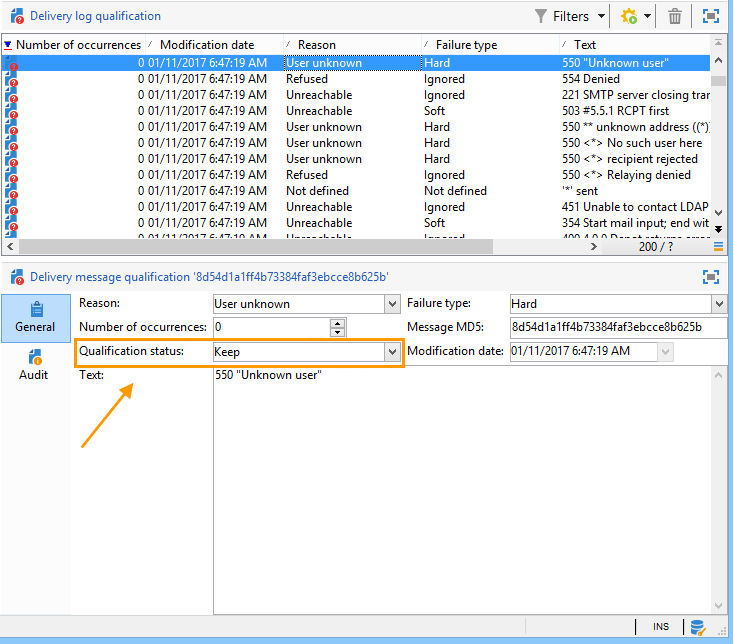

# Leveringsfouten begrijpen{#understanding-delivery-failures}

## Leveringsfouten {#about-delivery-failures}

Wanneer een bericht (e-mail, SMS, pushmelding) niet naar een profiel kan worden verzonden, verstuurt de externe server automatisch een foutbericht dat wordt opgehaald door het Adobe Campagne-platform en dat is gekwalificeerd om te bepalen of het e-mailadres of telefoonnummer al dan niet in quarantaine moet worden geplaatst. Zie [Bounce-mailbeheer](#bounce-mail-management).

>[!NOTE]
>
>E-mailfoutberichten (of &#39;bounces&#39;) worden gekwalificeerd door het InMail-proces. SMS-foutberichten (of &quot;SR&quot; voor &quot;Statusrapport&quot;) worden gekwalificeerd door het MTA-proces.

Zodra een bericht wordt verzonden, staat de leveringslogboeken u toe om de leveringsstatus voor elk profiel en het bijbehorende mislukkingstype en de reden te bekijken.

Berichten kunnen ook tijdens de voorbereiding van de levering worden uitgesloten als een adres in quarantaine is geplaatst of als een profiel op een zwarte lijst staat. Uitgesloten berichten worden vermeld in het leveringsdashboard.

**Verwante onderwerpen:**

* [Leveringslogboeken en geschiedenis](../../delivery/using/monitoring-a-delivery.md#delivery-logs-and-history)
* [Mislukte status](../../delivery/using/monitoring-a-delivery.md#failed-status)
* [Typen leveringsfouten en redenen](#delivery-failure-types-and-reasons)

## Typen leveringsfouten en redenen {#delivery-failure-types-and-reasons}

Er zijn drie typen fouten wanneer een bericht mislukt. Elk fouttype bepaalt of een adres naar quarantines wordt verzonden. Raadpleeg voor meer informatie de [Voorwaarden voor het verzenden van een adres naar quarantaine](../../delivery/using/understanding-quarantine-management.md#conditions-for-sending-an-address-to-quarantine)

* **Hard**: Een &quot;harde&quot;fout wijst op een ongeldig adres. Dit omvat een foutbericht waarin expliciet wordt aangegeven dat het adres ongeldig is, zoals: &quot;Onbekende gebruiker&quot;.
* **Zacht**: Dit kan een tijdelijke fout zijn of een fout die niet kan worden gecategoriseerd, zoals: &quot;Ongeldig domein&quot; of &quot;Brievenbus vol&quot;.
* **Genegeerd**: Dit is een fout die als tijdelijk, zoals &quot;uit bureau&quot;bekend is, of een technische fout, bijvoorbeeld als het afzendertype &quot;postmaster&quot;is.

De mogelijke oorzaken van een mislukking van de levering zijn:

<table> 
 <tbody> 
  <tr> 
   <td> Foutlabel </td> 
   <td> Fouttype </td> 
   <td> Technische waarde </td> 
   <td> Beschrijving </td> 
  </tr> 
  <tr> 
   <td> Account uitgeschakeld </td> 
   <td> Zacht/Hard </td> 
   <td> 4 </td> 
   <td> De account die aan het adres is gekoppeld, is niet meer actief. Wanneer de Internet Access Provider (IAP) een lange periode van inactiviteit detecteert, kan deze de account van de gebruiker sluiten. Leveringen aan het adres van de gebruiker zijn dan onmogelijk. Als de account tijdelijk is uitgeschakeld vanwege een inactiviteit van zes maanden en nog steeds kan worden geactiveerd, wordt de status Met fouten toegewezen en wordt de account opnieuw geprobeerd tot de foutenteller 5 bereikt. Als de fout aangeeft dat de account permanent is gedeactiveerd, wordt deze rechtstreeks ingesteld op Quarantine.  </td> 
  </tr> 
  <tr> 
   <td> Adres in quarantaine </td> 
   <td> Hard </td> 
   <td> 9 </td> 
   <td> Het adres is in quarantaine geplaatst.  </td> 
  </tr> 
  <tr> 
   <td> Adres niet opgegeven </td> 
   <td> Hard </td> 
   <td> 7 </td> 
   <td> Geen adres wordt gegeven voor de ontvanger.  </td> 
  </tr> 
  <tr> 
   <td> Adres van slechte kwaliteit </td> 
   <td> Genegeerd </td> 
   <td> 14 </td> 
   <td> De kwaliteitsbeoordeling voor dit adres is te laag.  </td> 
  </tr> 
  <tr> 
   <td> Adres op zwarte lijst </td> 
   <td> Hard </td> 
   <td> 8 </td> 
   <td> Het adres is op de zwarte lijst geplaatst op het moment van verzending. Deze status wordt gebruikt voor het importeren van gegevens uit externe lijsten en externe systemen wanneer gegevens worden geïmporteerd in de lijst Adobe Campagne Quarantine.  </td> 
  </tr> 
  <tr> 
   <td> Besturingsadres </td> 
   <td> Genegeerd </td> 
   <td> 127 </td> 
   <td> Het adres van de ontvanger maakt deel uit van de controlegroep.  </td> 
  </tr> 
  <tr> 
   <td> Dubbel </td> 
   <td> Genegeerd </td> 
   <td> 10 </td> 
   <td> Het adres van de ontvanger was reeds in deze levering.  </td> 
  </tr> 
  <tr> 
   <td> Fout genegeerd </td> 
   <td> Geen fout </td> 
   <td> 25 </td> 
   <td> Het adres is gewhitelisteerd. De fout wordt daarom genegeerd en er wordt een e-mail verzonden.  </td> 
  </tr> 
  <tr> 
   <td> Uitgesloten na arbitrage </td> 
   <td> Genegeerd </td> 
   <td> 12 </td> 
   <td> De ontvanger werd uitgesloten door een typologische regel van het type "arbitrage".  </td> 
  </tr> 
  <tr> 
   <td> Uitgesloten door een SQL-regel </td> 
   <td> Genegeerd </td> 
   <td> 11 </td> 
   <td> De ontvanger werd uitgesloten door een "SQL"regel van de campagnetypologie.  </td> 
  </tr> 
  <tr> 
   <td> Ongeldig domein </td> 
   <td> Zacht </td> 
   <td> 2 </td> 
   <td> Het domein van het e-mailadres is onjuist of bestaat niet meer. Dit profiel wordt opnieuw geactiveerd tot het aantal fouten 5 is. Hierna wordt de record ingesteld op Quarantine-status en wordt het niet opnieuw geprobeerd.  </td> 
  </tr> 
  <tr> 
   <td> Postbus vol </td> 
   <td> Zacht </td> 
   <td> 5 </td> 
   <td> De brievenbus van deze gebruiker is volledig en kan niet meer berichten goedkeuren. Dit profiel wordt opnieuw geactiveerd tot het aantal fouten 5 is. Hierna wordt de record ingesteld op Quarantine-status en wordt het niet opnieuw geprobeerd.  Dit type fout wordt beheerd door een schoonmaakproces, het adres wordt geplaatst aan een geldige status na 30 dagen.  Waarschuwing: om het adres automatisch uit de lijst van quarantined adressen te verwijderen, moet het technische werkschema van de schoonmaakbeurt van het Gegevensbestand zijn begonnen.  </td> 
  </tr> 
  <tr> 
   <td> Niet verbonden </td> 
   <td> Genegeerd </td> 
   <td> 6 </td> 
   <td> De mobiele telefoon van de ontvanger is uitgeschakeld of is niet verbonden met het netwerk wanneer het bericht wordt verzonden.  </td> 
  </tr> 
  <tr> 
   <td> Niet gedefinieerd </td> 
   <td> Niet gedefinieerd </td> 
   <td> 0 </td> 
   <td> Het adres is in kwalificatie omdat de fout nog niet is verhoogd. Dit type fout treedt op wanneer een nieuw foutbericht wordt verzonden door de server: het kan een geïsoleerde fout zijn, maar als het opnieuw voorkomt, zal de foutenteller stijgen, die de technische teams zal waarschuwen. Zij kunnen berichtanalyse dan uitvoeren en deze fout kwalificeren, via de knoop van het Beheer van de Beleid / Campagne /van het Beheer van Niet te leveren Punten in de boomstructuur.  </td> 
  </tr> 
  <tr> 
   <td> Niet in aanmerking komend voor de voorstellen </td> 
   <td> Genegeerd </td> 
   <td> 16 </td> 
   <td> De begunstigde kwam bij de levering niet in aanmerking voor de aanbiedingen.  </td> 
  </tr> 
  <tr> 
   <td> Geweigerd </td> 
   <td> Zacht/Hard </td> 
   <td> 20 </td> 
   <td> Het adres is in quarantaine geplaatst toe te schrijven aan een veiligheid terugkoppelt als spamrapport. Volgens de fout, zal het adres opnieuw worden geprobeerd tot de foutenteller 5 bereikt, of het zal direct naar quarantines worden verzonden.  </td> 
  </tr> 
  <tr> 
   <td> Beperkte doelgrootte </td> 
   <td> Genegeerd </td> 
   <td> 17 </td> 
   <td> De maximale leveringsgrootte is bereikt voor de ontvanger.  </td> 
  </tr> 
  <tr> 
   <td> Onbevoegd adres </td> 
   <td> Genegeerd </td> 
   <td> 15 </td> 
   <td> Het postadres is niet gekwalificeerd.  </td> 
  </tr> 
  <tr> 
   <td> Onbereikbaar </td> 
   <td> Zacht/Hard </td> 
   <td> 3 </td> 
   <td> Er is een fout opgetreden in de berichtleveringsketen. Het zou een incident op het relais SMTP, een domein kunnen zijn dat tijdelijk onbereikbaar is, etc. Volgens de fout, zal het adres opnieuw worden geprobeerd tot de foutenteller 5 bereikt, of het zal direct naar quarantines worden verzonden.  </td> 
  </tr> 
  <tr> 
   <td> Gebruiker onbekend </td> 
   <td> Hard </td> 
   <td> 1 </td> 
   <td> Het adres bestaat niet. Voor dit profiel worden geen verdere leveringen uitgevoerd.  </td> 
  </tr> 
 </tbody> 
</table>

## Retourneert na een tijdelijke leverfout {#retries-after-a-delivery-temporary-failure}

Als een bericht wegens een **Zachte** of **Genegeerde** fout ontbreekt die tijdelijk is, zullen de pogingen tijdens de leveringsduur worden uitgevoerd.

>[!NOTE]
>
>Tijdelijk niet-geleverde berichten kunnen alleen worden gerelateerd aan een **Zachte** of **Genegeerde** fout, maar niet aan een **Harde** fout (zie de types en redenen [van de mislukking van de](#delivery-failure-types-and-reasons)Levering).

Om de duur van een levering te wijzigen, ga naar de geavanceerde parameters van het levering of leveringsmalplaatje en specificeer de gewenste duur op het overeenkomstige gebied. De geavanceerde leveringseigenschappen worden voorgesteld in [deze sectie](../../delivery/using/steps-sending-the-delivery.md#defining-validity-period).

De standaardconfiguratie staat vijf herpogingen toe met intervallen van één uur, die door één herpoging per dag gedurende vier dagen worden gevolgd. Het aantal pogingen kan globaal worden gewijzigd (neem contact op met uw technische beheerder van Adobe) of voor elke levering of leveringsmalplaatje (zie [deze sectie](../../delivery/using/steps-sending-the-delivery.md#configuring-retries)).

## Synchrone en asynchrone fouten {#synchronous-and-asynchronous-errors}

Een bericht kan onmiddellijk (synchrone fout), of later op ontbreken, nadat het is verzonden (asynchrone fout).

* Synchrone fout: Als de externe mailserver waarmee contact is opgenomen door de Adobe Campagne-leveringsserver onmiddellijk een foutbericht heeft geretourneerd, mag de levering niet naar de server van het profiel worden verzonden. Adobe Campaign kwalificeert elke fout om te bepalen of de e-mailadressen in kwestie al dan niet in quarantaine moeten worden geplaatst. Zie [Bounce mail-kwalificatie](#bounce-mail-qualification).
* Asynchrone fout: een stuiterende post of een SR werd later opnieuw toegestuurd door de ontvangende server. Deze post wordt geladen in een technische brievenbus de toepassing gebruikt om berichten met een fout te etiketteren. Asynchrone fouten kunnen optreden tot een week nadat een levering is verzonden.

   >[!NOTE]
   >
   >De configuratie van de stuiterende brievenbus is gedetailleerd in [deze sectie](../../installation/using/deploying-an-instance.md#managing-bounced-emails).

   De feedbacklus werkt als stuiterende e-mails. Wanneer een gebruiker een e-mail als spam kwalificeert, kunt u e-mailregels in de Campagne van Adobe vormen om alle leveringen aan deze gebruiker te blokkeren. Berichten die worden verzonden naar gebruikers die een e-mailbericht hebben gekwalificeerd als spam, worden automatisch omgeleid naar een e-mailvak dat speciaal voor dit doel is gemaakt. De adressen van deze gebruikers worden op de zwarte lijst weergegeven, ook al hebben ze niet op de koppeling voor het opzeggen van abonnementen geklikt. De adressen zijn zwarte lijst in de (**NmsAddress**) quarantainelijst en niet de (**NmsRecipient**) ontvankelijke lijst.

   >[!NOTE]
   >
   >Het klachtenbeheer wordt gedetailleerd beschreven in de sectie [Leverbaarheidsbeheer](../../delivery/using/about-deliverability.md) .

## Bounce mail management {#bounce-mail-management}

Met het Adobe Campaign-platform kunt u fouten in de e-maillevering beheren via de functie voor stuiterende berichten. Wanneer een e-mail niet aan een ontvanger kan worden geleverd, keert de verre overseinenserver automatisch een foutenmelding (stuiterende post) aan technische inbox terug die voor dit doel wordt ontworpen. Foutberichten worden verzameld door het Adobe Campagne-platform en gekwalificeerd door het inMail-proces om de lijst met regels voor e-mailbeheer te verrijken

### Bounce mail-kwalificatie {#bounce-mail-qualification}

Wanneer de levering van een e-mailbericht mislukt, ontvangt de Adobe Campagne Delivery-server een foutbericht van de berichtenserver of de externe DNS-server. De lijst met fouten bestaat uit tekenreeksen in het bericht dat door de externe server wordt geretourneerd. De types en de redenen van mislukkingen worden toegewezen aan elk foutenbericht.

Deze lijst is beschikbaar via het **[!UICONTROL Administration > Campaign Management > Non deliverables Management > Delivery log qualification]** knooppunt. Het bevat alle regels die door Adobe Campaign worden gebruikt om leveringsfouten te kwalificeren. Het is niet-uitputtend, wordt regelmatig bijgewerkt door de Campagne van Adobe en kan ook door de gebruiker worden beheerd.

* Het bericht dat door de externe server wordt geretourneerd bij de eerste instantie van dit fouttype, wordt weergegeven in de **[!UICONTROL First text]** kolom van de **[!UICONTROL Delivery log qualification]** tabel. Als deze kolom niet wordt weergegeven, klikt u op de **[!UICONTROL Configure list]** knop rechts onder aan de lijst om deze te selecteren.

Adobe Campagne filtert dit bericht om de variabele inhoud (zoals IDs, data, e-mailadressen, telefoonaantallen, enz.) te schrappen en geeft het gefilterde resultaat weer in de **[!UICONTROL Text]** kolom. De variabelen worden vervangen door **`#xxx#`**, behalve adressen die worden vervangen door **`*`**.

Dit proces staat toe om alle mislukkingen van het zelfde type samen te brengen en veelvoudige ingangen voor gelijkaardige fouten in de de kwalificatielijst van het Logboek van de Levering te vermijden.

>[!NOTE]
>
>In het **[!UICONTROL Number of occurrences]** veld wordt het aantal exemplaren van het bericht in de lijst weergegeven. Het is beperkt tot 100 000 voorvallen. U kunt het veld bewerken als u het bijvoorbeeld opnieuw wilt instellen.

Stuitberichten kunnen de volgende kwalificatiestatus hebben:

* **[!UICONTROL To qualify]** : de stuiterende post kon niet worden gekwalificeerd. De kwalificatie moet aan het leveringsteam worden toegewezen om efficiënte platformleverantie te waarborgen. Zolang het niet gekwalificeerd is, wordt de stuiterende post niet gebruikt om de lijst van e-mailbeheerregels te verrijken.
* **[!UICONTROL Keep]** : de stuiterende post werd gekwalificeerd en zal door het **Vernieuwen voor leverbaarheidswerkschema** worden gebruikt om met bestaande e-mailbeheersregels te worden vergeleken en de lijst te verrijken.
* **[!UICONTROL Ignore]** : de stuiterende post werd gekwalificeerd maar zal niet door het **Refresh voor leverbaarheidswerkschema** worden gebruikt. Het wordt niet naar clientinstanties verzonden.

>[!NOTE]
>
>Voor gehoste of hybride installaties, als u aan Verbeterde MTA hebt bevorderd, worden de stuiterende kwalificaties in de **[!UICONTROL Delivery log qualification]** lijst niet meer gebruikt. Verbeterde MTA zal het stuittype en de kwalificatie bepalen, en zal die informatie terugsturen naar Campagne.
>
>Raadpleeg dit [document](https://helpx.adobe.com/campaign/kb/campaign-enhanced-mta.html)voor meer informatie over de verbeterde MTA voor Adobe-campagne.

### E-mailbeheerregels {#email-management-rules}

E-mailregels zijn toegankelijk via het **[!UICONTROL Administration > Campaign Management > Non deliverables Management > Mail rule sets]** knooppunt. De regels voor e-mailbeheer worden weergegeven in het onderste gedeelte van het venster.

Deze regels bevatten de lijst met tekenreeksen die door externe servers kunnen worden geretourneerd en waarmee u de fout (**Hard**, **Zacht** of **Genegeerd**) kunt kwalificeren.

>[!NOTE]
>
>De standaardparameters van het platform worden gevormd in de plaatsingstovenaar. Zie [deze sectie](../../installation/using/deploying-an-instance.md)voor meer informatie.

De standaardregels zijn als volgt:

* **Binnenkomende e-mail**

   Wanneer een e-mail mislukt, retourneert de externe server een stuiterend bericht naar het adres dat is opgegeven in de platformparameters. De Campagne van Adobe vergelijkt de inhoud van elke stuiterende post met de koorden in de lijst van regels, en wijst het dan toe één van de drie foutentypes.

   De gebruiker kan zijn eigen regels tot stand brengen.

   >[!CAUTION]
   >
   >Wanneer u een pakket importeert en gegevens bijwerkt via de workflow **Vernieuwen voor** levering, worden de door de gebruiker gemaakte regels overschreven.

* **Domeinbeheer**

   De regels van het domeinbeheer worden gebruikt om de stroom van uitgaande e-mails voor een specifiek domein te regelen. Ze nemen een monster van de stuiterende berichten en blokkeren het verzenden, indien van toepassing. De het overseinenserver van de Campagne van Adobe past regels toe specifiek voor de domeinen, en toen de regels voor het algemene geval dat door een asterisk in de lijst van regels wordt vertegenwoordigd. De regels voor de Hotmail- en MSN-domeinen zijn standaard beschikbaar in Adobe Campagne.

   Klik op het **[!UICONTROL Detail]** pictogram om de configuratie van de regel te openen.

   

   Om domeinbeheerregels te vormen, eenvoudig plaats een drempel en selecteer bepaalde parameters SMTP. Een **drempel** is een grens die als foutenpercentage wordt berekend waarvoorbij alle berichten naar een specifiek domein worden geblokkeerd.

   In het algemeen geldt dat het verzenden van e-mails voor minimaal 300 berichten drie uur wordt geblokkeerd als het foutenpercentage 90% bereikt.

   De **parameters** SMTP handelen als filters die voor een blokkerende regel worden toegepast.

   * U kunt kiezen al dan niet om bepaalde identificatienormen en encryptiesleutels te activeren om de domeinnaam, zoals identiteitskaart **van de** Afzender, **Domeinsleutels**, **DKIM**, en **S/MIME** te controleren.
   * **SMTP-relais**: laat u het IP adres en de haven van een relaisserver voor een bepaald domein vormen.

* **MX-beheer**

   Raadpleeg [deze sectie](../../installation/using/email-deliverability.md#mx-configuration)voor meer informatie over MX-beheer.

   >[!NOTE]
   >
   >Voor ontvangen of hybride installaties, als u aan Verbeterde MTA hebt bevorderd, worden de regels van de **[!UICONTROL MX management]** leveringsproductie niet meer gebruikt. Verbeterde MTA gebruikt zijn eigen MX regels die het toestaan om uw productie door domein aan te passen die op uw eigen historische e-mailreputatie wordt gebaseerd, en op real time terugkoppelen die uit de domeinen komt waar u e-mails verzendt.
   >
   >Raadpleeg dit [document](https://helpx.adobe.com/campaign/kb/campaign-enhanced-mta.html)voor meer informatie over de verbeterde MTA voor Adobe-campagne.

>[!CAUTION]
>
>* De leveringsserver (MTA) moet opnieuw worden begonnen als de parameters zijn veranderd.
>* De wijziging of invoering van beheerregels is alleen voor professionele gebruikers.

