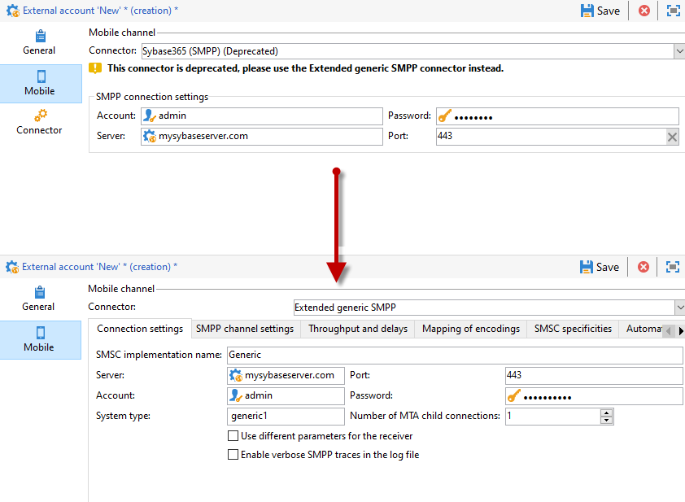

# Niet-ondersteunde SMS-aansluiting migreren naar de uitgebreide algemene SMPP-connector{#unsupported-connector-migration}

Vanaf versie 20.2, zijn de erfenisschakelaars verouderd. Dit document zal u helpen schakelaars migreren die op het oude systeem nog lopen aan de geadviseerde schakelaar SMPP.

>[!CAUTION]
>
>Deze migratie is niet verplicht, maar wordt aanbevolen door Adobe en zorgt ervoor dat u de nieuwste ondersteunde versie van de software gebruikt.

## Informatie over SMS-connectors {#about-sms-connectors}

De volgende schakelaars worden afgekeurd vanaf versie 20.2:

* **[!UICONTROL Generic SMPP]** (SMPP versie 3.4 die binaire wijze steunt)
* **[!UICONTROL Sybase365]** (SAP SMS 365)
* **[!UICONTROL CLX Communications]**
* **[!UICONTROL Tele2]**
* **[!UICONTROL O2]**
* **[!UICONTROL iOS]**

Verouderde mogelijkheden zijn nog steeds beschikbaar en worden ondersteund, maar ze worden niet verder uitgebreid. Wij adviseren gebruikend de **[!UICONTROL Extended generic SMPP]** schakelaar.

Raadpleeg deze [pagina](../../rn/using/deprecated-features.md) voor meer informatie over vervangen en verwijderde functies.

De oude schakelaars van SMS gebruiken de schakelaar van SMS van Java die het Webproces overlaadt. Het migreren aan de nieuwe **[!UICONTROL Extended Generic SMPP]** schakelaar zal deze lading aan MTA bewegen die het kan steunen.

## Migreren naar de Extended Generic SMPP-connector {#migrating-extended-generic-smpp}

>[!CAUTION]
>
>Zelfs als u de parameters kunt omzetten, vereist het vormen van de **[!UICONTROL Extended Generic SMPP]** schakelaar u om met uw leverancier te spreken die u de informatie nodig zal geven om de rest parameters in te vullen. Raadpleeg [deze pagina](../../delivery/using/sms-protocol.md) voor meer informatie.

Eerst, zult u een nieuwe **[!UICONTROL Extended Generic SMPP]** externe rekening moeten creëren en dan zou u sommige parameters kunnen omzetten. U kunt de gedetailleerde stappen in deze [pagina](../../delivery/using/sms-channel.md#creating-an-smpp-external-account) vinden.

U moet nu de parameters van het **[!UICONTROL Mobile]** lusje van uw onlangs gecreeerd **[!UICONTROL Extended Generic SMPP]** externe rekening, afhankelijk van uw vorige schakelaar invullen.

### Van de Algemene schakelaar {#from-generic-connector}

Wanneer u de **[!UICONTROL Generic]**-connector kiest, moet u een aangepaste JavaScript-connector hebben die zich aan elke situatie aanpast.

Als u weet dat deze schakelaar reeds het protocol SMPP gebruikt dan kunt u aan de **[!UICONTROL Extended Generic SMPP]** schakelaar migreren. Als dat niet het geval is, raadpleegt u uw provider of deze het SMPP-protocol ondersteunt en stelt u een nieuwe connector in met de hulp van een consultant.

Vanuit uw **[!UICONTROL Generic]**-connector kunt u de nieuwe **[!UICONTROL Extended SMPP]**-account omzetten:

Op het tabblad **[!UICONTROL Connection Settings]**:

* **[!UICONTROL Account]**
* **[!UICONTROL Password]**
* **[!UICONTROL Server]**
* **[!UICONTROL Port]**

### Van de Algemene schakelaar SMPP {#from-generic-smpp-connector}

Vanuit uw **[!UICONTROL Generic SMPP]**-connector kunt u de nieuwe **[!UICONTROL Extended SMPP]**-account omzetten:

Op het tabblad **[!UICONTROL Connection Settings]**:

* **[!UICONTROL Account]**
* **[!UICONTROL Password]**
* **[!UICONTROL Server]**
* **[!UICONTROL Port]**
* **[!UICONTROL System Type]**

Op het tabblad **[!UICONTROL SMPP Channel Settings]**:

* **[!UICONTROL Source number]**
* **[!UICONTROL Source NPI]**
* **[!UICONTROL Destination NPI]**
* **[!UICONTROL Source TON]**
* **[!UICONTROL Destination TON]**

Op het tabblad **[!UICONTROL Mapping of Encoding]**:

* **[!UICONTROL Outbound SMS coding]**

Op het tabblad **[!UICONTROL SMSC specificities]**:

* **[!UICONTROL Coding when sending]** komt overeen met  **[!UICONTROL ID Format in MT acknowledgement]**
* **[!UICONTROL Coding when receiving]** komt overeen met  **[!UICONTROL ID Format in the SR]**

### Van de Sybase365 schakelaar {#from-sybase}

Vanuit uw **[!UICONTROL Sybase365]**-connector kunt u de nieuwe **[!UICONTROL Extended SMPP]**-account omzetten:

Op het tabblad **[!UICONTROL Connection Settings]**:

* **[!UICONTROL Account]**
* **[!UICONTROL Password]**
* **[!UICONTROL Server]**
* **[!UICONTROL Port]**
* **[!UICONTROL System Type]**

### Van CLX-connector {#from-clx}

Vanuit uw **[!UICONTROL CLX]**-connector kunt u de nieuwe **[!UICONTROL Extended SMPP]**-account omzetten:

Op het tabblad **[!UICONTROL Connection Settings]**:

* **[!UICONTROL Account]**
* **[!UICONTROL Password]**
* **[!UICONTROL Server]**
* **[!UICONTROL Port]**
* **[!UICONTROL System Type]**

Op het tabblad **[!UICONTROL SMPP Channel Settings]**:

* **[!UICONTROL Source number]**

Op het tabblad **[!UICONTROL SMSC specificities]**:

* **[!UICONTROL Coding when sending]** komt overeen met  **[!UICONTROL ID Format in MT acknowledgement]**
* **[!UICONTROL Coding when receiving]** komt overeen met  **[!UICONTROL ID Format in the SR]**

### Vanaf de Tele2-connector {#from-tele2}

Vanuit uw **[!UICONTROL Tele2]**-connector kunt u de nieuwe **[!UICONTROL Extended SMPP]**-account omzetten:

Op het tabblad **[!UICONTROL Connection Settings]**:

* **[!UICONTROL Account]**
* **[!UICONTROL Password]**
* **[!UICONTROL Server]**
* **[!UICONTROL Port]**
* **[!UICONTROL System Type]**

Op het tabblad **[!UICONTROL SMPP Channel Settings]**:

* **[!UICONTROL Source number]**
* **[!UICONTROL Source NPI]**
* **[!UICONTROL Destination NPI]**
* **[!UICONTROL Source TON]**

Op het tabblad **[!UICONTROL Mapping of Encoding]**:

* **[!UICONTROL Outbound SMS coding]**

### Van de O2-connector {#from-O2}

Vanuit uw **[!UICONTROL O2]**-connector kunt u de nieuwe **[!UICONTROL Extended SMPP]**-account omzetten:

Op het tabblad **[!UICONTROL Connection Settings]**:

* **[!UICONTROL Account]**
* **[!UICONTROL Password]**
* **[!UICONTROL Server]**
* **[!UICONTROL Port]**
* **[!UICONTROL System Type]**

Op het tabblad **[!UICONTROL SMPP Channel Settings]**:

* **[!UICONTROL Source number]**
* **[!UICONTROL Source NPI]**
* **[!UICONTROL Destination NPI]**
* **[!UICONTROL Source TON]**
* **[!UICONTROL Destination TON]**