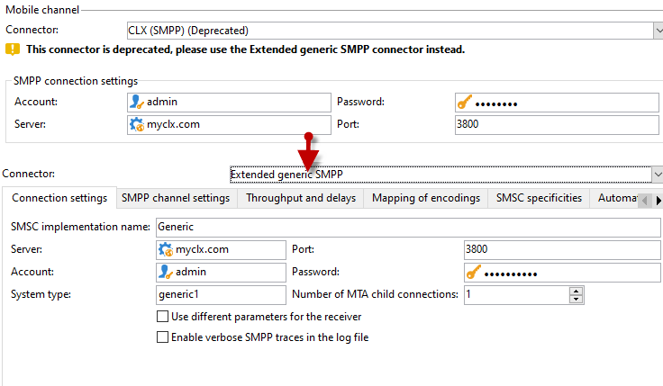

# Niet-ondersteunde SMS-connector migreren naar de uitgebreide algemene SMPP-connector{#unsupported-connector-migration}

Vanaf versie 20.2, zijn de erfenisschakelaars verouderd. Dit document zal u helpen schakelaars migreren die op het oude systeem nog lopen aan de geadviseerde schakelaar SMPP.

>[!CAUTION]
>
>Deze migratie is niet verplicht, maar wordt aanbevolen door Adobe en zorgt ervoor dat u de nieuwste ondersteunde versie van de software gebruikt.

## Informatie over SMS-connectors {#about-sms-connectors}

De volgende schakelaars worden afgekeurd vanaf versie 20.2:

* **[!UICONTROL Generic SMPP]** (SMPP versie 3.4 die binaire wijze steunt)
* **[!UICONTROL Sybase365]** (SAP SMS 365)
* **[!UICONTROL CLX Communications]**
* **[!UICONTROL Tele2]**
* **[!UICONTROL O2]**
* **[!UICONTROL iOS]**

Verouderde mogelijkheden zijn nog steeds beschikbaar en worden ondersteund, maar ze worden niet verder uitgebreid. We raden u aan de **[!UICONTROL Extended generic SMPP]** -aansluiting.

Raadpleeg voor meer informatie over vervangen en verwijderde functies [page](../../rn/using/deprecated-features.md).

De oude schakelaars van SMS gebruiken de schakelaar van SMS van Java die het Webproces overlaadt. Migreren naar de nieuwe **[!UICONTROL Extended Generic SMPP]** de schakelaar zal deze lading naar MTA verplaatsen die het kan steunen.

## Migreren naar de Extended Generic SMPP-connector {#migrating-extended-generic-smpp}

>[!CAUTION]
>
>Zelfs als u de parameters kunt omzetten, vormend **[!UICONTROL Extended Generic SMPP]** de schakelaar vereist u om met uw leverancier te spreken die u de informatie nodig zal geven om de rest parameters in te vullen. Raadpleeg [deze pagina](sms-protocol.md) voor meer informatie.

Eerst moet u een nieuwe **[!UICONTROL Extended Generic SMPP]** externe rekening en dan kunt u sommige parameters misschien omzetten. U vindt de gedetailleerde stappen in dit [page](sms-set-up.md#creating-an-smpp-external-account).

U moet nu de parameters van de **[!UICONTROL Mobile]** tabblad van uw zojuist gemaakte **[!UICONTROL Extended Generic SMPP]** externe account, afhankelijk van uw vorige connector.

### Van de Algemene schakelaar {#from-generic-connector}

Als u de opdracht **[!UICONTROL Generic]** moet u beschikken over een aangepaste JavaScript-connector die zich aan elke situatie aanpast.

Als u weet dat deze schakelaar reeds het protocol SMPP gebruikt dan kunt u aan **[!UICONTROL Extended Generic SMPP]** -aansluiting. Als dat niet het geval is, raadpleegt u uw provider of deze het SMPP-protocol ondersteunt en stelt u een nieuwe connector in met de hulp van een consultant.

Van uw **[!UICONTROL Generic]** -aansluiting, kunt u omzetten naar uw nieuwe **[!UICONTROL Extended SMPP]** account:

In de **[!UICONTROL Connection Settings]** tab:

* **[!UICONTROL Account]**
* **[!UICONTROL Password]**
* **[!UICONTROL Server]**
* **[!UICONTROL Port]**

### Van de Algemene schakelaar SMPP {#from-generic-smpp-connector}

Van uw **[!UICONTROL Generic SMPP]** -aansluiting, kunt u omzetten naar uw nieuwe **[!UICONTROL Extended SMPP]** account:

In de **[!UICONTROL Connection Settings]** tab:

* **[!UICONTROL Account]**
* **[!UICONTROL Password]**
* **[!UICONTROL Server]**
* **[!UICONTROL Port]**
* **[!UICONTROL System Type]**

In de **[!UICONTROL SMPP Channel Settings]** tab:

* **[!UICONTROL Source number]**
* **[!UICONTROL Source NPI]**
* **[!UICONTROL Destination NPI]**
* **[!UICONTROL Source TON]**
* **[!UICONTROL Destination TON]**

In de **[!UICONTROL Mapping of Encoding]** tab:

* **[!UICONTROL Outbound SMS coding]**

In de **[!UICONTROL SMSC specificities]** tab:

* **[!UICONTROL Coding when sending]** komt overeen met **[!UICONTROL ID Format in MT acknowledgement]**
* **[!UICONTROL Coding when receiving]** komt overeen met **[!UICONTROL ID Format in the SR]**

### Van de Sybase365-connector {#from-sybase}

Van uw **[!UICONTROL Sybase365]** -aansluiting, kunt u omzetten naar uw nieuwe **[!UICONTROL Extended SMPP]** account:

In de **[!UICONTROL Connection Settings]** tab:

* **[!UICONTROL Account]**
* **[!UICONTROL Password]**
* **[!UICONTROL Server]**
* **[!UICONTROL Port]**
* **[!UICONTROL System Type]**

### Van CLX-connector {#from-clx}

Van uw **[!UICONTROL CLX]** -aansluiting, kunt u omzetten naar uw nieuwe **[!UICONTROL Extended SMPP]** account:

In de **[!UICONTROL Connection Settings]** tab:

* **[!UICONTROL Account]**
* **[!UICONTROL Password]**
* **[!UICONTROL Server]**
* **[!UICONTROL Port]**
* **[!UICONTROL System Type]**

In de **[!UICONTROL SMPP Channel Settings]** tab:

* **[!UICONTROL Source number]**

In de **[!UICONTROL SMSC specificities]** tab:

* **[!UICONTROL Coding when sending]** komt overeen met **[!UICONTROL ID Format in MT acknowledgement]**
* **[!UICONTROL Coding when receiving]** komt overeen met **[!UICONTROL ID Format in the SR]**

### Van de Tele2-connector {#from-tele2}

Van uw **[!UICONTROL Tele2]** -aansluiting, kunt u omzetten naar uw nieuwe **[!UICONTROL Extended SMPP]** account:

In de **[!UICONTROL Connection Settings]** tab:

* **[!UICONTROL Account]**
* **[!UICONTROL Password]**
* **[!UICONTROL Server]**
* **[!UICONTROL Port]**
* **[!UICONTROL System Type]**

In de **[!UICONTROL SMPP Channel Settings]** tab:

* **[!UICONTROL Source number]**
* **[!UICONTROL Source NPI]**
* **[!UICONTROL Destination NPI]**
* **[!UICONTROL Source TON]**

In de **[!UICONTROL Mapping of Encoding]** tab:

* **[!UICONTROL Outbound SMS coding]**

### Van de O2-connector {#from-O2}

Van uw **[!UICONTROL O2]** -aansluiting, kunt u omzetten naar uw nieuwe **[!UICONTROL Extended SMPP]** account:

In de **[!UICONTROL Connection Settings]** tab:

* **[!UICONTROL Account]**
* **[!UICONTROL Password]**
* **[!UICONTROL Server]**
* **[!UICONTROL Port]**
* **[!UICONTROL System Type]**

In de **[!UICONTROL SMPP Channel Settings]** tab:

* **[!UICONTROL Source number]**
* **[!UICONTROL Source NPI]**
* **[!UICONTROL Destination NPI]**
* **[!UICONTROL Source TON]**
* **[!UICONTROL Destination TON]**
