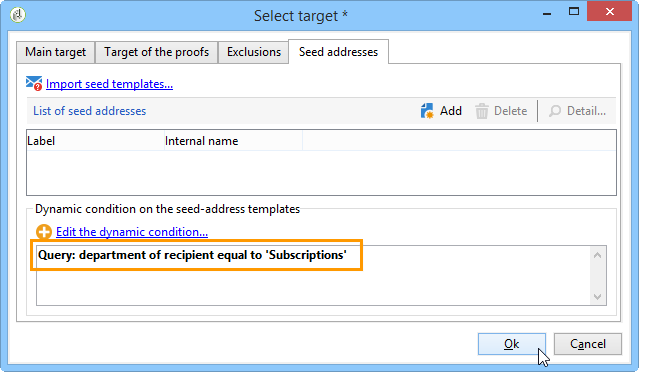

# Hoofdlettergebruik: configureren van veldvervanging{#use-case-configuring-the-field-substitution}

Met Willekeurige veldvervanging kunt u een waarde uit de lijst met ontvangers toewijzen aan de zaadadressen die leeg zijn wanneer de gebruiker deze waarde in een levering gebruikt (voorbeeld: naam, stad, enz.).

Met deze vervanging bespaart u tijd bij het maken van de levering: in plaats van manueel het toevoegen van de gewenste waarde aan de zaadadressen, herstelt de substitutie willekeurig deze waarde in de lijst van ontvangers die door de levering wordt gericht en past het op de zaadadressen toe.

## Context {#context}

In dit geval wil de site **Mijn onlinebibliotheek** een korting op hun favoriete literaire genre naar hun klanten sturen.

De leveringsmanager heeft een verpersoonlijkingsgebied met favoriete genre in zijn e-mail geïntegreerd. Hij zou graag wat zaadadressen gebruiken. Deze zaadadressen hebben het verpersoonlijkingsgebied in hun lijst maar geen waarde wordt daar bewaard.

Als u een willekeurige veldvervanging wilt gebruiken, moet u beschikken over:

* een levering met een of meer personalisatievelden;
* zaadadressen de waarvan **gegevensschema** volgens de verpersoonlijkingsgebieden wordt gewijzigd die in de levering worden gebruikt.

## Een levering maken {#step-1---creating-a-delivery}

De stappen voor het maken van een levering worden beschreven in het gedeelte [Een e-maillevering](../../delivery/using/creating-an-email-delivery.md) maken.

In dit voorbeeld heeft de leveringsmanager de nieuwsbrief gemaakt.


## Het gegevensschema van de zaadadressen bewerken {#editing-the-seed-addresses-data-schema}

De instructies over hoe te om een gegevensschema te wijzigen zijn gedetailleerd in de sectie.

In dit voorbeeld, neemt het gegevensschema van zaadadressen een waarde die van het schema van ontvangersgegevens wordt gecreeerd:

```
 <attribute label="Favorite literary genre" length="80" name="favoriteLiteraryGenre"
               type="string" userEnum="favoriteLiteraryGenre"/>
```

Deze opsomming laat de gebruiker het favoriete literaire genre van hun cliënten specificeren.

Als u wilt dat deze wijziging van het gegevensschema kan worden weergegeven in het formulier **** Invoeradressen, moet u het bijwerken. Raadpleeg de sectie [Invoerformulier](../../delivery/using/use-case--selecting-seed-addresses-on-criteria.md#updating-the-input-form) bijwerken.

## Aanpassing configureren {#configuring-personalization}

1. Open een levering.

   In dit voorbeeld heeft de levering twee verpersoonlijkingsgebieden: de **voornaam** van de ontvanger en het **favoriete literaire genre** van de ontvanger .

   

1. Vorm uw leveringslijst en uw zaadadressen. Zie [Doelpopulaties](../../delivery/using/steps-defining-the-target-population.md)identificeren.

   In dit voorbeeld selecteert de gebruiker gebruikers van wie het **favoriete literaire genre** Sci-Fi de belangrijkste doelpopulatie is.

   

   De gebruiker voegt zaadadressen aan de levering toe.

   

   >[!NOTE]
   >
   >Raadpleeg het onderwerp **[!UICONTROL Edit the dynamic condition...]** Gebruik voor meer informatie over de [koppeling: het selecteren van zaadadressen op criteria](../../delivery/using/use-case--selecting-seed-addresses-on-criteria.md).

1. Klik op het **[!UICONTROL Preview]** tabblad en selecteer vervolgens een beginadres om de personalisatie te testen.

   

   U ziet dat een van de velden voor personalisatie leeg is. Aangezien het zaadadres geen gegevens voor dit gebied heeft, kan de voorproef van de HTML- inhoud geen waarde tonen.

   De velden worden **bij levering** willekeurig vervangen.

1. Klik op de **[!UICONTROL Send]** knop.
1. Analyseer uw levering en **bevestig de levering**.

   De zaadadressen ontvangen de levering in hun inbox.

   Veldpersonalisatie is effectief.

   
