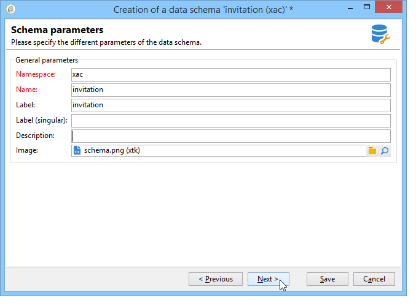
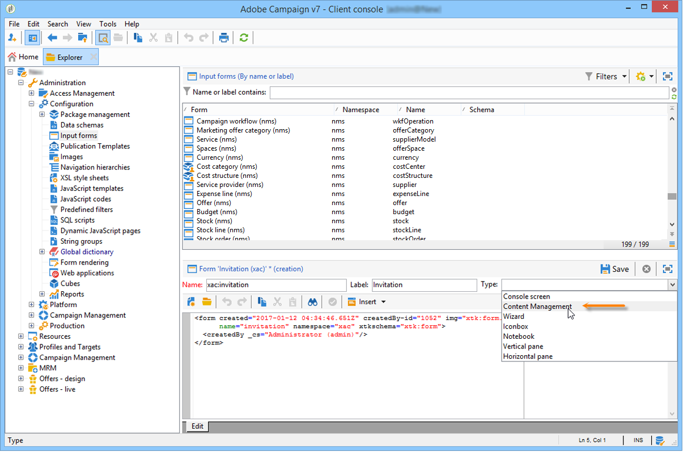

# Gebruiksscenario: contentmanagement maken{#use-case-creating-content-management}

Voor het maken van contentbeheer in Adobe Campaign zijn de volgende stappen nodig:

* [Stap 1 - De te produceren](#step-1---analyzing-the-content-to-be-produced) inhoud analyseren,
* [Stap 2 - het creëren van het gegevensschema](#step-2---creating-the-data-schema),
* [Stap 3 - Het invoerformulier](#step-3---creating-the-input-form) maken,
* [Stap 4 - Het bouwsjabloon](#step-4---creating-the-construction-template) maken,
* [Stap 5 - het creëren van het publicatiesjabloon](#step-5---creating-the-publication-template),
* [Stap 6 - Inhoud](#step-6---creating-contents) maken.

## Stap 1 - De te produceren inhoud analyseren {#step-1---analyzing-the-content-to-be-produced}

Voordat u begint, moet u een nauwkeurige analyse uitvoeren van de inhoud die moet worden geproduceerd: identificeert de elementen die moeten worden weergegeven, bestudeert de beperkingen die eraan zijn gekoppeld, definieert een type voor elk element, enz. U moet ook onderscheid maken tussen statische elementen en variabele elementen.

Als u bijvoorbeeld een nieuwsbrief wilt maken in HTML met het volgende type inhoud:


Deze nieuwsbrief bevat drie soorten elementen:

1. Variabele elementen waarvan de inhoud door de gebruiker via een invoerformulier wordt ingevoerd of geselecteerd tijdens het maken van de levering.

   

1. Personaliseringsgebieden die dynamisch op de informatie worden ingegaan die in het gegevensbestand (de voornaam en achternaam van de ontvanger in dit geval) wordt opgeslagen.

   

1. Statische elementen, die voor alle nieuwsbrieven hetzelfde zijn.

   

De verschillende elementen van deze nieuwsbrief worden samengesteld op basis van de regels die zijn gedefinieerd in een JavaScript-sjabloon waarin wordt verwezen naar alle elementen die moeten worden ingevoegd en waarin de lay-out ervan wordt beschreven.

Deze elementen worden gemaakt via een speciaal schema dat de volgende elementen voor elke inhoud opgeeft: naam, etiket, type, grootte en alle andere informatie die relevant is voor de verwerking ervan in Adobe Campaign.

## Stap 2 - het creëren van het gegevensschema {#step-2---creating-the-data-schema}

Een gegevensschema is een XML-document dat is gekoppeld aan inhoud. Hierin wordt de XML-structuur van de gegevens in deze inhoud beschreven.

>[!NOTE]
>
>Raadpleeg [deze sectie](../../configuration/using/about-schema-edition.md) voor meer informatie over het maken en configureren van gegevensschema&#39;s in Adobe Campaign.
>
>De elementen van de configuratie specifiek voor inhoudsbeheer zijn gedetailleerd in [Gegevensschema&#39;s](../../delivery/using/data-schemas.md).

Voer de volgende stappen uit om een gegevensschema te maken:

1. Open de Ontdekkingsreiziger van Adobe Campaign en selecteer **[!UICONTROL Administration > Configuration > Data schemas]** knoop.

   Klik op het pictogram **[!UICONTROL New]** boven de lijst met gegevensschema&#39;s.

1. Selecteer de optie **[!UICONTROL Create a schema]** voor inhoudsbeheer en klik vervolgens op **[!UICONTROL Next]**.

   

1. Voer de naam en het label van het schema in de desbetreffende velden in. U kunt desgewenst een beschrijving toevoegen en een bepaalde afbeelding koppelen.

   

   Klik **[!UICONTROL Next]** om te bevestigen.

1. Typ de inhoud van het schema in het venster **[!UICONTROL Edit schema]**.

   Gebruik de **[!UICONTROL Insert]** knoop om de schemainhoud tot stand te brengen.

   

   Raadpleeg [Schema&#39;s bewerken](../../delivery/using/data-schemas.md#editing-schemas) voor meer informatie.

   Voor elk element waarnaar in de inhoud wordt verwezen, moet u een overeenkomend type selecteren.

   In dit voorbeeld zijn de geïdentificeerde inhoud, de opmaak en het type als volgt:

<table> 
 <thead> 
  <tr> 
   <th> <strong>Inhoud</strong> <br /> </th> 
   <th> <strong>Indeling</strong> <br /> </th> 
   <th> <strong>Type</strong> <br /> </th> 
   <th> <strong>Label</strong> <br /> </th> 
  </tr> 
 </thead> 
 <tbody> 
  <tr> 
   <td> Titel<br /> </td> 
   <td> Attribute<br /> </td> 
   <td> Tekenreeks<br /> </td> 
   <td> Titel<br /> </td> 
  </tr> 
  <tr> 
   <td> Subtitel<br /> </td> 
   <td> Kenmerk<br /> </td> 
   <td> Tekenreeks<br /> </td> 
   <td> Naam<br /> </td> 
  </tr> 
  <tr> 
   <td> Gebeurtenisdatum<br /> </td> 
   <td> Kenmerk<br /> </td> 
   <td> Datum<br /> </td> 
   <td> Datum<br /> </td> 
  </tr> 
  <tr> 
   <td> Inleiding alinea<br /> </td> 
   <td> Element<br /> </td> 
   <td> HTML<br /> </td> 
   <td> Overzicht<br /> </td> 
  </tr> 
  <tr> 
   <td> Foto van de auteur<br /> </td> 
   <td> Kenmerk<br /> </td> 
   <td> Tekenreeks<br /> </td> 
   <td> URL<br /> </td> 
  </tr> 
  <tr> 
   <td> Auteur<br /> </td> 
   <td> Element<br /> </td> 
   <td> Memo<br /> </td> 
   <td> Auteur<br /> </td> 
  </tr> 
  <tr> 
   <td> Koptekstlogo (opgeslagen in openbare bronnen van Adobe Campaign)<br /> </td> 
   <td> Kenmerk<br /> </td> 
   <td> Koppeling<br /> </td> 
   <td> Image<br /> </td> 
  </tr> 
 </tbody> 
</table>

Het schema bevat de volgende informatie:

```
<element label="Invitation" name="invitation" template="ncm:content" xmlChildren="true">
    <compute-string expr="@name"/>
    <attribute label="Title" length="40" name="title" type="string"/>
    <element label="Presentation" name="presentation" type="html"/>
    <attribute label="Date" name="date" type="date"/>
    <attribute label="Name" length="10" name="name" type="string"/>
    <attribute label="URL" name="url" type="string"/>
    <element label="Author" name="author" type="memo"/>
    <element label="Image" name="image" target="xtk:fileRes" type="link"/>
  </element>
```

1. Klik **[!UICONTROL Save]** om het gegevensschema tot stand te brengen.

## Stap 3 - Het creëren van de inputvorm {#step-3---creating-the-input-form}

Met het invoerformulier kunt u een inhoudsinstantie bewerken via een invoerinterface vanuit de Adobe Campaign-clientconsole.

De beschrijving van een formulier is een gestructureerd XML-document waarin de grammatica van het formulierschema &quot;xtk:form&quot; wordt gevolgd.

>[!NOTE]
>
>Raadpleeg [deze sectie](../../configuration/using/identifying-a-form.md) voor meer informatie over het maken en configureren van formulieren in Adobe Campaign.
>
>De configuratieelementen specifiek voor inhoudsbeheer worden beschreven in [Invoerformulieren](../../delivery/using/input-forms.md).

Voer de volgende stappen uit om een invoerformulier te maken voor inhoudsbeheer:

1. Open de Ontdekkingsreiziger van Adobe Campaign en selecteer **[!UICONTROL Administration > Configuration > Input forms]** knoop.

   Klik op het pictogram **[!UICONTROL New]** boven de lijst met formulieren.

1. Voer de naam in van het formulier en het label dat aan het formulier is gekoppeld en selecteer vervolgens het type **[!UICONTROL Content management]**.

   

   >[!NOTE]
   >
   >Als u wilt dat beide elementen automatisch overeenkomen, kunt u het beste dezelfde naam gebruiken als voor het gekoppelde gegevensschema. Gebruik de knop **[!UICONTROL Insert]** boven de invoerzone om velden toe te voegen vanuit het schema dat is gekoppeld aan het formulier.

   

1. Geef in het middelste gedeelte van de editor de velden op die u in het invoerformulier wilt weergeven.

   In dit voorbeeld hebben we het volgende type informatie:

   ```
    <input xpath="@title"/>
     <input xpath="@date"/>
     <input xpath="presentation"/>
     <input xpath="@name"/>
     <input xpath="@url"/>
     <input xpath="author"/>
     <input img="nl:sryimage.png" newEntityFormChoice="true" xpath="image">
       <sysFilter>
         <condition expr="@isImage = true"/>
       </sysFilter>
     </input>
   ```

   Op het tabblad **[!UICONTROL Preview]** kunt u de weergave van het formulier controleren terwijl u het bewerkt:

   

1. Klik op **[!UICONTROL Save]** om het invoerformulier te maken.

## Stap 4 - Het creëren van het bouwmalplaatje {#step-4---creating-the-construction-template}

Met de XSLT-taal kunt u een XML-document transformeren in een ander uitvoerdocument. Deze transformatie wordt beschreven in XML in een document genoemd een stijlblad.

In dit voorbeeld willen we een JavaScript-sjabloon gebruiken om de gegevensconstructie en de lay-outmodus in het gegenereerde document te definiëren.

>[!NOTE]
>
>Restricties die zijn gekoppeld aan documentopbouw (JavaScript- of XSL-sjabloon) worden beschreven in [Opmaak](../../delivery/using/formatting.md).

Als u een JavaScript-sjabloon wilt gebruiken in Adobe Campaign, voert u de volgende stappen uit:

1. Open de Ontdekkingsreiziger van Adobe Campaign en selecteer **[!UICONTROL Administration > Configuration > JavaScript Templates]** knoop.

   Klik op het pictogram **[!UICONTROL New]** boven de lijst met sjablonen.

1. Voer een sjabloonnaam in en selecteer het schema dat u voor inhoudsbeheer hebt gemaakt.
1. Importeer de setinhoud die u in het bericht wilt weergeven.

   Voeg de elementen van de variabele toe met inachtneming van de syntaxis in [JavaScript-sjablonen](../../delivery/using/formatting.md#javascript-templates).

   Als u de inhoud wilt weergeven die in ons voorbeeld wordt weergegeven, moet de JavaScript-sjabloon de volgende elementen bevatten:

   ```
   <html>
   <% eval(xtk.javascript.load("xac:perso").data); %>
   <head>
     <title>Invitation to an exceptional dedication session</title>
   </head>
   <body link="#0E59AE" vlink="#0E59AE" alink="#0E59AE" style="background-color:white;">
       <table width="546" border="0" align="center" cellpadding="0" cellspacing="0" style="border-left: solid 1px gray;border-top: solid 1px gray;border-right: solid 1px gray;">
         <tr>
           <td colspan="3">
             <%= generateImgTag(content.@["image-id"]) %>
           </td>
         </tr>
       </table>
       <table width="546" border="0" align="center" cellpadding="0" cellspacing="0" style="border-left: solid 1px gray;border-right: solid 1px gray;">
         <tr>
           <td>
             <table border="0" cellspacing="0" cellpadding="5">
               <tr>
                 <td width="10"> </td>
                 <td style="padding-top:2em; padding-bottom:2em;" width="730" align="middle">
                   <b>
                     <font style="font-family:Verdana, Arial, Helvetica, sans-serif; font-size:14px; color:#800080;">
                       <span style="FONT-VARIANT: small-caps"><%= content.@title %> - <%= content.@name %></span>
                     </font>
                   </b>
                 </td>
                 <td width="10"> </td>
               </tr>
               <tr>
                 <td width="10"> </td>
                 <td style="padding-top:1em; padding-bottom:1em;" width="730">
                   <font style="font-family:Verdana, Arial, Helvetica, sans-serif; font-size:11px; color:#666666;">
                     Hello <%= perso('recipient.firstName') %> <%= perso('recipient.lastName') %>,
                     <p>
                       <%= content.presentation %>
                     </p>               
                     <center>
                       <b><%= formatDate(content.@date, "%2D %Bl %4Y") %></b> come to our Book Fair and meet our favorite authors and illustrators.<br>
                       <br>
                       <a href="https://www.site.web.com/registration" target="_blank"><b>REGISTER</b></a>
                     </center>
                   </font>
                 </td>
                 <td width="10"> </td>
               </tr>
               <tr>
                 <td width="10"> </td>
                 <td style="padding-top:1em; padding-bottom:1em;" width="730">
                   <font style="font-family:Verdana, Arial, Helvetica, sans-serif; font-size:11px; color:#666666;">
                    " width="70" height="70">
                     <b><%= content.author %></b>, will be signing their book between 2
   and 5:30PM.
                   </font>
                 </td>
                 <td width="10"> </td>
               </tr>            
                   <tr>
                 <td width="10"> </td>
                 <td width="730">
                   <font style="font-family:Verdana, Arial, Helvetica, sans-serif; font-size:11px; color:#666666;">                  
                 </td>
                 <td width="10"> </td>
               </tr>           
               <tr>
                 <td width="10"> </td>
                 <td>
                   <font style="font-family:Verdana, Arial, Helvetica, sans-serif; font-size:11px; color:#666666;">
                     <center>
                       <p>
                         <a href="https://www.site.web.com/program" target="_blank"><span style="FONT-VARIANT: small-caps"><b>Program</b></span></a>
                          | 
                         <a href="https://www.site.web.com/information" target="_blank"><span style="FONT-VARIANT: small-caps"><b>Useful information</b></span></a>
                          | 
                       <a href="https://www.site.web.com/registration" target="_blank"><span style="FONT-VARIANT: small-caps"><b>Register</b></span></a></p>
                       </center>
                     </font>
                   </td>
                   <td width="10"> </td>
                 </tr>
               </table>
               <br>
             </td>
           </tr>
         </table>
   </body>
   </html>
   ```

   Als u een functie oproept aan het begin van een sjabloon, kunt u een aanroep instellen naar verpersoonlijkingsgegevens uit de Adobe Campaign-database (in dit geval: receiving.firstName en receiving.lastName), zodat het kan worden geïnterpreteerd wanneer gebruikt in een levering. Raadpleeg [Including a JavaScript template](../../delivery/using/formatting.md#including-a-javascript-template) voor meer informatie.

   In dit voorbeeld bevat de functie de volgende code:

   ```
   function perso(strPerso)
   {
     var strStart = '<' + '%' + '=';
     var strEnd = '%' + '>';
     return strStart + strPerso + strEnd;
   }
     function bloc(strPerso)
   {
     var strStart = '<' + '%' + '@ include view="';
     var strEnd = '" %' + '>';
     return strStart + strPerso + strEnd;
   }
   ```

   De JavaScript-sjabloon is alleen geldig als deze functie vooraf wordt gemaakt op basis van het knooppunt **[!UICONTROL JavaScript codes]** in de boomstructuur, zoals hieronder:

   

## Stap 5 - het Creëren van het publicatiemalplaatje {#step-5---creating-the-publication-template}

De volgende stap bestaat uit het maken van een publicatiesjabloon voor inhoud om het schema, het formulier en de constructiesjabloon voor inhoud te koppelen. Deze publicatiesjabloon kan verschillende uitvoerindelingen hebben.

>[!NOTE]
>
>Raadpleeg [Publicatiesjablonen](../../delivery/using/publication-templates.md) voor meer informatie over publicatiesjablonen voor inhoud.

In dit voorbeeld zijn de stappen als volgt:

1. Maak een nieuwe publicatiesjabloon via het knooppunt **[!UICONTROL Administration > Configuration > Publication templates]**.
1. Voer een naam en een label in en selecteer het schema en het formulier dat u wilt gebruiken.
1. Voer vervolgens de naam van de sjabloon in en kies de renderingmodus die u wilt toepassen. Hier is een rendering van het type **[!UICONTROL JavaScript]** gebaseerd op de hierboven gemaakte sjabloon.

   

   >[!NOTE]
   >
   >De optie **[!UICONTROL DOM interface]** is standaard ingeschakeld. Dit betekent dat dit document niet toegankelijk is als u de syntaxis E4X gebruikt. De DOM-interface moet worden gebruikt wanneer deze optie is ingeschakeld. Dit is de aanbevolen syntaxis.
   >
   >U kunt nog steeds de syntaxis E4X gebruiken. Als dat het geval is, schakelt u deze optie uit.

   Gebruik de knop **[!UICONTROL Add]** om andere transformatiesjablonen te maken.

1. Klik op **[!UICONTROL Save]** om de publicatiesjabloon te maken.

## Stap 6 - Inhoud maken {#step-6---creating-contents}

U kunt nu inhoud maken op basis van deze publicatiesjabloon.

>[!NOTE]
>
>Raadpleeg [Een inhoudssjabloon gebruiken](../../delivery/using/using-a-content-template.md) voor meer informatie over het maken van inhoud.

### Inhoud maken in de wizard {#creating-content-in-the-delivery-wizard}

Voer de volgende stappen uit om inhoud rechtstreeks in de leveringen te maken:

1. Begin door het publiceren malplaatje via het **[!UICONTROL Advanced]** lusje van de leveringseigenschappen van verwijzingen te voorzien.

   

   Er wordt een extra tabblad toegevoegd aan de wizard voor levering om de inhoud te definiëren via het inhoudsbeheerformulier.

1. Voer de variabele gegevens van uw nieuwsbrief in.

   

1. Klik op het tabblad **[!UICONTROL HTML preview]** om de rendering weer te geven. U moet een ontvanger selecteren om verpersoonlijking te testen.

   
