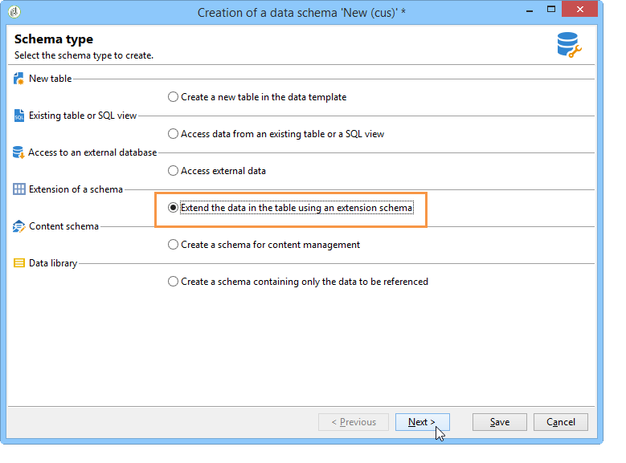
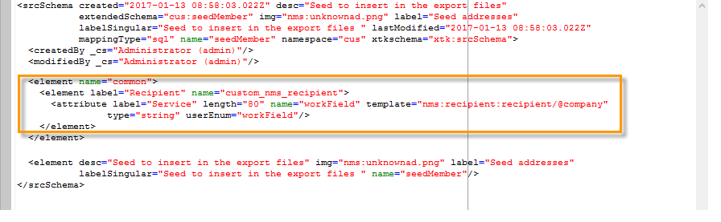
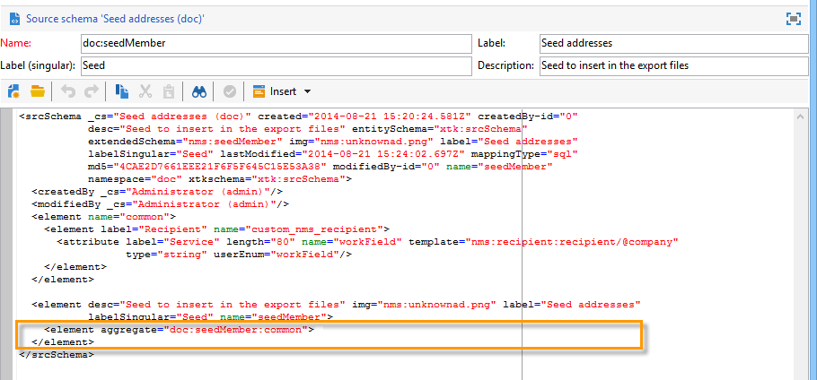
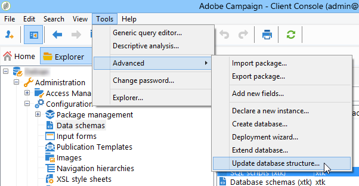

# Hoofdlettergebruik: het selecteren van zaadadressen op criteria{#use-case-selecting-seed-addresses-on-criteria}

In het kader van een levering of een campagne, laat de **[!UICONTROL Edit the dynamic condition...]** verbinding u zaadadressen kiezen die op specifieke selectiecriteria worden gebaseerd.

In dit geval wil de site **Mijn onlinebibliotheek** zijn nieuwsbrieven personaliseren volgens de literaire smaak van zijn klanten.

In samenwerking met de aankoopafdeling heeft de gebruiker die verantwoordelijk is voor de levering een nieuwsbrief gemaakt voor abonnees die politieromans hebben gekocht.

Om het definitieve resultaat van hun samenwerking met hen te delen, besluit de leveringsmanager om zijn collega&#39;s van de aankoopafdeling aan de levering als zaadadressen toe te voegen. Met een dynamische voorwaarde kunt u tijd besparen bij het configureren en bijwerken van adressen.

Als u de dynamische voorwaarde wilt gebruiken, moet u beschikken over:

* een levering klaar om te worden verzonden,
* zaadadressen die een gemeenschappelijke waarde hebben. Deze waarde kan een veld zijn dat al bestaat in Adobe Campaign. In dit voorbeeld hebben de zaadadressen dezelfde waarde als &quot;Aanschaffen&quot; in het veld &quot;Afdeling&quot;, die standaard niet in de toepassing aanwezig is.

## Stap 1 - Een levering maken {#step-1---creating-a-delivery}

De stappen voor het maken van een levering worden beschreven in het gedeelte [Een e-maillevering](../../delivery/using/creating-an-email-delivery.md) maken.

In dit voorbeeld heeft de leveringsmanager de nieuwsbrief gemaakt en de ontvangers geselecteerd.


## Stap 2 - Een gemeenschappelijke waarde maken {#step-2---creating-a-common-value}

Als u een gemeenschappelijke waarde wilt maken, zoals in ons voorbeeld (afdeling Aanschaffen), moet u eerst het **gegevensschema** van uw zaadadressen uitbreiden en het bijbehorende invoerformulier bewerken.

### Het gegevensschema uitbreiden {#extending-the-data-schema}

Raadpleeg de handleiding [Configuratie voor meer informatie over schema-extensies](../../configuration/using/data-schemas.md).

1. Klik in het **[!UICONTROL Administration > Configuration > Data schemas]** knooppunt op het **[!UICONTROL New]** pictogram.
1. Selecteer de **[!UICONTROL Creation of a data schema]** optie in het **[!UICONTROL Extension of a schema]** venster en klik op **[!UICONTROL Next]**.

   

1. Selecteer het **[!UICONTROL Seed addresses]** bronschema, ga **doc** als **[!UICONTROL Namespace]** en klik in **[!UICONTROL Ok]**.

   

1. Klik **[!UICONTROL Save]**.
1. Kopieer in het schemabewerkingsvenster de onderstaande regels en plak deze in het gebied dat in de schermafbeelding wordt aangegeven.

   ```
     <element name="common">
       <element label="Recipient" name="custom_nms_recipient">
         <attribute label="Department" length="80" name="workField" template="nms:recipient:recipient/@company"
                    type="string" userEnum="workField"/>
       </element>
     </element>
   ```

   

   Kopieer de volgende regels en plak deze onder het **[!UICONTROL Seed to insert in the export files]** element.

   ```
       <element aggregate="doc:seedMember:common">
     </element>
   ```

   

   In dit geval, specificeert u dat een nieuwe genoemde opsomming in de lijst van het zaadadres **[!UICONTROL Department]** is gecreeerd, en het is gebaseerd op het standaardopsommingsmalplaatje (geëtiketteerd onder de naam **[!UICONTROL @company]** Bedrijf **** in de vorm van het zaadadres).

1. Klik **[!UICONTROL Save]**.
1. Selecteer de **[!UICONTROL Tools > Advanced]** optie in het **[!UICONTROL Update database structure]** menu.

   

1. Wanneer de updatewizard wordt weergegeven, klikt u op de **[!UICONTROL Next]** knop voor toegang tot het venster Tabellen bewerken: de veranderingen die in het schema van de zaadadresgegevens worden uitgevoerd vereisen een structuurupdate.

   

1. Volg de wizard totdat u naar de pagina komt om de update uit te voeren. Klik op de **[!UICONTROL Start]** knop.

   

   Nadat de update is voltooid, kunt u de wizard sluiten.

1. Maak de verbinding en maak vervolgens opnieuw verbinding met Adobe Campaign. De veranderingen in het schema van de zaadadresgegevens worden aangebracht die zijn nu effectief. Om hen van het scherm van het zaadadres zichtbaar te zijn, moet u bijwerken bijbehorende **[!UICONTROL Input form]**. Raadpleeg de sectie [Invoerformulier](#updating-the-input-form) bijwerken.

#### Het gegevensschema uitbreiden vanuit een gekoppelde tabel {#extending-the-data-schema-from-a-linked-table}

Het gegevensschema van de zaadadressen kan waarden van een lijst gebruiken verbonden aan het ontvankelijke gegevensschema - Ontvanger (nms).

De gebruiker wil bijvoorbeeld de **[!UICONTROL Internet Extension]** gevonden code in de **[!UICONTROL Country]** tabel integreren die is gekoppeld aan het schema voor ontvangers.


Daarom moeten zij het schema van de zaadadressen zoals die in de sectie worden gedetailleerd uitbreiden. De coderegels die in **stap 4** moeten worden geïntegreerd, zijn echter als volgt:

```
<element name="country">
      <attribute label="Internet Extension" length="2" name="iana" type="string"/>
      <attribute label="Country ISO" length="2" name="countryIsoA2" type="string"/>
    </element>
```


Zij geven aan:

* dat de gebruiker een nieuw element wil creëren genoemd **[!UICONTROL Internet Extension]**,
* dat dit element uit de **[!UICONTROL Country]** tabel komt.

>[!CAUTION]
>
>In de naam van de gekoppelde tabel moet u de **xpath-dst** van de desbetreffende gekoppelde tabel opgeven.
>
>Dit vindt u in het **[!UICONTROL Country]** element in de tabel met ontvangers.


De gebruiker kan dan uit **stap 5** van de sectie volgen, en de **[!UICONTROL Input form]** van de zaadadressen bijwerken.

Raadpleeg de sectie [Invoerformulier](#updating-the-input-form) bijwerken.

#### Het invoerformulier bijwerken {#updating-the-input-form}

1. In de **[!UICONTROL Administration > Configuration > Input forms]** knoop, vind de zaadadressen inputvorm.

   

1. Bewerk het formulier en voeg de volgende regel in de **[!UICONTROL Recipient]** container in.

   ```
   <input xpath="@workField"/>
   ```

   

1. Sla uw wijzigingen op.
1. Open een zaadadres. Het **[!UICONTROL Department]** veld wordt weergegeven in de **[!UICONTROL Recipient]** tabel.

   

1. Bewerk de zaadadressen die u voor de levering wilt gebruiken en voer **Aankoop** in als de waarde in het **[!UICONTROL Department]** veld.

## Stap 3 - De voorwaarde definiëren {#step-3---defining-the-condition}

U kunt nu de dynamische voorwaarde van de zaadadressen voor de levering specificeren. Dit doet u als volgt:

1. Open een levering.

   

1. Klik op de **[!UICONTROL To]** koppeling en vervolgens op het **[!UICONTROL Seed addresses]** tabblad om de **[!UICONTROL Edit the dynamic condition...]** koppeling te openen.

   

1. Selecteer de uitdrukking die u de zaadadressen laat kiezen u wilt. Hier selecteert de gebruiker de **[!UICONTROL Department (@workField)]** expressie.

   

1. Selecteer de gewenste waarde. In dit voorbeeld selecteert de gebruiker de **inkoopafdeling** in de vervolgkeuzelijst met waarden.

   

   >[!NOTE]
   >
   >De eerder gemaakte schema-extensie komt van het **ontvangende** schema. De waarden die op het scherm hierboven worden getoond komen van een opsomming van het **ontvankelijke** schema.

1. Klik **[!UICONTROL Ok]**.

   De query wordt weergegeven in het **[!UICONTROL Select target]** venster.

   

1. Klik **[!UICONTROL Ok]** om de vraag goed te keuren.
1. Analyseer uw levering en klik op het **[!UICONTROL Delivery]** tabblad voor toegang tot de leveringslogboeken.

   De zaadadressen van de aankoopafdeling worden getoond als hangende levering, enkel zoals die van de ontvangers of andere zaadadressen.

   

1. Klik op de **[!UICONTROL Send]** knop om de levering te starten.

   De leden van de aankoopafdeling maken deel uit van uw zaadadressen die de levering in hun e-mailpostvak zullen ontvangen.

   
