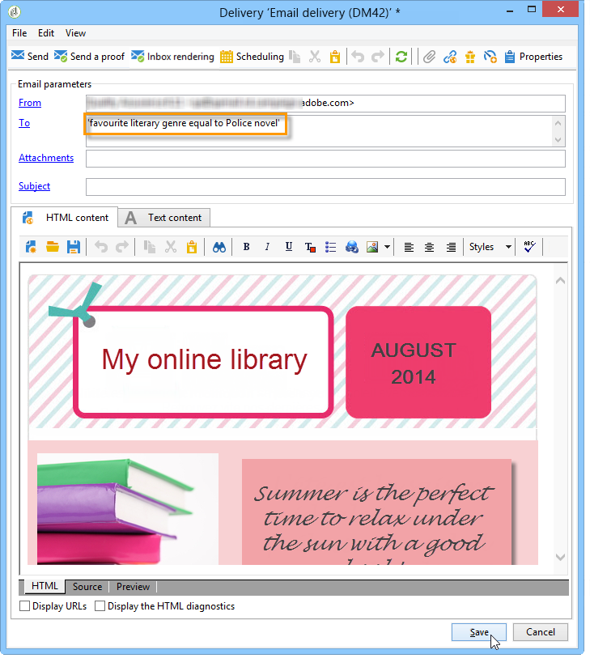

# Gebruiksscenario: seedadressen selecteren op criteria{#use-case-selecting-seed-addresses-on-criteria}


In het kader van een levering of een campagne, kunt u met de koppeling **[!UICONTROL Edit the dynamic condition...]** zaadadressen kiezen op basis van specifieke selectiecriteria.

In dit gebruiksgeval, zou de plaats **Mijn online bibliotheek** zijn nieuwsbrieven volgens zijn literaire smaak van cliënten willen personaliseren.

In samenwerking met de aankoopafdeling heeft de gebruiker die verantwoordelijk is voor de levering een nieuwsbrief gemaakt voor abonnees die politieromans hebben gekocht.

Om het definitieve resultaat van hun samenwerking met hen te delen, besluit de leveringsmanager om hun collega&#39;s van de aankoopafdeling aan de levering als zaadadressen toe te voegen. Met een dynamische voorwaarde kunt u tijd besparen bij het configureren en bijwerken van adressen.

Als u de dynamische voorwaarde wilt gebruiken, moet u beschikken over:

* een levering klaar om te worden verzonden,
* zaadadressen die een gemeenschappelijke waarde hebben. Deze waarde kan een veld zijn dat al bestaat in Adobe Campaign. In dit voorbeeld hebben de zaadadressen dezelfde waarde als &quot;Aanschaffen&quot; in het veld &quot;Afdeling&quot;, die standaard niet in de toepassing aanwezig is.

## Stap 1 - Een levering maken {#step-1---creating-a-delivery}

De stappen voor het creëren van een levering zijn gedetailleerd in [ creeer een e-maillevering ](creating-an-email-delivery.md) sectie.

In dit voorbeeld heeft de leveringsmanager de nieuwsbrief gemaakt en de ontvangers geselecteerd.



## Stap 2 - Een gemeenschappelijke waarde maken {#step-2---creating-a-common-value}

Om tot een gemeenschappelijke waarde zoals in ons voorbeeld (het Aankopen afdeling) te leiden, moet u het **gegevensschema** van uw zaadadressen eerst uitbreiden en de bijbehorende inputvorm uitgeven.

### Het gegevensschema uitbreiden {#extending-the-data-schema}

Voor verdere details op schemauitbreidingen, verwijs naar [ deze sectie ](../../configuration/using/data-schemas.md).

1. Klik in het knooppunt **[!UICONTROL Administration > Configuration > Data schemas]** op het pictogram **[!UICONTROL New]** .
1. Selecteer in het **[!UICONTROL Creation of a data schema]** -venster de optie **[!UICONTROL Extension of a schema]** en klik op **[!UICONTROL Next]** .

   

1. Selecteer het **[!UICONTROL Seed addresses]** bronschema, ga **doc** als **[!UICONTROL Namespace]** in en klik **[!UICONTROL Ok]**.

   

1. Klik op **[!UICONTROL Save]**.
1. Kopieer in het schemabewerkingsvenster de onderstaande regels en plak deze in het gebied dat in de schermafbeelding wordt aangegeven.

   ```
     <element name="common">
       <element label="Recipient" name="custom_nms_recipient">
         <attribute label="Department" length="80" name="workField" template="nms:recipient:recipient/@company"
                    type="string" userEnum="workField"/>
       </element>
     </element>
   ```

   

   Vervolgens kopieert u de volgende regels en plakt u deze onder het element **[!UICONTROL Seed to insert in the export files]** .

   ```
       <element aggregate="doc:seedMember:common">
     </element>
   ```

   

   In dit geval, specificeert u dat een nieuwe opsomming genoemd **[!UICONTROL Department]** in de lijst van het zaadadres is gecreeerd, en het is gebaseerd op het standaard **[!UICONTROL @company]** opsommingsmalplaatje (geëtiketteerd onder de naam **Bedrijf** in de vorm van het zaadadres).

1. Klik op **[!UICONTROL Save]**.
1. Selecteer de optie **[!UICONTROL Update database structure]** in het menu **[!UICONTROL Tools > Advanced]** .

   

1. Wanneer de updateassistent wordt weergegeven, klikt u op de knop **[!UICONTROL Next]** om het venster Tabellen bewerken te openen. Voor wijzigingen die worden uitgevoerd in het gegevensschema van het zaadadres is een structuurupdate vereist.

   

1. Volg de assistent tot u aan de pagina komt om de update in werking te stellen. Klik op de knop **[!UICONTROL Start]**.

   

   Nadat de update is voltooid, kunt u de assistent sluiten.

1. Verbinding verbreken en vervolgens opnieuw verbinding maken met Adobe Campaign. De veranderingen in het schema van de zaadadresgegevens worden aangebracht die zijn nu effectief. Als u deze wilt weergeven vanuit het scherm met het zaadadres, moet u de gekoppelde **[!UICONTROL Input form]** bijwerken. Verwijs naar de [ Update de sectie van de inputvorm ](#updating-the-input-form).

#### Het gegevensschema uitbreiden vanuit een gekoppelde tabel {#extending-the-data-schema-from-a-linked-table}

Het gegevensschema van de zaadadressen kan waarden van een lijst gebruiken verbonden aan het ontvankelijke gegevensschema - Ontvanger (nms).

De gebruiker wil bijvoorbeeld de tabel **[!UICONTROL Internet Extension]** integreren die is gevonden in de **[!UICONTROL Country]** -tabel die is gekoppeld aan het schema voor ontvangers.


Daarom moeten zij het schema van de zaadadressen zoals die in de sectie worden gedetailleerd uitbreiden. Nochtans, zijn de lijnen van code om bij **stap 4** te integreren als volgt:

```
<element name="country">
      <attribute label="Internet Extension" length="2" name="iana" type="string"/>
      <attribute label="Country ISO" length="2" name="countryIsoA2" type="string"/>
    </element>
```


Zij geven aan:

* dat de gebruiker een nieuw element met de naam **[!UICONTROL Internet Extension]** wil maken,
* Dit element komt uit de **[!UICONTROL Country]** tabel.

>[!CAUTION]
>
>In de verbonden lijstnaam, moet u **xpath-dst** van genoemde verbonden lijst specificeren.
>
>Dit vindt u in het element **[!UICONTROL Country]** in de tabel met ontvangers.


De gebruiker kan dan uit **stap 5** van de sectie volgen, en **[!UICONTROL Input form]** van de zaadadressen bijwerken.

Verwijs naar de [ Update de sectie van de inputvorm ](#updating-the-input-form).

#### Het invoerformulier bijwerken {#updating-the-input-form}

1. Zoek in het knooppunt **[!UICONTROL Administration > Configuration > Input forms]** het invoerformulier voor zaadadressen.

   

1. Bewerk het formulier en voeg de volgende regel in de container van **[!UICONTROL Recipient]** in.

   ```
   <input xpath="@workField"/>
   ```

   

1. Sla uw wijzigingen op.
1. Open een zaadadres. Het veld **[!UICONTROL Department]** wordt weergegeven in de tabel **[!UICONTROL Recipient]** .

   

1. Bewerk de zaadadressen die u voor de levering wilt gebruiken en ga **Aankoop** als waarde op het **[!UICONTROL Department]** gebied in.

## Stap 3 - De voorwaarde definiëren {#step-3---defining-the-condition}

U kunt nu de dynamische voorwaarde van de zaadadressen voor de levering specificeren. Dit doet u als volgt:

1. Open een levering.

   

1. Klik op de koppeling **[!UICONTROL To]** en vervolgens op de tab **[!UICONTROL Seed addresses]** om de koppeling **[!UICONTROL Edit the dynamic condition...]** te openen.

   

1. Selecteer de uitdrukking die u de zaadadressen laat kiezen u wilt. Hier selecteert de gebruiker de expressie **[!UICONTROL Department (@workField)]** .

   

1. Selecteer de gewenste waarde. In dit voorbeeld selecteert de gebruiker de **Aankoopende** afdeling van de drop-down lijst van waarden.

   

   >[!NOTE]
   >
   >De eerder gemaakte schemauitbreiding komt uit het **ontvankelijke** schema. De waarden die op het scherm hierboven worden getoond komen uit een opsomming van het **ontvankelijke** schema.

1. Klik op **[!UICONTROL Ok]**.

   De query wordt weergegeven in het **[!UICONTROL Select target]** -venster.

   

1. Klik op **[!UICONTROL Ok]** om de query goed te keuren.
1. Analyseer uw levering en klik op het tabblad **[!UICONTROL Delivery]** voor toegang tot de leveringslogboeken.

   De zaadadressen van de aankoopafdeling worden getoond als hangende levering, enkel zoals die van de ontvangers of andere zaadadressen.

   

1. Klik op de knop **[!UICONTROL Send]** om de levering te starten.

   De leden van de aankoopafdeling maken deel uit van uw zaadadressen die de levering in hun e-mailpostvak zullen ontvangen.

   
