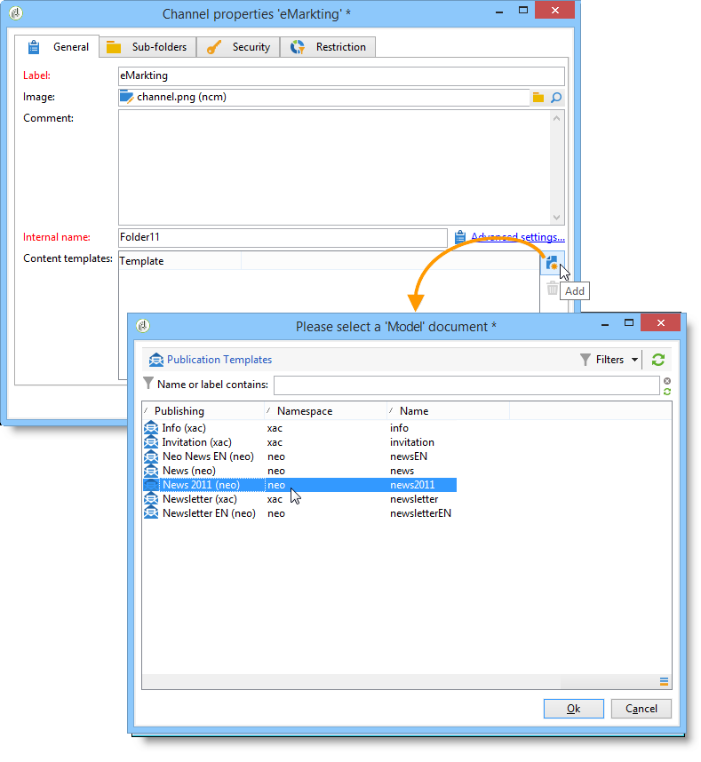
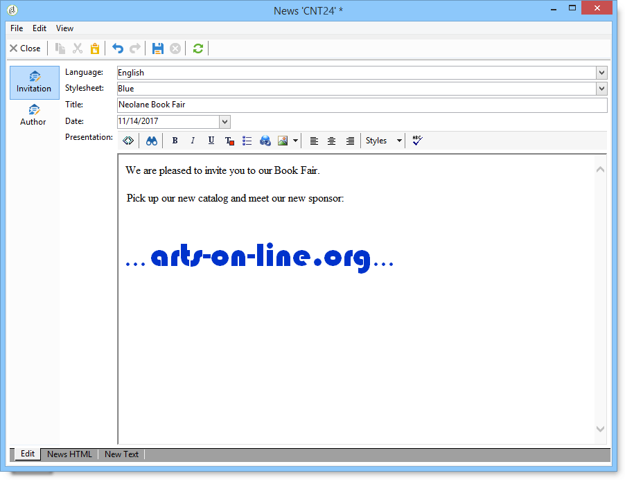
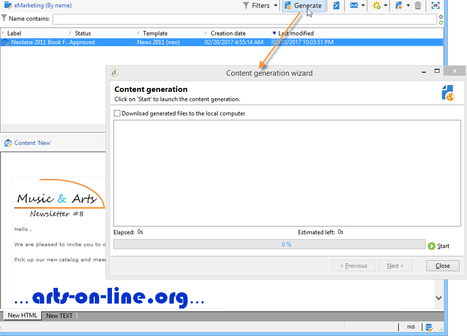

# Een inhoudssjabloon gebruiken{#using-a-content-template}

## Over inhoudssjablonen {#about-content-templates}

Er kan rechtstreeks naar inhoudssjablonen worden verwezen en deze kunnen worden gebruikt in leveringen. Raadpleeg Levering [maken via contentbeheer](#creating-a-delivery-via-content-management)

Ze kunnen ook worden gebruikt om inhoudsinstanties te maken. Nadat deze exemplaren zijn gemaakt, kunnen ze worden afgeleverd (zie [Inhoudsinstantie](#delivering-a-content-instance)leveren) of geëxporteerd (zie [Inhoudsinstantie](#creating-a-content-instance)maken).

## Levering maken via contentbeheer {#creating-a-delivery-via-content-management}

U kunt in een levering naar een inhoudssjabloon verwijzen om invoervelden te gebruiken om inhoud in te voeren. Er wordt een extra tabblad toegevoegd aan de wizard voor levering voor het definiëren van inhoud voor levering.

De lay-out wordt automatisch toegepast op basis van de geselecteerde instellingen. Als u deze wilt weergeven, klikt u op de **[!UICONTROL HTML preview]** (of **[!UICONTROL Text preview]** ) en selecteert u een ontvanger om de personalisatie-elementen te testen.

Raadpleeg het voorbeeld van de volledige implementatie voor meer informatie hierover: Inhoud [maken in de wizard](../../delivery/using/use-case--creating-content-management.md#creating-content-in-the-delivery-wizard)Aflevering.

## Inhoudsinstanties maken {#creating-a-content-instance}

U kunt inhoud rechtstreeks in de Adobe Campagne boom tot stand brengen om in werkschema&#39;s te gebruiken, uit te voeren, of direct te injecteren in nieuwe leveringen.

Voer de volgende stappen uit:

1. Selecteer het **[!UICONTROL Resources > Contents]** knooppunt van de structuur, klik met de rechtermuisknop en kies **[!UICONTROL Properties]**.

   

1. Selecteer de publicatiesjablonen die actief zijn voor deze map.

   

1. U kunt nu nieuwe inhoud maken met de **[!UICONTROL New]** knop boven de inhoudslijst.

   

1. Voer de velden in het formulier in.

   

1. Klik vervolgens op het **[!UICONTROL HTML preview]** tabblad om de rendering weer te geven. Hier, zijn de verpersoonlijkingsgebieden die uit het gegevensbestand worden genomen niet ingegaan.

   

1. Nadat de inhoud is gemaakt, wordt deze toegevoegd aan de lijst met beschikbare inhoud. Klik op de **[!UICONTROL Properties]** koppeling om het label, de status of de geschiedenis te wijzigen.

   

1. Indien nodig kan de inhoud worden gegenereerd met de desbetreffende knop op de werkbalk nadat de inhoud is goedgekeurd.

   

   >[!NOTE]
   >
   >U kunt het genereren van niet-goedgekeurde inhoud toestaan. Om dit te doen, verander de relevante optie in het publicatiemalplaatje. Voor meer op dit, verwijs naar het [Creëren van en het vormen van het malplaatje](../../delivery/using/publication-templates.md#creating-and-configuring-the-template).

   De inhoud van HTML en Tekst wordt standaard gegenereerd in de **publicatiemap** van de Adobe Campagne-instantie. U kunt de publicatiemap wijzigen met de optie **NcmPublishingDir** .

## Inhoudsinstantie leveren {#delivering-a-content-instance}

Als u een inhoudsinstantie wilt maken en leveren, moet een leveringssjabloon worden gekoppeld aan de publicatiesjabloon die wordt gebruikt om deze inhoud te genereren. Raadpleeg [Aflevering](../../delivery/using/publication-templates.md#delivery)voor meer informatie.

Bovendien moet de opslagmap voor inhoud worden toegewezen aan inhoud die is ontleend aan deze publicatiesjabloon (wanneer u met een inhoudsmap meerdere typen inhoud kunt genereren, kunnen leveringen niet automatisch worden gemaakt).

Als u de levering automatisch wilt maken op basis van de geselecteerde inhoud, klikt u op het **[!UICONTROL Delivery]** pictogram en kiest u de sjabloon.

Tekst en HTML-inhoud worden automatisch ingevoerd.
