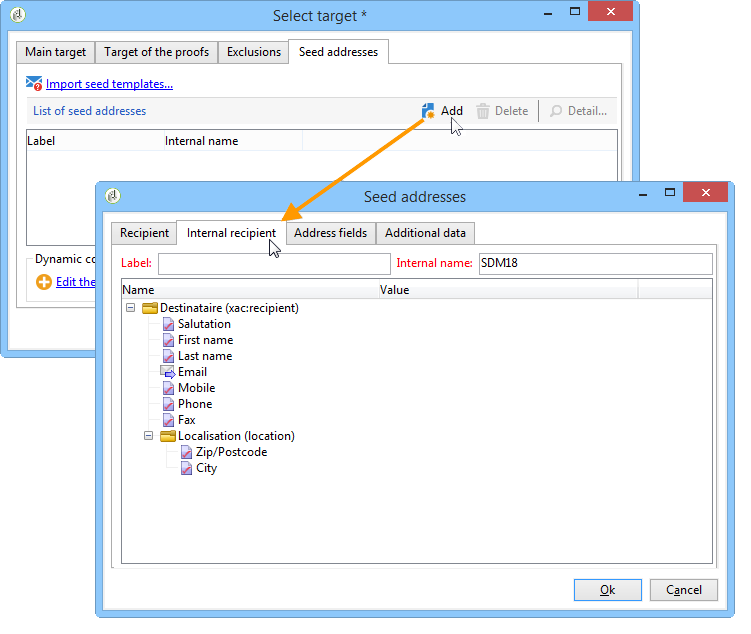

# Een externe tabel voor ontvangers gebruiken{#using-an-external-recipient-table}

Als de leveringstabel een externe lijst is, zult u extra configuraties moeten maken. Het **[!UICONTROL nms:seedmember]** schema moet worden uitgebreid. Er wordt een tabblad toegevoegd aan de adressen van de zaadadressen om de juiste velden te definiëren, zoals hieronder wordt getoond:

In dit geval, om zaadadressen aan de levering toe te voegen, ga de adequate gebieden direct op het passende lusje in, of voer de adresmalplaatjes in:

De **extensie nms:seedMember** schema is [deze sectie](../../configuration/using/seed-addresses.md).
